# Fișă Modul: Procese de implementare — proiect, procese, teste de acceptanță și probleme

**Modul:** `deltatech_business_process`
**Utilizator principal:** Consultant / manager de proiect de implementare, utilizatorii-cheie ai
clientului (testare de acceptanță)
**Prioritate:** 🟢 Scăzută (nu atinge contabilitatea sau stocurile; organizează proiectul de
implementare)

---

## 1. Scop business

Un proiect de implementare Odoo se încheie bine când clientul **a validat, proces cu proces**, că
fluxurile lui funcționează. Fără un registru comun, procesele stau în documente Word, testele în
e-mailuri, iar problemele găsite la testare se pierd între ele.

Modulul ține tot proiectul în Odoo:
- **proiectul** clientului, cu procesele lui grupate pe **arii** (Vânzări, Achiziții, Stocuri,
  Contabilitate etc.);
- fiecare **proces** cu **pașii** lui, responsabilii (implementator, suport, utilizator-cheie al
  clientului) și **estimarea de efort** (configurare, instruire, migrare date, testare);
- **testele** procesului: testul implementatorului, testul de integrare și testul de **acceptanță
  al utilizatorului**, cu rezultat trecut / eșuat pe fiecare pas;
- **problemele** (issues) găsite la testare, legate de pasul care a picat, cu un flux de rezolvare
  până la închidere;
- **dezvoltările** cerute de proces (rapoarte, personalizări), cu aprobare;
- rapoarte de progres și un **export Excel** al efortului pe arii;
- **biblioteca de procese**: procese-tip gata scrise (ex. cele de contabilitate RO din
  `l10n_ro_process_library`), importate în proiect cu pașii, testele și fișele lor.

Ciclul de viață al unui proces: **Ciornă → Proiectare → Test → Gata → Producție** (sau
**Abandonat**).

## 2. Bază legală și context

Modulul nu are bază legală și nu generează note contabile, mișcări de stoc sau documente fiscale.
E un instrument de **management al proiectului de implementare**. Cele cinci stări ale procesului
urmează fazele clasice ale unui proiect ERP: proiectarea fluxului (*Business Blueprint*, BBP),
testarea și trecerea în producție.

Modulul se instalează de regulă **în baza implementatorului** (proiect de tip *La distanță*). Poate
fi instalat și în baza clientului (*Local*), caz în care poate instala direct modulele legate de
proces.

## 3. Utilizatori și roluri

| Rol | Ce face | Drept Odoo (grup *Proces afaceri*) |
|---|---|---|
| Manager de proiect / consultant principal | creează proiectul și procesele, configurează ariile și biblioteca | **Admin procese** |
| Consultant pe arie | scrie pașii, dezvoltările și testele proceselor lui, schimbă starea proceselor | **Responsabil proces** |
| Utilizator-cheie al clientului / tester | rulează testele de acceptanță, notează rezultatul pe pași, deschide probleme | **Utilizator final** |

Grupurile se moștenesc: **Admin procese** include **Responsabil proces**, care include **Utilizator
final**. La instalare, administratorul bazei primește **Admin procese**.

Ce poate fiecare, efectiv:
- **Utilizator final**: citește proiectele, procesele, pașii și dezvoltările; creează și modifică
  teste, pași de test și probleme (fără ștergere). Poate porni orice test: de acceptanță, de
  integrare și chiar pe cel al implementatorului.
- **Responsabil proces**: în plus, modifică pașii, dezvoltările și testele, creează procese și
  **schimbă starea proceselor** cu butoanele din antet (Pornire proiectare, Pornire test, Finalizare
  testare, Trecere producție, Resetează la ciornă). Câmpurile procesului existent rămân însă needitabile
  pentru el: le modifică un **Admin procese**.
- **Admin procese**: drepturi complete, inclusiv câmpul *Vizibil doar pentru* și asistenții de
  export / import. E singurul grup care poate modifica **proiectul** (inclusiv starea lui și
  **Calculează durata**) și care poate șterge teste.

**Vizibilitate pe proces.** Câmpul *Vizibil doar pentru* (tab-ul *Responsabil*) restrânge un proces
la utilizatorii din listă: procesul, pașii, testele, problemele și rândurile din rapoarte dispar
pentru ceilalți. Gol (implicit) înseamnă vizibil tuturor. Administratorii de procese văd tot.

Butonul **Abandonează** și acțiunea **Instalare module pentru procesele selectate** sunt doar pentru
administratorul Odoo (*Setări*).

Roluri recomandate la testare: un utilizator **Admin procese** pentru fluxul complet și un
**Utilizator final** pentru testul de acceptanță (partea clientului).

## 4. Conturi și date implicate

Modulul **nu folosește conturi contabile**. Datele lui:

| Obiect | Rol | Numerotare |
|---|---|---|
| Proiect (`business.project`) | proiectul clientului; adună procesele, problemele, dezvoltările | `P00001` |
| Proces (`business.process`) | procesul de business, cu stare, responsabili și durate | `PR…` dacă nu se dă un cod |
| Pas proces (`business.process.step`) | activitățile procesului, ordonate | `ST00001` |
| Test proces (`business.process.test`) | un test al procesului: implementator / integrare / acceptanță | „Test intern VZ02” (implementator), „Test VZ02 #1” (celelalte) |
| Pas de test (`business.process.step.test`) | rezultatul testului pe fiecare pas | — |
| Problemă (`business.issue`) | defect, îmbunătățire, cerere de schimbare găsite la test | `I00001` |
| Dezvoltare (`business.development`) | personalizare cerută de proces, cu aprobare și efort | `D…` |
| Arie, Grup procese, Etapă de implementare, Rol, Tranzacție, Tip dezvoltare | nomenclatoare | — |

Durata totală a unui proces = configurare + instruire + migrare date + testare (în ore, afișate
`hh:mm`). Durata totală a proiectului = suma duratelor proceselor + durata dezvoltărilor care nu
sunt în *Ciornă* sau *Respinse* la aprobare (intră deci și cele *În așteptare* / *Așteaptă
aprobare*). Se recalculează doar la **Calculează durata**.

Date demo folosite în capturi: compania **Demo Consultanță SRL** (implementatorul), clientul
**Mobila Nord SRL**, proiectul **Odoo Mobila Nord** cu cinci procese:

| Cod | Proces | Arie | Stare | Durată (config. / instruire / migrare / testare) |
|---|---|---|---|---|
| VZ01 | Ofertare și comandă client | Vânzări | Producție | 6:00 / 3:00 / 2:00 / 4:00 = 15:00 |
| VZ02 | Retururi de la clienți | Vânzări | Test | 3:00 / 1:30 / 0:00 / 2:00 = 6:30 |
| AC01 | Aprovizionare de la furnizori | Achiziții | Proiectare | 4:00 / 2:00 / 1:00 / 2:30 = 9:30 |
| ST01 | Inventar anual | Stocuri | Ciornă | 2:00 / 1:00 / 0:00 / 1:00 = 4:00 |
| CT01 | Transmitere e-Factura | Contabilitate | Gata | 3:00 / 1:00 / 0:00 / 1:30 = 5:30 |

Total proiect: 40:30. Singura dezvoltare, „Raport retururi pe motiv” (8 ore), e în *Ciornă* la
aprobare, deci nu intră în total.

## 5. Configurare inițială

1. **Drepturi** — *Setări → Utilizatori*: pe fiecare utilizator, la *Proces afaceri*, alegeți
   **Admin procese**, **Responsabil proces** sau **Utilizator final** (secțiunea 3).
2. **Arii** — *Proces afaceri → Configurație → Arie*: creați ariile proiectului (Vânzări,
   Achiziții, Stocuri, Contabilitate…). Pe fiecare arie se pot adăuga *Grupuri procese* și un
   **Responsabil**: procesele noi din arie îl preiau automat ca *Responsabil implementare*.
3. **Etape de implementare** — *Configurație → Etapă de implementare*: la instalare există „Etapa
   1”, „Etapa 2” și „Start”. Redenumiți-le după planul proiectului (ex. „Val 1 — Vânzări”).
4. **Tip dezvoltare**, **Rol**, **Tranzacții** — nomenclatoare opționale, din același meniu.
5. **Biblioteca de procese** (opțional) — *Configurație → Bibliotecă de procese*:
   - **Descoperă procese din toate modulele** (bifat implicit): orice modul instalat care are un
     dosar `processes/` devine sursă, ex. `l10n_ro_process_library`;
   - **Limitează la module**: listă de module separate prin virgulă; când e completată, doar
     acestea sunt surse;
   - **Depozite git**: URL-uri separate prin virgulă, apoi **Sincronizează acum**;
   - **Credențiale depozit privat**: utilizator (implicit `x-access-token` la GitHub, `oauth2` la
     GitLab) și token, pentru depozite HTTPS private.

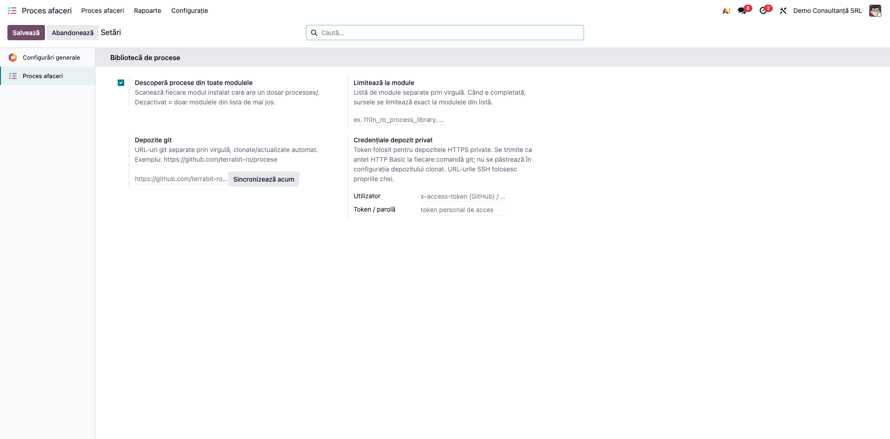

## 6. Flux de utilizare

### Pasul 1 — Proiectul

*Proces afaceri → Proces afaceri → Proiecte* → **Nou(ă)**. Completați numele, clientul, managerul
de proiect, data de început și data de trecere în producție. Codul (`P00001`) se dă automat. Starea
proiectului (*Pregătire → Explorare → Realizare → Lansare → În exploatare → Închis*) se schimbă cu un
clic pe bara de stare.

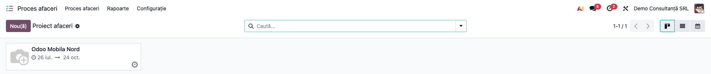

Butoanele din dreapta-sus deschid procesele, pașii, dezvoltările, documentele și problemele
proiectului. **Calculează durata** ① recalculează *Durata totală a proiectului*.

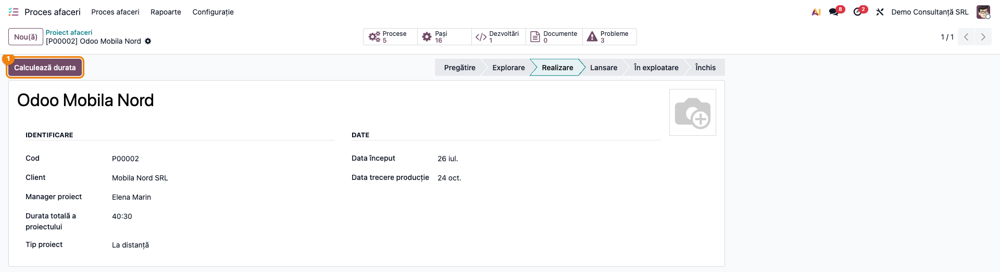

### Pasul 2 — Procesele și pașii lor

*Proces afaceri → Proces afaceri → Proces afaceri* → **Nou(ă)** (sau butonul *Procese* din proiect,
care completează proiectul). Obligatorii: **Nume**, **Proiect**, **Arie**. Codul se poate scrie de
mână (VZ02), altfel se dă automat.

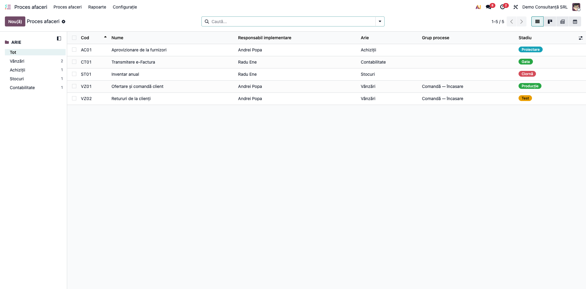

În tab-ul **Pași proces** ① adăugați pașii în ordine, fiecare cu *Responsabil pas*. Pașii se pot
modifica doar cât procesul e în *Ciornă* sau *Proiectare*.

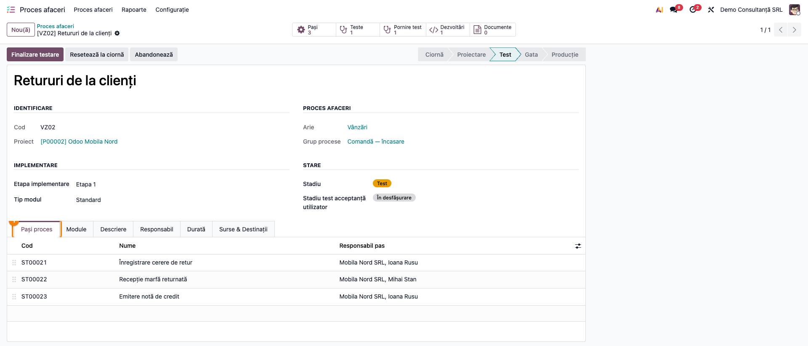

În tab-ul **Durată** se trec estimările de efort și perioada de proiectare (BBP).

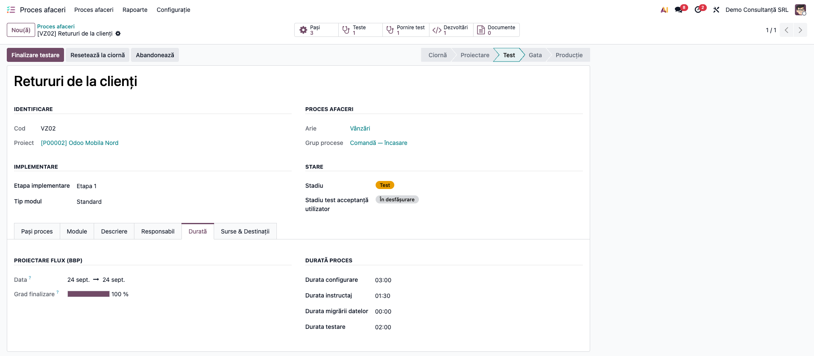

În tab-ul **Responsabil** se aleg responsabilul de implementare, suportul, responsabilul clientului
și cine a aprobat procesul. Blocul **Vizibilitate** (doar pentru *Admin procese*) restrânge
procesul la anumiți utilizatori: în captură, VZ02 e vizibil doar consultantului și managerului de
proiect (plus administratorilor de procese).

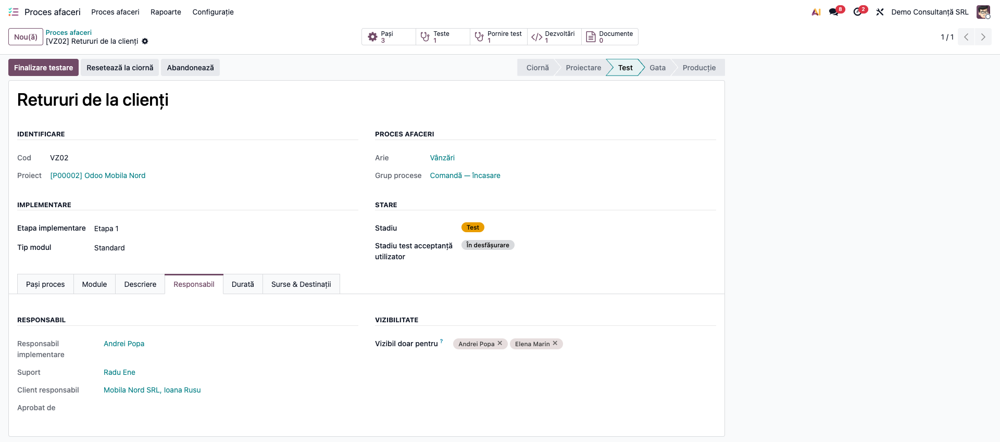

### Pasul 3 — Proiectarea

Pe proces, **Pornire proiectare** trece procesul în *Proiectare*, pune data de început BBP (dacă
lipsește) și abonează la proces responsabilul, clientul și responsabilii pașilor. Butonul de stare
**Pornire test** (în antet, stânga) trece procesul în *Test*, pune data de sfârșit BBP și gradul de
finalizare 100 %.

Nu îl confundați cu butonul inteligent **Pornire test** (dreapta-sus, cu contor), din Pasul 4: acela
creează un test de acceptanță.

Butoanele de stare cer grupul **Responsabil proces** (sau **Admin procese**). Utilizatorul final nu
le vede.

### Pasul 4 — Pornirea testelor

Din lista proceselor, **Acțiuni** (⚙) oferă:
- **Pornire test implementator** — testul intern al consultantului, cu consultantul ca tester;
- **Pornire test de integrare**;
- **Pornire test acceptanță utilizator** — testul clientului.

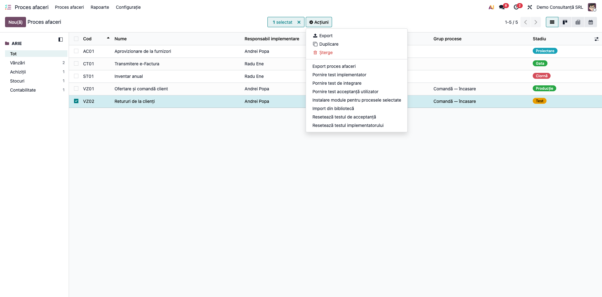

Fiecare test se creează cu toți pașii procesului. Pe o selecție de mai multe procese se creează
câte un test pentru fiecare proces; la testul implementatorului, testerul e responsabilul de
implementare al fiecărui proces.

Tot din **Acțiuni**:
- **Import din bibliotecă** — ca din proiect (Pasul 10), în proiectul procesului selectat;
- **Resetează testul de acceptanță** / **Resetează testul implementatorului** — repun pe
  *Neînceput* doar stadiul testului de pe proces; testele create rămân.

Butonul inteligent **Pornire test** (cu contor) din formularul procesului deschide testul de
acceptanță al procesului. Îl creează doar dacă procesul nu are încă niciunul. Dacă procesul are mai
multe teste de acceptanță, deschide lista lor.

### Pasul 5 — Rularea testului de acceptanță

*Proces afaceri → Proces afaceri → Teste proces* → testul. **Pornire** trece testul în rulare, pune
datele de început și îl alege ca tester pe utilizatorul curent, dacă nu era ales.

Pe fiecare pas utilizatorul-cheie completează *Date utilizate*, *Date rezultate* și **Rezultat**
(*Trecut* / *Eșuat*). Rândurile trecute apar cu verde, cele eșuate cu roșu, iar *Progres testare*
arată procentul de pași trecuți.

Pe un pas eșuat apare butonul ① pentru **problemele pasului**: deschide lista lor și permite o
problemă nouă, cu proiectul, procesul, aria și responsabilul completate.

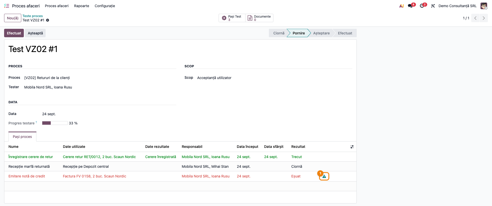

**Efectuat** închide testul. Pe proces, stadiul testului respectiv devine *Efectuat*. Dacă nu mai
rămâne niciun test nefinalizat, procesul trece singur în **Gata**. Excepție: finalizarea testului
implementatorului nu schimbă starea procesului.

Un proces aflat deja în *Gata*, *Producție* sau *Abandonat* nu își schimbă starea la închiderea unui
test.

**Așteaptă** pune testul în *Așteptare* (ex. până vin datele de test de la client). Din *Așteptare*,
**Reia** îl trece înapoi în rulare, iar **Efectuat** îl închide.

**Efectuat** marchează *Trecut* doar pașii rămași în *Ciornă* (neevaluați). Pașii *Eșuați* rămân
eșuați. Închideți testul după ce toate problemele lui sunt rezolvate.

### Pasul 6 — Problemele (issues)

*Proces afaceri → Proces afaceri → Probleme*. O problemă are **Categorie** (Defect, Problemă
deschisă, Îmbunătățire, Cerere schimbare, Operație, Altele) și **Severitate** (Critic, Majoră,
Minoră, Cosmetică).

Fluxul ei:

| Buton | Stare nouă | Cine | Ce cere / ce face |
|---|---|---|---|
| **Trimite** | Deschis | oricine | marchează pasul de test *Eșuat* |
| **În desfășurare** ① | Alocat | Responsabil proces | *Data estimată* devine obligatorie |
| **Rezolvat** | Rezolvat | Responsabil proces | cere *Soluție* și *Data soluției* |
| **În testare** | În testare la client | oricine | clientul reverifică |
| **Efectuat** | Închis | oricine | cere *Data închiderii*; pune *Pasul de test* pe *Trecut* dacă nu mai are alte probleme deschise |
| **Redeschide** | Redeschis | oricine | din *În testare la client* |
| **Setează ciornă** | Ciornă | Admin procese | din orice stare, în afară de *Ciornă* și *Redeschis* |

La creare, problema trimite managerului de proiect un e-mail „Issue Submitted” (șablonul e în
engleză). La aprobarea unei dezvoltări pleacă, tot către managerul de proiect, e-mailul „Development
Approved”.

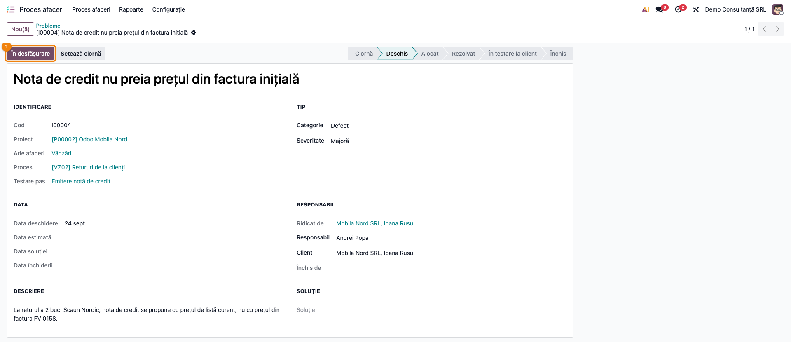

### Pasul 7 — Trecerea în producție

Procesul ajunge în **Gata** fie singur, la închiderea ultimului test (Pasul 5), fie manual, cu
butonul **Finalizare testare**. Acesta refuză trecerea cât procesul are teste nefinalizate și le
numește în mesaj. Problemele deschise nu sunt verificate: urmăriți-le în testul respectiv.

Când procesul e **Gata**, **Trecere producție** îl trece în *Producție*. **Resetează la ciornă**
(din orice stare, în afară de *Ciornă*) și **Abandonează** sunt disponibile pentru corecturi.

### Pasul 8 — Rapoarte

*Proces afaceri → Rapoarte*:
- **Procese afaceri** — pașii proceselor pe proiect, arie și stare. Tabelul numără **pași**, nu
  procese.

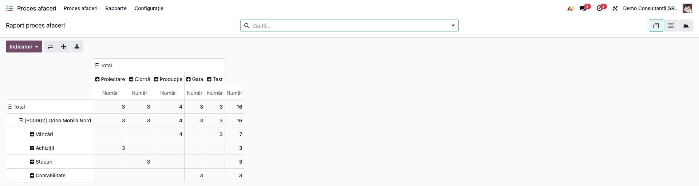

- **Teste afaceri** — pașii de test pe arie și rezultat (trecut / eșuat / ciornă).

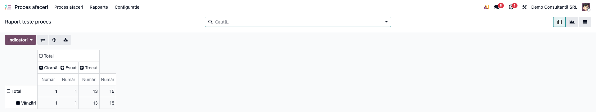

- **Probleme** — problemele pe arie și severitate.

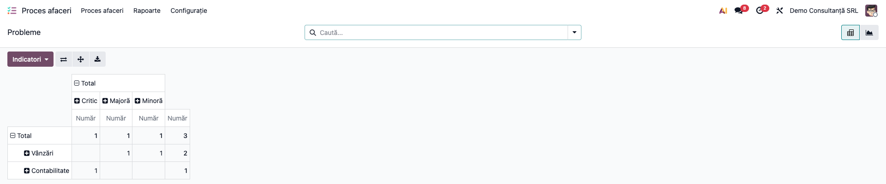

Din proiect, **Acțiuni → Descarcă raportul Excel** descarcă `Project_Report.xlsx`: procesele pe
arii, cu durata de configurare, instruire, testare, migrare și totalul. Procesele cu durata totală 0
apar cu roșu. Antetele sunt în limba utilizatorului care descarcă raportul.

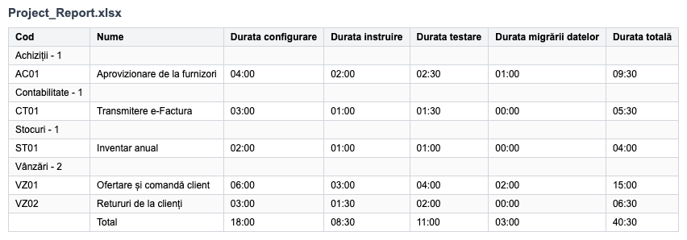

### Pasul 9 — Export și import de procese (JSON)

Procesele unui proiect se pot refolosi la alt client:
- **Export**: din lista proceselor, selectați procesele, apoi **Acțiuni → Export proces afaceri**.
  Alegeți ce se include (stare, teste, probleme, module, durate, dezvoltări, iar în tab-ul
  *Contacte* responsabilii), apoi **Export** și descărcați fișierul JSON.

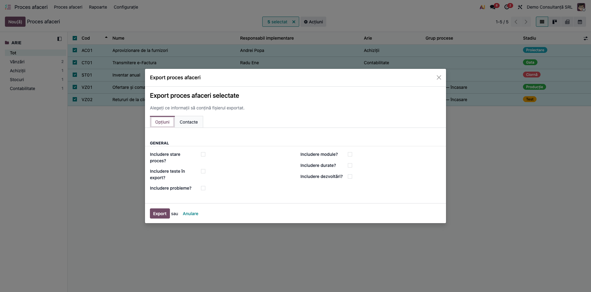

- **Import**: din formularul proiectului țintă, **Acțiuni → Import din fișier (JSON)**. Procesele
  existente în proiect (același cod) se actualizează, fără durate; cele noi se creează. Responsabilii
  se caută după nume: un nume care nu există în baza țintă creează un contact nou.

### Pasul 10 — Import din biblioteca de procese

Din formularul proiectului, **Acțiuni → Import din bibliotecă**. Dialogul întreabă dacă se importă
și **duratele** exportate (pentru toate procesele selectate, totul sau nimic), apoi **Continuă**
afișează procesele disponibile, grupate pe arie, cu modulele legate și sursa.

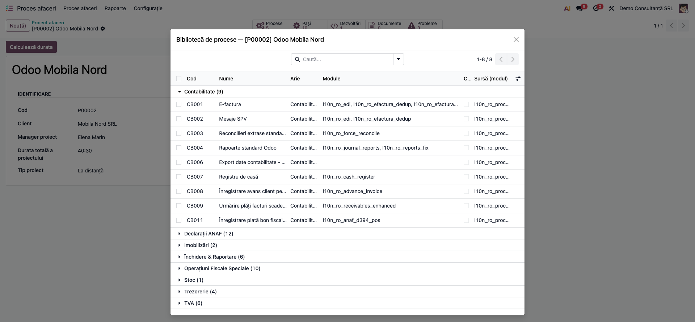

Bifați procesele și apăsați **Importă selectate**. Fiecare proces vine cu pașii și testele lui. Ca
atașamente PDF vin fișa procesului și fișele consultant ale modulelor legate. Un proces al cărui cod
există deja în proiect este sărit.

## 7. Legături cu alte module / declarații

- **`l10n_ro_process_library`** (suita `l10n_ro_ent`) — biblioteca de procese RO: 50 de procese de
  contabilitate, TVA, declarații ANAF, trezorerie, imobilizări și stocuri, cu fișe și capturi.
  Instalarea ei le face disponibile la **Import din bibliotecă**.
- **`l10n_ro_doc_screenshots`** — generează capturile acestei fișe (dependență doar pentru teste).
- **Module legate de proces** (tab-ul *Module*) — pe un proiect *Local*, **Instalare module pentru
  procesele selectate** le instalează direct din proces. Pe un proiect *La distanță* acțiunea e
  blocată.
- Nu are legături contabile și nu influențează nicio declarație ANAF.

## 8. Verificări pentru consultant

- [ ] Utilizatorii au grupul potrivit la *Proces afaceri*: managerul de proiect **Admin procese**,
      consultanții pe arie **Responsabil proces** (schimbă starea proceselor).
- [ ] Un proces nou dintr-o arie cu responsabil primește automat *Responsabil implementare*.
- [ ] **Pornire proiectare** pune data de început BBP, iar **Pornire test** data de sfârșit și 100 %.
- [ ] Un test pornit pe proces conține toți pașii procesului.
- [ ] Un pas marcat *Eșuat* arată butonul de probleme. **Trimite** pe problemă pune pasul pe *Eșuat*,
      iar închiderea ultimei probleme a pasului îl pune pe *Trecut*.
- [ ] **Rezolvat** cere *Soluție* și *Data soluției*. **Efectuat** pe problemă cere *Data închiderii*.
- [ ] După **Efectuat** pe testul de acceptanță, procesul trece în *Gata* dacă nu mai are teste
      nefinalizate. Un proces deja în *Producție* rămâne în *Producție*.
- [ ] **Finalizare testare** refuză un proces cu teste nefinalizate.
- [ ] Butonul inteligent **Pornire test** apăsat de două ori deschide același test de acceptanță.
- [ ] Pe demo, **Calculează durata** dă 40:30 pe proiect.
- [ ] Un proces cu *Vizibil doar pentru* completat nu apare unui utilizator din afara listei, nici în
      rapoarte.
- [ ] **Import din bibliotecă** arată procesele din `l10n_ro_process_library` când modulul e
      instalat.

## 9. Mesaje de eroare frecvente

| Mesaj / simptom | Cauză probabilă | Remediere |
|---|---|---|
| „Doar responsabilii de proces pot schimba starea unui proces de business.” | Utilizatorul e doar *Utilizator final* | Dați grupul **Responsabil proces** celui care conduce ciclul de viață al procesului |
| „Procesul … are încă teste nefinalizate: …” la **Finalizare testare** | Procesul are teste care nu sunt *Efectuate* | Închideți testele numite în mesaj (**Efectuat**), apoi reluați |
| „The field Solution Date is required, please complete it to change status to Solved” | Lipsește *Data soluției* sau *Soluția* | Completați ambele câmpuri, apoi **Rezolvat** |
| „The field Closed Date is required, please complete it to change status to Closed” | Lipsește *Data închiderii* | Completați-o în starea *În testare la client* |
| „This test is completed.” | Problema a fost legată de un pas al unui test deja *Efectuat* | Alegeți un pas dintr-un test în rulare |
| „No project selected!” la import | Asistentul de import a fost deschis fără un proiect sau proces curent | Deschideți-l din formularul proiectului țintă |
| „Only local projects can install modules” | **Instalare module** pe un proiect *La distanță* | Comportament voit; instalați modulele în baza clientului |
| Eroare de acces la **Calculează durata** sau la schimbarea stării proiectului | Doar *Admin procese* poate modifica proiectul | Comportament voit; operația se face de managerul de proiect |
| Pașii procesului nu se pot modifica | Procesul e în *Test* sau mai departe | **Resetează la ciornă**, modificați, apoi reluați |

## 10. Capturi de ecran

Capturile (`readme/screenshots/`) se generează automat din `tests/test_screenshots.py`, cu mixinul
`ScreenshotCase` din `l10n_ro_doc_screenshots` (import defensiv). Sunt în **limba română**, pe
compania **Demo Consultanță SRL**, cu datele demo din secțiunea 4.

| # | Fișier | Conținut |
|---|---|---|
| 1 | `01_proiecte.png` | Lista proiectelor (kanban) |
| 2 | `02_proiect.png` | Proiectul, cu butoanele de navigare și **Calculează durata** |
| 3 | `03_procese.png` | Lista proceselor, pe arii și stări |
| 4 | `04_proces_pasi.png` | Procesul VZ02 în *Test*, cu pașii lui |
| 5 | `05_proces_durate.png` | Tab-ul *Durată*: BBP și estimările de efort |
| 6 | `06_proces_responsabili.png` | Tab-ul *Responsabil*, cu *Vizibil doar pentru* |
| 7 | `07_pornire_teste.png` | Meniul **Acțiuni** din lista proceselor |
| 8 | `08_test_acceptanta.png` | Testul de acceptanță VZ02: pas trecut, pas eșuat, pas neînceput |
| 9 | `09_issue.png` | Problema deschisă pe pasul eșuat |
| 10 | `10_raport_procese.png` | Raportul *Procese afaceri* (pivot) |
| 11 | `11_raport_teste.png` | Raportul *Teste afaceri* (pivot) |
| 12 | `12_raport_issues.png` | Raportul *Probleme* pe arie și severitate |
| 13 | `13_raport_excel_proiect.png` | Exportul Excel al proiectului |
| 14 | `14_export_json.png` | Asistentul **Export proces afaceri** |
| 15 | `15_biblioteca_procese.png` | Biblioteca de procese RO, grupată pe arie |
| 16 | `16_setari_biblioteca.png` | Setările bibliotecii de procese |

Regenerare (captura 15 cere și `l10n_ro_process_library`; fără el se sare doar ea):

```bash
./odoo/odoo-bin -c odoo.conf -d <db> \
    -i deltatech_business_process,l10n_ro_doc_screenshots,l10n_ro_process_library \
    --test-tags=/deltatech_business_process:TestBusinessProcessScreenshots --stop-after-init \
    --http-port=8993 --gevent-port=8994
```

## 11. Observații pentru manual

Păstrați ordinea de lucru:
1. drepturile (managerul de proiect pe **Admin procese**, consultanții pe **Responsabil proces**);
2. ariile, cu responsabilii lor, și etapele de implementare;
3. proiectul;
4. procesele: din bibliotecă, din JSON-ul altui proiect sau scrise de la zero, cu pașii și duratele;
5. proiectarea (**Pornire proiectare**), apoi **Pornire test**;
6. testul implementatorului, apoi testul de acceptanță cu utilizatorul-cheie;
7. problemele găsite, rezolvate și închise;
8. închiderea testului (**Efectuat**), apoi **Trecere producție**.

Subliniați pentru client că **rezultatul se trece pe fiecare pas**, nu pe test în ansamblu, și că
orice pas eșuat trebuie să aibă o problemă deschisă. Altfel defectul nu mai poate fi urmărit.

### Limitări cunoscute

- **Deschiderea bibliotecii de procese creează ariile lipsă** (ex. „Declarații ANAF”), chiar dacă nu
  importați nimic.
- **Durata totală a proiectului nu se actualizează singură**: se recalculează doar la **Calculează
  durata**.
- **Importul JSON potrivește responsabilii după nume**: un nume scris altfel în baza țintă creează un
  contact nou.
