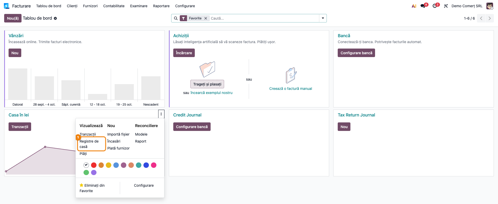
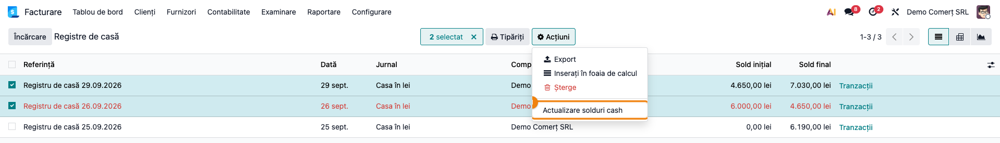
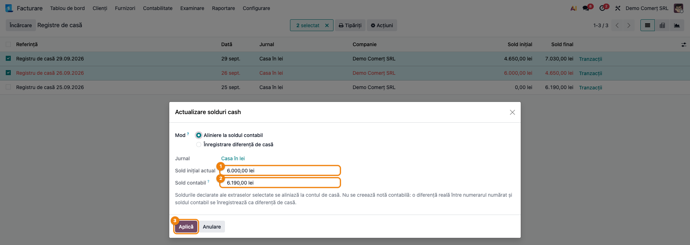
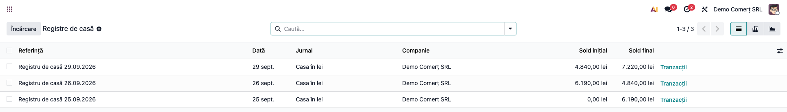
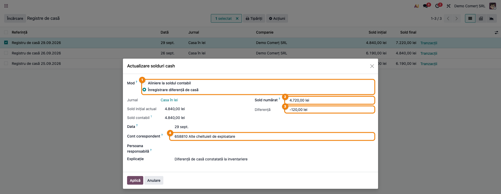
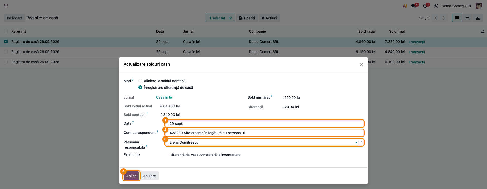
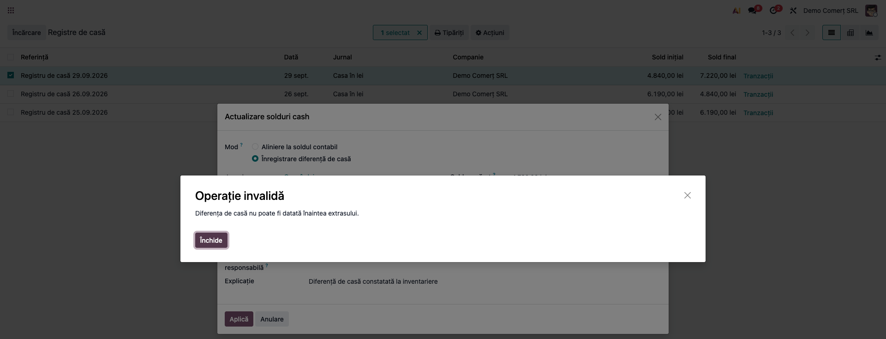
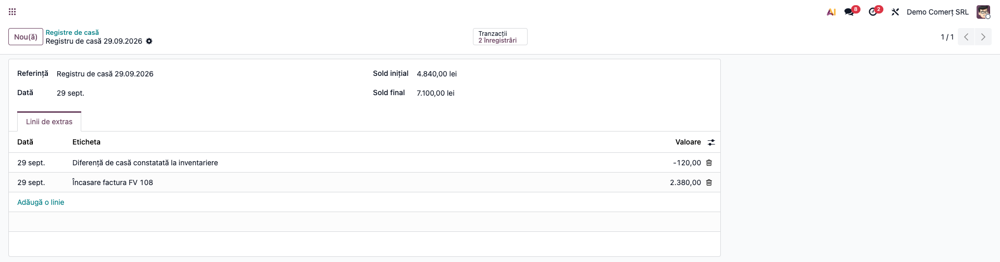
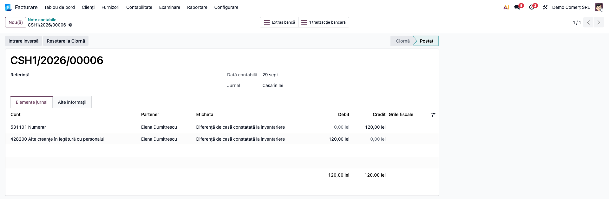

# Fișă Modul: Solduri de casă și diferențe de casă

**Modul:** `deltatech_cash_statement`
**Utilizator principal:** Contabil, Casier
**Prioritate:** 🟡 Medie (corectează soldurile registrelor de casă fără a ascunde diferențele de numerar)

---

## 1. Scop business

În Odoo, fiecare registru de casă (extras al jurnalului de numerar) are un **sold inițial** și un
**sold final**. Când un registru a fost creat cu soldul inițial tastat greșit, sau când la
inventarierea casei numerarul numărat diferă de soldul din contabilitate, lanțul de solduri se rupe
și registrele apar cu roșu în listă.

Modulul adaugă pe lista registrelor de casă acțiunea **Actualizare solduri cash**, cu două moduri:

- **Aliniere la soldul contabil** — soldul inițial al primului registru selectat devine soldul
  contului de casă (5311) din notele postate **dinaintea** datei registrului, iar fiecare registru
  următor pornește de la soldul final real al celui dinainte. **Nu se creează notă contabilă**:
  se corectează doar soldurile declarate pe registre, nu contabilitatea.
- **Înregistrare diferență de casă** — când numerarul numărat diferă de soldul contabil, diferența
  se înregistrează printr-o **linie de registru datată**, cu nota contabilă aferentă: plusul pe
  7588, minusul pe 6588 sau, dacă lipsa se impută unei persoane, pe 4282 cu persoana responsabilă.

Principiul modulului: un sold de casă **nu se suprascrie** cu o valoare tastată. Orice diferență
reală între casă și contabilitate trece printr-o notă datată și documentată.

## 2. Bază legală și context

- **Inventarierea casei**: numerarul se inventariază cel puțin la închiderea exercițiului și ori de
  câte ori e nevoie (Legea contabilității nr. 82/1991, art. 7; procedura de inventariere din
  OMFP 2861/2009). Diferențele constatate se înregistrează în contabilitate.
- **Registrul de casă** (OMFP 2634/2015, documentele financiar-contabile): soldul de la sfârșitul
  zilei se reportează ca sold inițial al zilei următoare. Modulul păstrează această regulă: soldul
  inițial vine din contabilitate și din registrul anterior, nu se tastează.
- **Conturi** (OMFP 1802/2014): plusurile de casă sunt venituri (7588 „Alte venituri din
  exploatare"); lipsurile neimputabile sunt cheltuieli (6588 „Alte cheltuieli de exploatare");
  lipsurile imputate se urmăresc ca debit al persoanei vinovate (4282 „Alte creanțe în legătură cu
  personalul").
- **Fiscal**: o lipsă de numerar neimputată (6588) este de regulă cheltuială nedeductibilă la
  impozitul pe profit. Tratamentul fiscal se stabilește cu contabilul firmei.

## 3. Utilizatori și roluri

- **Contabilul** rulează alinierea soldurilor și înregistrează diferențele de la inventariere.
- **Casierul** semnalează diferența numărată și este, de obicei, persoana căreia i se impută lipsa.

Roluri recomandate pentru testare:
- utilizator cu drept **Facturare** sau **Contabil** (vede jurnalele de numerar și registrele de
  casă); meniul **Note contabile** cere cel puțin drept de citire în contabilitate;
- un partener pentru casier (ex. „Elena Dumitrescu"), folosit ca persoană responsabilă la 4282.

## 4. Conturi și date implicate

| Cont | Rol |
|---|---|
| **5311** Casa în lei | contul implicit al jurnalului de numerar; soldul lui este „Sold contabil" în wizard |
| **7588** Alte venituri din exploatare | contrapartida plusului de casă (implicit pe companie RO) |
| **6588** Alte cheltuieli de exploatare | contrapartida minusului neimputat (implicit pe companie RO) |
| **4282** Alte creanțe în legătură cu personalul | minusul imputat; cere persoana responsabilă |

Pe o companie din altă țară decât România, contrapartidele implicite sunt conturile **Cont Profit**
și **Cont Pierderi** setate pe jurnalul de numerar.

Date minime pentru demo (cele din capturi):
- companie RO cu plan de conturi RO, jurnal de numerar **Casa în lei** (5311);
- trei registre de casă:

| Registru | Operațiuni | Notă |
|---|---|---|
| 25.09.2026 | ridicare numerar de la bancă +5.000; încasare factura FV 102 +1.190 | 5311 = 581; 5311 = 4111 |
| 26.09.2026 | plată factura 4471 −850; avans de trezorerie −500 | 401 = 5311; 542 = 5311 |
| 29.09.2026 | încasare factura FV 108 +2.380 | 5311 = 4111 |

- registrul din 26.09 are soldul inițial tastat greșit: **6.000** în loc de **6.190**;
- la inventarierea din 29.09, dimineața, casiera numără **4.720 lei**, față de soldul contabil de
  **4.840 lei**: lipsă de **120 lei**, imputată casierei.

## 5. Configurare inițială

1. Instalați modulul `deltatech_cash_statement` (depinde doar de `account`).
2. Verificați că jurnalul de numerar are contul implicit **5311** (Facturare → Configurare →
   Contabilitate → Jurnale, sau Contabilitate → Configurare → … cu aplicația de contabilitate
   instalată; necesită drept de administrator contabil).
3. Pe o companie RO, conturile 7588, 6588 și 4282 există în planul de conturi; nu e nevoie de altă
   configurare. Pe o companie din altă țară, completați **Cont Profit** și **Cont Pierderi** pe
   jurnalul de numerar.

## 6. Flux de utilizare

### Pasul 1 — Deschideți registrele de casă

Accesați **Facturare → Tablou de bord** (sau **Contabilitate → Tablou de bord**, cu aplicația de
contabilitate instalată). Pe cardul jurnalului de numerar (**Casa în lei**) deschideți meniul
**⋮** și alegeți **Vizualizează → Registre de casă**.



### Pasul 2 — Selectați registrele și porniți acțiunea

Lista **Registre de casă** arată, pe fiecare registru, **Sold inițial** și **Sold final**.
Un registru afișat cu **roșu** are soldul inițial diferit de soldul final al registrului anterior
sau soldul final diferit de suma operațiunilor. În exemplu, registrul din 26.09 începe de la
6.000,00 lei, deși cel din 25.09 s-a încheiat la 6.190,00 lei.

Bifați registrele de corectat — **toate ale aceluiași jurnal**, de la primul registru greșit până
la ultimul (aici 26.09 și 29.09) — apoi **Acțiuni → Actualizare solduri cash**.



### Pasul 3 — Aliniere la soldul contabil

Wizardul se deschide în modul **Aliniere la soldul contabil**. Comparați:
1. **Sold inițial actual** — soldul inițial declarat pe primul registru selectat (6.000,00 lei);
2. **Sold contabil** — soldul contului 5311 din notele postate datate **înaintea** primului
   registru (6.190,00 lei = 5.000 + 1.190).

Dacă diferența vine dintr-o tastare greșită pe registru (casa reală are 6.190 lei), apăsați
**Aplică**. Dacă numerarul numărat diferă de soldul contabil, nu aliniați: înregistrați
diferența (pasul 5).



### Pasul 4 — Verificați registrele aliniate

După **Aplică**, registrele selectate se actualizează în ordine cronologică: registrul din 26.09
pornește de la 6.190,00 lei și se încheie la 4.840,00 lei, iar cel din 29.09 pornește de la
4.840,00 lei. Niciun registru nu mai este roșu. Nu s-a creat nicio notă contabilă: soldul
contului 5311 a rămas același.



### Pasul 5 — Înregistrare diferență de casă (minus neimputat, 6588)

La inventarierea din 29.09, înainte de operațiunile zilei, casiera numără 4.720 lei. Bifați
**doar registrul zilei inventarierii** (29.09) și porniți din nou **Acțiuni → Actualizare solduri
cash**. Completați:
1. **Mod** = **Înregistrare diferență de casă**;
2. **Sold numărat** = numerarul numărat efectiv la începutul zilei registrului (4.720,00 lei);
3. **Diferență** se calculează singură: sold numărat − sold contabil (−120,00 lei = lipsă);
4. **Cont corespondent** se propune singur: **6588** la minus, **7588** la plus.

**Data** se propune egală cu data registrului; **Explicație** are textul „Diferență de casă
constatată la inventariere" și se poate modifica (ex. numărul procesului-verbal de inventariere).

Bifați un singur registru: dacă bifați mai multe, diferența se înregistrează pe **cel mai vechi**
dintre ele, nu pe ziua inventarierii. Și în acest mod, după crearea liniei, soldurile registrelor
bifate se realiniază, iar soldul final declarat devine soldul calculat din operațiuni.



### Pasul 6 — Minus imputat casierei (4282)

Dacă lipsa se impută casierei, schimbați contul:
1. **Data** — data notei (nu poate fi înaintea registrului, vezi pasul 7);
2. **Cont corespondent** = **4282** Alte creanțe în legătură cu personalul;
3. **Persoana responsabilă** = casiera (Elena Dumitrescu) — devine **obligatorie** la 4282; pe ea
   se urmărește debitul;
4. **Aplică** — înainte de a apăsa, verificați data (pasul 7).



### Pasul 7 — Verificați data, apoi aplicați

Dacă **Data** este anterioară registrului (ex. 28.09 pe registrul din 29.09), **Aplică** este
refuzat cu mesajul „Diferența de casă nu poate fi datată înaintea extrasului.". O diferență
datată înaintea registrului ar fi numărată de două ori: o dată în soldul contabil de la începutul
registrului și încă o dată în liniile lui. Închideți mesajul, corectați data (29.09 sau o zi
ulterioară) și apăsați din nou **Aplică**: wizardul se închide și diferența este înregistrată.



### Pasul 8 — Registrul cu linia de diferență

Deschideți registrul din 29.09: are o linie nouă **Diferență de casă constatată la inventariere**
de **−120,00**, cu data registrului. Soldul inițial rămâne 4.840,00 lei, iar soldul final devine
7.100,00 lei (4.840 + 2.380 − 120). Linia are nota contabilă deja postată.



### Pasul 9 — Nota contabilă a diferenței

Deschideți nota din **Facturare → Contabilitate → Tranzacții → Note contabile** (sau
**Contabilitate → …**, cu aplicația de contabilitate instalată; meniul cere drept de citire în
contabilitate), filtrând jurnalul **Casa în lei** și data 29.09. Pe notă, butonul **Extras bancă**
(denumirea standard Odoo, și pentru numerar) deschide înapoi registrul de casă. În tab-ul
**Elemente jurnal**, verificați:
- debit **4282** Alte creanțe în legătură cu personalul, 120,00 lei, partener **Elena Dumitrescu**;
- credit **5311** Numerar (531101 în planul RO din Odoo), 120,00 lei;
- data contabilă **29.09**, starea **Postat**.



### Note de monografie și raportare

| Operațiune | Notă contabilă | Generată de |
|---|---|---|
| Aliniere la soldul contabil | — (nu se creează notă) | modul: modifică doar soldurile declarate pe registre |
| Plus de casă la inventariere | `5311 = 7588` | modul (linie de registru datată) |
| Minus de casă neimputat | `6588 = 5311` | modul (linie de registru datată) |
| Minus de casă imputat | `4282 = 5311` (pe persoana responsabilă) | modul (linie de registru datată) |
| Recuperarea sumei imputate, în numerar | `5311 = 4282` | manual, în registrul de casă al zilei |
| Recuperarea prin reținere din salariu | `421 = 4282` | manual / modulul de salarizare |

Operațiunile din exemplu, înregistrate prin registre: `5311 = 581` (5.000, ridicare numerar),
`5311 = 4111` (1.190 și 2.380, încasări), `401 = 5311` (850, plată furnizor), `542 = 5311` (500,
avans de trezorerie). Soldul contului 5311 la sfârșitul zilei de 29.09: 4.840 + 2.380 − 120 =
**7.100 lei**, egal cu soldul final al registrului.

## 7. Legături cu alte module / declarații

| Modul | Rol |
|---|---|
| `account` | jurnalele de numerar, registrele de casă (extrase) și liniile lor; modulul doar adaugă acțiunea |
| `l10n_ro` | planul de conturi RO: 5311, 7588, 6588, 4282; pe companie RO conturile implicite ale diferenței |
| `l10n_ro_cash_bank_enhanced` (opțional) | plafoanele de numerar și tabloul „Casă și bancă"; soldul de pe tablou este soldul contabil 5311, pe care îl folosește și alinierea |

**Ce e automat:** calculul soldului contabil dinaintea registrului, înlănțuirea soldurilor pe
registrele selectate, calculul diferenței, propunerea contului (7588 / 6588 sau conturile
jurnalului), crearea și postarea liniei de registru cu nota ei.
**Ce rămâne manual:** numărarea casei și procesul-verbal de inventariere, alegerea între aliniere și
diferență, schimbarea contului pe 4282 și alegerea persoanei responsabile, recuperarea sumei
imputate.

## 8. Verificări pentru consultant

- [ ] Pe lista **Registre de casă**, cu registre bifate, meniul **Acțiuni** conține **Actualizare
      solduri cash**.
- [ ] Cu registre din două jurnale bifate, wizardul refuză: „Selectați extrase ale unui singur jurnal."
- [ ] În modul **Aliniere**, **Sold contabil** este egal cu soldul contului 5311 din notele postate
      datate înaintea primului registru selectat (6.190,00 lei în exemplu).
- [ ] După **Aplică** în modul Aliniere, fiecare registru pornește de la soldul final al celui
      anterior, niciun registru nu mai e roșu și **nu** apare nicio notă contabilă nouă.
- [ ] În modul **Diferență**, cu sold numărat 4.720 față de sold contabil 4.840, **Diferență** =
      −120,00 și contul propus este 6588; cu un sold numărat mai mare, contul propus este 7588.
- [ ] Cu **Cont corespondent** = 4282, câmpul **Persoana responsabilă** devine obligatoriu.
- [ ] O dată anterioară registrului este refuzată cu „Diferența de casă nu poate fi datată
      înaintea extrasului."
- [ ] După aplicare, registrul are linia „Diferență de casă constatată la inventariere" cu
      −120,00, iar nota ei este `4282 = 5311`, pe partenerul ales, postată, datată 29.09.
- [ ] Soldul final al registrului (7.100,00 lei) este egal cu soldul contului 5311 la aceeași dată.

## 9. Mesaje de eroare frecvente

| Mesaj | Cauză | Remediere |
|---|---|---|
| „Vă rugăm să selectați doar extrase deschise sau postate" | Acțiunea a fost pornită fără registre selectate | Bifați cel puțin un registru de casă în listă |
| „Selectați extrase ale unui singur jurnal." | Registrele bifate aparțin mai multor jurnale (ex. casă lei și casă valută) | Rulați acțiunea separat pe fiecare jurnal |
| „Alegeți contul pe care se înregistrează diferența de casă." | Mod Diferență, cu diferență nenulă și fără cont (companie non-RO fără Cont Profit / Cont Pierderi pe jurnal) | Alegeți contul sau completați conturile pe jurnal |
| „Completați data diferenței de casă." | Data a fost ștearsă | Completați data (cel mai devreme data registrului) |
| „Diferența de casă nu poate fi datată înaintea extrasului." | Data diferenței este anterioară registrului | Puneți data registrului sau o dată ulterioară |
| „Alegeți persoana căreia i se impută lipsa de numerar." | Cont 4282 (sau alt cont de creanță) fără persoană responsabilă | Alegeți persoana responsabilă |
| Registrul rămâne roșu după aliniere | Nu au fost selectate toate registrele de după cel greșit | Selectați toate registrele, de la primul greșit până la ultimul |

## 10. Capturi de ecran

Capturile din `readme/screenshots/` se generează automat din `tests/test_screenshots.py`
(mixinul `ScreenshotCase` din `l10n_ro_doc_screenshots`, HttpCase + Playwright, import defensiv),
în limba română, pe o companie cu plan de conturi RO.

Lista capturilor (în ordinea fluxului):
1. `01_tablou_registre_casa.png` — tabloul de bord: meniul jurnalului de numerar, „Registre de casă"
2. `02_lista_registre_actiune.png` — lista registrelor, registrul greșit cu roșu, Acțiuni → Actualizare solduri cash
3. `03_aliniere_sold_contabil.png` — wizardul în modul „Aliniere la soldul contabil"
4. `04_registre_aliniate.png` — registrele după aliniere, cu soldurile înlănțuite
5. `05_diferenta_casa_6588.png` — diferență de casă: minus de 120 lei propus pe 6588
6. `06_diferenta_casa_4282.png` — minusul imputat casierei: 4282 cu persoana responsabilă
7. `07_eroare_data_anterioara.png` — blocajul diferenței datate înaintea registrului (pasul 7)
8. `08_registru_cu_diferenta.png` — registrul din 29.09 cu linia de diferență
9. `09_nota_diferenta_4282.png` — nota contabilă `4282 = 5311`

Regenerare:
```
./odoo/odoo-bin -c odoo.conf -d test19 -i l10n_ro,deltatech_cash_statement,l10n_ro_doc_screenshots \
    --test-tags=fise_screenshots --stop-after-init
```

## 11. Observații pentru manual

- Explicați diferența dintre cele două moduri: **alinierea** corectează un sold tastat greșit pe
  registru (casa reală e cea din contabilitate); **diferența de casă** corectează contabilitatea
  când casa reală diferă. Dacă nu știți care e cazul, numărați casa întâi.
- **Sold numărat** înseamnă numerarul de la **începutul** zilei registrului, înainte de operațiunile
  zilei — se compară cu soldul contabil dinaintea registrului.
- Diferența de casă se înregistrează pe registrul **zilei inventarierii** — bifați doar acel
  registru, altfel linia ajunge pe cel mai vechi registru bifat; documentul justificativ
  este procesul-verbal de inventariere (treceți-i numărul în **Explicație**).
- Alinierea nu creează notă contabilă: nu o folosiți ca să „închideți" o diferență reală de numerar.
- Pe o lipsă imputată (4282), urmăriți recuperarea pe partenerul casierului: încasare în casă
  (`5311 = 4282`) sau reținere din salariu (`421 = 4282`).
