# Fișă Modul: Încasări cu cardul și decontarea lor cu extrasul băncii (5125)

**Modul:** `deltatech_expected_receipt`
**Utilizator principal:** Casier / agent de vânzări (încasează), Contabil trezorerie (decontează)
**Prioritate:** 🟡 Medie (frecvent la firmele cu terminal de plată în showroom sau la livrare)

---

## 1. Scop business

Clientul plătește cu cardul la terminalul de plată (POS bancar), dar banii ajung în contul firmei
peste una–trei zile, ca **o singură sumă pe zi**, fără detaliu pe tranzacții. Până atunci clientul
apare restant, iar contabilul trebuie să desfacă manual suma de pe extras pe facturi. Modulul
înregistrează încasarea **în clipa plății** (clientul nu mai apare restant, banii „stau” pe 5125
„Sume în curs de decontare”) și, la venirea extrasului, găsește **combinația exactă** de încasări
care dă suma virată de bancă, la ban, și le stinge pe toate cu un clic. Este util pentru firmele
care vând cu terminal de card (showroom, livrare cu POS mobil, comenzi plătite la ridicare).

## 2. Bază legală și context

- **OMFP 1802/2014** — contul **5125 „Sume în curs de decontare”** preia sumele încasate care nu au
  ajuns încă în contul bancar; **419 „Clienți - creditori”** ține avansurile încasate de la clienți;
  **627 „Cheltuieli cu serviciile bancare și asimilate”** primește comisionul băncii.
- **Codul fiscal, art. 282 alin. (2) lit. b)** — pentru avansuri, TVA devine exigibilă la data
  încasării avansului. De aceea o plată cu cardul pe o comandă încă nefacturată se tratează ca
  avans: modulul emite **factura de avans** standard din comandă.
- **Codul fiscal, art. 319 alin. (16)** — factura se emite cel târziu până la data de 15 a lunii
  următoare celei în care a luat naștere faptul generator; pentru avansuri, cel târziu până la data
  de 15 a lunii următoare celei în care **s-a încasat avansul**. Modulul emite factura de avans chiar
  la încasare.
- **Bonul fiscal** — modulul **nu înlocuiește** bonul fiscal. Pentru vânzările către persoane fizice
  plătite cu cardul, bonul se emite în continuare din casa de marcat (aparatul de marcat electronic
  fiscal). Dacă acele vânzări se contabilizează din raportul Z, nu emiteți **și** factură de avans
  din modul pentru aceeași vânzare: venitul și TVA-ul s-ar înregistra de două ori.

## 3. Utilizatori și roluri

Modulul are două roluri proprii, în **Setări → Utilizatori → <utilizator>**, secțiunea
**„Încasări așteptate”**:

- **Casier card** — înregistrează încasări cu cardul de pe comandă și de pe factură și își vede doar
  propriile încasări (**Vânzări → Comenzi → Încasările mele cu cardul**). Nu primește niciun drept
  contabil: plata este scrisă de modul, după ce verifică compania, terminalul și documentul.
- **Administrator** — vede toate încasările, încasează și pe client fără document, decontează
  extrasul, configurează terminalele și anulează încasările greșite. Administratorii contabilității
  primesc automat acest rol.

Roluri recomandate pentru testare:
- un utilizator **Casier card** + drept de vânzări: trebuie să vadă butonul **Încasare cu cardul**
  pe comandă și pe factură, dar nu meniul **Decontare card**;
- un utilizator **Administrator** (contabil): parcurge decontarea și verifică notele.

## 4. Conturi și date implicate

| Cont | Rol |
|---|---|
| 5125 „Sume în curs de decontare” | contul de așteptare (contul de suspensie) al jurnalului bancar al terminalului; încasarea stă aici până la extras |
| 4111 „Clienți” | se creditează la încasare: clientul nu mai apare restant |
| 419 „Clienți - creditori” | contul facturii de avans, emisă pe o comandă încă nefacturată |
| 4427 „TVA colectată” | TVA-ul facturii de avans |
| 5121 „Conturi la bănci în lei” | contul jurnalului bancar în care virează banca |
| 627 „Cheltuieli cu serviciile bancare și asimilate” | comisionul băncii, pe linie separată de extras |

Date minime pentru demo:
- companie românească cu planul de conturi RO și taxa de 21% (`l10n_ro`);
- un jurnal bancar pentru contul în care virează banca (în exemplu **ING card**, cont 512105), cu
  contul de suspensie **512500 Sume în curs de decontare**, care permite reconcilierea;
- un terminal de card; câțiva clienți persoane juridice; o ofertă de vânzare și o factură postată;
- o linie de extras pe jurnalul terminalului cu suma globală virată de bancă.

## 5. Configurare inițială

1. Instalați modulul `deltatech_expected_receipt` (dependențe: `account`, `sale`).
2. Atribuiți rolurile din secțiunea 3: **Administrator** contabililor care decontează, **Casier card**
   celor care încasează.
3. Pregătiți jurnalul bancar în care virează banca: **Facturare → Configurare → Jurnale** → jurnalul
   băncii (sau unul nou, de tip Bancă). În tabul **Note contabile**, **Cont Suspensie** trebuie să
   fie un cont 5125. **Recomandat în producție: un analitic dedicat cardului** (de exemplu 5125.01
   „Încasări card în curs de decontare”). Pe planul RO, 5125 este contul de suspensie implicit al
   **tuturor** jurnalelor bancare: fără analitic dedicat, pe același cont ajung și liniile
   nereconciliate ale celorlalte bănci, iar soldul lui nu mai poate fi comparat cu registrul.
   Exemplul din capturi folosește, pentru simplitate, contul 512500.
4. Pe contul de suspensie (**Facturare → Configurare → Plan de conturi**), bifați **Permite
   reconciliere**: pe planul RO nu este bifat implicit, iar fără el modulul refuză încasarea.
5. Setați contul de avans: **Facturare → Configurare → Setări**, secțiunea **Conturi implicite**,
   rândul **Conturi produse: Cont plată în avans** = **419 Clienți - creditori**. Secțiunea apare
   utilizatorilor cu funcțiile contabile complete. Fără acest cont modulul refuză emiterea facturilor
   de avans (altfel Odoo ar credita avansul pe 707 și ar umfla cifra de afaceri).
6. Creați terminalul: **Facturare → Configurare → Terminale card → Nou**. Completați:
   - **Jurnal bancar** — jurnalul de la pasul 3; **Cont de decontare** se afișează singur din
     contul de suspensie al jurnalului;
   - **Implicit pentru** — utilizatorul care folosește terminalul: la încasare, terminalul se alege
     singur (un utilizator are un singur terminal implicit);
   - **Fereastră de potrivire (zile)** — câte zile înaintea datei extrasului se caută încasările
     (implicit 4);
   - **Alertă după (zile)** — după câte zile o încasare nedecontată apare ca întârziată (implicit 3).

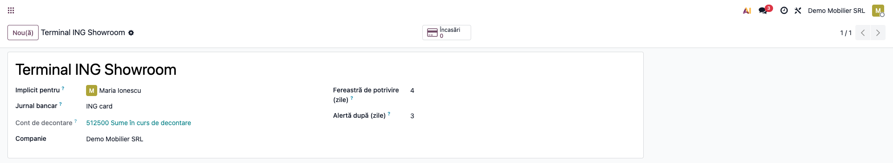

## 6. Flux de utilizare

Exemplul urmărește o zi reală de încasări pe **Terminal ING Showroom**: o ofertă plătită integral
(3.184,27 lei), o plată parțială pe o factură (301,59 lei) și o plată pe client fără document
(33,17 lei). Banca virează a doua zi suma globală de **3.519,03 lei** = 3.184,27 + 301,59 + 33,17.

### Pasul 1 — Butonul „Încasare cu cardul” pe ofertă

Deschideți oferta din **Vânzări → Comenzi → Oferte**. În antet apare butonul **Încasare cu cardul**,
lângă **Trimite** / **Confirmă**. Butonul smart **Încasări cu cardul** din dreapta-sus deschide
încasările deja înregistrate pentru comandă.

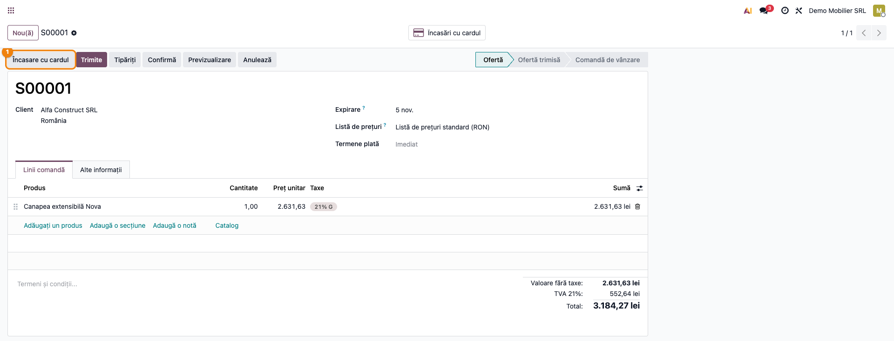

### Pasul 2 — Încasarea pe comandă (factură de avans)

Apăsați **Încasare cu cardul**. Se deschide fereastra **Încasare cu cardul**, cu clientul și comanda
completate. Verificați:

- **Facturare** — pe o comandă fără factură deschisă este propus **Emite factură de avans**. Celelalte
  variante: **Încasează o factură emisă** (când comanda are deja o factură neachitată) și **Fără
  factură (credit pe client)**, permisă doar administratorului. Folosiți-o numai dacă livrarea se
  facturează în aceeași perioadă de TVA cu încasarea, altfel TVA-ul avansului se declară cu
  întârziere: modulul nu verifică perioada, doar afișează un avertisment;
- **Sumă de plată** — ce mai e de încasat pe comandă; **Sumă încasată** se propune egală cu ea și se
  poate micșora (plată parțială); **Rămâne de plată** arată diferența;
- **Data încasării** — data de pe chitanța terminalului; **Terminal** — propus pentru utilizator.

Un mesaj galben în partea de sus semnalează problemele înainte de înregistrare (de exemplu lipsa
contului de avans 419 sau o sumă peste cea de plată).

Apăsați **Înregistrează**. Modulul: confirmă oferta (oferta plătită devine comandă de vânzare),
emite factura de avans standard din comandă pe suma încasată (cu TVA inclus), o postează, înregistrează
plata pe jurnalul terminalului și o reconciliază cu factura. Pe comandă și pe factură rămâne o notă
în istoric cu suma, terminalul și utilizatorul.

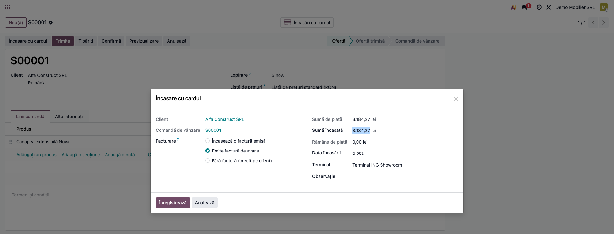

### Pasul 3 — Încasarea pe o factură emisă

Pe o factură client postată și neachitată (**Facturare → Clienți → Facturi**), butonul **Încasare cu
cardul** stă lângă **Plătește**. Fereastra se deschide cu factura selectată și **Sumă de plată** =
restul de plată al facturii (6.050,00 lei). În exemplu clientul plătește doar **301,59 lei**:
modificați **Sumă încasată** și apăsați **Înregistrează**. Butonul **Încasări cu cardul** de pe
factură deschide încasările ei. Nota generată este tot **Dr 5125 = Cr 4111** (301,59 lei), ca la
pasul 6.

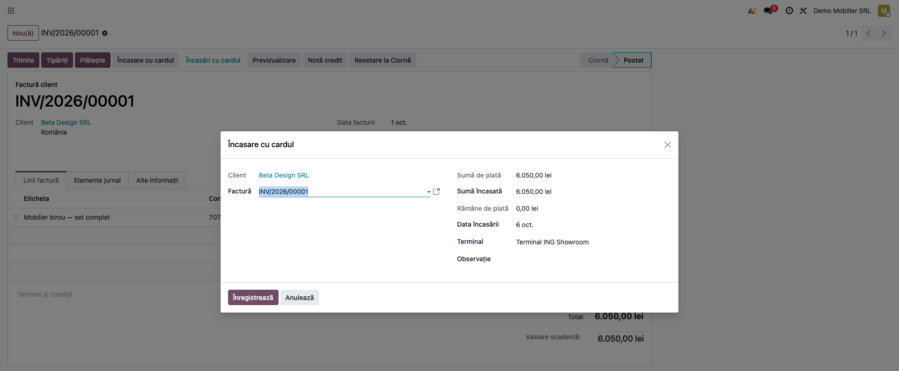

### Pasul 4 — Încasarea pe client (sold mai vechi, fără document)

Pentru o plată pe soldul clientului, fără comandă sau factură anume: **Facturare → Clienți → Încasare
cu cardul pe client** (doar administratorul). Alegeți **Client**, completați **Sumă încasată**
(în exemplu 33,17 lei pentru Gamma Retail SRL), data și terminalul, apoi **Înregistrează**. Plata
rămâne pe client și se reconciliază ulterior cu factura lui, în reconcilierea standard. Nota
generată este tot **Dr 5125 = Cr 4111** (33,17 lei), ca la pasul 6.

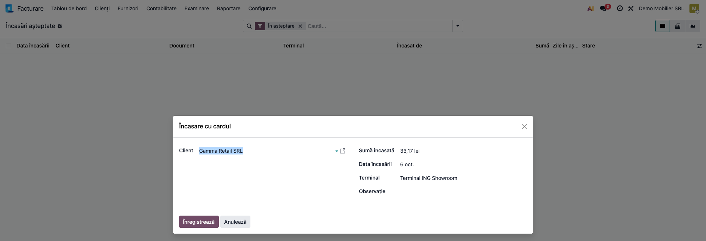

### Pasul 5 — Verificarea facturii de avans

Deschideți factura de avans din butonul **Încasări cu cardul** al comenzii → **Document** sau din
**Facturare → Clienți → Facturi**. În tabul **Elemente jurnal** verificați:

- **Dr 4111 Clienți** = 3.184,27 lei (suma încasată, cu TVA);
- **Cr 419 Clienți - creditori** = 2.631,63 lei (baza avansului);
- **Cr 4427 TVA colectată** = 552,64 lei (21%);
- banderola **PLĂTIT**: plata cu cardul este deja reconciliată cu factura.

La facturarea finală a comenzii, avansul se scade automat (mecanismul standard Odoo de avansuri).

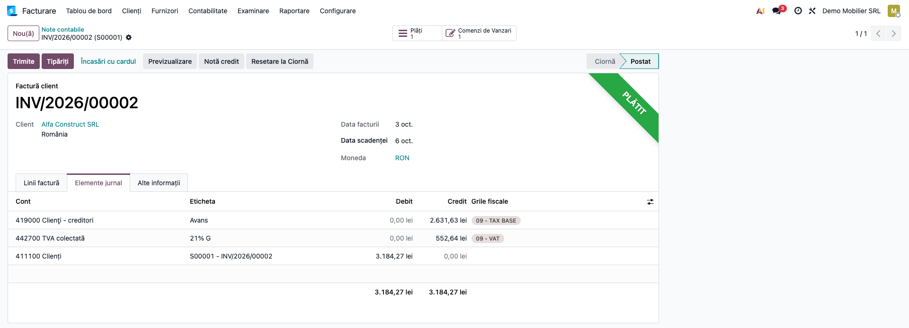

### Pasul 6 — Verificarea notei de încasare (5125 = 4111)

Plata se postează imediat pe jurnalul terminalului. Din factură → butonul **Plăți**, sau din registru
→ încasarea → **Plată**, deschideți nota și verificați în tabul **Elemente jurnal**:

- **Dr 512500 Sume în curs de decontare** = 3.184,27 lei;
- **Cr 411100 Clienți** = 3.184,27 lei, pe partenerul clientului;
- **Referință** = „Card <terminal> · <document>”, ca să regăsiți încasarea pe chitanța terminalului.

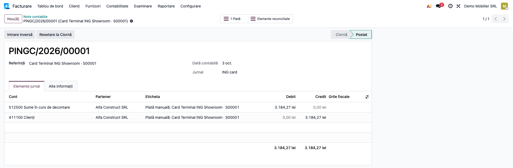

### Pasul 7 — Factura plătită parțial

Pe factura din pasul 3, banderola **PARȚIAL** și rândul **Plătit pe 04.10.2026 — 301,59 lei**
confirmă încasarea; **Valoare scadentă** = 6.050,00 − 301,59 = **5.748,41 lei**. Butonul **Încasare
cu cardul** rămâne disponibil pentru restul sumei.

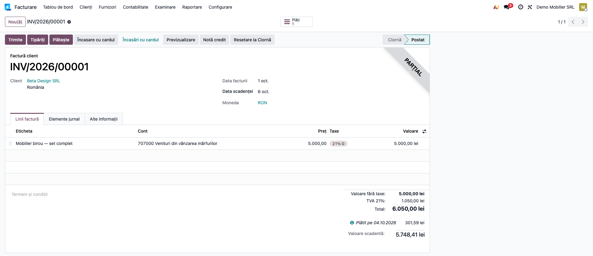

### Pasul 8 — Registrul „Încasări așteptate”

**Facturare → Clienți → Încasări așteptate** se deschide cu filtrul **În așteptare**. Fiecare rând
este o încasare cu cardul: **Data încasării**, **Client**, **Document** (factura și/sau comanda),
**Terminal**, **Încasat de**, **Sumă**, **Zile în așteptare** și **Stare**. Verificați:

- totalul coloanei **Sumă** (4.089,03 lei) = încasările cu cardul încă nedecontate; vezi mai jos,
  la „Note de monografie și raportare”, cum se compară cu soldul contului 5125;
- rândurile **roșii** sunt întârziate: au depășit pragul **Alertă după (zile)** al terminalului (în
  exemplu Epsilon Interior SRL, 450,00 lei, 6 zile). Filtrul **Întârziată** le arată doar pe ele;
  de regulă, o încasare întârziată nu a fost înregistrată corect sau banca nu a virat-o;
- căutarea după **Sumă** găsește rapid încasarea de pe o chitanță a terminalului.

Registrul are și vederile **Pivot** și **Grafic** (sume pe zi și pe terminal), iar gruparea după
**Terminal**, **Client**, **Încasat de** sau **Zi** ajută la controlul zilnic.

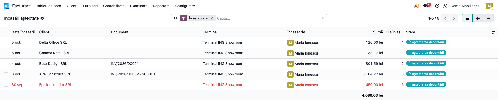

### Pasul 9 — Decontarea: alegerea liniei de extras

După importul extrasului contului de card, suma globală virată de bancă apare ca o linie de extras
pe jurnalul terminalului (în exemplu **3.519,03 lei**, cu data de azi). La import, linia își
postează deja nota **Dr 5121 = Cr 5125** (vezi pasul 12); decontarea doar o reconciliază cu
încasările. Porniți decontarea:

- din **Facturare → Contabilitate → Decontare card** și alegeți **Linie de extras** (oricând,
  în Community și Enterprise); sau
- în Enterprise, din vederea **listă** a reconcilierii bancare (**Facturare → Tablou de bord** →
  jurnalul **ING card** → **Tranzacții**, comutat pe listă): selectați linia → **Acțiune → Decontare
  card**.

Fereastra **Decontare card** arată **Data extrasului** și **Sumă de decontat**. **Terminal** se lasă
gol (toate terminalele care virează în jurnalul liniei) sau se alege unul anume când pe același
cont virează mai multe terminale. Apăsați **Caută**.

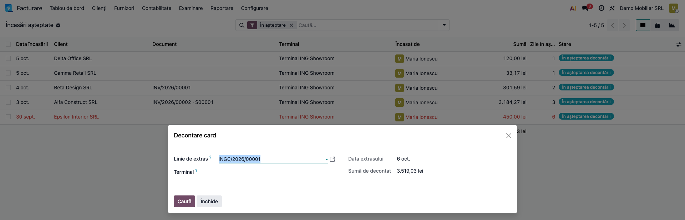

### Pasul 10 — Combinația găsită și decontarea

Modulul caută, printre încasările **în așteptare** ale jurnalului din fereastra terminalului (data
extrasului minus 4 zile), grupul a cărui sumă este **exact** suma liniei, la ban. Citiți ecranul:

- **mesajul albastru** — „Am găsit exact o combinație: 3 încasări dau 3.519,03 lei la ban”;
- **lista** — toate încasările candidate; cele din combinație au **Decontează** bifat și cifra
  combinației în coloana **Combinația**. În exemplu: Gamma Retail 33,17 + Beta Design 301,59 + Alfa
  Construct 3.184,27; încasarea Delta Office de 120,00 lei rămâne nebifată (nu face parte din
  virament). Totalul de sub listă (3.639,03 lei) este al tuturor candidatelor, nu al celor bifate;
- **Bifate** = 3, **Total bifat** = 3.519,03 lei, **Diferență** = **0,00 lei**. Butonul
  **Decontează** apare doar când diferența este zero.

Dacă **două combinații diferite** dau aceeași sumă, modulul **nu alege**: nu bifează nimic, coloana
**Combinația** arată „1”, „2” (sau „1, 2”) și bifați manual grupul corect, după chitanțele
terminalului. Dacă **nu există** combinație exactă, mesajul arată cât lipsește (de regulă o încasare
neînregistrată): înregistrați încasarea lipsă și apăsați **Caută din nou**. **Decontează** apare
doar la diferență zero; **Debifează tot** golește bifele.

Apăsați **Decontează**. Încasările bifate se reconciliază cu linia de extras pe contul 5125 și
trec în starea **Decontată**.

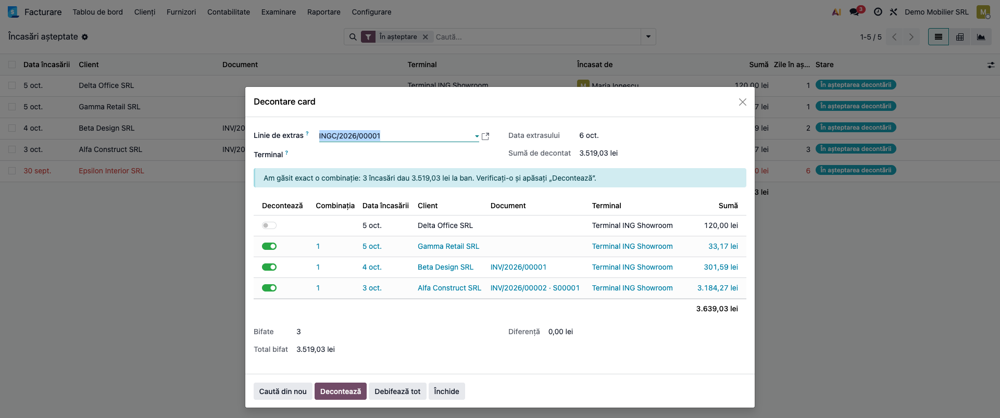

### Pasul 11 — Registrul după decontare

După **Decontează** se deschide lista încasărilor decontate. În registru, fără filtrul **În
așteptare**, verificați: cele trei încasări sunt **Decontată** (verde), cu **Zile în așteptare** = 0;
Delta Office (120,00 lei) și Epsilon Interior (450,00 lei, întârziată) rămân **În așteptarea
decontării** și vor intra într-un extras următor. În formularul unei încasări decontate apar
**Data decontării** și **Linie de extras**.

Dacă un contabil reconciliază încasarea din ecranul standard de reconciliere bancară (nu din
**Decontare card**), o acțiune programată actualizează starea registrului la fiecare 2 ore.

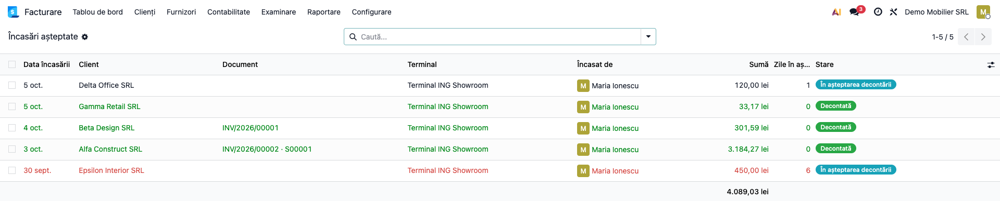

### Pasul 12 — Nota liniei de extras (5121 = 5125)

Nota liniei de extras se postează la importul extrasului; **Decontează** nu creează nicio notă nouă,
ci reconciliază linia ei de 5125 cu cele trei încasări. Deschideți nota (din linia de extras sau
din **Facturare → Contabilitate → Note contabile**) și verificați în tabul **Elemente jurnal**:

- **Dr 512105 ING card** (contul bancar) = 3.519,03 lei;
- **Cr 512500 Sume în curs de decontare** = 3.519,03 lei, reconciliat cu cele trei încasări
  (butonul **Elemente reconciliate**).

Pe 5125, încasările decontate și linia de extras se compensează: pentru ele soldul devine zero.

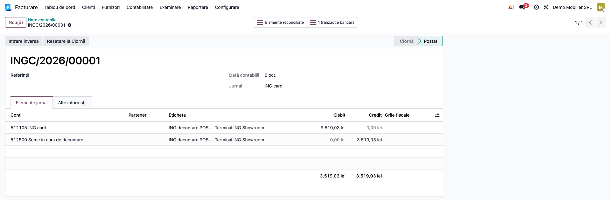

### Anularea unei încasări greșite

O încasare înregistrată din greșeală (de exemplu tranzacție anulată pe terminal) se anulează din
formularul ei cu **Anulează încasarea** (doar administratorul, doar în starea **În așteptarea
decontării**): plata se anulează odată cu ea, iar numărul ei rămâne în jurnal. O **factură de avans**
emisă pentru încasare **rămâne postată**, cu TVA-ul ei, și se stornează cu o **notă de credit**. O
încasare decontată, sau una dintr-o perioadă închisă (decont de TVA depus), se corectează prin
stornare în contabilitate, nu prin anulare.

### Note de monografie și raportare

| Operațiune | Notă contabilă | Când |
|---|---|---|
| Factura de avans (comandă nefacturată) | **Dr 4111 = Cr 419 + Cr 4427** | la **Înregistrează**, pasul 2 |
| Încasarea cu cardul | **Dr 5125 = Cr 4111** | la **Înregistrează**, pașii 2–4 |
| Viramentul băncii (linia de extras) | **Dr 5121 = Cr 5125** | la importul extrasului; **Decontează** (pasul 10) doar reconciliază pe 5125 |
| Comisionul băncii (linie separată de extras) | **Dr 627 = Cr 5121** | în reconcilierea bancară standard |
| Factura finală a comenzii (avansul scăzut cu minus, flux standard Odoo) | **Dr 4111 (rest de încasat) + Dr 419 (baza avansului) + Dr 4427 (TVA avans) = Cr 707 (valoarea integrală) + Cr 4427 (TVA integral)** | la facturarea livrării |

Dacă banca virează **suma netă** (comisionul reținut din virament), nu există combinație exactă și
**Decontează** nu apare (fereastra cere diferență zero). Folosiți fereastra **Decontare card** doar
ca să identificați grupul de încasări, apoi reconciliați **integral în ecranul standard de
reconciliere bancară**: liniile 5125 ale încasărilor plus o linie de diferență **Dr 627 = Cr 5125**
pentru comision. Registrul trece încasările în **Decontată** prin acțiunea programată (la 2 ore).

Raportare și control lunar: înainte de închiderea lunii, decontați toate liniile de extras ale
cardului. Atunci soldul debitor al contului de suspensie al jurnalului de card (de preferat
analiticul dedicat, secțiunea 5 pasul 3) = totalul registrului **Încasări așteptate** filtrat
**În așteptare**. Dacă rămân linii de extras importate dar nedecontate, regula devine: sold 5125 =
încasări **În așteptare** − linii de extras nedecontate. În exemplu, la momentul capturii 09
(extrasul de 3.519,03 lei importat, încă nedecontat): 4.089,03 − 3.519,03 = 570,00 lei, adică exact
încasările Delta Office (120,00) și Epsilon Interior (450,00). TVA-ul facturilor de avans intră în
D300 prin taxa standard de 21% a facturii, nu printr-o logică a modulului.

## 7. Legături cu alte module / declarații

| Modul / proces | Rol în flux |
|---|---|
| `account` | plata pe jurnalul terminalului (5125 = 4111), reconcilierea cu linia de extras, notele contabile |
| `sale` | butonul pe comandă, confirmarea ofertei plătite, factura de avans standard (`Cont plată în avans` = 419) |
| `l10n_ro` | planul de conturi (5125, 419, 4427, 627) și taxa de 21% |
| Import extras bancar | aduce linia globală de pe extras pe care se face decontarea |
| Casa de marcat / raport Z | bonul fiscal rămâne obligatoriu la vânzările către persoane fizice; nu se dublează cu factura de avans |
| e-Factura (`l10n_ro_edi`) | factura de avans este o factură obișnuită: se transmite în SPV în termenul legal de 5 zile lucrătoare, prin fluxul standard de e-Factura |
| D300 / D394 / SAF-T | TVA-ul și factura de avans intră prin taxa și jurnalul standard, nu printr-o logică a modulului |

Ce este automat: emiterea și postarea facturii de avans, confirmarea ofertei plătite, plata pe 5125
reconciliată cu factura, alegerea terminalului, căutarea combinației exacte, reconcilierea pe 5125,
starea registrului (inclusiv după reconcilieri făcute din ecranul standard).

Ce rămâne manual: configurarea jurnalului, a contului 5125 (reconciliabil) și a contului de avans
419; importul extrasului; alegerea grupului când există două combinații; înregistrarea comisionului
băncii; reconcilierea plăților pe client fără document cu facturile; nota de credit pentru un avans
anulat.

## 8. Verificări pentru consultant

- [ ] Jurnalul terminalului are **Cont Suspensie** 5125, iar contul permite reconcilierea.
- [ ] **Cont plată în avans** = 419 în setările de facturare.
- [ ] Un casier fără drepturi contabile vede **Încasare cu cardul** pe comandă și factură și doar
      propriile încasări, dar nu vede **Decontare card**.
- [ ] Încasarea pe o ofertă confirmă comanda și emite factura de avans: Dr 4111 3.184,27 = Cr 419
      2.631,63 + Cr 4427 552,64, factura **PLĂTIT**.
- [ ] Nota de încasare este Dr 5125 = Cr 4111, pe partenerul clientului, cu data de pe chitanță.
- [ ] O plată parțială pe factură lasă restul corect (6.050,00 − 301,59 = 5.748,41 lei).
- [ ] Cu toate extrasele cardului decontate, totalul registrului **În așteptare** = soldul contului
      de suspensie al jurnalului de card (cu linii de extras nedecontate: minus suma lor).
- [ ] O încasare mai veche decât pragul terminalului apare roșie și în filtrul **Întârziată**.
- [ ] Linia de extras de 3.519,03 lei găsește exact o combinație (3 încasări), diferență 0,00.
- [ ] Când două grupuri dau aceeași sumă, nimic nu e bifat automat.
- [ ] După **Decontează**: încasările sunt **Decontată**, linia de extras e reconciliată, nota ei
      (postată la import) este Dr 5121 = Cr 5125, iar pe 5125 cele trei încasări sunt compensate.
- [ ] La un virament net, reconcilierea în ecranul standard cu diferența 627 = 5125 trece
      încasările în **Decontată** după rularea acțiunii programate.
- [ ] Comisionul băncii este pe linie separată: Dr 627 = Cr 5121.
- [ ] Anularea unei încasări cu factură de avans lasă factura postată; se emite nota de credit.

## 9. Mesaje de eroare frecvente

| Mesaj / simptom | Cauză | Remediere |
|---|---|---|
| „Setați Cont plată în avans în Facturare > Configurare > Setări, Conturi implicite…” | Compania nu are contul de avans | Setați 419 Clienți - creditori (secțiunea 5, pasul 5) |
| „Contul … nu permite reconcilierea…” | Contul 5125 nu are **Permite reconciliere** | Bifați opțiunea pe cont |
| „Jurnalul … nu are cont de așteptare (5125).” | Jurnalul terminalului nu are cont de suspensie | Setați **Cont Suspensie** pe jurnal (tabul **Note contabile**) |
| „O încasare pe o comandă de vânzare este un avans și cere factură de avans. Doar un administrator…” | Casierul a ales **Fără factură** pe o comandă | Alegeți **Emite factură de avans** sau cereți administratorului |
| „Nicio combinație nu dă exact …” | O încasare nu a fost înregistrată sau banca a reținut comisionul din virament | Înregistrați încasarea lipsă și **Caută din nou**; la virament net reconciliați în ecranul standard, cu diferența 627 = 5125 |
| „Nicio încasare cu cardul în așteptare pe jurnalul … între … și …” | Încasările sunt pe alt jurnal sau în afara ferestrei | Verificați terminalul/jurnalul și **Fereastră de potrivire (zile)** |
| „Sunt peste 80 încasări în așteptare în fereastră…” | Prea multe candidate pentru căutare | Alegeți **Terminal** sau bifați manual |
| „… are deja terminalul …” | Un utilizator are deja un terminal implicit | Lăsați un singur terminal implicit per utilizator |
| „Încasarea de la … este deja decontată; stornați-o în contabilitate.” | Anulare pe o încasare decontată | Corecție prin stornare, nu prin anulare |

## 10. Capturi de ecran

Capturile din `readme/screenshots/` sunt **generate automat** din `tests/test_screenshots.py`
(mixinul `ScreenshotCase` din `l10n_ro_doc_screenshots`, import defensiv), în **limba română**, pe
planul de conturi RO (`setup_country("ro")`), pe compania de test „Demo Mobilier SRL”:

1. `01_terminal.png` — terminalul de card „Terminal ING Showroom” (jurnal, cont de decontare,
   fereastră, alertă).
2. `02_oferta_buton_card.png` — oferta S00001 de 3.184,27 lei, cu butonul „Încasare cu cardul”.
3. `03_incasare_comanda.png` — fereastra de încasare de pe ofertă, cu „Emite factură de avans”.
4. `04_incasare_factura.png` — fereastra de încasare de pe factura INV/2026/00001.
5. `05_incasare_client.png` — fereastra de încasare pe client, deschisă din meniu (Gamma Retail SRL,
   33,17 lei).
6. `06_factura_avans.png` — factura de avans: Dr 4111 = Cr 419 + Cr 4427.
7. `07_nota_incasare.png` — nota de încasare: Dr 512500 = Cr 411100.
8. `08_factura_platita_partial.png` — factura plătită parțial, rest 5.748,41 lei.
9. `09_registru_in_asteptare.png` — registrul „Încasări așteptate”, cu încasarea întârziată.
10. `10_decontare_linie_extras.png` — „Decontare card” cu linia de extras de 3.519,03 lei.
11. `11_decontare_combinatie.png` — combinația găsită: 3 încasări, diferență 0,00.
12. `12_registru_dupa_decontare.png` — registrul după decontare.
13. `13_nota_decontare.png` — nota liniei de extras: Dr 512105 = Cr 512500.

Regenerare:

```bash
./odoo/odoo-bin -c odoo.conf -d <db> \
    -i l10n_ro,deltatech_expected_receipt,l10n_ro_doc_screenshots \
    --test-tags=fise_screenshots --stop-after-init
```

## 11. Observații pentru manual

Păstrați în manual ideea centrală: încasarea cu cardul se înregistrează **când clientul plătește**
(clientul nu mai e restant), iar banii „așteaptă” pe 5125 până la extras; decontarea este o potrivire
**la ban**, iar comisionul băncii vine separat. Explicați regula avansului (plata pe o comandă
nefacturată = factură de avans cu TVA) și faptul că bonul fiscal nu este înlocuit. Notele contabile
se prezintă în detaliu (Dr/Cr), cu exemplul 3.519,03 = 3.184,27 + 301,59 + 33,17, care se verifică
ușor pe ecran.
