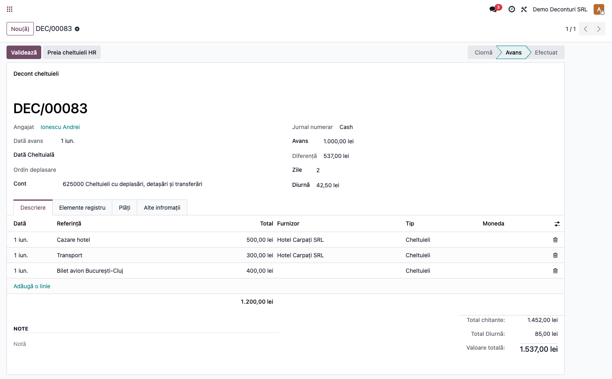
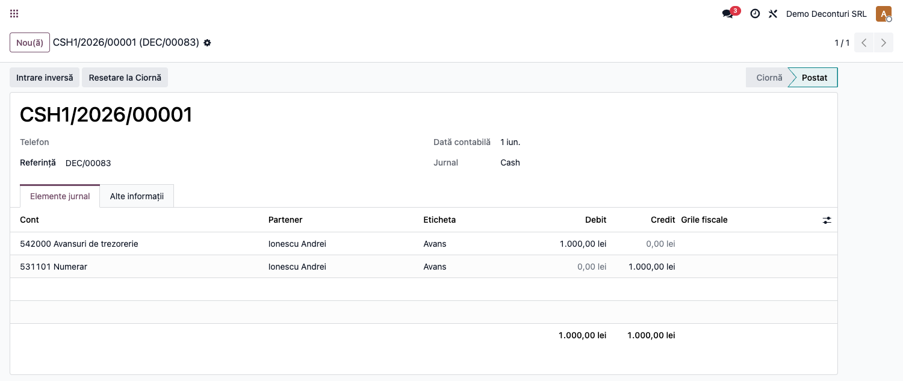
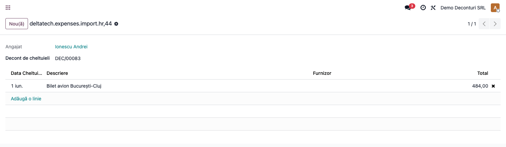
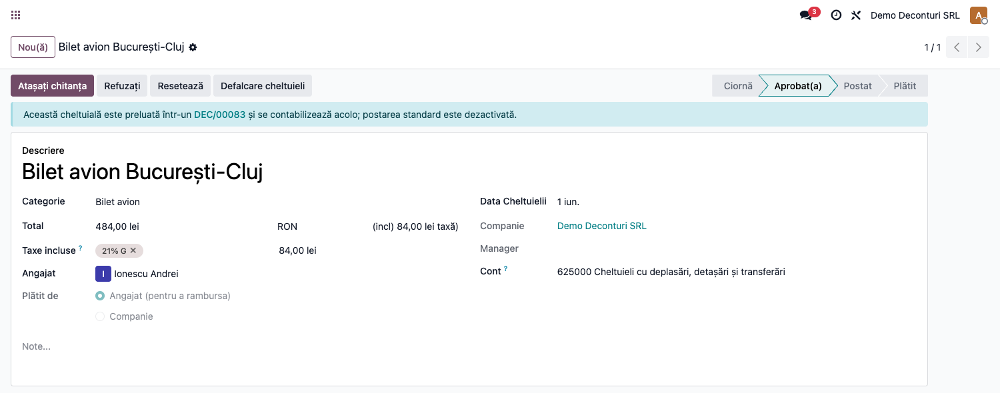
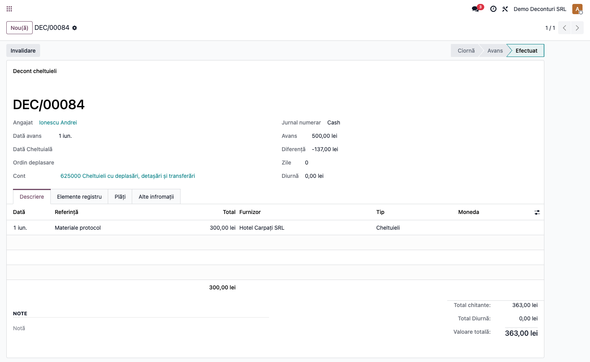
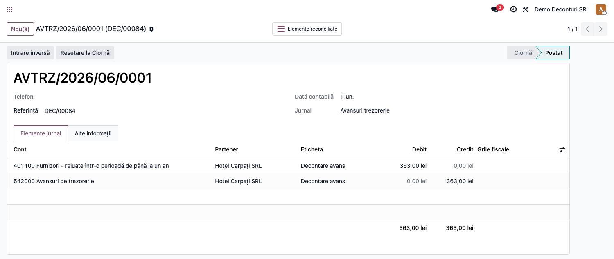
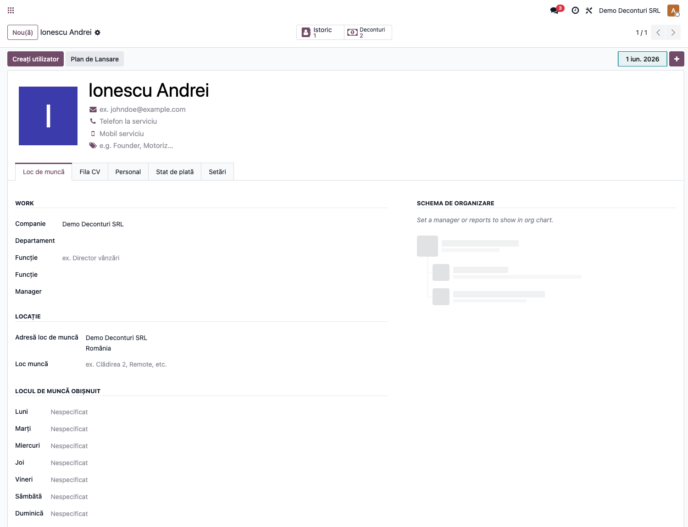

# Fișă Modul: Decont de cheltuieli din avans de trezorerie (542) și diurnă

**Modul:** `deltatech_expenses`
**Utilizator principal:** Contabil, Casier, Operator deconturi
**Prioritate:** 🔴 Ridicată (flux frecvent în practica românească)

---

## 1. Scop business

Modulul gestionează **decontul de cheltuieli al angajatului pornind de la un avans de trezorerie**
(cont 542), specific contabilității din România. Angajatul primește un avans, efectuează cheltuieli
(cazare, transport, protocol etc.) și, eventual, beneficiază de diurnă; la final, decontul calculează
automat diferența de restituit sau de încasat și generează notele contabile, inclusiv chitanțele de
achiziție și plățile, închizând soldul contului 542 al angajatului.

## 2. Bază legală și context

- Ordinul 2634/2015 — documentul „Decont de cheltuieli" și „Ordin de deplasare (delegație)".
- Reglementări privind diurna internă/externă pentru deplasări.
- Plan de conturi conform OMFP 1802/2014: 542 „Avansuri de trezorerie", 625 „Cheltuieli cu
  deplasări, detașări și transferări", 4426 „TVA deductibilă".

## 3. Utilizatori și roluri

Contabil, Casier, Operator deconturi.

Roluri recomandate pentru testare:
- Administrator funcțional: instalează modulul, configurează jurnalele și contul de avans.
- Operator: introduce decontul, avansul și liniile de cheltuieli.
- Contabil/manager: validează notele contabile și închiderea contului 542.

## 4. Conturi și date implicate

- **542** — Avansuri de trezorerie (contul angajatului care se închide la final).
- **5311 / 5121** — Casa / Bancă (sursa avansului).
- **625 / 623** — Cheltuieli cu deplasări / de protocol.
- **4426** — TVA deductibilă aferentă cheltuielilor.

Date minime pentru demo:
- companie românească cu localizarea contabilă instalată (RON);
- un angajat `hr.employee` cu „Work Contact" completat (partenerul folosit pe notele contabile);
- jurnal de numerar (Casă), un jurnal general cu **contul implicit = 542** (pentru avans/decont) și
  un jurnal pentru diurnă.

## 5. Configurare inițială

1. Instalați modulul `deltatech_expenses` (atrage și `hr`, `hr_expense`).
2. Creați/identificați un jurnal general al cărui **cont implicit este 542** și folosiți-l ca
   „Jurnal cheltuieli" pe decont.
3. Verificați jurnalul de numerar (Casă) și contul său implicit (5311).
4. Configurați contul de diurnă (625) și jurnalul de diurnă.
5. Asigurați-vă că angajații au „Work Contact" completat (sau lăsați-l gol pentru note interne, fără
   partener).

## 6. Flux de utilizare

### Pasul 1 — Crearea decontului și acordarea avansului

Accesați decontul de cheltuieli, alegeți **angajatul**, **jurnalul de numerar** și **jurnalul de
cheltuieli** (cu contul 542), completați **avansul** acordat și, dacă e cazul, **diurna** (sumă/zi și
numărul de zile). La **Avans** documentul trece în starea „Avans"; pe măsură ce adăugați liniile de
cheltuieli, se calculează automat totalul și **diferența** față de avans.



Acordarea avansului generează nota contabilă **Dr 542 = Cr 5311** (avansul iese din casă în contul de
avansuri de trezorerie al angajatului).



### Pasul 2 — (Opțional) Preluarea unei cheltuieli din modulul standard `hr_expense`

Dacă angajatul a înregistrat cheltuieli prin modulul standard, butonul **„Preia cheltuieli HR"**
(vizibil în stările Ciornă/Avans) deschide un wizard cu cheltuielile eligibile ale angajatului —
aprobate, fără notă contabilă proprie și nelegate de alt decont.



Puteți **selecta mai multe cheltuieli** dintr-o dată — toate devin linii în decontul curent.

La confirmare, fiecare cheltuială selectată devine o **linie de decont** (cu suma, TVA-ul, furnizorul
și contul de cheltuială preluate din `hr.expense`) și este **legată** de decont. TVA-ul este mapat
corect indiferent de configurarea taxei (TVA inclus în preț sau „pe deasupra"), astfel încât netul și
TVA-ul liniei corespund exact cu cheltuiala originală. Pe cheltuiala
`hr.expense` apare un banner care indică decontul, iar butoanele de postare standard sunt ascunse —
astfel **nu se mai contabilizează și din `hr_expense`**, evitând dublarea cheltuielii.



**Două moduri de a prelua mai multe cheltuieli într-un decont anume:**

1. **Din decont** (descris mai sus): deschideți decontul țintă → **„Preia cheltuieli HR"** → bifați
   cheltuielile dorite → **Preia**. Toate intră în decontul curent.
2. **Din lista de cheltuieli**: în **Cheltuieli**, selectați (bifați) mai multe cheltuieli ale
   aceluiași angajat → meniul **Acțiuni → „Adaugă în decont de cheltuieli"** → alegeți decontul țintă
   (doar deconturile în Ciornă/Avans ale angajatului) → **Preia**.

> **Notă contabilă la acest pas:** preluarea **nu** generează nicio notă contabilă — doar adaugă
> liniile în decont. Cheltuielile se contabilizează abia la **validarea decontului** (Pasul 3),
> împreună cu celelalte linii.

> **Reversibilitate:** la **invalidarea** unui decont (butonul „Invalidare"), liniile preluate din
> `hr.expense` se șterg automat, iar cheltuielile respective sunt **eliberate** — redevin disponibile
> pentru fluxul standard sau pentru o nouă preluare. Liniile introduse manual rămân pentru re-validare.

### Pasul 3 — Introducerea cheltuielilor și validarea decontului

Adăugați liniile de cheltuieli (furnizor, sumă cu TVA inclus, cont de cheltuială). Fiecare linie are
un **tip**:

- **Cheltuieli** — justificată cu bon/factură; la validare se generează o **chitanță de achiziție** și
  decontarea din avans (vezi mai jos);
- **Plată furnizor** — angajatul a achitat direct o datorie a firmei către un furnizor (fără chitanță
  proprie); la validare se generează doar nota `Dr 401 = Cr 542`, care se **reconciliază cu facturile
  furnizor deschise** ale aceluiași furnizor (stinge datoria, ca o plată). Dacă furnizorul nu are
  datorii deschise, suma rămâne ca avans către furnizor.

La **Validează**, decontul trece în starea „Efectuat": modulul generează chitanțele de achiziție,
notele de decontare din avans, nota de diurnă și nota de diferență, închizând soldul contului 542.



Pentru fiecare cheltuială se generează o **notă de decontare din avans** care stinge datoria către
furnizor pe seama avansului: **Dr 401 (Furnizori) = Cr 542 (Avansuri de trezorerie)**, reconciliată cu
chitanța de achiziție.



### Note de monografie și raportare (notele generate la fiecare pas)

- **Acordare avans** (Pasul 1): **Dr 542 = Cr 5311/5121** (suma avansului);
- **Preluare cheltuială HR** (Pasul 2): *nicio notă* — doar se adaugă linia în decont;
- **Decontare cheltuieli** (Pasul 3, la validare), pentru liniile de tip „Cheltuieli", în două note:
  - chitanța de achiziție: **Dr 6xx + Dr 4426 = Cr 401** (cheltuială fără TVA + TVA deductibil);
  - decontarea din avans: **Dr 401 = Cr 542** (reconciliată cu chitanța);
- **Plată furnizor** (Pasul 3, liniile de tip „Plată furnizor"): **Dr 401 = Cr 542**, reconciliată cu
  facturile furnizor deschise;
- **Diurnă** (la validare): **Dr 625 = Cr 542** (totalul diurnei);
- **Diferență** (la validare): **Dr/Cr 5311 = Cr/Dr 542**, astfel încât soldul 542 al angajatului
  devine **zero**.

### Pasul 4 — Urmărirea deconturilor pe angajat

Fișa angajatului afișează butonul smart **„Deconturi"** cu numărul deconturilor; un clic deschide
lista filtrată pentru acel angajat.



## 7. Legături cu alte module / declarații

| Modul / proces | Rol în flux |
|---|---|
| `account` | note contabile de avans, decontare, diurnă și diferență; chitanțe `in_receipt` și plăți |
| `hr` | angajatul (`hr.employee`); partenerul contabil derivă din `work_contact_id` |
| `hr_expense` | preluarea cheltuielilor standard în decont și prevenirea dublei contabilizări |
| `l10n_ro` | planul de conturi și TVA-ul românesc |
| `deltatech_partner_generic` | partener generic pentru liniile fără furnizor explicit |

Ce este automat: generarea notelor contabile, calculul diferenței și al diurnei, închiderea contului 542.
Ce rămâne manual: configurarea jurnalelor/conturilor și verificarea soldului 542 după validare.

## 8. Verificări pentru consultant

- [ ] Modulul se instalează fără erori pe baza demo.
- [ ] Jurnalul de cheltuieli are contul implicit 542.
- [ ] Acordarea avansului produce nota Dr 542 = Cr 5311.
- [ ] Liniile de cheltuieli calculează corect subtotalul și TVA-ul deductibil.
- [ ] Diferența (avans − cheltuieli − diurnă) este corectă.
- [ ] După validare, soldul contului 542 al angajatului este zero.
- [ ] Cheltuielile preluate din `hr_expense` nu se mai postează din modulul standard.

## 9. Mesaje de eroare frecvente

| Mesaj / simptom | Cauză probabilă | Remediere |
|-----------------|-----------------|-----------|
| Notele de avans nu au partener | Angajatul nu are „Work Contact" | Completați partenerul pe fișa angajatului (sau acceptați note interne) |
| Contul 542 nu se închide | Jurnalul de cheltuieli nu are contul implicit 542 | Setați contul implicit 542 pe jurnalul de cheltuieli |
| Nu pot prelua cheltuieli HR | Decontul nu este în Ciornă/Avans, sau cheltuielile nu sunt eligibile | Aduceți decontul în Ciornă/Avans; verificați că cheltuielile sunt aprobate și nelegate |
| Cheltuiala standard „nu se postează" | Este legată de un decont (`expenses_deduction_id`) | Comportament intenționat — contabilizarea se face prin decont |
| „Furnizorul ... nu are un cont de datorii (401)" | Linie „Plată furnizor" cu un furnizor fără cont de plătit configurat | Completați „Cont de plătit" pe fișa furnizorului |

## 10. Capturi de ecran

Capturile (`readme/screenshots/`) sunt **generate automat** din `tests/test_screenshots.py`
(mixinul `ScreenshotCase` din `l10n_ro_doc_screenshots`, import defensiv), în **limba română**, pe
planul de conturi RO (`setup_country("ro")`):

1. `01_decont_avans.png` — decontul în starea „Avans": avans 1.000 lei, linii de cheltuieli (cazare,
   transport și biletul preluat din HR), diurnă (2 zile × 42,50) și diferența calculată.
2. `02_nota_avans.png` — nota contabilă de acordare a avansului (Dr 542 = Cr 5311).
3. `03_preia_hr_wizard.png` — wizardul „Preia cheltuieli HR" cu cheltuielile eligibile ale angajatului.
4. `04_hr_expense_legat.png` — cheltuiala `hr.expense` legată de decont (banner + postare standard dezactivată).
5. `05_angajat_deconturi.png` — fișa angajatului cu butonul smart „Deconturi".
6. `06_decont_validat.png` — decontul în starea „Efectuat" după validare.
7. `07_nota_decontare.png` — nota de decontare din avans (Dr 401 = Cr 542), reconciliată cu chitanța.

Regenerare:

```bash
./odoo/odoo-bin -c odoo.conf -d <db> -u deltatech_expenses -i l10n_ro_doc_screenshots \
    --test-tags=fise_screenshots --stop-after-init
```

## 11. Observații pentru manual

În manualul final, păstrați explicația orientată pe activitatea utilizatorului: când se acordă avansul,
ce documente justificative se adaugă, cum se citește diferența de restituit/încasat și cum se verifică
închiderea contului 542. Notele contabile se prezintă în detaliu (liniile Dr/Cr), iar integrarea cu
`hr_expense` se menționează ca opțiune pentru companiile care folosesc și fluxul standard de cheltuieli.
