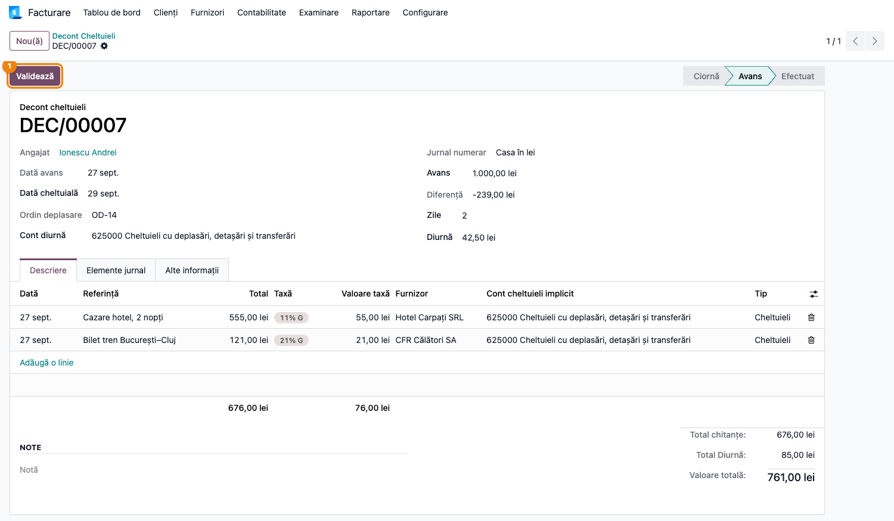
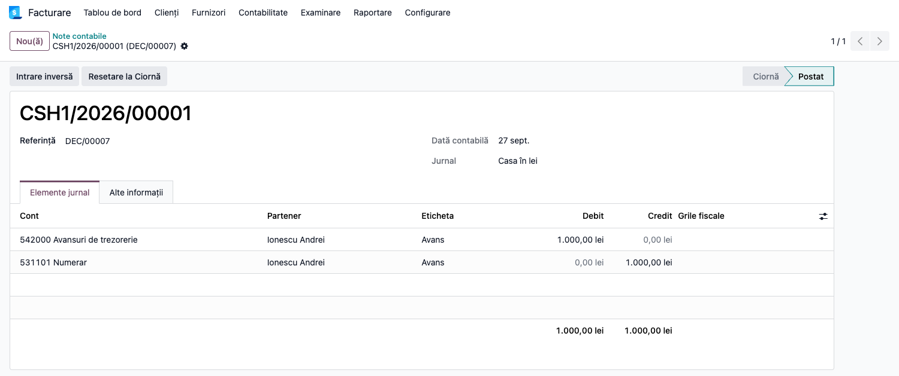
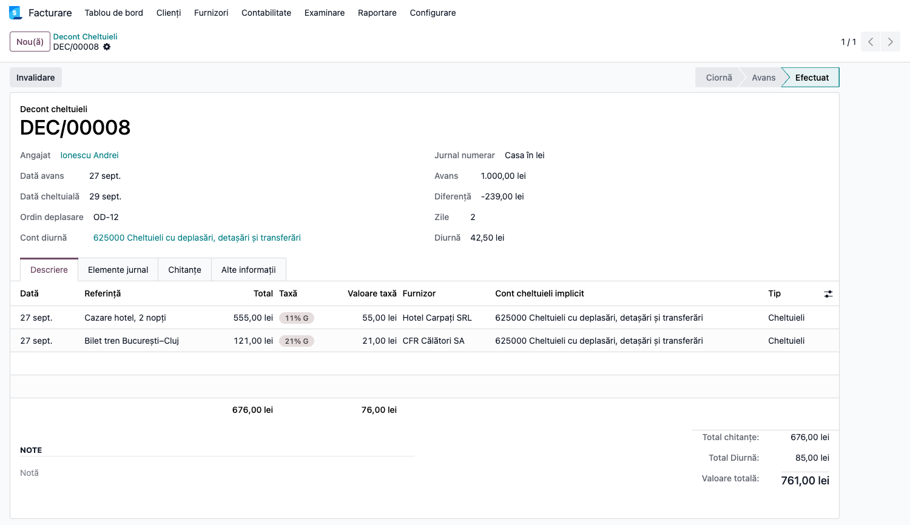
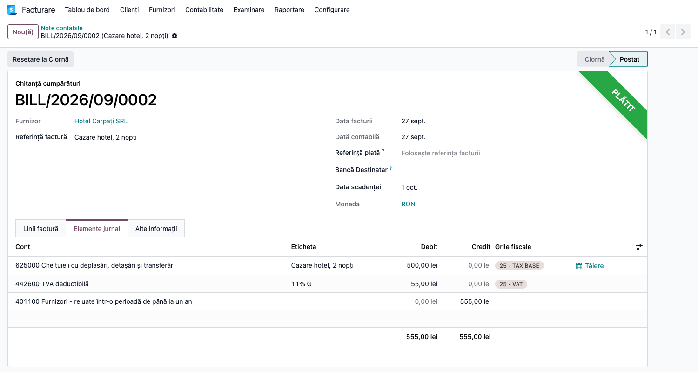
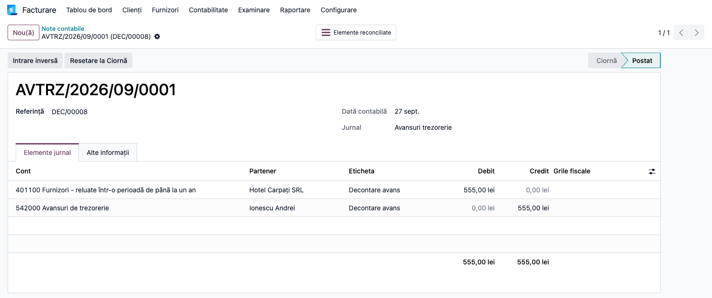
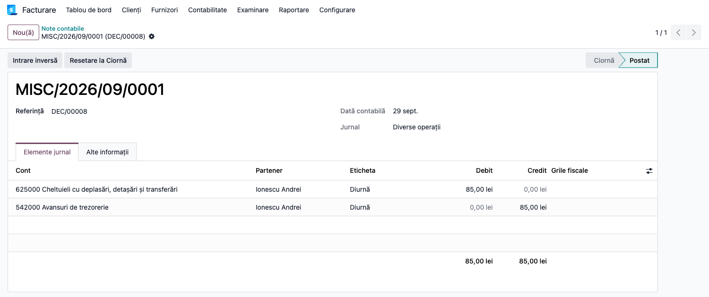
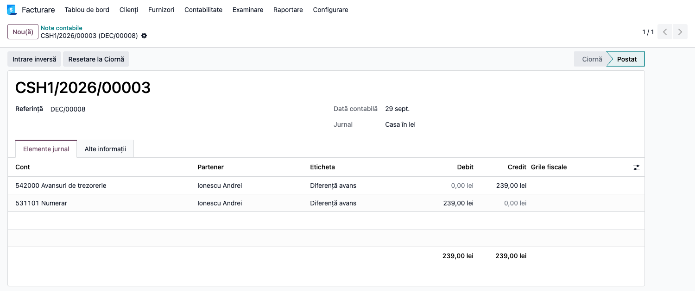
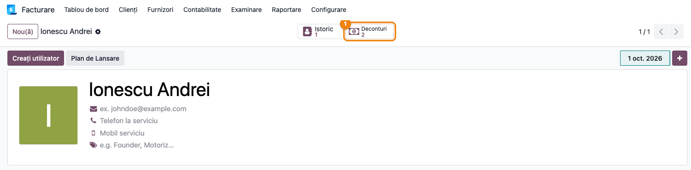

# Fișă Modul: Decont de cheltuieli din avans de trezorerie (542) și diurnă

**Modul:** `deltatech_expenses`
**Utilizator principal:** Contabil, Aprobator (casier / șef ierarhic), Angajat
**Prioritate:** 🔴 Ridicată (flux frecvent în practica românească)

---

## 1. Scop business

Modulul gestionează **decontul de cheltuieli al angajatului pornind de la un avans de trezorerie**
(cont 542), specific contabilității din România. Angajatul primește un avans, efectuează cheltuieli
(cazare, transport, protocol etc.) și, eventual, beneficiază de diurnă; la final, decontul calculează
automat diferența de restituit sau de încasat și generează notele contabile (chitanțele de achiziție,
decontarea din avans, diurna și regularizarea diferenței în casă), închizând soldul contului 542 al
angajatului.

## 2. Bază legală și context

- OMFP 2634/2015 — formularele „Decont de cheltuieli" și „Ordin de deplasare (delegație)"; chitanța
  și dispoziția de plată/încasare către casierie pentru avans și pentru regularizarea diferenței.
- OMFP 1802/2014 — funcțiunea conturilor: 542 „Avansuri de trezorerie", 625 „Cheltuieli cu
  deplasări, detașări și transferări", 623 „Cheltuieli de protocol, reclamă și publicitate",
  4426 „TVA deductibilă", 409 „Furnizori - debitori" (4091 bunuri de natura stocurilor, 4092
  servicii, 4093/4094 imobilizări).
- Legea 82/1991 art. 6 alin. (1) — operațiunea se înregistrează la data efectuării ei, pe baza unui
  document justificativ.
- Codul fiscal art. 76 alin. (2) lit. k) — diurna este neimpozabilă doar în limita a **2,5 ori**
  nivelul legal stabilit pentru instituțiile publice (HG 714/2018 pentru deplasări în țară,
  HG 518/1995 pentru străinătate) și a **3 salarii de bază** pe lună. Partea care depășește plafonul
  este venit de natură salarială (impozit, contribuții, D112).
- Codul fiscal art. 319 alin. (12) lit. a) și Normele metodologice (HG 1/2016) pct. 69 alin. (6) —
  bonul fiscal ține loc de factură simplificată, deci dă drept de deducere a TVA, doar dacă are
  tipărit **codul de TVA (RO…) al firmei** și valoarea lui, cu TVA, **nu depășește 100 euro**.
- Cote TVA 2026: 21% standard, 11% redusă (inclusiv cazarea hotelieră).

## 3. Utilizatori și roluri

Modulul are trei roluri proprii, alese pe utilizator în **Setări → Utilizatori și companii →
Utilizatori**, secțiunea **„Decont Cheltuieli"**. Fiecare rol îl include pe cel anterior:

| Rol | Ce poate face |
|---|---|
| **Angajat** | vede și completează doar deconturile proprii |
| **Aprobator** | vede toate deconturile; apasă **Avans** (aprobă și contabilizează acordarea avansului) |
| **Contabil** | apasă **Validează** (contabilizează decontul) și **Invalidare**; poate șterge deconturi în Ciornă |

Administratorii (grupul „Setări") primesc automat rolul de Contabil. Fără rolul potrivit,
butoanele respective nu apar pe formular.

Meniul decontului se află în aplicația Facturare/Contabilitate, deci utilizatorul are nevoie și de un
drept de acces în Facturare. Butonul „Deconturi" de pe fișa angajatului apare doar utilizatorilor care
văd fișa completă a angajatului (drepturi în aplicația Angajați).

## 4. Conturi și date implicate

- **542** — Avansuri de trezorerie (contul angajatului care se închide la final).
- **5311 / 5121** — Casa / Bancă (sursa avansului).
- **625 / 623** — Cheltuieli cu deplasări / de protocol (contul se alege pe fiecare linie).
- **4426** — TVA deductibilă aferentă cheltuielilor.
- **401** — Furnizori (chitanțele de achiziție și plățile directe din avans).
- **4092** — Furnizori-debitori pentru servicii (plată directă din avans fără factură deschisă;
  pentru bunuri se reclasifică manual pe 4091, pentru imobilizări pe 4093).

Date minime pentru demo:
- companie românească cu localizarea contabilă instalată (RON);
- un angajat `hr.employee` cu „Work Contact" completat (partenerul folosit pe notele contabile);
- jurnal de numerar (Casă), un jurnal general cu **contul implicit = 542** (pentru avans/decont) și
  un jurnal pentru diurnă.

## 5. Configurare inițială

1. Instalați modulul `deltatech_expenses` (atrage și `hr`). Dacă folosiți și modulul standard de
   cheltuieli (`hr_expense`), instalați și `deltatech_expenses_hr_expense` pentru puntea de preluare
   a cheltuielilor standard în decont (vezi fișa acelui modul).
2. În **Facturare → Configurare → Jurnale**, creați un jurnal de tip „Diverse" al cărui **cont
   implicit este 542** (de ex. „Avansuri trezorerie"). Pe decont îl alegeți în tabul **„Alte
   informații"**, câmpul **„Jurnal avansuri (542)"**.
3. Verificați jurnalul de numerar (Casă) și contul său implicit (5311); pe decont este câmpul
   **„Jurnal numerar"** din antet.
4. Pe decont, **„Cont diurnă"** (implicit primul cont 625) se află în antet, iar **„Jurnal diurnă"**
   (implicit primul jurnal „Diverse") în tabul „Alte informații".
5. Atribuiți utilizatorilor rolurile din secțiunea 3.
6. Asigurați-vă că angajații au „Work Contact" completat (sau lăsați-l gol pentru note interne, fără
   partener).
7. Opțional, pentru verificarea automată a plafonului fiscal al diurnei, instalați
   `l10n_ro_expense_allowance`.

## 6. Flux de utilizare

### Pasul 1 — Crearea decontului și acordarea avansului

Meniul este **Facturare → Furnizori → Decont Cheltuieli** (cu Enterprise: **Contabilitate →
Furnizori → Decont Cheltuieli**). Apăsați **Nou**, alegeți **angajatul** și **jurnalul de numerar**,
completați **data avansului**, **data cheltuielii** (data decontului; se completează din data
avansului dacă e goală), **ordinul de deplasare**, **avansul** acordat și, dacă e cazul, **diurna**
(sumă/zi și număr de zile). În tabul „Alte informații" verificați **jurnalul de avansuri (542)**.

Aprobatorul apasă **Avans**: documentul primește număr (`DEC/…`) și trece în starea „Avans". Pe
măsură ce adăugați liniile de cheltuieli, se calculează automat totalul și **diferența** față de
avans: o valoare **pozitivă** înseamnă că firma îi mai datorează angajatului, una **negativă** că
angajatul restituie restul în casă.



Acordarea avansului generează nota contabilă **Dr 542 = Cr 5311** (avansul iese din casă în contul de
avansuri de trezorerie al angajatului).



> **Preluare din modulul standard de cheltuieli:** dacă instalați și `deltatech_expenses_hr_expense`,
> pe formularul decontului apare butonul **„Preia cheltuieli HR"**, care preia cheltuielile eligibile
> din `hr.expense` ca linii de decont. Detaliile acelui flux sunt descrise în fișa modulului-punte.

### Pasul 2 — Introducerea cheltuielilor și validarea decontului

Adăugați liniile de cheltuieli: dată, referință (ce s-a cumpărat), **Total** = suma de pe bon sau
factură, **cu TVA inclus**, taxa de achiziție, furnizor și contul de cheltuială. Modulul extrage
baza și TVA-ul din total, oricum ar fi configurată taxa („inclusă în preț" sau „pe deasupra"); cu o
taxă „pe deasupra" poate apărea o rotunjire de 1 ban față de bon. Alegeți cota corectă la data
operațiunii (de ex. cazarea are 11%) și puneți taxă doar dacă documentul dă drept de deducere:
factura sau un bon fiscal de cel mult 100 euro cu **codul de TVA al firmei** tipărit. Un bon fără cod
de TVA sau peste 100 euro se introduce fără taxă, iar TVA-ul rămâne în cheltuială (pentru sume mari
cereți factură; în exemplu, cazarea are factură).

Contul de cheltuială se vede în coloana **„Cont cheltuieli implicit"** (pentru utilizatorii cu
drepturi de contabilitate). Implicit este primul cont **623** (protocol): pentru deplasări schimbați-l
în **625**.

Fiecare linie are un **tip**:

- **Cheltuieli** — justificată cu bon/factură; la validare se generează o **chitanță de achiziție** și
  decontarea din avans (vezi mai jos);
- **Plată furnizor** — angajatul a achitat direct o datorie a firmei către un furnizor (fără chitanță
  proprie); la validare se generează nota `Dr 401 = Cr 542`, care se **reconciliază cu facturile
  furnizor deschise** ale aceluiași furnizor (stinge datoria, ca o plată). Partea neacoperită de
  facturi deschise este un **avans acordat furnizorului** și se reclasifică automat
  `Dr 4092 = Cr 401`. De exemplu, o plată de 300 lei către un furnizor fără facturi deschise dă
  `Dr 401 = Cr 542` 300 lei și `Dr 4092 = Cr 401` 300 lei. La primirea facturii, contabilul compensează
  avansul (`Dr 401 = Cr 4092`). Modulul folosește mereu 4092 (servicii); dacă avansul e pentru bunuri
  (4091) sau imobilizări (4093), contabilul îl reclasifică manual.

Contabilul apasă **Validează**: decontul trece în starea „Efectuat", iar modulul generează
chitanțele de achiziție, notele de decontare din avans, nota de diurnă și nota de regularizare a
diferenței, închizând soldul contului 542. Chitanțele se văd în tabul **„Chitanțe"**, iar toate
liniile contabile în tabul **„Elemente jurnal"**.



Pentru fiecare cheltuială se generează o **notă de decontare din avans** care stinge datoria către
furnizor pe seama avansului: **Dr 401 (Furnizori) = Cr 542 (Avansuri de trezorerie)**, reconciliată cu
chitanța de achiziție. Linia de 542 poartă partenerul angajatului, cea de 401 pe al furnizorului.





Diurna se înregistrează cu data cheltuielii (**Dr 625 = Cr 542**), iar diferența dintre avans și
total se regularizează în casă cu aceeași dată, cea a decontului: în exemplu, angajatul restituie
239 lei (**Dr 5311 = Cr 542**).





**Atenție la diurnă:** modulul contează integral diurna introdusă și **nu verifică plafonul fiscal**.
Valoarea implicită de 42,50 lei/zi e doar un punct de pornire, nu plafonul legal. Ce depășește
plafonul de neimpozitare (secțiunea 2) trebuie preluat în salarizare ca venit impozabil. Modulul
`l10n_ro_expense_allowance` calculează automat plafonul și surplusul.

Dacă decontul a fost validat greșit, contabilul apasă **Invalidare**: **toate** notele decontului,
inclusiv nota de avans și chitanțele, se șterg, iar decontul revine în Ciornă. Fluxul se reia de la
**Avans** (care regenerează nota de avans) și **Validează**. Nu folosiți Invalidare pe o perioadă
declarată sau închisă: acolo corecția se face prin stornare.

Decontul se tipărește din meniul cu rotița (⚙) → **Tipărire → Tipărire decont cheltuieli**; documentul tipărit e
justificativul semnat de titularul avansului.

### Note de monografie și raportare (notele generate la fiecare pas)

- **Acordare avans** (Pasul 1): **Dr 542 = Cr 5311/5121** (suma avansului);
- **Decontare cheltuieli** (Pasul 2, la validare), pentru liniile de tip „Cheltuieli", în două note:
  - chitanța de achiziție: **Dr 6xx + Dr 4426 = Cr 401** (cheltuială fără TVA + TVA deductibil),
    cu data liniei;
  - decontarea din avans: **Dr 401 = Cr 542** (reconciliată cu chitanța);
- **Plată furnizor** (Pasul 2, liniile de tip „Plată furnizor"): **Dr 401 = Cr 542**, reconciliată cu
  facturile furnizor deschise; restul neacoperit: **Dr 4092 = Cr 401**;
- **Diurnă** (la validare): **Dr 625 = Cr 542** (totalul diurnei), cu data cheltuielii;
- **Diferență** (la validare), cu data cheltuielii (a decontului), ca soldul 542 al angajatului să
  devină **zero**:
  - angajatul restituie restul avansului: **Dr 5311 = Cr 542**;
  - firma îi plătește angajatului diferența: **Dr 542 = Cr 5311**.

### Pasul 3 — Urmărirea deconturilor pe angajat

Fișa angajatului afișează butonul smart **„Deconturi"** cu numărul deconturilor; un clic deschide
lista filtrată pentru acel angajat.



## 7. Legături cu alte module / declarații

| Modul / proces | Rol în flux |
|---|---|
| `account` | note contabile de avans, decontare, diurnă și diferență; chitanțe `in_receipt` |
| `hr` | angajatul (`hr.employee`); partenerul contabil derivă din `work_contact_id` |
| `deltatech_expenses_hr_expense` (opțional) | preluarea cheltuielilor standard `hr_expense` în decont și prevenirea dublei contabilizări |
| `l10n_ro` | planul de conturi și TVA-ul românesc |
| `deltatech_partner_generic` | partener generic pentru liniile fără furnizor explicit |
| `l10n_ro_expense_allowance` (opțional) | plafonul fiscal al diurnei și surplusul impozabil |
| Salarizare / D112 | surplusul de diurnă peste plafon se declară manual ca venit salarial |
| D300 | chitanțele cu TVA intră în decontul de TVA prin grilele taxei de achiziție |

Ce este automat: generarea notelor contabile, calculul diferenței și al diurnei, închiderea contului 542.
Ce rămâne manual: configurarea jurnalelor/conturilor, alegerea cotei TVA și a contului pe fiecare
linie, plafonul fiscal al diurnei (fără `l10n_ro_expense_allowance`), reclasificarea avansului la
furnizor pe 4091/4093 când nu e pentru servicii, compensarea lui la primirea facturii și verificarea
soldului 542 după validare.

## 8. Verificări pentru consultant

- [ ] Modulul se instalează fără erori pe baza demo.
- [ ] „Jurnal avansuri (542)" are contul implicit 542.
- [ ] Acordarea avansului produce nota Dr 542 = Cr 5311.
- [ ] Utilizatorii au rolurile potrivite (Angajat / Aprobator / Contabil).
- [ ] Liniile de deplasare au contul 625, nu 623 implicit.
- [ ] Un bon de 555 lei cu TVA 11% dă bază 500 și TVA 55; „Total chitanțe" este egal cu suma bonurilor.
- [ ] Diferența = cheltuieli + diurnă − avans (negativă = angajatul restituie).
- [ ] Nota de diferență din casă are data decontului, nu data avansului.
- [ ] O plată furnizor fără factură deschisă ajunge pe 4092, iar pe 401 nu rămâne sold debitor.
- [ ] Diurna se încadrează în plafonul fiscal sau surplusul a fost transmis la salarizare.
- [ ] După validare, soldul contului 542 al angajatului este zero.

## 9. Mesaje de eroare frecvente

| Mesaj / simptom | Cauză probabilă | Remediere |
|-----------------|-----------------|-----------|
| Notele de avans nu au partener | Angajatul nu are „Work Contact" | Completați partenerul pe fișa angajatului (sau acceptați note interne) |
| Contul 542 nu se închide | „Jurnal avansuri (542)" nu are contul implicit 542 | Setați contul implicit 542 pe jurnal |
| „Furnizorul ... nu are un cont de datorii (401)" | Linie „Plată furnizor" cu un furnizor fără cont de plătit configurat | Completați „Cont de plătit" pe fișa furnizorului |
| „Nu aveți rolul necesar pentru a ... decontul" / lipsesc butoanele Avans, Validează | Utilizatorul nu are rolul Aprobator sau Contabil | Atribuiți rolul în Setări → Utilizatori, secțiunea „Decont Cheltuieli" |
| Plata furnizor rămâne cu sold debitor pe 401 | Planul de conturi nu are un cont 4092 | Creați contul 4092 sau reclasificați manual |
| „Total chitanțe" diferă cu 1 ban de bon | Taxă „pe deasupra": TVA-ul se recalculează pe baza rotunjită | Folosiți o taxă „inclusă în preț" pentru potrivire exactă |

Pentru mesajele legate de preluarea cheltuielilor standard (`hr_expense`), vezi fișa modulului
`deltatech_expenses_hr_expense`.

## 10. Capturi de ecran

Capturile (`readme/screenshots/`) sunt **generate automat** din `tests/test_screenshots.py` al acestui
modul (mixinul `ScreenshotCase` din `l10n_ro_doc_screenshots`, import defensiv), în **limba română**,
pe planul de conturi RO (`setup_country("ro")`), pe o bază **fără** `hr_expense`:

1. `01_decont_avans.png` — decontul în starea „Avans": avans 1.000 lei, cazare 555 lei (TVA 11%) și
   bilet de tren 121 lei (TVA 21%), cu TVA inclus, diurnă 2 zile × 42,50 lei și diferența −239 lei.
2. `02_nota_avans.png` — nota contabilă de acordare a avansului (Dr 542 = Cr 5311).
3. `05_angajat_deconturi.png` — antetul fișei angajatului, cu butonul smart „Deconturi".
4. `06_decont_validat.png` — decontul în starea „Efectuat" după validare.
5. `07_nota_decontare.png` — nota de decontare din avans (Dr 401 = Cr 542), cu 542 pe angajat.
6. `08_chitanta_achizitie.png` — chitanța de achiziție pentru cazare (Dr 625 + Dr 4426 = Cr 401).
7. `09_nota_restituire.png` — restituirea diferenței în casă (Dr 5311 = Cr 542).
8. `10_nota_diurna.png` — nota de diurnă (Dr 625 = Cr 542).

Capturile wizard-ului „Preia cheltuieli HR" (`03`/`04`) sunt în modulul
`deltatech_expenses_hr_expense`, generate de testul de capturi al acelui modul.

Regenerare (pe o bază fără `hr_expense`, altfel apare și butonul „Preia cheltuieli HR"):

```bash
./odoo/odoo-bin -c odoo.conf -d <db> -i deltatech_expenses,l10n_ro_doc_screenshots \
    --test-tags=/deltatech_expenses:TestExpensesScreenshots --stop-after-init
```

## 11. Observații pentru manual

În manualul final, păstrați explicația orientată pe activitatea utilizatorului: când se acordă avansul,
ce documente justificative se adaugă, cum se citește diferența de restituit/încasat și cum se verifică
închiderea contului 542. Notele contabile se prezintă în detaliu (liniile Dr/Cr), iar integrarea cu
`hr_expense` se menționează ca opțiune pentru companiile care folosesc și fluxul standard de cheltuieli.
