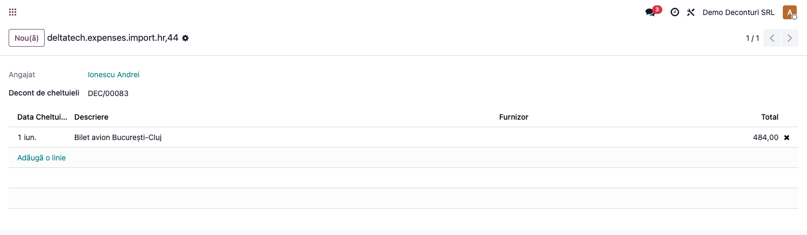
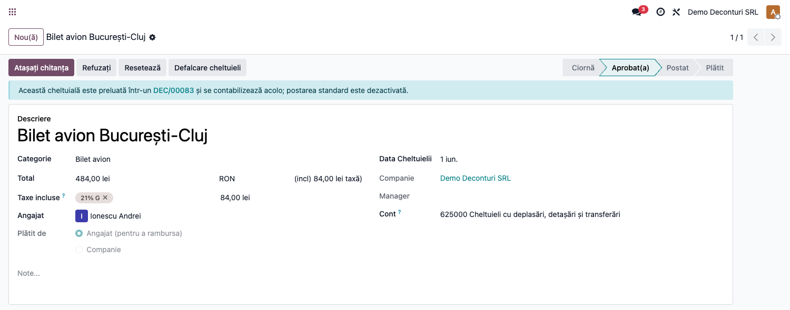

# Fișă Modul: Preluarea cheltuielilor standard (hr_expense) în Decontul de cheltuieli

**Modul:** `deltatech_expenses_hr_expense`
**Utilizator principal:** Contabil, Operator deconturi
**Prioritate:** 🟡 Medie (opțional — doar pentru companiile care folosesc și modulul standard de cheltuieli)

---

## 1. Scop business

Modulul este o **punte** între modulul standard de cheltuieli al Odoo (`hr_expense`) și Decontul de
cheltuieli din avans de trezorerie (`deltatech_expenses`, cont 542). Companiile care folosesc ambele
fluxuri riscă să contabilizeze aceeași cheltuială de două ori: o dată prin nota de cheltuială standard
și o dată prin Decont. Acest modul permite **preluarea** unei cheltuieli `hr.expense` deja aprobate ca
linie de decont și **dezactivează** automat postarea ei standard, astfel încât contabilizarea rămâne
unică.

Modulul se instalează **automat** (`auto_install`) doar când ambele module — `deltatech_expenses` și
`hr_expense` — sunt deja prezente în baza de date. Companiile care nu folosesc `hr_expense` nu îl
primesc.

## 2. Bază legală și context

Nu introduce o bază legală proprie — se aplică regulile deja descrise în fișa modulului
`deltatech_expenses` (Ordinul 2634/2015, OMFP 1802/2014). Rolul acestui modul este strict de
integrare tehnică între cele două fluxuri, ca să nu apară dublă cheltuială în contabilitate.

## 3. Utilizatori și roluri

Contabil, Operator deconturi (aceleași roluri ca la `deltatech_expenses`: Angajat/Aprobator/Contabil).

Roluri recomandate pentru testare:
- Administrator funcțional: instalează modulul (automat, la instalarea/upgrade-ul `deltatech_expenses`
  cu `hr_expense` deja prezent) și verifică apariția butonului pe formularul decontului.
- Operator: înregistrează o cheltuială standard (`hr.expense`) și o preia într-un decont existent.
- Contabil: validează decontul și verifică pe fișa cheltuielii că postarea standard a fost sărită.

## 4. Conturi și date implicate

Nu introduce conturi proprii — cheltuiala `hr.expense` preluată își păstrează contul de cheltuială
(`account_id`) și taxele (`tax_ids`), transferate identic pe linia de decont.

Date minime pentru demo:
- un Decont de cheltuieli (`deltatech.expenses.deduction`) în starea Ciornă sau Avans, cu un angajat
  asociat (vezi fișa `deltatech_expenses` pentru pregătirea companiei/jurnalelor);
- o cheltuială `hr.expense` a **aceluiași** angajat, cu un produs marcat „Poate fi cheltuit"
  (`can_be_expensed`), aprobată (`approval_state = approved`) și fără notă contabilă proprie.

## 5. Configurare inițială

1. Instalați `deltatech_expenses` și `hr_expense`; modulul-punte se instalează singur.
2. Nu este nevoie de nicio configurare suplimentară — butonul și wizardul apar automat pe formularul
   decontului, respectiv pe fișa/lista cheltuielilor standard.

## 6. Flux de utilizare

### Pasul 1 — Preluarea unei cheltuieli din modulul standard `hr_expense`

Pe formularul unui Decont de cheltuieli aflat în starea Ciornă sau Avans, butonul **„Preia cheltuieli
HR"** deschide un wizard cu cheltuielile `hr.expense` eligibile ale angajatului decontului — aprobate,
fără notă contabilă proprie și nelegate de alt decont. Puteți selecta mai multe cheltuieli dintr-o
dată.



La confirmare (**Preia**), fiecare cheltuială selectată devine o **linie de decont** (cu suma, TVA-ul,
furnizorul și contul de cheltuială preluate din `hr.expense`) și este **legată** de decont. TVA-ul este
mapat corect indiferent de configurarea taxei (TVA inclus în preț sau „pe deasupra"), astfel încât
netul și TVA-ul liniei corespund exact cu cheltuiala originală.

> **Al doilea mod de a prelua:** din lista **Cheltuieli** (meniul standard), selectați (bifați) mai
> multe cheltuieli ale aceluiași angajat → meniul **Acțiuni → „Adaugă în decont de cheltuieli"** →
> alegeți decontul țintă (doar deconturile în Ciornă/Avans ale angajatului) → **Preia**.

> **Notă contabilă la acest pas:** preluarea **nu** generează nicio notă contabilă — doar adaugă
> liniile în decont. Cheltuielile se contabilizează abia la **validarea decontului**, în
> `deltatech_expenses`, împreună cu celelalte linii.

### Pasul 2 — Dezactivarea postării standard pe cheltuiala legată

Pe fișa cheltuielii `hr.expense` preluate apare un banner care indică decontul de care este legată, iar
butoanele de postare standard sunt ascunse — astfel **nu se mai contabilizează și din `hr_expense`**,
evitând dublarea. Cheltuielile **nelegate** de niciun decont se postează normal, ca de obicei.



> **Reversibilitate:** la **invalidarea** decontului din `deltatech_expenses` (butonul „Invalidare"),
> liniile preluate din `hr.expense` se șterg automat, iar cheltuielile respective sunt **eliberate** —
> redevin disponibile pentru fluxul standard sau pentru o nouă preluare. Liniile introduse manual pe
> decont rămân neatinse.

## 7. Legături cu alte module / declarații

| Modul / proces | Rol în flux |
|---|---|
| `deltatech_expenses` | modelul Decont de cheltuieli (`deltatech.expenses.deduction`) și fluxul de validare/invalidare pe care se leagă preluarea |
| `hr_expense` | cheltuiala standard (`hr.expense`) preluată ca linie de decont |

Ce este automat: instalarea modulului (când ambele module sunt prezente), maparea TVA-ului la preluare,
dezactivarea postării standard pe cheltuiala legată, eliberarea cheltuielii la invalidarea decontului.
Ce rămâne manual: aprobarea cheltuielii standard (`hr.expense`) înainte de a fi eligibilă pentru
preluare, alegerea deciziei de a folosi decontul sau fluxul standard pentru fiecare cheltuială.

## 8. Verificări pentru consultant

- [ ] Modulul se instalează automat când `deltatech_expenses` și `hr_expense` sunt ambele prezente.
- [ ] Butonul „Preia cheltuieli HR" e vizibil doar în stările Ciornă/Avans ale decontului.
- [ ] Wizardul arată doar cheltuielile aprobate, fără notă contabilă proprie, ale angajatului decontului.
- [ ] Linia de decont creată reproduce corect suma, TVA-ul și contul cheltuielii originale.
- [ ] Cheltuiala `hr.expense` legată nu se mai postează prin `action_post` standard.
- [ ] Invalidarea decontului șterge liniile importate și eliberează cheltuielile aferente.
- [ ] O cheltuială a altui angajat sau dintr-o altă companie este respinsă la preluare.

## 9. Mesaje de eroare frecvente

| Mesaj / simptom | Cauză probabilă | Remediere |
|-----------------|-----------------|-----------|
| Nu pot prelua cheltuieli HR | Decontul nu este în Ciornă/Avans, sau cheltuielile nu sunt eligibile | Aduceți decontul în Ciornă/Avans; verificați că cheltuielile sunt aprobate și nelegate de alt decont |
| „Cheltuielile pot fi preluate doar într-un decont în starea Draft sau Advance." | S-a încercat preluarea într-un decont Finalizat/Anulat | Deschideți/creați un decont în Ciornă sau Avans |
| „Următoarele cheltuieli nu pot fi preluate în acest decont…" | Cheltuiala e a altui angajat/altei companii, neaprobată sau deja contabilizată | Selectați doar cheltuieli aprobate, ale aceluiași angajat, nelegate de alt decont |
| Cheltuiala standard „nu se postează" | Este legată de un decont (`expenses_deduction_id`) | Comportament intenționat — contabilizarea se face prin decont |
| Bifa „Cheltuieli" (Expenses) nu apare pe produs | Produsul nu e marcat ca vânzabil/achiziționabil (`purchase_ok`) sau modulul `hr_expense` nu e instalat | Bifați „Achiziții" pe produs; verificați instalarea `hr_expense` |

## 10. Capturi de ecran

Capturile (`readme/screenshots/`) sunt **generate automat** din `tests/test_screenshots.py`
(mixinul `ScreenshotCase` din `l10n_ro_doc_screenshots`, import defensiv), în **limba română**, pe
planul de conturi RO (`setup_country("ro")`):

1. `03_preia_hr_wizard.png` — wizardul „Preia cheltuieli HR" cu cheltuielile eligibile ale angajatului.
2. `04_hr_expense_legat.png` — cheltuiala `hr.expense` legată de decont (banner + postare standard
   dezactivată).

Numerotarea (03/04) a fost păstrată din `deltatech_expenses`, modulul din care aceste capturi au fost
mutate odată cu split-ul.

Regenerare:

```bash
./odoo/odoo-bin -c odoo.conf -d <db> -i deltatech_expenses_hr_expense,l10n_ro_doc_screenshots \
    --test-tags=fise_screenshots --stop-after-init
```

## 11. Observații pentru manual

În manualul final, prezentați acest flux ca o **opțiune** pentru companiile care folosesc și
modulul standard de cheltuieli — nu ca pas obligatoriu al Decontului de cheltuieli. Insistați pe
regula de bază: o cheltuială se contabilizează *o singură dată*, fie prin Decont (dacă a fost
preluată), fie prin `hr_expense` (dacă nu a fost preluată).
