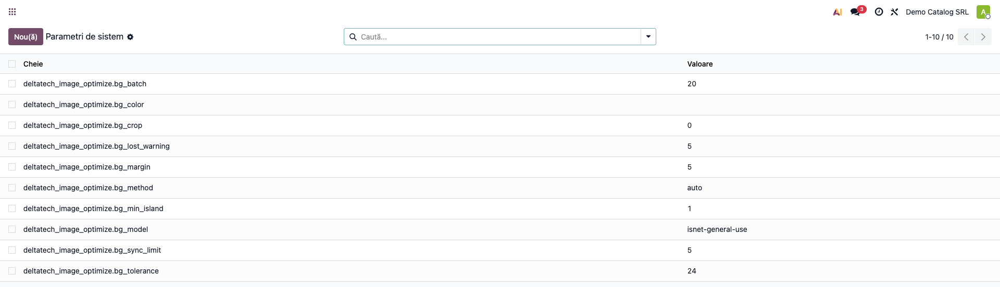
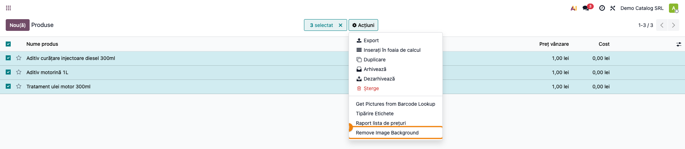
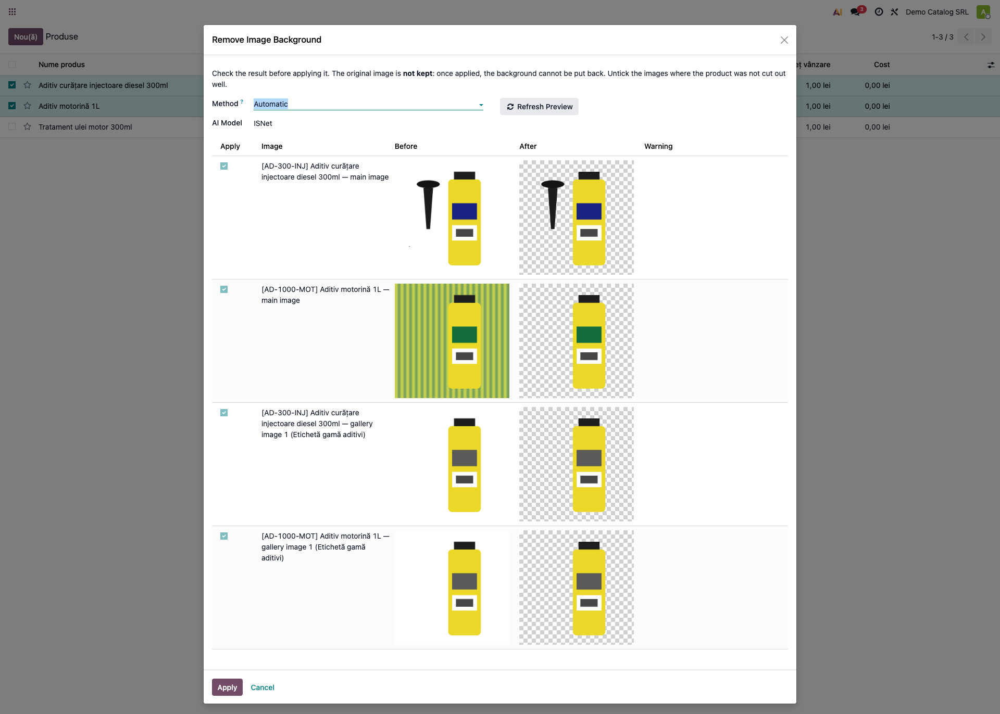
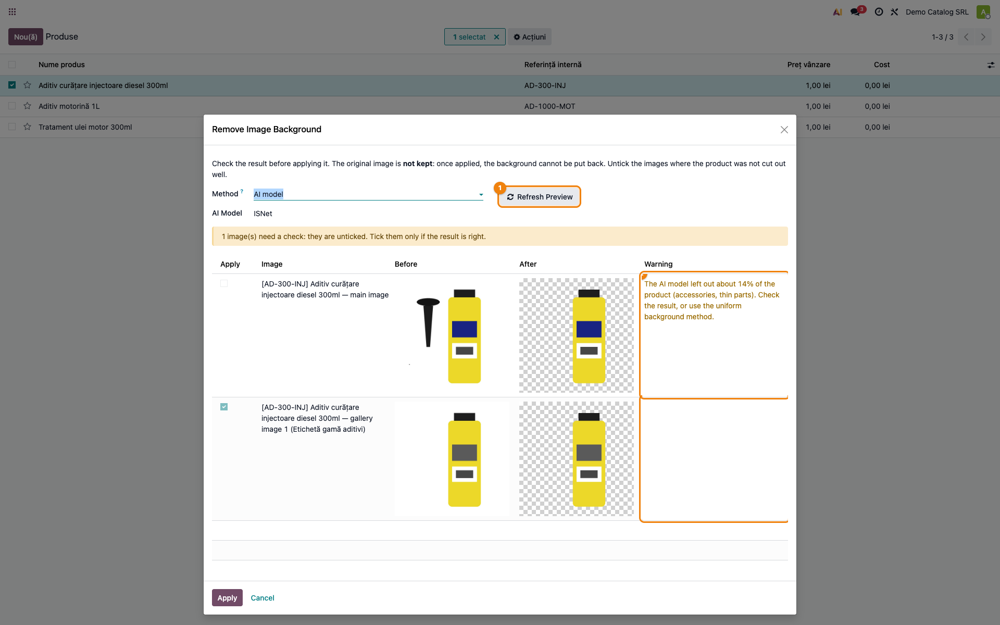
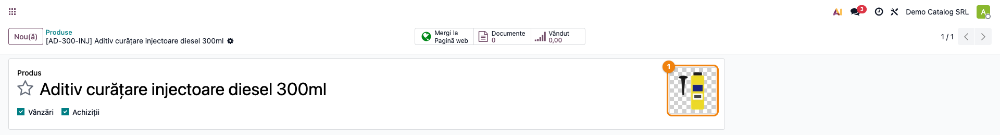
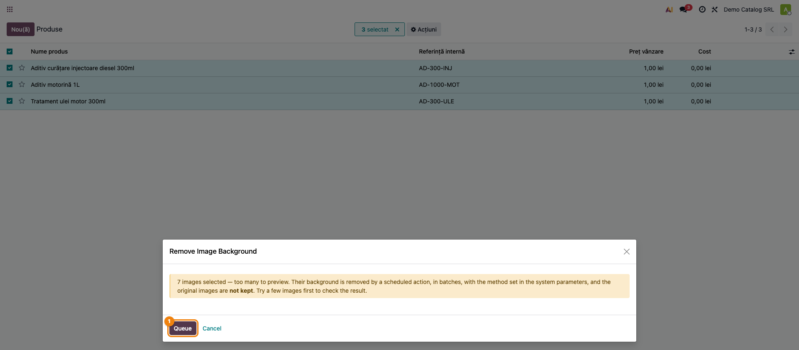
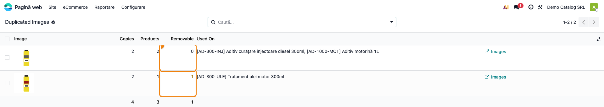
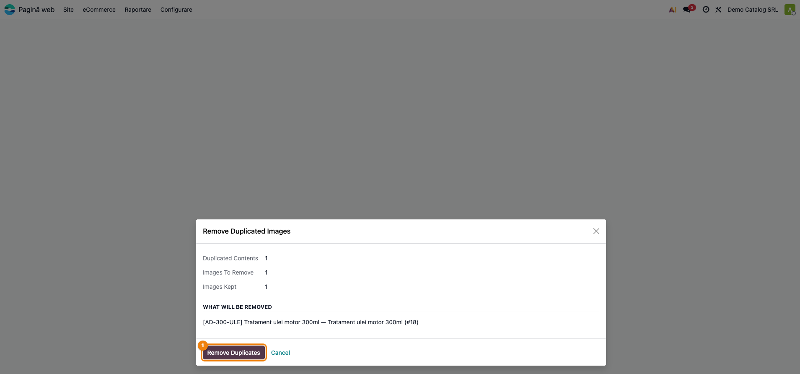
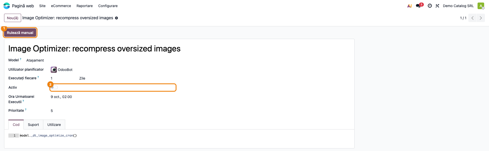

# Fișă Modul: Imaginile de produs — fundal eliminat, duplicate șterse, spațiu recuperat

**Modul:** `deltatech_image_optimize`
**Utilizator principal:** Responsabilul de catalog / eCommerce (fundal eliminat), administratorul
Odoo (imagini duplicate, recomprimare)
**Prioritate:** 🟡 Medie (nu atinge contabilitatea; schimbă însă **definitiv** imaginile produselor)

---

## 1. Scop business

Un catalog eCommerce adună în timp imagini de toate felurile: fotografii făcute în magazin pe un preș
sau pe o masă, poze de la furnizori pe fundal alb, aceeași poză importată de două ori la același
produs, originale de câțiva megaocteți care încarcă greu fiecare pagină. Modulul rezolvă trei
probleme pe aceleași imagini:

- **Eliminarea fundalului** — produsul este decupat și salvat pe fundal transparent (sau pe o
  culoare aleasă), ca toate fotografiile din magazin să arate la fel. Rezultatul se vede **înainte**
  de a fi scris, pentru că originalul nu se păstrează.
- **Imaginile duplicate** — aceeași poză pusă de mai multe ori în galeria unui produs se găsește și se
  șterge; poza folosită pe mai multe produse se raportează, dar nu se șterge.
- **Recomprimarea** — originalele prea mari se micșorează și se recodează (JPEG, sau WebP când au
  transparență), ca filestore-ul și paginile magazinului să fie mai ușoare.

## 2. Bază legală și context

Modulul nu are bază legală și nu generează note contabile, mișcări de stoc sau documente fiscale.

Context operațional de reținut:
- **Imaginea originală nu se păstrează** nici la eliminarea fundalului, nici la recomprimare: păstrarea
  unei copii ar dubla imaginile din baza de date. Verificarea se face înainte, în asistent.
- **Imaginile sunt procesate pe serverul Odoo**, nu sunt trimise unui serviciu extern.
- Unele marketplace-uri și feed-uri acceptă doar JPEG sau PNG, iar o imagine transparentă poate apărea
  acolo pe fundal negru. Verificați canalele de vânzare înainte de a converti tot catalogul, sau
  alegeți un fundal alb plin (parametrul `bg_color`, secțiunea 5).

## 3. Utilizatori și roluri

| Rol | Ce face | Drepturi Odoo (*Setări → Utilizatori & Companii → Utilizatori*) |
|---|---|---|
| Responsabil catalog / eCommerce | elimină fundalul imaginilor de produs | **Produse: Creează** — fără el acțiunea *Remove Image Background* nu apare; **Vânzări: Utilizator** (orice nivel) — pentru meniul *eCommerce*; **Vânzări: Administrator** sau **Pagină web: Editor restricționat** — pentru imaginile din galerie, pe care Odoo le lasă modificate doar acestor grupuri |
| Administrator Odoo | găsește și șterge imaginile duplicate, configurează parametrii, pornește recomprimarea | **Setări** (administrare); are implicit și **Produse: Creează** |

Fără drept de scriere pe galerie, **Apply** se oprește cu o eroare de acces pe rândurile *gallery
image*, chiar dacă imaginea principală s-ar putea scrie.

Roluri recomandate la testare: un utilizator cu **Produse: Creează** + **Vânzări: Administrator**
pentru eliminarea fundalului și **administratorul** pentru restul.

## 4. Conturi și date implicate

Modulul **nu folosește conturi contabile**. Lucrează pe:

| Date | Rol |
|---|---|
| Imaginea principală a produsului (`image_1920`) și imaginile din galeria eCommerce (`product.image`) | imaginile procesate |
| Variantele redimensionate (`image_1024`, `image_512`, `image_256`, `image_128`) | regenerate de Odoo din imaginea nouă, apoi recodate |
| Starea *Background Removal* pe produs și pe imagine | *Pending* (în coadă), *Removed*, *Failed*; nu apare în formular — se caută cu un filtru personalizat (Pasul 5) |
| Parametrii de sistem `deltatech_image_optimize.*` | configurarea (secțiunea 5) |

Date demo folosite în capturi: compania **Demo Catalog SRL** și trei produse cu fotografii realizate
pentru test:

| Produs | Fotografie | Ce arată |
|---|---|---|
| Aditiv curățare injectoare diesel 300ml | flacon cu pâlnie neagră alături, pe fundal alb | accesoriul rămâne întreg la decuparea după culoare |
| Tratament ulei motor 300ml | flacon pe fundal alb; aceeași poză apare de două ori în galerie | fundal eliminat; imagine duplicată |
| Aditiv motorină 1L | flacon pe un fundal neuniform | decupat cu modelul AI |

## 5. Configurare inițială

1. **Biblioteca `rembg` (doar pentru fotografiile pe fundal real).** Fotografiile pe fundal uniform
   (alb, gri de studio) se decupează fără ea. Pentru celelalte, administratorul serverului adaugă
   `rembg[cpu]` în `requirements.txt` al instalării (pe odoo.sh, în repo-ul proiectului) și refac
   build-ul. Modelul se descarcă la prima folosire (aprox. 180 MB pentru ISNet).
2. **Parametrii de sistem** — *Setări → Tehnic → Parametri → Parametri sistem* (cu modul
   dezvoltator activ), cheile `deltatech_image_optimize.bg_*`. Valorile implicite merg pentru
   majoritatea cataloagelor:

| Cheie | Implicit | Când se schimbă |
|---|---|---|
| `bg_method` | `auto` | `uniform` = doar după culoare; `rembg` = mereu modelul AI |
| `bg_model` | `isnet-general-use` | alt model AI; BiRefNet nu încape în memoria unui worker odoo.sh |
| `bg_tolerance` | 24 | se mărește pentru JPEG-uri cu zgomot sau umbre fine |
| `bg_min_island` | 1 | bucățile mai mici de atâtea procente din produs se elimină |
| `bg_lost_warning` | 5 | avertisment când modelul AI pierde atâtea procente din produs |
| `bg_crop` / `bg_margin` | 0 / 5 | 1 = produsul încadrat într-un pătrat, cu margine în procente |
| `bg_color` | (gol) | gol = transparent; `#FFFFFF` = fundal alb plin (JPEG) |
| `bg_sync_limit` | 5 | până la atâtea **imagini** (principale + din galerie) au previzualizare; peste, merg în coadă |
| `bg_batch` | 20 | imagini procesate la o rulare a acțiunii planificate |



3. **Recomprimarea** e oprită la instalare și se pornește din acțiunea planificată, după o probă pe
   staging (Pasul 8). Parametrii ei, tot în *Parametri sistem*, cu prefixul `deltatech_image_optimize.`:

| Cheie | Implicit | Ce face |
|---|---|---|
| `min_size` | 102400 | doar originalele mai mari de atâția octeți (100 KB) |
| `max_dim` | 1920 | latura maximă, în pixeli |
| `quality` | 85 | calitatea JPEG |
| `webp_quality` | 85 | calitatea WebP, pentru imaginile cu transparență |
| `batch` | 50 | originale (și apoi variante) procesate la o rulare |
| `variant_min_size` / `variant_quality` | 20480 / 85 | variantele redimensionate: pragul și calitatea |
| `force_jpeg` | 0 | **nu schimbați**: la 1, transparența devine negru, definitiv |

## 6. Flux de utilizare

### Pasul 1 — Selectați produsele și porniți acțiunea

*Pagină web → eCommerce → Produse → Produse*, vizualizarea listă. Bifați produsele ale căror
fotografii le curățați, apoi **Acțiuni → Remove Image Background** ①. Pe un produs, acțiunea cuprinde
și imaginile din galeria lui eCommerce.



### Pasul 2 — Verificați previzualizarea

Când selecția are cel mult `bg_sync_limit` imagini (implicit 5, numărând imaginea principală și pe
cele din galerie ale fiecărui produs), asistentul le decupează pe loc, fără să scrie nimic, și le
arată **înainte** și **după**. În captură, două produse cu câte o imagine în galerie dau 4 rânduri.

1. **Găsiți pe ecran** — fiecare rând este o imagine: *main image* este imaginea principală a
   produsului, *gallery image N* este a N-a imagine din galeria lui. Coloana *After* arată rezultatul
   pe o tablă de șah: pătrățelele sunt zona transparentă.
2. **Verificați** — produsul e întreg (accesoriile, capacul, pâlnia sunt acolo), nu au rămas urme
   lângă produs, iar zonele albe din interiorul produsului (eticheta) nu au devenit transparente.
   Coloana *Warning* e goală pe rândurile bifate.
3. **Treceți mai departe** — debifați rândurile la care rezultatul nu e bun și apăsați **Apply**.
   Doar rândurile bifate se scriu.

*Method* este metoda aleasă. Cu *Automatic*, asistentul alege pe fiecare imagine: după culoare când
marginea imaginii are o singură culoare, cu modelul AI altfel. Fotografia cu pâlnie (fundal alb) se
decupează după culoare, deci pâlnia rămâne întreagă; flaconul pe fundal neuniform trece prin modelul
AI.



### Pasul 3 — Când modelul AI pierde o parte din produs

Modelul AI tinde să păstreze doar obiectul principal. Situația apare când modelul AI lucrează pe o
fotografie cu fundal uniform: cu *Method* = *AI model* în asistent, sau cu `bg_method` = `rembg` în
parametri (cum e făcută captura). Rezultatul lui se compară atunci cu decuparea după culoare: dacă a
lăsat deoparte cel puțin `bg_lost_warning` procente din produs, rândul primește un **avertisment** în
coloana *Warning* și este **debifat**, iar deasupra listei apare numărul imaginilor de verificat.

Alegeți altă metodă sau alt model în câmpurile *Method* / *AI Model* și apăsați **Refresh Preview** ①:
previzualizarea se reface pentru toate rândurile, **iar bifele se refac și ele** după noul rezultat.
De aceea: întâi alegeți metoda și apăsați **Refresh Preview**, abia apoi debifați ce nu e bun, chiar
înainte de **Apply**.



### Pasul 4 — Rezultatul pe produs

După **Apply**, imaginea produsului (și variantele ei redimensionate) e salvată pe fundal transparent,
în format WebP (PNG, dacă serverul nu poate coda WebP; JPEG, dacă `bg_color` dă un fundal plin), iar
starea *Background Removal* devine *Removed*. Pe magazin, produsul apare pe fundalul paginii.



### Pasul 5 — Multe imagini: coada

Peste `bg_sync_limit` imagini (în captură: trei produse, 7 imagini), previzualizarea ar dura prea
mult. Asistentul cere doar confirmarea și trimite imaginile în **coadă** (**Queue**): acțiunea
planificată *Image Optimizer: remove product image background* le procesează în loturi de `bg_batch`,
cu metoda din parametrii de sistem. Orice imagine care nu s-a putut decupa (niciun produs găsit,
fundal real fără `rembg`, memorie insuficientă) rămâne neschimbată și e marcată *Failed*; motivul
apare doar în jurnalul serverului.

Imaginile rămase în coadă sau eșuate se găsesc în lista de produse cu *Filtre → Adaugă un filtru
personalizat*, pe câmpul *Background Removal* (*Pending* sau *Failed*).

Încercați întâi câteva imagini cu previzualizare, ca să vedeți rezultatul pe fotografiile catalogului.



### Pasul 6 — Imaginile duplicate

*Pagină web → eCommerce → Produse → Duplicated Images* (doar administratorul). Lista se deschide
filtrată pe grupurile care se pot curăța (*Removable*); în captură filtrul e scos, ca să se vadă și
poza comună mai multor produse.

1. **Găsiți pe ecran** — fiecare rând este un conținut de imagine identic octet cu octet:
   *Copies* = câte imagini au acest conținut, *Products* = pe câte produse, *Removable* = câte copii
   se repetă în interiorul aceluiași produs.
2. **Verificați** — *Removable* este mai mic decât *Copies*: pe fiecare produs rămâne o imagine.
   Filtrul *Shared Across Products* arată poza folosită pe mai multe produse — de regulă o problemă de
   feed, care **nu** se șterge.
3. **Treceți mai departe** — butonul *Images* deschide imaginile grupului. Ștergerea se face din
   *Pagină web → eCommerce → Produse → Remove Duplicated Images* (Pasul 7).



### Pasul 7 — Ștergerea duplicatelor

*Pagină web → eCommerce → Produse → Remove Duplicated Images*. Asistentul arată câte conținuturi au
copii de șters, câte imagini se șterg și câte se păstrează, și lista exactă a ce se șterge. Din fiecare grup
(același conținut, același produs) rămâne imaginea care apare prima în galerie; imaginile cu video
rămân mereu. **Remove Duplicates** ① cere confirmare și șterge definitiv.



### Pasul 8 — Recomprimarea imaginilor mari

*Setări → Tehnic → Automatizare → Acțiuni planificate → Image Optimizer: recompress oversized
images*. Acțiunea e **inactivă** la instalare ②. Rulați-o întâi pe staging cu **Rulează manual** ①:
o rulare ia cele mai mari `batch` originale (implicit 50) peste `min_size`, le micșorează la
`max_dim` pixeli și le recodează, apoi recomprimă tot atâtea variante și curăță filestore-ul.
Rezultatul se păstrează doar dacă e mai mic. Verificați produsele cu cele mai mari imagini, apoi
activați acțiunea pe producție.



### Note de monografie și raportare

Modulul **nu generează note contabile** și nu are rapoarte proprii. Spațiul recuperat la recomprimare
apare în jurnalul serverului, în linia *Image optimizer: …*: valoarea *on disk* este spațiul eliberat
efectiv pe disc (cea de lângă *freed* o depășește când aceeași poză e folosită de mai multe
înregistrări).

## 7. Legături cu alte module / declarații

| Modul | Rol |
|---|---|
| `website_sale` | galeria de imagini eCommerce a produsului (`product.image`), meniurile *Pagină web → eCommerce* |
| `product` | imaginea principală a produsului și dreptul **Produse: Creează** |
| `rembg` (bibliotecă Python, opțională) | modelul AI pentru fotografiile pe fundal real |

**Ce e automat:** decuparea și curățarea urmelor, regenerarea variantelor redimensionate și trecerea
lor pe WebP, procesarea cozii, recomprimarea (după activare), alegerea imaginii păstrate dintr-un grup
de duplicate.

**Ce rămâne manual:** selecția produselor, verificarea previzualizării și debifarea rezultatelor
greșite, decizia de a șterge duplicatele, activarea recomprimării pe producție.

## 8. Verificări pentru consultant

- [ ] Acțiunea **Remove Image Background** apare pe lista de produse pentru un utilizator cu
      **Produse: Creează** și lipsește pentru un utilizator care doar vizualizează produsele.
- [ ] Un utilizator cu **Produse: Creează** + **Vânzări: Administrator** aplică rezultatul și pe
      imaginile din galerie, fără eroare de acces.
- [ ] Pe o fotografie pe fundal alb cu un accesoriu alături, rezultatul păstrează accesoriul întreg.
- [ ] Zonele albe din interiorul produsului (eticheta) rămân opace în coloana *After*.
- [ ] Rândul debifat nu se scrie: imaginea produsului rămâne cea veche după **Apply**.
- [ ] După **Apply**, imaginea e transparentă, iar filtrul personalizat *Background Removal* =
      *Removed* găsește produsul.
- [ ] Cu metoda *AI model*, un produs la care modelul a pierdut accesoriul apare cu avertisment și
      debifat; **Refresh Preview** cu *Automatic* îl readuce corect.
- [ ] O selecție cu mai mult de `bg_sync_limit` imagini deschide asistentul în modul **Queue**, iar
      imaginile ajung *Removed* după rularea acțiunii planificate.
- [ ] Un rând debifat manual redevine bifat după **Refresh Preview** (de aceea debifarea se face
      după Refresh, chiar înainte de **Apply**).
- [ ] În *Duplicated Images*, o poză pusă de două ori pe același produs are *Removable* = 1; o poză
      folosită pe două produse are *Removable* = 0.
- [ ] După **Remove Duplicates**, fiecare produs are o singură copie a pozei.
- [ ] Recomprimarea rulată manual pe staging micșorează imaginile mari fără a schimba aspectul lor;
      `force_jpeg` a rămas 0.

## 9. Mesaje de eroare frecvente

În previzualizare, mesajele apar în coloana *Warning* a rândului, nu ca fereastră; în coadă, imaginea
e marcată *Failed* și mesajul ajunge doar în jurnalul serverului.

| Mesaj | Unde apare | Cauză | Remediere |
|---|---|---|---|
| *The background is not a single color and the AI model (rembg) is not installed.* | rândul din asistent | fotografie pe fundal real, iar biblioteca `rembg` lipsește | instalați `rembg[cpu]` (secțiunea 5) sau folosiți fotografii pe fundal uniform |
| *The AI model (rembg) is not installed; use the uniform background method.* | rândul din asistent | metoda *AI model* aleasă fără `rembg` | alegeți *Automatic* sau *Uniform background* și **Refresh Preview** |
| *The background is not a single color; use the AI model.* | rândul din asistent | metoda *Uniform background* pe o fotografie cu fundal real | alegeți *Automatic* sau *AI model* |
| *Not enough memory on the server for the AI model …* | rândul din asistent | modelul AI ales nu încape în memoria workerului | alegeți ISNet sau metoda *Uniform background* |
| *The AI model left out about N% of the product …* | rândul din asistent (debifat) | modelul AI a pierdut accesorii sau părți subțiri | verificați imaginea; de regulă *Automatic* o decupează corect |
| *No product was found in the image.* | rândul din asistent | imaginea nu are un obiect distinct de fundal | imaginea rămâne neschimbată; verificați fotografia |
| *Background removal with the AI model needs the Python library rembg.* | fereastră, la pornirea acțiunii | `bg_method` = `rembg` în parametri, fără bibliotecă | instalați `rembg[cpu]` sau puneți `bg_method` = `auto` |
| Eroare de acces la **Apply** pe *product.image* | fereastră, la **Apply** | utilizatorul nu are drept de scriere pe galerie | **Vânzări: Administrator** sau **Pagină web: Editor restricționat** (secțiunea 3) |

## 10. Capturi de ecran

Capturile sunt **generate automat** de `tests/test_screenshots.py` (mixinul `ScreenshotCase` din
`l10n_ro_doc_screenshots`, import defensiv), cu interfața în limba română. Etichetele proprii ale
modulului (*Remove Image Background*, *Method*, *Apply*…) apar în engleză, pentru că modulul nu are
încă traducere în română. Fotografiile de produs sunt desenate de test, iar modelul AI este simulat,
ca rezultatul să fie același la fiecare regenerare. Parametrii au valorile implicite, cu o singură
excepție: captura 03 e făcută cu `bg_method` = `rembg`.

| Fișier | Ce arată |
|---|---|
| `01_produse_actiune.png` | lista de produse cu acțiunea *Remove Image Background* |
| `02_previzualizare_automat.png` | asistentul cu previzualizarea înainte / după, metoda automată |
| `03_avertisment_model_ai.png` | rândul semnalat când modelul AI a pierdut pâlnia |
| `04_produs_dupa.png` | produsul cu imaginea pe fundal transparent |
| `05_coada.png` | asistentul pentru o selecție mare, trimisă în coadă |
| `06_parametri_sistem.png` | parametrii de sistem pentru eliminarea fundalului |
| `07_imagini_duplicate.png` | lista imaginilor duplicate |
| `08_eliminare_duplicate.png` | asistentul de ștergere a duplicatelor |
| `09_recomprimare_cron.png` | acțiunea planificată de recomprimare |

Regenerare:

```bash
./odoo/odoo-bin -c odoo.conf -d <db> -i deltatech_image_optimize,l10n_ro_doc_screenshots \
    --test-tags=/deltatech_image_optimize:TestImageOptimizeScreenshots --stop-after-init
```

## 11. Observații pentru manual

- Insistați pe faptul că **originalul nu se păstrează**: verificarea din previzualizare este singura
  plasă de siguranță. Recomandați o probă pe câteva produse înainte de coadă.
- Explicați diferența dintre *Automatic* (fundal uniform → după culoare) și *AI model*: pe fotografiile
  pe alb, metoda după culoare e mai rapidă și păstrează accesoriile.
- Pentru catalogul trimis pe marketplace-uri, menționați parametrul `bg_color` (fundal alb plin).
- Imaginile duplicate: ce se șterge (copii în același produs) și ce nu (poza comună mai multor
  produse).
- Recomprimarea se activează pe producție doar după o rulare pe staging.
