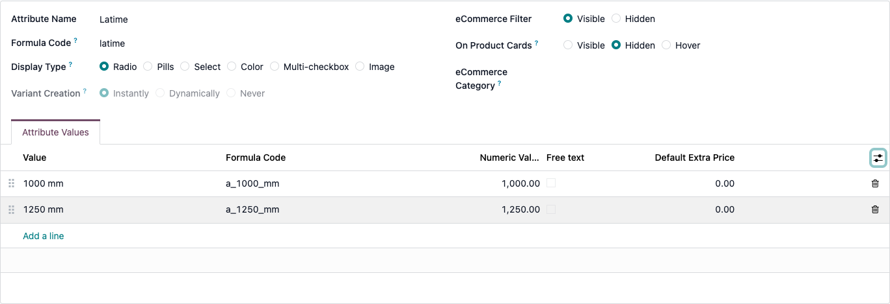
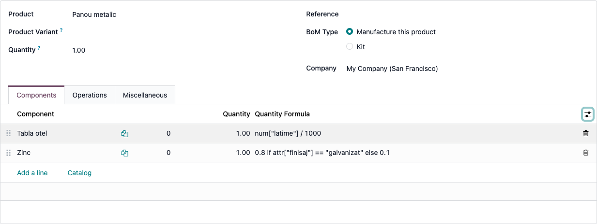
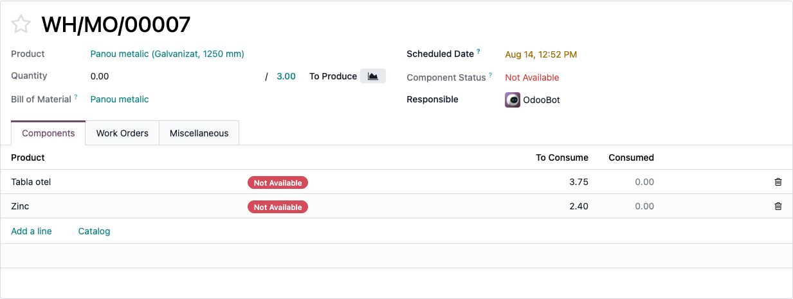
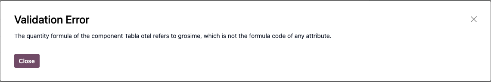

# Fișă Modul: BoM Quantity Formulas

**Modul:** `deltatech_mrp_bom_formula`  
**Rol principal:** calculul cantității unei componente din LDM pe baza atributelor variantei fabricate  
**Utilizatori principali:** consultant implementare producție, inginer tehnolog, administrator Odoo

---

## 1. Scop

Standardul Odoo permite doar **includerea sau excluderea** unei linii din lista de
materiale în funcție de valorile unui atribut (câmpul „Se aplică pe variante").
Cantitatea rămâne însă constantă. De îndată ce consumul depinde de configurație,
singura soluție standard este multiplicarea liniei — câte una pentru fiecare
combinație de atribute — ceea ce face LDM-ul greu de întreținut.

Modulul adaugă o **formulă de cantitate** pe linia de componentă, evaluată în
raport cu configurația produsului fabricat. O singură linie acoperă toate
variantele.

Este echivalentul funcțional al mecanismului *variant configuration* din SAP,
partea de calcul al consumului.

## 2. Ce configurează

### 2.1 Codul de formulă pe atribut

Meniu: `Inventar → Configurare → Atribute`

Fiecare atribut primește un câmp **Formula Code** — identificatorul tehnic sub
care atributul este vizibil în formule. Se generează automat din denumire, cu
diacriticele curățate:

| Denumire atribut | Formula Code |
|---|---|
| Finisaj | `finisaj` |
| Lățime | `latime` |

Codul este editabil și trebuie să fie unic; la coliziune se adaugă automat un
sufix numeric (`finisaj_2`). Câmpul este vizibil pentru grupul *Manufacturing /
Administrator*.

### 2.2 Codul și valoarea numerică pe valorile atributului

În aceeași fereastră, pe fiecare valoare a atributului:

- **Formula Code** — ce returnează dicționarul `attr` (implicit derivat din nume);
- **Numeric Value** — ce returnează dicționarul `num`. Se completează doar pentru
  caracteristicile măsurabile (lățime, lungime, grosime).

Exemplu de configurare a atributului „Lățime":

| Valoare | Formula Code | Numeric Value |
|---|---|---|
| 1000 mm | `a_1000_mm` | 1000 |
| 1250 mm | `a_1250_mm` | 1250 |

### 2.3 Formula pe linia de componentă

Meniu: `Producție → Produse → Liste de materiale`

Pe fila **Componente**, coloana **Quantity Formula** (implicit ascunsă — se
activează din butonul de coloane opționale). Câmpul este vizibil doar când LDM-ul
este definit pe șablon, nu pe o variantă anume.

## 3. Flux operațional

### Pasul 1 — stabiliți codurile

Verificați `Formula Code` pe atributele care influențează consumul. Completați
`Numeric Value` pe valorile caracteristicilor măsurabile.

### Pasul 2 — scrieți formula pe componentă

Trei tipare acoperă majoritatea cazurilor:

```python
num["latime"] / 1000                              # consum proporțional cu o dimensiune
0.8 if attr["finisaj"] == "galvanizat" else 0.1   # consum pe valoare discretă
qty * num["latime"] / 1000                        # qty = cantitatea de bază a liniei
```

În formulă sunt disponibile:

| Nume | Conținut |
|---|---|
| `attr` | dicționar cod atribut → codul valorii selectate |
| `num` | dicționar cod atribut → valoarea numerică a valorii selectate |
| `qty` | cantitatea completată pe linia de LDM |
| `ceil`, `floor` | rotunjire în sus / în jos |

Suplimentar sunt disponibile funcțiile matematice uzuale: `min`, `max`, `abs`,
`round`, `int`, `float`.

### Pasul 3 — salvați

Formula este verificată la salvare. O expresie greșită este respinsă imediat, în
editorul de LDM — nu la confirmarea comenzii de vânzare.

### Pasul 4 — lansați producția

La explodarea LDM-ului (ordin de fabricație, kit, previziune), cantitatea
componentei se calculează din configurația produsului fabricat. Rotunjirea la
unitatea de măsură se face în sus, ca în standard.

## 4. Reguli importante

- **Linia fără formulă își păstrează cantitatea.** Modulul nu schimbă nimic acolo
  unde nu a fost configurat, iar un LDM fără nicio formulă folosește integral
  codul standard.
- **Un atribut pe care produsul nu îl poartă are valoare neutră** — `False` în
  `attr`, `0.0` în `num`. Acest lucru permite unei LDM de semifabricat să
  folosească o caracteristică a produsului finit.
- **Un cod care nu există în nicio definiție de atribut generează eroare** — este
  cazul greșelii de tipar, prins la salvare.
- **Pe LDM-uri imbricate**, configurația produsului rădăcină rămâne disponibilă;
  doar valorile pe care produsul intermediar le poartă efectiv o suprascriu.
- **Formula nu poate returna o valoare negativă** și nici altceva decât un număr.
- **Formula nu are acces la baza de date.** Este evaluată izolat, nu poate citi
  sau modifica înregistrări.
- **Cantitatea de pe linie rămâne relevantă** — se poate folosi ca bază prin `qty`
  și este cantitatea aplicată dacă formula este ștearsă.

## 5. Unde se vede în interfață

| Loc | Element |
|---|---|
| Atribut produs | câmpul **Formula Code** lângă tipul de afișare |
| Valorile atributului | coloanele **Formula Code** și **Numeric Value** |
| LDM → Componente | coloana opțională **Quantity Formula** |
| LDM → linia deschisă | câmpul **Quantity Formula** sub „Se aplică pe variante" |
| Ordin de fabricație | cantitățile componentelor, deja calculate |

## 6. Verificări utile pentru consultant

- [ ] atributele care influențează consumul au `Formula Code` completat și stabil
- [ ] valorile caracteristicilor măsurabile au `Numeric Value` completat
- [ ] formula se salvează fără eroare pe LDM
- [ ] pe două variante diferite, ordinul de fabricație arată cantități diferite
- [ ] cantitatea scalează corect la o comandă de mai multe bucăți
- [ ] pe LDM-uri imbricate, semifabricatul preia caracteristica produsului finit
- [ ] componentele fără formulă au rămas la cantitatea inițială

## 7. Limitări cunoscute

- **Caracteristicile numerice introduse de utilizator nu ajung în producție.**
  Valoarea tastată într-un atribut de tip „Custom Value" pe linia de ofertă
  (`product.attribute.custom.value`) nu este propagată către ordinul de
  fabricație de către standardul Odoo. Formulele pot folosi doar valori de
  atribut definite în nomenclator. Pentru dimensiuni libere, introduse de la caz
  la caz, este necesară o dezvoltare suplimentară.
- **Formula se aplică doar componentelor**, nu și timpilor de operație sau
  subproduselor. Structura de filtrare pe atribute este aceeași, deci extinderea
  este posibilă, dar nu este livrată.
- **Raportul de structură al LDM** își calculează cantitățile separat de
  mecanismul de explodare, deci nu reflectă formulele.
- **Modulul rescrie metoda `explode` din `mrp`.** Corpul este copiat din standard
  cu o singură linie schimbată și trebuie recomparat la fiecare trecere de
  versiune. Este notat în `HISTORY.md`.
- Formula este o expresie, nu un program: nu poate conține instrucțiuni pe mai
  multe rânduri sau atribuiri.

## 8. Capturi

### Atributul cu cod de formulă și valori numerice

`Inventar → Configurare → Atribute` — atributul „Latime" are **Formula Code**
`latime`, iar fiecare valoare are propriul cod și **Numeric Value** completat.
Coloana `Numeric Value` este opțională; se afișează din butonul de coloane.



### Lista de materiale cu formule de cantitate

`Producție → Produse → Liste de materiale` — o singură linie pentru tablă și una
pentru zinc, ambele cu formulă. Fără modul, aceleași reguli ar fi cerut câte o
linie pentru fiecare din cele patru combinații de finisaj și lățime.



### Ordinul de fabricație cu cantitățile calculate

Ordin pentru 3 bucăți din varianta *Galvanizat, 1250 mm*. Tabla rezultă din
`num["latime"] / 1000` → 1,25 kg/buc → **3,75 kg**; zincul din formula pe finisaj
→ 0,8 kg/buc → **2,40 kg**.



### Formulă respinsă la salvare

O formulă care se referă la un cod inexistent este oprită în editorul de LDM, cu
numele codului în mesaj — nu la lansarea producției.



## 9. Întrebări de pus clientului înainte de configurare

1. Ce atribut determină consumul — unul cu valori dintr-o listă fixă, sau o
   dimensiune introdusă la fiecare comandă? (a doua variantă nu este acoperită)
2. Consumul este proporțional cu o dimensiune, sau are trepte discrete?
3. Consumul depinde de un singur atribut sau de combinația mai multora?
4. Formula se aplică produsului finit sau unui semifabricat din structură?
5. Se dorește urmărirea stocului pe configurație? (decide modul de creare a
   variantelor, care nu mai poate fi schimbat ulterior)
