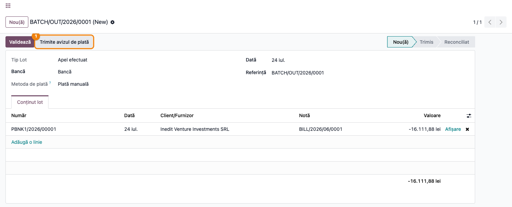
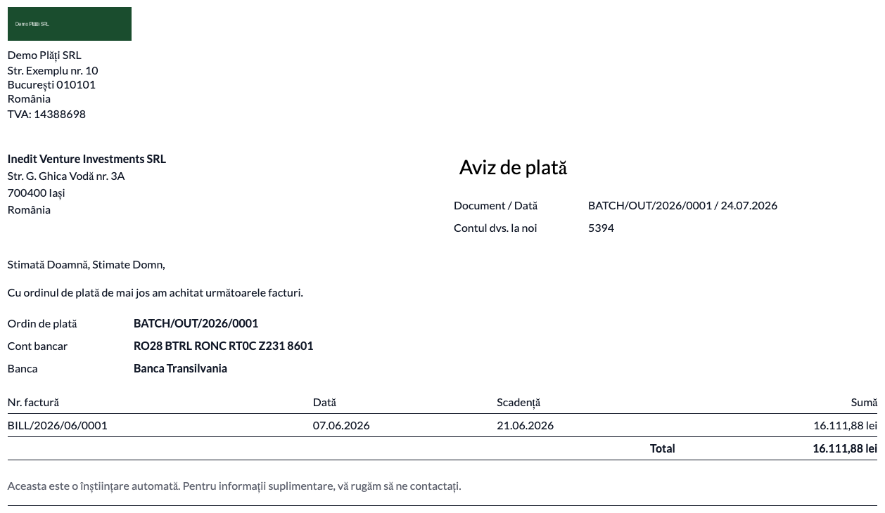
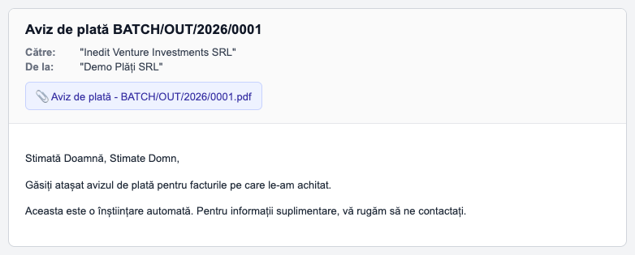

# Fișă Modul: Aviz de plată către furnizori (remittance advice)

**Modul:** `deltatech_payment_advice`
**Utilizator principal:** Contabil furnizori / Operator plăți
**Prioritate:** 🟡 Medie (îmbunătățește comunicarea cu furnizorii, nu produce înregistrări contabile)

---

## 1. Scop business

Această fișă descrie utilizarea modulului `deltatech_payment_advice` pentru emiterea unui **aviz de
plată** (remittance advice) — documentul pe care plătitorul îl trimite furnizorilor pentru a-i
notifica ce facturi le-au fost achitate printr-un ordin de plată bancar. Modulul adaugă un raport PDF
pe **plata în lot** (`account.batch.payment`): grupează plățile pe furnizor și produce câte un aviz
per furnizor, cu lista facturilor achitate și suma aferentă fiecăreia. Opțional, avizul se poate
trimite automat pe e-mail fiecărui furnizor, în limba lui.

## 2. Bază legală și context

Nu există o obligație legală specifică pentru avizul de plată în România — este un document de
**curtoazie comercială**, uzual în relația cu furnizorii mari (lanțuri de retail, importatori), care
ajută furnizorul să reconcilieze încasările cu facturile emise. Documentul preia informația deja
existentă în Odoo (plata, ordinul de plată, facturile furnizor achitate) și o prezintă într-un format
lizibil pentru furnizor.

## 3. Utilizatori și roluri

Contabil furnizori, Operator plăți.

Roluri recomandate pentru testare:
- Administrator funcțional: instalează modulul și verifică butonul/raportul pe plata în lot.
- Utilizator operațional: creează plata în lot și emite/trimite avizul.
- Contabil/manager: validează că facturile și sumele din aviz corespund plății.

## 4. Conturi și date implicate

Modulul **nu generează el însuși note contabile** — este un document de raportare peste plăți deja
existente. Conturile implicate sunt cele ale plăților subiacente:
- **401** (Furnizori) — soldul stins de plată;
- **512x** (Conturi la bănci) / contul de **plăți în curs** (outstanding payments), în funcție de
  momentul confirmării extrasului.

Date minime pentru demo:
- companie românească cu localizarea contabilă instalată;
- un jurnal de **bancă** cu cont IBAN și bancă completate (apar în antetul avizului);
- un **furnizor** cu adresă, cod intern (`ref`) și adresă de e-mail (pentru trimitere);
- una sau mai multe **facturi furnizor** postate;
- o **plată** înregistrată pe factură și o **plată în lot** care o conține.

## 5. Configurare inițială

1. Instalați modulul `deltatech_payment_advice` (necesită `account_batch_payment` — Enterprise).
2. Pe jurnalul de bancă folosit la plată, completați **contul bancar (IBAN)** și **banca** — acestea
   apar în corpul avizului („Cont bancar", „Banca").
3. Pe furnizori, completați **codul intern** (`ref` — apare ca „Contul dvs. la noi") și, pentru
   trimiterea automată, **adresa de e-mail** și **limba**.
4. Postați câteva facturi furnizor și înregistrați plata lor.
5. Verificați că utilizatorul de test are acces la **Plăți în lot**.

## 6. Flux de utilizare

### Pasul 1 — Crearea plății în lot

Accesați **Contabilitate → Furnizori → Plăți în lot** și creați o plată în lot de tip ieșire — în
câmpul **Tip Lot** apare eticheta „Apel efectuat" (outbound): alegeți jurnalul de bancă și adăugați
în tab-ul „Conținut lot" plățile către furnizori (fiecare plată e legată de facturile pe care le
stinge).



> Un lot poate conține plăți către **mai mulți furnizori**. Avizul se emite **per furnizor**, deci
> dintr-un singur lot rezultă câte un document pentru fiecare furnizor din lot.

### Pasul 2 — Emiterea avizului de plată (PDF)

Din formularul plății în lot, apăsați **Tipărire → Aviz de plată**. Se generează un PDF cu câte o
pagină per furnizor.

**Ce găsiți pe ecran:** antetul cu datele furnizorului (nume, adresă, „Contul dvs. la noi"), caseta
„Aviz de plată" cu documentul și data, ordinul de plată cu IBAN-ul și banca, apoi tabelul facturilor
achitate cu coloanele **Nr. factură**, **Dată**, **Scadență** și **Sumă**, încheiat cu **Total**.

**Verificați** înainte de a trimite documentul: fiecare furnizor apare pe pagina lui; facturile
listate sunt cele achitate efectiv prin acest lot; suma pe fiecare linie corespunde valorii plătite,
iar **Total** corespunde sumei plății către acel furnizor.



> Imaginea de mai sus este previzualizarea HTML a raportului, identică cu PDF-ul tipărit.

> Suma pe fiecare factură se preia din reconcilierea plății când aceasta este finalizată; dacă avizul
> se emite înainte ca plata să fie confirmată prin extras (starea `in_process`), se afișează valoarea
> **brută** a facturii — la fel ca în avizul de tip retail.

### Pasul 3 — Trimiterea avizului pe e-mail către furnizori

Tot din formularul plății în lot, apăsați **Trimite avizul de plată**. Modulul generează PDF-ul
fiecărui furnizor, îl atașează la un e-mail (șablonul „Aviz de plată: notificare furnizor",
randat în limba furnizorului) și îl pune la coadă pentru trimitere către adresa furnizorului. La final
apare o notificare cu numărul de avize trimise.



> Furnizorii **fără adresă de e-mail** sunt omiși și raportați în notificare; dacă niciunul nu are
> e-mail, acțiunea se oprește cu un mesaj explicit (nu se trimite nimic).

### Note de monografie și raportare

- Modulul **nu produce înregistrări contabile** — este strict un document de notificare peste plăți
  existente.
- Nota contabilă a plății subiacente (generată de Odoo, nu de acest modul), la stingerea unei facturi
  furnizor: **Dr 401 = Cr 512x** (sau contul de plăți în curs până la confirmarea extrasului).
- Avizul nu se raportează în nicio declarație ANAF; este un document extern, către furnizor.

## 7. Legături cu alte module / declarații

| Modul / proces | Rol în flux | Tip legătură |
|---|---|---|
| `account_batch_payment` | plata în lot pe care se sprijină avizul | dependență (manifest) |
| `account` | plăți, facturi furnizor, reconciliere | dependență (tranzitivă) |
| `mail` | șablonul de e-mail și trimiterea către furnizor | dependență (tranzitivă) |

Ce este automat: gruparea plăților pe furnizor, calculul sumelor, randarea PDF-ului per furnizor și
trimiterea e-mailului în limba furnizorului.
Ce rămâne manual: crearea plății în lot, completarea IBAN-ului/băncii pe jurnal și a datelor de
contact pe furnizor, declanșarea tipăririi sau trimiterii.

## 8. Verificări pentru consultant

- [ ] Modulul se instalează fără erori pe baza demo (cu `account_batch_payment` disponibil).
- [ ] Butonul **Trimite avizul de plată** apare pe plata în lot de tip ieșire (Tip Lot = „Apel efectuat"), cu plăți adăugate.
- [ ] Acțiunea **Tipărire → Aviz de plată** produce un PDF cu câte o pagină per furnizor.
- [ ] Facturile listate și sumele corespund plăților din lot; **Total** = suma plătită furnizorului.
- [ ] Antetul avizului arată corect IBAN-ul, banca și codul intern al furnizorului.
- [ ] La trimiterea pe e-mail, se creează câte un mesaj per furnizor, cu PDF-ul atașat.
- [ ] Avizul unui furnizor cu limba `ro_RO` este randat în română; al unuia cu altă limbă, în limba lui.
- [ ] Furnizorii fără e-mail sunt omiși și raportați în notificare.

## 9. Mesaje de eroare frecvente

| Mesaj / simptom | Cauză probabilă | Remediere |
|-----------------|-----------------|-----------|
| „Nu s-a trimis niciun aviz de plată: niciun furnizor nu are adresă de e-mail (…)." | Niciunul dintre furnizorii din lot nu are e-mail | Completați adresa de e-mail pe fișele furnizorilor și reîncercați |
| „Furnizori omiși (fără adresă de e-mail): …" (notificare) | Doar o parte dintre furnizori au e-mail | Completați e-mailul furnizorilor omiși dacă doriți să primească și ei avizul |
| Butonul **Trimite avizul de plată** nu apare | Lotul nu este de tip ieșire sau nu are plăți adăugate | Setați **Tip Lot** pe „Apel efectuat" (outbound) și adăugați plăți în tab-ul „Conținut lot" |
| Antetul avizului nu arată IBAN-ul / banca | Jurnalul de bancă nu are contul bancar sau banca completate | Completați contul bancar (IBAN) și banca pe jurnalul folosit la plată |
| Avizul nu apare în limba furnizorului | Furnizorul nu are limba setată sau traducerea nu e instalată | Setați limba pe fișa furnizorului; asigurați-vă că limba română e activă |

## 10. Capturi de ecran

Capturile (`readme/screenshots/`) sunt **generate automat** din `tests/test_screenshots.py`
(mixinul `ScreenshotCase` din `l10n_ro_doc_screenshots`, import defensiv), în **limba română**, pe
planul de conturi RO:

1. `01_plata_in_lot.png` — formularul plății în lot, cu plățile către furnizori.
2. `02_aviz_pdf.png` — avizul de plată tipărit (PDF), o pagină per furnizor.
3. `03_email_furnizor.png` — e-mailul cu avizul atașat, trimis furnizorului.

Regenerare:

```bash
./odoo/odoo-bin -c odoo.conf -d <db> -i deltatech_payment_advice,l10n_ro_doc_screenshots \
    --test-tags=fise_screenshots --stop-after-init
```

## 11. Observații pentru manual

În manualul final, păstrați explicația orientată pe activitatea utilizatorului: avizul de plată este
un document de curtoazie către furnizor, se emite din plata în lot, se poate tipări sau trimite
automat pe e-mail, și **nu** modifică contabilitatea. Accentuați relația un lot → mai mulți furnizori
→ câte un aviz per furnizor.
