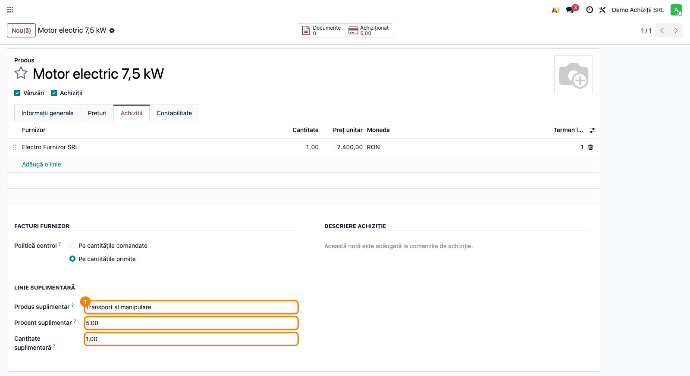
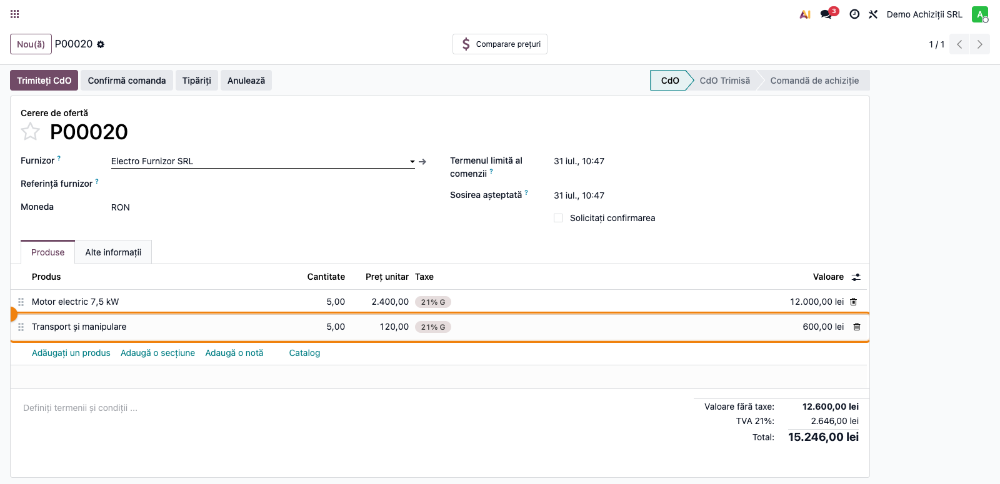
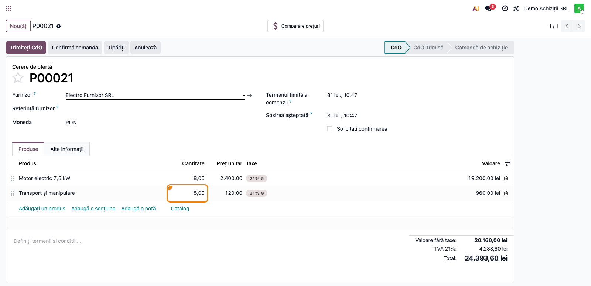
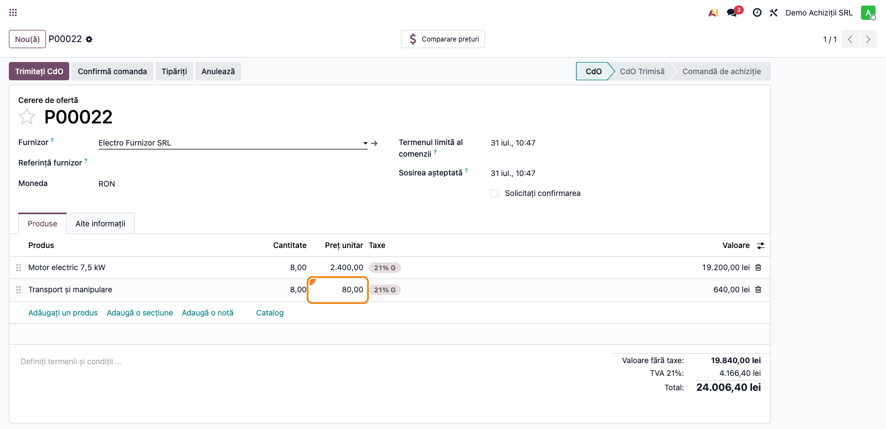
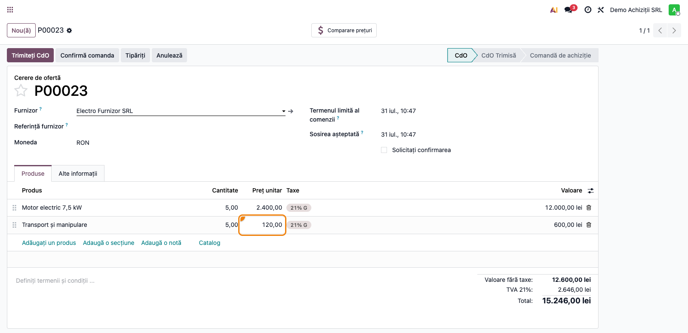
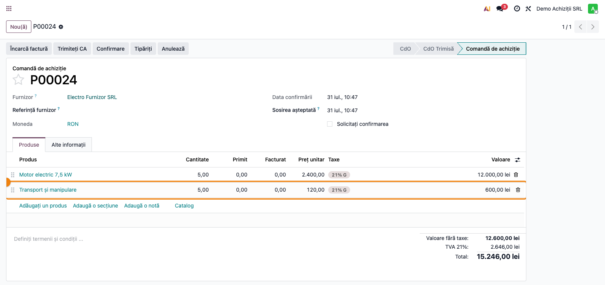

# Fișă Modul: Linie suplimentară automată pe comanda de achiziție

**Modul:** `deltatech_purchase_add_extra_line`
**Utilizator principal:** Operator achiziții, responsabil date de bază produse
**Versiune documentată:** 19.0.1.2.0
**Prioritate:** 🟡 Medie (obligatoriu unde furnizorul facturează automat un al doilea articol: ambalaj, transport, taxă, serviciu)

---

## 1. Scop business

Modulul rezolvă situația în care achiziția unui produs atrage **întotdeauna** un al doilea articol
facturat de furnizor, pe care operatorul nu trebuie să-l uite și nu trebuie să-l calculeze manual:
ambalajul nereturnabil, taxa de mediu, manipularea, serviciul de punere în funcțiune, comisionul de
transport calculat procentual din valoarea mărfii.

Consultantul configurează o singură dată produsul „suplimentar" pe fișa produsului principal, iar la
fiecare cerere de ofertă sau comandă de achiziție linia suplimentară apare automat, cu cantitatea și
prețul calculate din linia principală.

Modulul nu adaugă meniuri, rapoarte sau note contabile proprii — este **infrastructură** pe comanda
de achiziție. Efectul contabil apare la înregistrarea facturii de la furnizor, prin produsul
suplimentar.

## 2. Bază legală și context

Modulul nu are temei legal propriu; este un mecanism comercial. Baza legală vine din **cazul de
utilizare** pe care îl deservește:

| Caz de utilizare | Temei / context |
|---|---|
| Ambalaj nereturnabil, manipulare, montaj | politică comercială a furnizorului; se achiziționează cu TVA deductibilă ca orice bun/serviciu |
| Contribuție de mediu facturată de furnizor (ambalaje, echipamente electrice) | clauză a furnizorului; pentru cumpărător este un cost al achiziției, nu o obligație declarativă proprie |
| Comision de transport procentual | clauză contractuală cu furnizorul (procent din valoarea mărfii) |

> **Atenție — transportul și manipularea NU sunt cheltuială de perioadă.** Conform OMFP 1802/2014
> **pct. 6**, costul de achiziție al bunurilor cuprinde „cheltuielile de transport, manipulare și alte
> cheltuieli care pot fi atribuibile direct achiziției bunurilor respective" (inclusiv atunci când
> funcția de aprovizionare este externalizată). Deci, când produsul suplimentar este transport,
> manipulare sau ambalaj atribuibil direct unei achiziții de bunuri, valoarea lui trebuie să intre în
> **costul stocului**, nu pe 624/628. Modulul adaugă doar linia pe comandă; includerea în cost se face
> separat, prin **costuri suplimentare (landed costs)** — vezi precondițiile din secțiunea 7.

> Modulul **nu** decide regimul de TVA al produsului suplimentar — el doar adaugă linia. Taxa se
> configurează pe produsul suplimentar și determină singură rândurile din D300/D394; verificați cota
> (21% / 11% / scutit) la configurare.

## 3. Utilizatori și roluri

Responsabil date de bază produse (configurarea), operator achiziții (folosirea zilnică),
contabil furnizori (verificarea liniei suplimentare pe factura de la furnizor).

Roluri recomandate pentru testare:
- Administrator funcțional: instalează modulul și configurează produsele
- Utilizator operațional (Achiziții / Utilizator): creează cereri de ofertă și verifică linia automată
- Contabil/manager: validează linia suplimentară pe factura de achiziție și contul folosit

## 4. Conturi și date implicate

Modulul nu impune conturi. Linia suplimentară este o linie normală de comandă de achiziție, deci la
înregistrarea facturii folosește **contul produsului suplimentar**, luat din categoria lui de produs:

- `371` / `302` / `381` — mărfuri / materiale consumabile / **ambalaje**, dacă produsul suplimentar este
  stocabil. Contul concret vine din **categoria de produs** configurată pe produsul suplimentar;
  ambalajele scoase din gestiune se descarcă prin `608`;
- `628` / `624` — alte servicii executate de terți / transport de bunuri, **numai** pentru articole care
  **nu** sunt atribuibile direct achiziției unui bun (ex. punere în funcțiune ulterioară, comision fără
  legătură cu intrarea bunului) sau când produsul principal nu este stoc;
- `4426` — TVA deductibilă, conform taxei setate pe produsul suplimentar;
- `401` — furnizori, contrapartida facturii.

> Regula de aur: transportul, manipularea și ambalajul **atribuibile direct** unei achiziții de bunuri
> intră în **costul de achiziție** (OMFP 1802/2014, pct. 6), nu în cheltuielile perioadei. Folosirea lui
> 624/628 pentru astfel de articole este excepția, nu regula.

Date minime pentru demo (scenariul folosit și în capturi):
- companie românească cu localizarea contabilă instalată și perioadă deschisă;
- un **furnizor** („Electro Furnizor SRL") cu o intrare în lista lui de prețuri pentru produsul
  principal;
- produs principal „Motor electric 7,5 kW" (2.400 lei) + produs suplimentar de tip serviciu
  „Transport și manipulare", cu **Procent suplimentar = 5** și **Cantitate suplimentară = 1**.

Pentru un scenariu cu multiplicator (ex. un palet nereturnabil per 500 de cărămizi), configurați
**Cantitate suplimentară** cu valoarea dorită și lăsați **Procent suplimentar = 0**, ca prețul să vină
de la furnizor.

## 5. Configurare inițială

1. Instalați modulul `deltatech_purchase_add_extra_line` (dependență: `purchase`).
2. Creați produsul **suplimentar** ca produs obișnuit, cu prețul și taxa corecte.
3. Deschideți **produsul principal** și, în fila **Achiziții**, completați grupul
   **Linie suplimentară**:
   - **Produs suplimentar** — produsul care se adaugă automat;
   - **Procent suplimentar** — procentul din prețul liniei principale; lăsați **0** dacă produsul
     suplimentar are preț propriu (de la furnizor sau din lista de prețuri);
   - **Cantitate suplimentară** — multiplicatorul de cantitate (1 = o unitate suplimentară pentru
     fiecare unitate achiziționată).
4. Verificați drepturile: **configurarea** de la pasul 1 cere drept de scriere pe produs
   (Achiziții sau Inventar — Manager), altfel grupul apare doar în citire; **folosirea zilnică**
   (pașii 2–6) cere doar **Achiziții / Utilizator**.

> Câmpurile sunt aceleași care apar și în fila **Vânzări**, dacă este instalat și modulul
> `deltatech_sale_add_extra_line`: configurarea este **comună**, nu separată per document. Un produs
> configurat cu produs suplimentar va genera linia atât la vânzare, cât și la achiziție.

## 6. Flux de utilizare

### Pasul 1 — Configurarea produsului principal

Accesați **Achiziții → Produse → Produse**, deschideți produsul principal și mergeți în fila
**Achiziții**, grupul **Linie suplimentară**. Completați produsul suplimentar, procentul și
multiplicatorul de cantitate, apoi salvați.

În exemplul din captură, „Motor electric 7,5 kW" are atașat „Transport și manipulare", cu
**Procent suplimentar = 5** (transportul costă 5% din valoarea motorului) și
**Cantitate suplimentară = 1**.



### Pasul 2 — Cererea de ofertă: linia suplimentară apare automat

Accesați **Achiziții → Comenzi → Cereri de ofertă → Nou**, alegeți furnizorul și adăugați produsul
principal cu cantitatea dorită. Linia suplimentară este inserată automat, poziționată direct sub
linia principală.

Ce găsiți pe ecran și ce trebuie să verificați:
- linia suplimentară are **cantitatea** = cantitatea liniei principale × **Cantitate suplimentară** —
  în captură, 5 motoare → 5 transporturi;
- linia suplimentară are **prețul unitar** = prețul liniei principale × **Procent suplimentar** / 100 —
  în captură, 120,00 lei, adică 5% din 2.400,00 lei;
- linia suplimentară stă imediat sub linia principală (nu la finalul comenzii).



> Spre deosebire de comanda de vânzare, aici linia se generează și **fără interfață**: modulul o
> creează la salvarea liniilor (inclusiv prin import sau API), precum și la trimiterea cererii de
> ofertă prin e-mail și la tipărirea ei.

### Pasul 3 — Sincronizarea cantității

Cantitatea liniei suplimentare urmează întotdeauna linia principală, înmulțită cu
**Cantitate suplimentară**. În captură, cantitatea motoarelor a fost urcată la **8**, iar linia de
transport a urmat.

Verificați pe ecran:
- raportul dintre cele două cantități rămâne cel din **Cantitate suplimentară**;
- prețul liniei suplimentare se reașează pe procentul configurat, iar subtotalul crește proporțional.



### Pasul 4 — Preț negociat manual pe linia suplimentară

Sunt situații în care furnizorul acceptă un transport la preț fix, diferit de procent. Modificați
**prețul unitar direct pe linia suplimentară** și salvați.

De la versiunea **19.0.1.1.0**, prețul introdus manual **rămâne**: nu mai este rescris de recalculul
automat. În captură, transportul a fost negociat la **80,00 lei** în loc de 120,00 lei, iar
cantitatea motoarelor a fost apoi urcată.

Verificați pe ecran, după salvare:
- prețul liniei suplimentare este cel introdus de dumneavoastră — 80,00 lei, nu 120,00 lei;
- **cantitatea** liniei suplimentare s-a actualizat, deci sincronizarea cantităților funcționează în
  continuare;
- același lucru se întâmplă la modificarea prețului liniei principale — procentul nu se mai aplică
  peste prețul negociat.



### Pasul 5 — Revenirea la prețul calculat automat

Dacă prețul negociat nu mai este valabil, **ștergeți linia suplimentară** (coșul de la capătul
liniei). Linia se regenerează **imediat**, cu prețul calculat din procent — nu este nevoie de nicio
altă acțiune. Nu vă alarmați dacă o vedeți reapărând instantaneu: nu e o ștergere eșuată, este exact
mecanismul de regenerare. (Prin import sau API, regenerarea are loc la salvarea liniilor.)

Verificați: linia reapărută are din nou prețul = procent × prețul liniei principale — în captură,
120,00 lei, în locul celor 80,00 lei negociați anterior.



> Ștergerea funcționează și în sens invers: dacă ștergeți **linia principală**, modulul șterge
> automat și linia suplimentară asociată, ca să nu rămână orfană în comandă.

### Pasul 6 — Confirmarea comenzii

Confirmați cererea de ofertă (**Confirmă comanda**). Linia suplimentară intră în comanda de
achiziție ca linie normală, cu cantitatea și prețul stabilite, și va fi preluată la recepție și la
înregistrarea facturii de la furnizor.

Ce verificați pe comanda confirmată:
- linia suplimentară este prezentă, cu prețul și cantitatea stabilite;
- dacă produsul suplimentar este stocabil, apare și în recepție; dacă este serviciu, doar pe factură;
- după confirmare, modulul **nu mai regenerează și nu mai sincronizează** linia — comanda a ieșit din
  stările „Cerere de ofertă" / „Ofertă trimisă", singurele în care mecanismul lucrează.



### Note de monografie și raportare

Modulul nu generează note contabile proprii. La înregistrarea facturii de la furnizor care conține
linia suplimentară, nota este cea a unei facturi obișnuite de achiziție:

- **cazul obișnuit — transport / manipulare / ambalaj atribuibil direct achiziției de bunuri:**
  valoarea intră în **costul stocului**, prin costuri suplimentare (landed costs) —
  **Dr 371/302/381 + Dr 4426 = Cr 401**. Contul de stoc se încarcă cu prețul mărfii **plus** articolul
  suplimentar repartizat (OMFP 1802/2014, pct. 6);
- **cazul excepțional — articol neatribuibil direct achiziției** (punere în funcțiune ulterioară,
  comision fără legătură cu intrarea bunului) sau produs principal care nu este stoc:
  **Dr 628/624 + Dr 4426 = Cr 401**;
- la scoaterea din gestiune a ambalajelor stocate pe `381`: **Dr 608 = Cr 381**;
- în **D300** și **D394**, linia suplimentară intră ca orice linie de factură de achiziție, prin
  tag-urile taxei configurate pe produsul suplimentar. Nu există tratament special și nici marcaj
  propriu al modulului;
- acest modul **doar adaugă linia** pe comandă; nu repartizează costul pe produse și nu decide contul —
  repartizarea rămâne un pas separat (vezi precondițiile de landed cost în secțiunea 7).

## 7. Legături cu alte module / declarații

| Modul / proces | Rol în flux | Tip legătură |
|---|---|---|
| `purchase` | cereri de ofertă și comenzi de achiziție, liniile pe care se inserează linia suplimentară | dependență (manifest) |
| `deltatech_sale_add_extra_line` | același mecanism pe comanda de vânzare; **partajează câmpurile de configurare** de pe produs | modul separat, independent |
| `deltatech_sale_add_extra_line_pos` | duce mecanismul de vânzare în Punctul de vânzare | modul separat, opțional |
| Costuri suplimentare (landed costs) | includerea în costul stocului a articolelor de tip transport/manipulare/ambalaj | proces separat, manual |

**Precondiții pentru includerea în costul stocului prin landed costs** — verificați-le, altfel
repartizarea nu are niciun efect și valoarea rămâne pe cheltuieli:

1. modulul **Costuri suplimentare** (`stock_landed_costs`) trebuie instalat;
2. pe produsul suplimentar trebuie bifat **„Este un cost suplimentar"** — bifa există **numai pentru
   produsele de tip serviciu**, deci articolul care se repartizează trebuie configurat ca serviciu;
3. produsul principal trebuie evaluat la **FIFO** sau **cost mediu (AVCO)** — mișcările produselor cu
   cost standard sunt ignorate la repartizare.

Ce este automat: inserarea liniei suplimentare, cantitatea (× **Cantitate suplimentară**), prețul
(procent din linia principală), ștergerea liniei suplimentare împreună cu linia principală,
păstrarea prețului introdus manual.

Ce rămâne manual: configurarea produsului suplimentar și a taxei lui, verificarea liniei pe factura
de la furnizor, alegerea prețului atunci când procentul nu se potrivește, repartizarea pe cost dacă
articolul este element de cost de achiziție.

**Limitări cunoscute — de comunicat clientului:**

1. **Mecanismul lucrează numai înainte de confirmare.** Modulul se oprește la comenzile care nu sunt
   în starea „Cerere de ofertă" sau „Ofertă trimisă". Pe o comandă confirmată, o modificare de
   cantitate pe linia principală **nu** mai actualizează linia suplimentară — trebuie corectată
   manual.
2. **Fără procent (Procent suplimentar = 0)**, prețul liniei suplimentare este cel calculat standard
   de Odoo pentru produsul respectiv: prețul de la furnizor dacă există o intrare în lista de prețuri
   a furnizorului, altfel prețul de achiziție al produsului. Modulul nu îl atinge.
3. **Pe comenzi cu mai multe produse configurate, ordinea liniilor poate să nu fie strictă.**
   Linia suplimentară primește secvența liniei principale + 1, fără ca liniile următoare să fie
   decalate, deci pe o comandă cu două sau mai multe produse configurate pot apărea secvențe egale, iar
   linia suplimentară nu stă neapărat imediat sub linia-mamă. Reordonați manual (prin glisare) dacă
   documentul tipărit o cere.
4. **Configurarea este comună cu modulul de vânzare.** Câmpurile stau pe produs, nu pe tipul de
   document: un produs configurat va genera linia suplimentară și la vânzare, dacă este instalat și
   `deltatech_sale_add_extra_line`. Nu există în prezent posibilitatea de a configura un produs
   suplimentar doar pentru achiziție.

## 8. Verificări pentru consultant

- [ ] Modulul se instalează fără erori.
- [ ] Grupul **Linie suplimentară** este vizibil în fila **Achiziții** a produsului.
- [ ] La adăugarea produsului principal în cererea de ofertă, linia suplimentară apare sub el.
- [ ] Cantitatea liniei suplimentare = cantitatea liniei principale × **Cantitate suplimentară**.
- [ ] Prețul liniei suplimentare = prețul liniei principale × **Procent suplimentar** / 100.
- [ ] Cu **Procent suplimentar = 0**, prețul vine de la furnizor / din prețul de achiziție.
- [ ] Un preț introdus manual pe linia suplimentară rămâne după modificarea cantității sau a
      prețului liniei principale.
- [ ] După ștergerea liniei suplimentare, aceasta se regenerează cu prețul calculat.
- [ ] Ștergerea liniei principale șterge și linia suplimentară asociată.
- [ ] Taxa de achiziție a produsului suplimentar este cota corectă (21% / 11% / scutit).
- [ ] Transportul/manipularea/ambalajul atribuibile direct achiziției ajung în **costul stocului**
      (nu pe 624/628), iar cele trei precondiții de landed cost sunt îndeplinite.
- [ ] Pe o comandă **confirmată**, linia suplimentară nu se mai sincronizează (comportament așteptat).
- [ ] S-a comunicat clientului că configurarea este comună cu fluxul de vânzare.

## 9. Mesaje de eroare frecvente

Modulul nu ridică mesaje de eroare proprii; problemele se manifestă ca **comportament lipsă**.

| Simptom | Cauză probabilă | Remediere |
|---|---|---|
| Linia suplimentară nu apare | Produsul principal nu are **Produs suplimentar** completat | Verificați fila **Achiziții → Linie suplimentară** pe șablonul produsului adăugat |
| Linia suplimentară nu apare deși produsul e configurat | Comanda este deja **confirmată** (nu mai e cerere de ofertă) | Mecanismul lucrează doar în stările „Cerere de ofertă" / „Ofertă trimisă"; adăugați linia manual |
| Linia suplimentară apare cu preț 0 | **Procent suplimentar = 0** și produsul suplimentar nu are preț de furnizor sau de achiziție | Completați prețul produsului suplimentar sau setați un procent |
| Prețul liniei suplimentare nu se mai actualizează | Prețul a fost modificat manual — comportament dorit de la 19.0.1.1.0 | Ștergeți linia suplimentară; se regenerează cu prețul calculat |
| Prețul introdus manual este rescris | Modul la o versiune anterioară lui 19.0.1.1.0 | Actualizați modulul; scriptul de migrare preia prețurile liniilor existente |
| Cantitatea liniei suplimentare nu urmează linia principală | **Cantitate suplimentară** este 0 sau necompletată | Setați valoarea (implicit 1); valoarea 0 este tratată ca 1 |
| Pe o bază migrată, prețul liniei suplimentare rămâne 0 și nu se recalculează | Linia veche avea preț 0 real, iar scriptul de migrare a putut-o marca drept „preț manual" | Ștergeți linia suplimentară și lăsați-o să se regenereze |
| Linia suplimentară apare și la vânzare, deși nu era dorit | Configurarea de pe produs este comună cu `deltatech_sale_add_extra_line` | Limitarea 3 din secțiunea 7; folosiți produse separate dacă fluxurile trebuie să difere |

## 10. Capturi de ecran

Capturile (`readme/screenshots/`) sunt **generate automat** din `tests/test_screenshots.py`
(mixinul `ScreenshotCase` din `l10n_ro_doc_screenshots`, import defensiv), în **limba română**, pe
compania „Demo Achiziții SRL" în RON:

| # | Fișier | Conținut |
|---|--------|----------|
| 1 | `screenshots/01_configurare_produs.png` | Fila **Achiziții** a produsului principal, grupul **Linie suplimentară** (transport, 5%, multiplicator 1) |
| 2 | `screenshots/02_comanda_linie_extra.png` | Cerere de ofertă cu linia de transport generată automat (120,00 lei = 5% din 2.400,00 lei) |
| 3 | `screenshots/03_cantitate_sincronizata.png` | Cantitatea liniei suplimentare după urcarea cantității principale la 8 |
| 4 | `screenshots/04_pret_manual.png` | Transport negociat manual la 80,00 lei, păstrat după modificarea liniei principale |
| 5 | `screenshots/05_revenire_pret_calculat.png` | Linia suplimentară regenerată după ștergere, cu prețul calculat (120,00 lei) |
| 6 | `screenshots/06_comanda_confirmata.png` | Comandă de achiziție confirmată, cu linia suplimentară preluată |

Regenerare:

```bash
./odoo/odoo-bin -c odoo.conf -d <db> -i deltatech_purchase_add_extra_line,l10n_ro,l10n_ro_doc_screenshots --test-tags=fise_screenshots --stop-after-init --http-port=8987 --gevent-port=8988
```

## 11. Observații pentru manual

În manualul final, păstrați explicația orientată pe activitatea utilizatorului: la ce servește linia
suplimentară în achiziții, unde se configurează (o singură dată, pe fișa produsului) și — cel mai
important pentru operator — că **prețul poate fi negociat manual** cu furnizorul, iar revenirea la
prețul automat se face prin ștergerea liniei. Menționați explicit că mecanismul lucrează doar până la
confirmarea comenzii și că configurarea este comună cu fluxul de vânzare.
