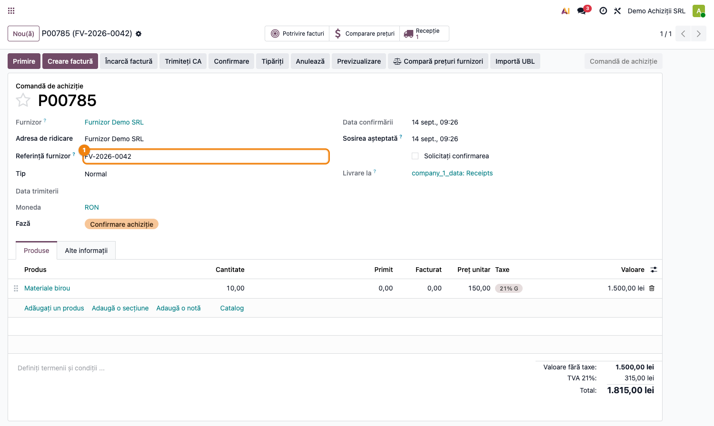
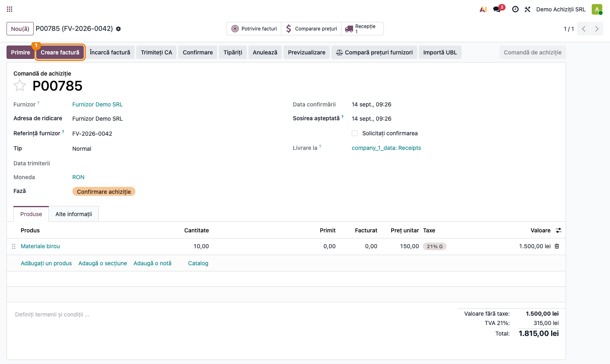
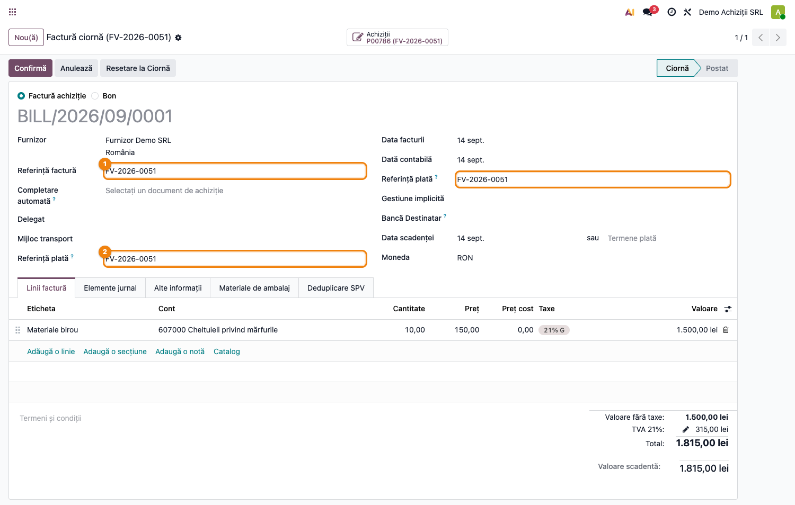

# Fișă Modul: Buton „Creează factură" pe comanda de achiziție

**Modul:** `deltatech_purchase_create_bill_button`
**Utilizator principal:** Operator achiziții, Contabil furnizori
**Prioritate:** 🟡 Medie (comoditate operațională, nu blochează fluxul fără el)

---

## 1. Scop business

În Odoo 19, butonul clasic „Creează factură" de pe comanda de achiziție a fost înlocuit cu un
widget de încărcare fișier („Upload Bill"), care cere atașarea unei facturi scanate/PDF înainte
de a putea genera factura furnizorului. Pentru operatorii care introduc facturile manual, fără
document scanat, acest lucru înseamnă un pas suplimentar inutil.

Modulul `deltatech_purchase_create_bill_button` readuce butonul „Creează factură" într-un singur
clic, exact ca în Odoo 18, alături de widget-ul de încărcare (nu îl înlocuiește, îl completează).
În plus, restaurează copierea automată a „Referinței furnizorului" de pe comanda de achiziție în
câmpurile „Referință" și „Referință plată" ale facturii generate — comportament care exista în
Odoo 18 și a fost eliminat în 19.

## 2. Bază legală și context

Nu există temei legal specific — este o restaurare de comportament UI/operațional (funcționalitate
prezentă în Odoo 18, eliminată în Odoo 19). Referința furnizorului corect copiată pe factură
ajută însă la reconcilierea plăților și la corelarea cu documentul furnizorului la control.

## 3. Utilizatori și roluri

Operator achiziții, Contabil furnizori.

Roluri recomandate pentru testare:
- Administrator funcțional: instalează modulul și verifică apariția butonului
- Utilizator operațional (achiziții): confirmă o comandă și creează factura din buton
- Contabil: verifică referința furnizorului și referința de plată pe factura generată

## 4. Conturi și date implicate

Modulul nu introduce conturi noi — factura generată folosește contabilizarea standard de
achiziții (jurnalul de cumpărări, contul de furnizor 401 și conturile de cheltuieli/stoc de pe
liniile comenzii, conform configurării standard Odoo).

Date minime pentru demo:
- companie cu modulul `purchase` instalat
- un furnizor (partener) cu o „Referință furnizor" completată pe comanda de achiziție
- un produs (consumabil sau stocabil) cu preț
- o comandă de achiziție confirmată (stare „Comandă de achiziție")

## 5. Configurare inițială

1. Instalați modulul `deltatech_purchase_create_bill_button` pe baza demo.
2. Nu sunt necesare configurări suplimentare — modulul nu adaugă meniuri, setări sau grupuri de
   acces noi.
3. Pregătiți o comandă de achiziție cu câmpul „Referință furnizor" completat, pentru a putea
   verifica ulterior copierea acestuia pe factură.
4. Confirmați comanda de achiziție (starea trebuie să fie „Comandă de achiziție", nu ciornă).

## 6. Flux de utilizare

### Pasul 1 — Confirmarea comenzii de achiziție

Accesați **Achiziții → Comenzi → Comenzi de achiziție**, deschideți o comandă și completați
„Referință furnizor" (ex. numărul facturii/avizului furnizorului). Apăsați **Confirmă comanda**.



### Pasul 2 — Butonul „Creează factură"

După confirmare, în bara de sus a comenzii apare butonul **Creează factură** (`action_create_invoice`),
poziționat lângă widget-ul de încărcare a facturii furnizorului, și evidențiat vizual (culoare
primară) pentru a fi ușor de identificat. Butonul este vizibil doar cât timp comanda este în starea
„Comandă de achiziție" și mai are ceva de facturat (`invoice_status = "to invoice"`).



Apăsați butonul — factura furnizorului se creează direct, fără să fie nevoie de niciun fișier
atașat, exact ca în Odoo 18.

### Pasul 3 — Verificarea facturii generate

Deschideți factura creată (din tabul **Facturi** al comenzii sau din **Contabilitate → Furnizori →
Facturi**). Câmpurile **Referință** și **Referință plată** sunt precompletate automat cu valoarea
„Referință furnizor" de pe comanda de achiziție.



### Note de monografie și raportare

- Modulul nu modifică notele contabile ale facturii — folosește contabilizarea standard generată
  de `purchase`/`account` (Dr cheltuieli/stoc + Dr 4426 TVA deductibilă = Cr 401 furnizor, conform
  configurării jurnalului și taxelor de pe linii).
- Singura modificare de date este la nivel de valori implicite ale facturii: `ref` și
  `payment_reference` preiau `partner_ref` de pe comanda de achiziție (dacă acesta lipsește,
  câmpurile rămân goale, nu se completează cu o valoare implicită).

## 7. Legături cu alte module / declarații

| Modul / proces | Rol în flux | Tip legătură |
|---|---|---|
| `purchase` | comanda de achiziție, widget-ul de încărcare a facturii, generarea facturii | dependență (manifest) |
| `account` | factura furnizorului și contabilizarea acesteia | folosit indirect prin `purchase` |

Ce este automat: apariția butonului „Creează factură" și copierea referinței furnizorului pe
factura generată.
Ce rămâne manual: verificarea sumelor, a taxelor și a contului contabil pe linia facturii, ca la
orice factură generată din achiziții.

## 8. Verificări pentru consultant

- [ ] Modulul se instalează fără erori pe baza demo (depinde doar de `purchase`).
- [ ] Butonul „Creează factură" apare pe comanda de achiziție confirmată, lângă widget-ul de
      încărcare a facturii, și este vizual evidențiat.
- [ ] Butonul dispare/rămâne ascuns dacă și doar dacă starea comenzii nu este „Comandă de
      achiziție" sau nu mai este nimic de facturat (`invoice_status != "to invoice"`).
- [ ] Apăsarea butonului creează factura fără să ceară un fișier atașat.
- [ ] Câmpurile „Referință" și „Referință plată" ale facturii preiau „Referință furnizor" de pe
      comandă.
- [ ] Dacă „Referință furnizor" lipsește pe comandă, câmpurile facturii rămân goale (nu apare o
      valoare implicită eronată).
- [ ] Widget-ul original de încărcare a facturii ("Upload Bill") rămâne funcțional, neschimbat.

## 9. Mesaje de eroare frecvente

| Mesaj / simptom | Cauză probabilă | Remediere |
|-----------------|-----------------|-----------|
| Butonul „Creează factură" nu apare deloc | Comanda nu este confirmată sau nu mai are nimic de facturat | Confirmați comanda și verificați câmpul „Stare facturare" (`invoice_status`) |
| Referința furnizorului nu apare pe factură | Câmpul „Referință furnizor" nu era completat pe comanda de achiziție înainte de creare | Completați „Referință furnizor" pe comandă înainte de a apăsa „Creează factură" |
| Butonul rămâne vizibil deși factura a fost deja creată integral | Mai există linii nefacturate pe comandă (livrări/cantități suplimentare) | Verificați liniile comenzii și cantitățile facturate față de comandate |

## 10. Capturi de ecran

Capturile (`readme/screenshots/`) sunt **generate automat** din `tests/test_screenshots.py`
(mixinul `ScreenshotCase` din `l10n_ro_doc_screenshots`, import defensiv), în limba română:

1. `01_comanda_confirmata.png` — comanda de achiziție confirmată, cu „Referință furnizor" completată.
2. `02_buton_creare_factura.png` — butonul „Creează factură" evidențiat, lângă widget-ul de încărcare.
3. `03_factura_generata.png` — factura generată, cu „Referință" și „Referință plată" preluate.

Regenerare:

```bash
./odoo/odoo-bin -c odoo.conf -d <db> -u deltatech_purchase_create_bill_button \
    --test-tags=fise_screenshots --stop-after-init
```

## 11. Observații pentru manual

În manualul final, prezentați acest modul ca o restaurare de comoditate: butonul „Creează
factură" într-un clic, fără fișier obligatoriu, plus preluarea automată a referinței
furnizorului pe factură — utile mai ales operatorilor care introduc facturile manual, fără
documente scanate.
