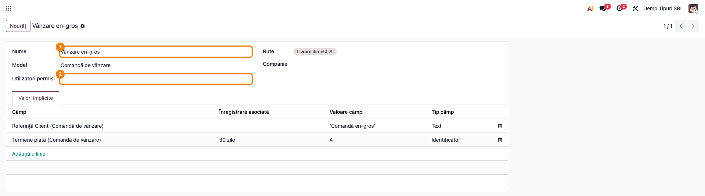
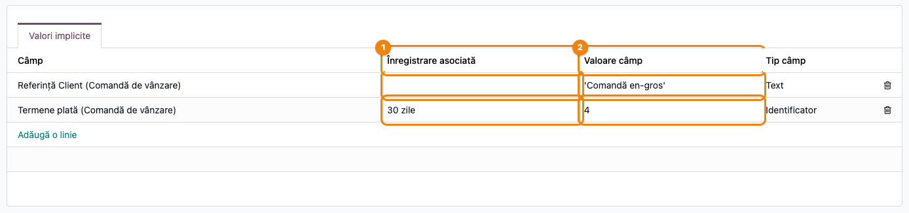
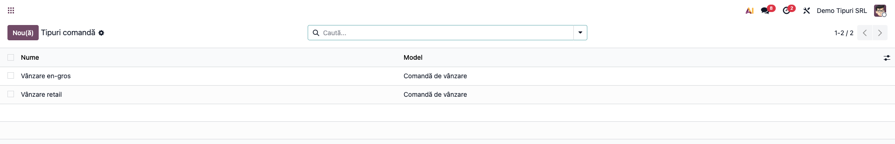
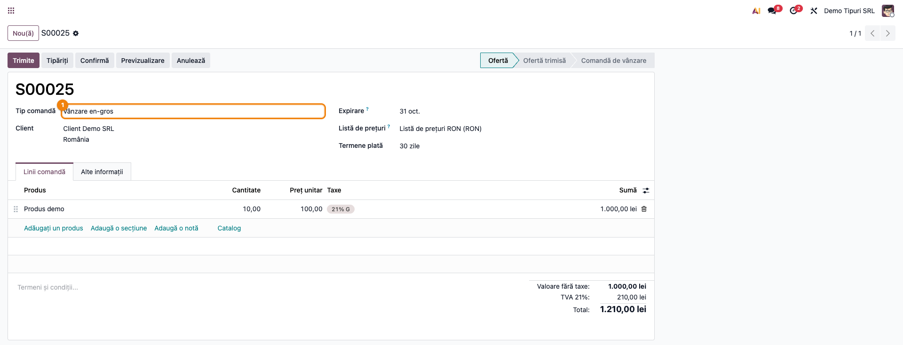
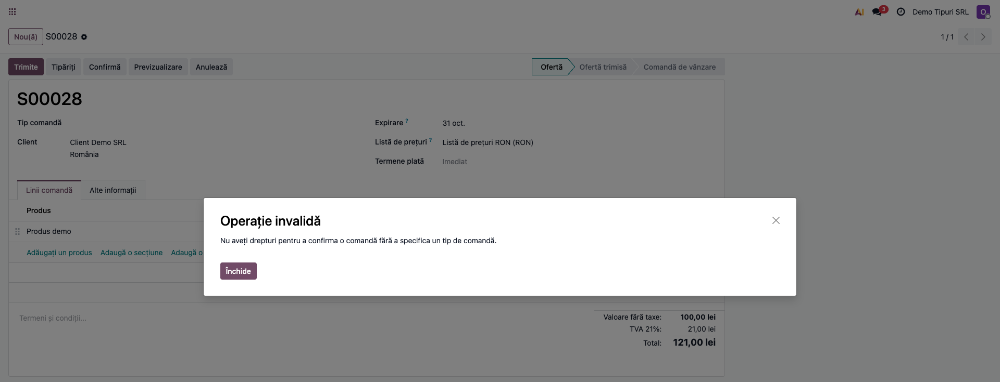
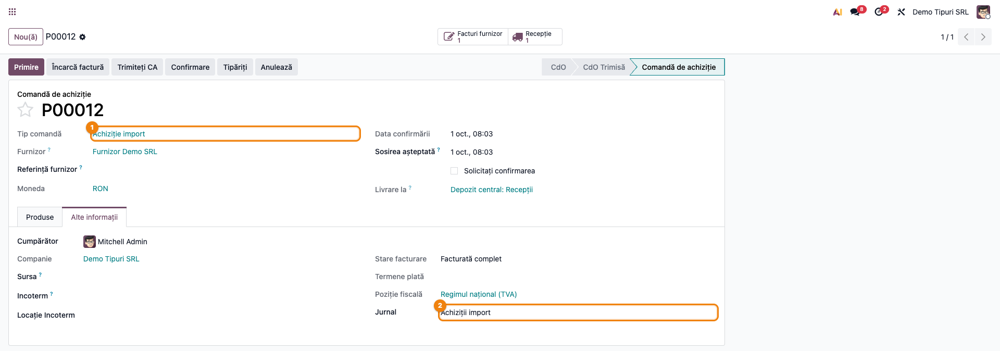
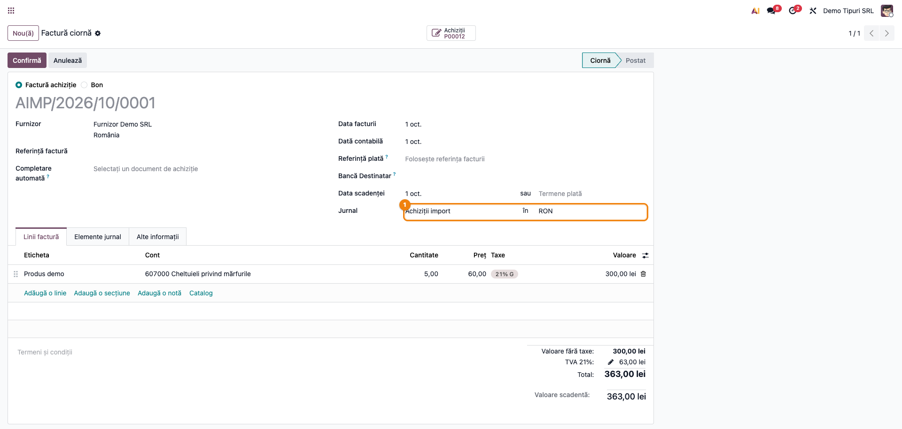
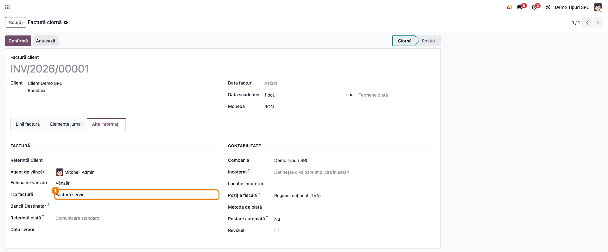
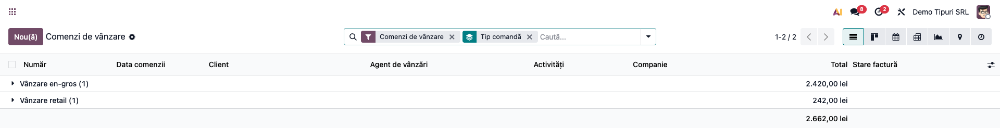

# Fișă Modul: Tipuri de documente (comenzi de vânzare, comenzi de achiziție, facturi)

**Modul:** `deltatech_record_type`
**Utilizator principal:** Administrator funcțional, Responsabil vânzări/achiziții, Contabil
**Prioritate:** 🟡 Medie (clasificare și automatizare de introducere; nu generează note contabile proprii)

---

## 1. Scop business

Modulul permite companiei să împartă **comenzile de vânzare, comenzile de achiziție și facturile** pe
**tipuri definite de ea** (de exemplu „Vânzare en-gros", „Vânzare retail", „Achiziție import",
„Factură servicii"). Pentru fiecare tip se pot stabili:

- **cine are voie să-l folosească** (lista de utilizatori permiși);
- **valori implicite** care se completează automat pe document la alegerea tipului (depozit, jurnal,
  termen de plată, echipa de vânzări etc.);
- **rutele de stoc** aplicate liniilor comenzii de vânzare (de exemplu livrare directă de la furnizor);
- **obligativitatea tipului** la confirmarea comenzilor de vânzare și de achiziție, pentru utilizatorii
  fără dreptul de excepție (pe facturi tipul rămâne opțional).

Rezultatul: mai puține erori de completare, rapoarte și filtre pe tip și un circuit diferit de
procesare pentru fiecare tip de comandă, fără personalizări separate.

## 2. Bază legală și context

Modulul nu are o bază legală proprie: este un instrument de organizare internă. Tipul documentului
**nu modifică** conținutul fiscal al facturii și nu generează note contabile. Contextul operațional:
companiile care trebuie să trateze diferit canalele de vânzare sau categoriile de achiziții, păstrând
în același timp o singură instanță Odoo.

## 3. Utilizatori și roluri

- **Administrator funcțional** — definește tipurile, valorile implicite, rutele și utilizatorii permiși.
- **Operator vânzări / achiziții / facturare** — alege tipul la crearea documentului.
- **Manager** — filtrează și grupează documentele pe tip; hotărăște cine poate confirma fără tip.

Roluri de test recomandate: un administrator și doi operatori, dintre care unul **nu** este în grupul
„Poate confirma comenzi fără tip comandă", ca să se vadă blocarea la confirmare.

## 4. Conturi și date implicate

Modulul **nu folosește conturi contabile** și nu generează note contabile. Datele implicate:

- tipurile de înregistrări (`record.type`): nume, document vizat, utilizatori permiși, rute, companie;
- valorile implicite ale fiecărui tip (câmp, valoare, tip de valoare);
- câmpurile noi de pe documente: **Tip comandă** (Order Type) pe comanda de vânzare și pe cea de achiziție,
  **Tip factură** (Invoice Type) pe factură; **Jurnal** pe comanda de achiziție.

Date minime pentru demo: cel puțin un tip pentru fiecare document (vânzare, achiziție, factură), un
client, un furnizor, un produs, doi utilizatori interni și, pentru jurnalul pe factura de furnizor, un
al doilea jurnal de achiziții (de exemplu „Achiziții import").

## 5. Configurare inițială

1. Instalați modulul `deltatech_record_type` (atrage `sale`, `sale_stock` și `purchase`).
2. **Setări → Vânzări → Oferte și Comenzi**, opțiunea **„Confirmat fără tip comandă"**
   (Confirmed without record type):
   - **bifată** = toți utilizatorii interni pot confirma comenzi fără tip;
   - **debifată** = doar membrii grupului „Poate confirma comenzi fără tip comandă" pot confirma fără tip.

   După instalare, grupul de excepție îl au doar administratorul și utilizatorul de sistem, deci
   **imediat ce definiți un tip, toți ceilalți utilizatori trebuie să aleagă tipul** la confirmare.
   Acordați grupul doar celor care au nevoie de excepție.
3. Definiți tipurile necesare (vezi Pasul 1). Un document afișează câmpul de tip **doar dacă există
   cel puțin un tip definit pentru el**.
4. Dacă folosiți rute de stoc pe tip, activați **Setări → Inventar → Trasee în mai mulți pași**
   (grupul „Gestionare procese de tragere și împingere stoc") — câmpul **Rute** (Routes) apare numai atunci.

## 6. Flux de utilizare

### Pasul 1 — Definirea unui tip de comandă de vânzare

**Vânzări → Configurare → Tipuri comandă** → **Nou**. Completați **Nume** (de exemplu „Vânzare en-gros"),
lăsați **Model** = *Comandă de vânzare* (este completat automat când deschideți lista din acest meniu),
alegeți eventual **Utilizatori permiși** (Allowed Users; lăsat gol = tipul este disponibil tuturor;
restricția se aplică **doar pe comanda de vânzare**, nu și pe achiziții sau facturi), **Rute** (Routes)
și **Companie** (Company; gol = toate companiile).

> **Nu schimbați Model după creare.** Valorile implicite sunt legate de câmpurile modelului ales: dacă
> schimbați *Comandă de vânzare* în *Comandă de achiziție* sau *Factură*, liniile existente rămân pe
> câmpuri ale vechiului model: la alegerea tipului dau eroare sau, dacă noul document are un câmp cu
> același nume tehnic, îl completează fără să fie evident. Pentru alt document creați un tip nou.



Pe tab-ul **Valori implicite** adăugați câte o linie pentru fiecare câmp care trebuie precompletat:
alegeți **Câmp** (de exemplu *Referință Client* sau *Termene plată*) și completați **Valoare câmp**. Reguli:

- **text și selecții** se scriu **între apostrofuri**, de exemplu `'Comandă en-gros'`: valoarea este
  evaluată ca expresie, iar text scris fără apostrofuri provoacă eroare la alegerea tipului;
- **bife** se scriu `True` sau `False`;
- **numerele** se scriu fără apostrofuri, de exemplu `5`;
- **câmpuri relaționale** (client, termen de plată, depozit, jurnal) se aleg din coloana **Înregistrare
  asociată** (Related); **Valoare câmp** devine identificatorul înregistrării. La alegerea câmpului, Odoo
  precompletează prima înregistrare găsită — verificați-o și schimbați-o dacă nu e cea dorită.

Coloana **Tip câmp** se completează automat la alegerea câmpului, după tipul acestuia:

| Tipul câmpului ales | Tip câmp | Cum se scrie Valoare câmp |
|---|---|---|
| relațional simplu (many2one: client, termen de plată, jurnal, depozit) | *Identificator* (Id) | se alege din **Înregistrare asociată** |
| text scurt (char) | *Text* (Char) | între apostrofuri: `'Comandă en-gros'` |
| selecție (selection) | *Text* (Char) | cheia tehnică a opțiunii, între apostrofuri: `'direct'` |
| număr întreg (integer) | *Text* (Char) | fără apostrofuri: `5` |
| bifă (boolean) | *Bifă* (Boolean) | `True` sau `False` |

Pentru câmpurile **zecimale, monetare, dată, dată-oră și text lung** (float, monetary, date, datetime,
text), **Tip câmp nu se schimbă automat** (rămâne valoarea anterioară, implicit *Text*): verificați-l
manual și scrieți valoarea ca expresie (număr fără apostrofuri, `12.5`; dată între apostrofuri,
`'2026-12-31'`). Câmpurile **multiple** (many2many, one2many — de exemplu etichete sau linii) **nu se pot
folosi**: **Înregistrare asociată** alege o singură înregistrare, iar valoarea rezultată nu este
acceptată de aceste câmpuri.



Tipurile pentru **achiziții** se definesc la **Achiziții → Configurare → Tipuri comandă**, iar cele pentru
**facturi** la **Contabilitate → Configurare → Facturare → Tipuri factură**. Ecranul este același; diferă
doar documentul vizat.



### Pasul 2 — Alegerea tipului pe comanda de vânzare

**Vânzări → Comenzi → Oferte → Nou**. În formular apare câmpul **Tip comandă**, înaintea clientului.
Sunt oferite doar tipurile pentru comenzi de vânzare la care utilizatorul curent este permis (sau tipurile
fără restricție de utilizatori). La alegerea tipului, valorile implicite definite se aplică automat pe
comandă. Câmpul devine needitabil după confirmare sau anulare.



Modulul face vizibil pe formularul comenzii de vânzare și câmpul **Jurnal** (jurnalul facturii), în
tab-ul **Alte informații**, grupul **Facturare**.

### Pasul 3 — Confirmarea comenzii și blocarea fără tip

La **Confirmare**, dacă utilizatorul **nu** are grupul „Poate confirma comenzi fără tip comandă", există
tipuri definite pentru vânzări și comanda nu are tip, confirmarea este refuzată cu mesajul *„Nu aveți drepturi
pentru a confirma o comandă fără a specifica un tip de comandă."* (în engleză: *You do not have the rights to
confirm an order without specifying an Order Type.*). Comenzile primite de pe
**website** nu sunt blocate (dacă folosiți magazinul online Odoo): excepția se face după câmpul
*Website* al comenzii.

> **Oferte acceptate din portal.** Blocarea se aplică doar utilizatorilor **interni**. O ofertă fără tip
> pe care clientul o acceptă/semnează sau o plătește online din portal se confirmă normal: Odoo o confirmă
> în numele clientului (utilizator de portal sau public), iar verificarea tipului nu se face. Comanda
> rămâne fără tip; dacă tipul contează pentru raportare, alegeți-l pe ofertă înainte de trimitere.

La confirmare, dacă linia comenzii nu
are o rută proprie, aprovizionarea folosește **rutele tipului**; câmpul de rută de pe linie rămâne
gol, efectul se vede pe transferurile generate.



### Pasul 4 — Tipul pe comanda de achiziție

**Achiziții → Comenzi → Cereri de ofertă → Nou**. Câmpul **Tip comandă** apare înaintea furnizorului,
iar câmpul **Jurnal** în tab-ul **Alte informații**, după **Poziție fiscală**. Lista tipurilor **nu este
filtrată** după utilizatorii permiși. Tipul se poate schimba doar cât comanda este **ciornă**: după trimiterea
cererii de ofertă nu mai este editabil. Regula de confirmare este aceeași ca la vânzări, dar **fără excepția
pentru website**.

**Jurnalul facturii de furnizor.** Câmpul **Jurnal** se poate completa manual sau din valorile implicite ale
tipului (în exemplu, tipul „Achiziție import" are valoarea implicită *Jurnal* = „Achiziții import"). La
**Creare factură** din comandă, factura de furnizor se emite **în jurnalul comenzii**, nu în primul jurnal de
achiziții al companiei; numerotarea urmează secvența acelui jurnal (în exemplu `AIMP/…`). Dacă **Jurnal** este
gol, factura folosește jurnalul de achiziții implicit.





### Pasul 5 — Tipul pe factură

**Contabilitate → Clienți → Facturi → Nou**: câmpul **Tip factură** (Invoice Type) apare în tab-ul
**Alte informații**, grupul **Factură**, după **Echipa de vânzări**, și se poate edita doar în starea
**ciornă**. Pe factură tipul este **opțional**: postarea nu verifică dacă a fost ales. Câmpul există doar pe **facturile și
notele de credit de client**, nu și pe facturile de furnizor. La alegerea tipului se aplică valorile
implicite ale acestuia pe factură. Tipul **nu se copiază automat** din comanda de vânzare pe factură:
se alege pe factură, separat.



### Pasul 6 — Filtrare, grupare și analiză

În lista comenzilor de vânzare, coloana **Tip comandă** este disponibilă opțional (la fel în listele de achiziții și de facturi),
iar în căutare apar câmpul de căutare **Tip comandă** și gruparea **Tip comandă**. Rapoartele de
vânzări și de achiziții expun tipul ca dimensiune: se poate grupa după el prin **Grup personalizat**.



### Note de monografie și raportare

Modulul **nu generează note contabile proprii**. Notele generate la facturare, livrare sau recepție
rămân cele ale modulelor standard; tipul este doar o etichetă de clasificare și o sursă de valori
implicite. Dacă valorile implicite completează **jurnalul** sau **poziția fiscală**, efectul contabil
vine din acele câmpuri, nu din modul.

## 7. Legături cu alte module / declarații

| Modul | Rol |
|---|---|
| `sale` | Câmpul **Tip comandă**, blocarea la confirmare, filtre și coloane |
| `sale_stock` | Rutele tipului se aplică liniilor comenzii de vânzare |
| `purchase` | Câmpurile **Tip comandă** și **Jurnal** pe comanda de achiziție; jurnalul comenzii se transmite facturii de furnizor (`_prepare_invoice`) |
| `account` | Câmpul **Tip factură** pe factură; factura de furnizor generată din comandă primește jurnalul comenzii |

**Ce e automat:** completarea valorilor implicite la alegerea tipului (inclusiv jurnalul comenzii de achiziție,
dacă e definit ca valoare implicită); aplicarea rutelor tipului la aprovizionarea liniilor de vânzare;
emiterea facturii de furnizor în jurnalul comenzii de achiziție; blocarea confirmării comenzilor fără tip.
**Ce rămâne manual:** definirea tipurilor și a valorilor implicite; alegerea tipului pe fiecare
document; alegerea tipului pe factură (nu se preia din comandă).

Modulul nu are legătură cu declarațiile ANAF.

## 8. Verificări pentru consultant

- [ ] Există cel puțin un tip pentru fiecare document folosit (vânzare, achiziție, factură); altfel
  câmpul nu apare.
- [ ] Pe o comandă nouă, la alegerea tipului se aplică valorile implicite definite.
- [ ] Pe comanda de vânzare, un utilizator din lista **Utilizatori permiși** vede tipul; un utilizator
  neinclus **nu** îl vede (pe achiziții și facturi lista nu filtrează).
- [ ] Un utilizator fără grupul de excepție **nu poate confirma** o comandă fără tip; cu grupul, poate.
- [ ] La confirmare, transferurile generate urmează ruta tipului pentru liniile fără rută proprie.
- [ ] Cu două jurnale de achiziții, jurnalul ales pe comanda de achiziție (manual sau din tip) ajunge pe
  factura de furnizor generată cu **Creare factură**, iar numărul facturii urmează secvența acelui jurnal.
- [ ] O ofertă fără tip, acceptată/semnată sau plătită de client în portal, se confirmă fără eroare
  (verificarea tipului se aplică doar utilizatorilor interni — vezi §6 Pasul 3).
- [ ] Tipul nu se poate modifica după confirmare (vânzare) sau după ce comanda iese din ciornă (achiziție).
- [ ] Tipurile cu **Companie** completată nu se văd din altă companie, când aceasta nu e activă în selectorul de companii.

## 9. Mesaje de eroare frecvente

| Mesaj | Cauză | Remediere |
|---|---|---|
| *Nu aveți drepturi pentru a confirma o comandă fără a specifica un tip de comandă.* (EN: *You do not have the rights to confirm an order without specifying an Order Type.*) | Există tipuri pentru document, comanda nu are tip, iar utilizatorul nu are grupul de excepție | Alegeți tipul pe comandă sau acordați grupul „Poate confirma comenzi fără tip comandă" |
| Utilizatorul nu poate alege niciun tip și nici nu poate confirma | Toate tipurile de vânzare sunt restrânse la alți utilizatori, iar el nu are grupul de excepție | Adăugați-l la **Utilizatori permiși** sau acordați grupul de excepție |
| Câmpul **Tip comandă** / **Tip factură** nu apare | Nu există niciun tip definit pentru acel document | Creați un tip cu **Model** corespunzător |
| Tipul dorit nu apare în lista comenzii de vânzare | Utilizatorul nu este în **Utilizatori permiși**, sau tipul aparține altei companii | Adăugați utilizatorul sau corectați compania |
| Câmpul **Rute** nu apare pe tip | Grupul „Gestionare procese de tragere și împingere stoc" nu este activ | Activați **Trasee în mai mulți pași** în Setări → Inventar |
| Eroare la alegerea tipului, valorile implicite nu se aplică | Valoare de tip text scrisă fără apostrofuri (de exemplu `Comandă en-gros` în loc de `'Comandă en-gros'`) | Scrieți textul între apostrofuri; pentru câmpuri relaționale folosiți coloana **Înregistrare asociată** |
| Eroare la alegerea tipului după ce **Model** a fost schimbat | Valorile implicite indică încă câmpuri ale modelului vechi | Nu schimbați **Model** după creare: ștergeți liniile vechi sau creați un tip nou |
| Factura de furnizor apare în jurnalul de achiziții implicit, nu în cel dorit | **Jurnal** era gol pe comanda de achiziție la generarea facturii (tipul nu are jurnalul ca valoare implicită sau a fost ales după) | Completați **Jurnal** pe comandă înainte de **Creare factură**; pe factura ciornă jurnalul se poate schimba manual |

## 10. Capturi de ecran

Capturile sunt **generate automat**, în limba română, din `tests/test_screenshots.py` (mixinul
`ScreenshotCase` din `l10n_ro_doc_screenshots`, import defensiv; testul se sare dacă acesta lipsește),
pe o companie românească în RON (planul de conturi RO, deci necesită `l10n_ro`). Fișierele din
`readme/screenshots/`:

| Fișier | Descriere |
|---|---|
| `01_tip_vanzare_formular.png` | Formularul tipului de comandă de vânzare (nume, utilizatori permiși, rute) |
| `02_valori_implicite.png` | Doar tab-ul „Valori implicite", cu două linii; marcate coloanele „Înregistrare asociată" și „Valoare câmp" |
| `03_lista_tipuri.png` | Lista tipurilor de comandă de vânzare |
| `04_comanda_vanzare_tip.png` | Comandă de vânzare creată prin formular: la alegerea tipului, onchange-ul a aplicat termenul de plată și referința clientului |
| `05_blocare_confirmare.png` | Mesajul de blocare la confirmarea fără tip, văzut de un utilizator fără drept de excepție |
| `06_comanda_achizitie_tip.png` | Comandă de achiziție confirmată, cu tipul „Achiziție import" și jurnalul „Achiziții import" venit din valorile implicite ale tipului (tab „Alte informații") |
| `07_factura_tip.png` | Factură de client cu tipul ales (tab „Alte informații") |
| `08_grupare_pe_tip.png` | Comenzi de vânzare grupate după tipul comenzii |
| `09_factura_furnizor_jurnal.png` | Factura de furnizor generată din comanda de achiziție, în jurnalul „Achiziții import" (număr `AIMP/…`) |

Comandă de regenerare (din rădăcina monorepo-ului, pe o bază nouă — cu `-i`, testele `post_install` rulează
doar pentru modulele instalate în acea rulare):

```bash
./odoo/odoo-bin -c odoo.conf -d <db> -i l10n_ro,deltatech_record_type,l10n_ro_doc_screenshots \
    --test-tags=fise_screenshots --stop-after-init
```

Fără `l10n_ro` instalat testul se sare tăcut („0 tests"); verificați în log că rulează 1 test.

## 11. Observații pentru manual

- Precizați clar că tipul este **clasificare + valori implicite + rute**, fără efect contabil direct.
- Precizați că valorile implicite se aplică **la alegerea tipului** (onchange), deci nu modifică
  documentele existente.
- Explicați regula de acces: fără grupul de excepție, tipul este **obligatoriu la confirmarea comenzilor
  de vânzare și de achiziție**, dacă există tipuri definite pentru documentul respectiv. **Pe facturi tipul
  rămâne opțional**: postarea facturii nu verifică tipul.
- Menționați excepția pentru portal (§6 Pasul 3): ofertele acceptate sau plătite de client din portal
  se confirmă și fără tip, dar rămân fără tip în rapoarte.
- Meniurile de configurare sunt restrânse la managerii aplicațiilor, dar drepturile de acces ale
  modelului dau citire, scriere, creare și ștergere oricărui utilizator intern: nu prezentați
  definirea tipurilor ca pe o operațiune sigură pentru oricine.
