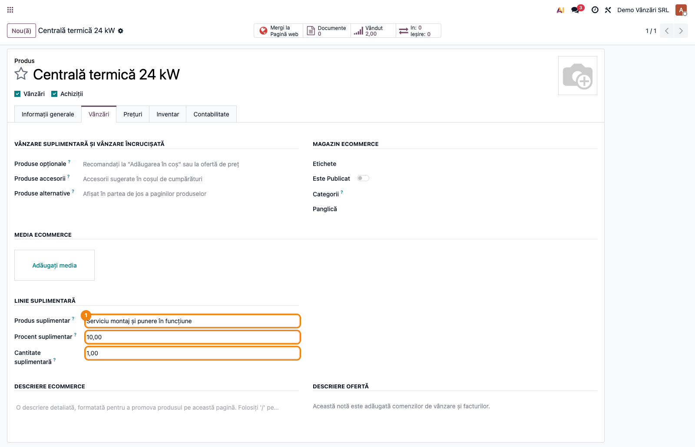
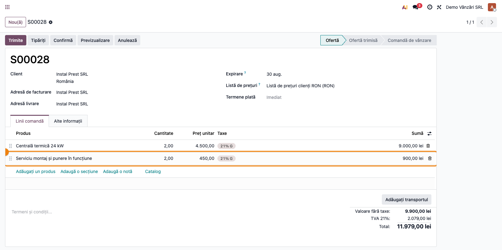
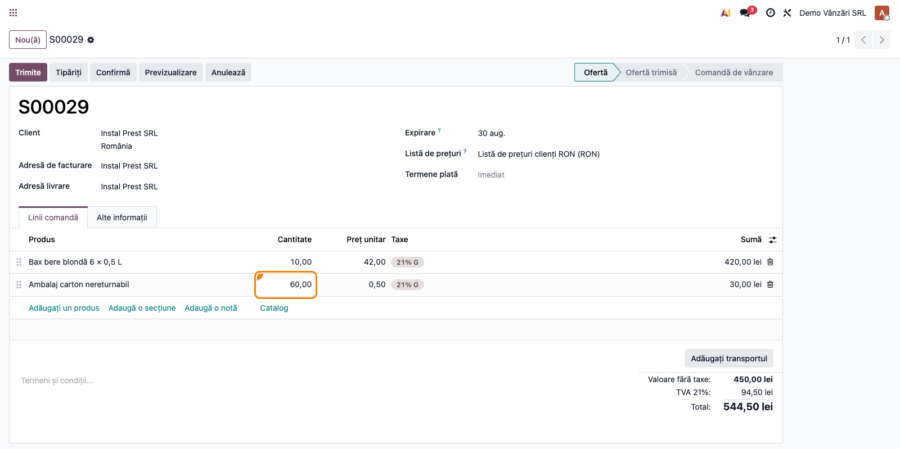
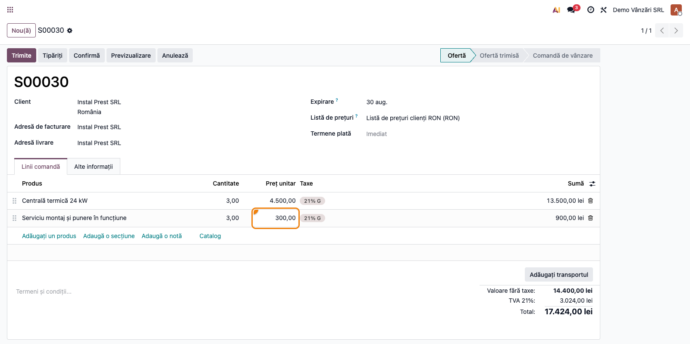
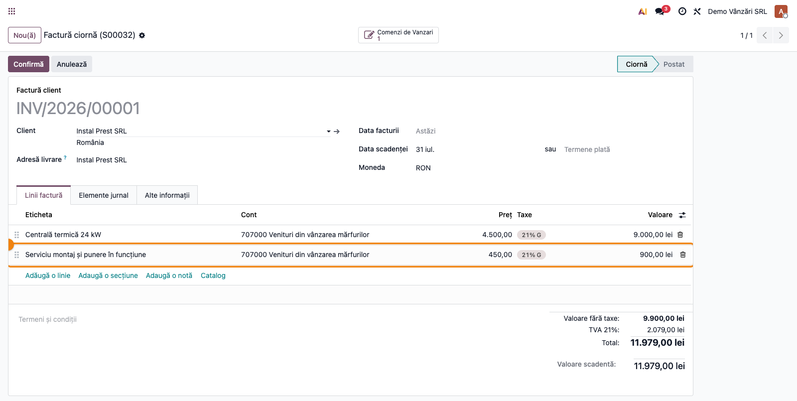

# Fișă Modul: Linie suplimentară automată pe comanda de vânzare

**Modul:** `deltatech_sale_add_extra_line`
**Utilizator principal:** Operator vânzări, responsabil date de bază produse
**Prioritate:** 🟡 Medie (obligatoriu unde produsul vândut atrage automat un al doilea produs: ambalaj, garanție, taxă, serviciu)

---

## 1. Scop business

Modulul rezolvă situația în care vânzarea unui produs atrage **întotdeauna** vânzarea unui al doilea
produs, pe care operatorul nu trebuie să-l uite și nu trebuie să-l calculeze manual: garanția de
ambalaj (SGR), timbrul de mediu, ambalajul nereturnabil, serviciul de montaj, prelungirea de garanție.
Consultantul configurează o singură dată produsul „extra" pe fișa produsului principal, iar la fiecare
comandă de vânzare linia suplimentară apare automat, cu cantitatea și prețul calculate din linia
principală.

Modulul nu adaugă meniuri, rapoarte sau note contabile proprii — este **infrastructură** pe comanda de
vânzare. Efectul contabil apare la facturarea comenzii, prin produsul extra.

## 2. Bază legală și context

Modulul nu are temei legal propriu; este un mecanism comercial. Baza legală vine din **cazul de
utilizare** pe care îl deservește:

| Caz de utilizare | Temei / context |
|---|---|
| Garanție ambalaje SGR | HG 1074/2021 (republicată) — stabilirea sistemului de garanție-returnare; **art. 315^5 alin. (2) Cod fiscal** — garanția percepută în cadrul SGR nu reprezintă contravaloarea unei livrări/prestări **în sfera TVA**. Fluxul complet este livrat de modulul `l10n_ro_sgr`, care folosește acest mecanism |
| Timbru verde / taxă de mediu | obligații de mediu pentru categoriile de produse vizate |
| Ambalaj nereturnabil, montaj, garanție extinsă | politică comercială proprie, fără temei legal; se vând cu TVA ca orice produs |

> Important: modulul **nu** decide regimul de TVA al produsului extra — el doar adaugă linia. Taxa se
> configurează pe produsul extra. Atenție la distincție: o **garanție SGR** este în **afara sferei
> TVA** (art. 315^5 alin. 2), în timp ce un **ambalaj nereturnabil** vândut clientului este o livrare
> normală, cu TVA 21%. Nu folosiți un exemplu cu TVA pentru garanția SGR.

## 3. Utilizatori și roluri

Responsabil date de bază produse (configurarea), operator vânzări (folosirea zilnică),
contabil facturare (verificarea liniei extra pe factură).

Roluri recomandate pentru testare:
- Administrator funcțional: instalează modulul și configurează produsele
- Utilizator operațional (Vânzări / Utilizator): creează comenzi și verifică linia automată
- Contabil/manager: validează linia extra pe factură și contul de venit folosit

## 4. Conturi și date implicate

Modulul nu impune conturi. Linia extra este o linie normală de comandă, deci la facturare folosește
**contul de venit al produsului extra**, luat din categoria lui de produs:

- `707` / `704` — venituri din vânzarea mărfurilor / prestări de servicii, după natura produsului extra;
- `4427` — TVA colectată, conform taxei setate pe produsul extra;
- `461.SGR` — doar în scenariul SGR, unde produsul extra este garanția de ambalaj (contul vine din
  configurarea făcută de `l10n_ro_sgr`, nu din acest modul). Atenție: este un **cont de creanță**
  (clasa 4), nu de venit — garanția nu se regăsește în veniturile din contul de profit și pierdere;
  se stinge la decontarea periodică cu administratorul SGR.

Date minime pentru demo (cele două scenarii folosite și în capturi):
- companie românească cu localizarea contabilă instalată și perioadă deschisă;
- **scenariul cu procent**: produs principal „Centrală termică 24 kW" (4.500 lei) + produs extra de tip
  serviciu „Serviciu montaj și punere în funcțiune", cu **Procent suplimentar = 10** și **Cantitate suplimentară = 1**;
- **scenariul cu multiplicator**: produs principal „Bax bere blondă 6 × 0,5 L" (42 lei) + produs extra
  „Ambalaj carton nereturnabil" (0,50 lei), cu **Procent suplimentar = 0** și **Cantitate suplimentară = 6**;
- un client și o listă de prețuri în RON.

## 5. Configurare inițială

1. Instalați modulul `deltatech_sale_add_extra_line` pe baza demo (dependențe: `sale`, `website_sale`, `stock`).
2. Creați produsul **extra** ca produs vandabil obișnuit, cu prețul de listă și taxa corecte.
3. Deschideți **produsul principal** și, în fila **Vânzări**, completați grupul **Linie suplimentară**:
   - **Produs suplimentar** — produsul care se adaugă automat;
   - **Procent suplimentar** — procentul din prețul liniei principale; lăsați **0** dacă produsul extra
     trebuie vândut la prețul lui propriu;
   - **Cantitate suplimentară** — multiplicatorul de cantitate (1 = o unitate extra pentru fiecare unitate vândută).
4. Verificați că utilizatorul de test are grupul **Vânzări / Utilizator** și acces la produse.
5. Pentru scenariul POS, instalați suplimentar `deltatech_sale_add_extra_line_pos`.

> Interfața este tradusă în română (`i18n/ro.po`): grupul apare ca **Linie suplimentară**, iar
> câmpurile ca **Produs suplimentar**, **Procent suplimentar** și **Cantitate suplimentară**.

## 6. Flux de utilizare

### Pasul 1 — Configurarea produsului principal

Accesați **Vânzări → Produse → Produse**, deschideți produsul principal și mergeți în fila
**Vânzări**, grupul **Linie suplimentară**. Completați produsul extra, procentul și multiplicatorul de
cantitate, apoi salvați.

În exemplul din captură, „Centrală termică 24 kW" are atașat „Serviciu montaj și punere în funcțiune",
cu **Procent suplimentar = 10** (montajul costă 10% din prețul centralei) și **Cantitate suplimentară = 1** (un montaj
pentru fiecare centrală vândută).



### Pasul 2 — Comanda de vânzare: linia extra apare automat

Accesați **Vânzări → Comenzi → Oferte → Nou**, alegeți clientul și adăugați produsul principal cu
cantitatea dorită. Imediat ce părăsiți linia, modulul inserează **a doua linie**, cu produsul extra,
poziționată direct sub linia principală.

Ce găsiți pe ecran și ce trebuie să verificați:
- linia extra are **cantitatea** = cantitatea liniei principale × **Cantitate suplimentară** — în captură,
  2 centrale → 2 montaje;
- linia extra are **prețul unitar** = prețul liniei principale × **Procent suplimentar** / 100 — în captură,
  450,00 lei, adică 10% din 4.500,00 lei;
- linia extra stă imediat sub linia principală (nu la finalul comenzii).



> Linia apare imediat în formular, dar există efectiv în bază **după salvarea comenzii** — este
> generată de mecanismul de recalculare al formularului. Nu o considerați pierdută dacă părăsiți
> comanda fără să salvați.

### Pasul 3 — Multiplicatorul de cantitate

Cantitatea liniei extra urmează întotdeauna linia principală, înmulțită cu **Cantitate suplimentară**. Captura
arată un al doilea produs, configurat pentru ambalaje: „Bax bere blondă 6 × 0,5 L", cu **Cantitate suplimentară = 6**
(șase ambalaje per bax) și **Procent suplimentar = 0**.

Verificați pe ecran:
- la **10 baxuri** vândute, linia extra are **60** de ambalaje — raportul este cel din **Cantitate suplimentară**;
- prețul ambalajului este **0,50 lei**, prețul propriu al produsului extra: cu **Procent suplimentar = 0**
  procentul nu se aplică, iar prețul vine din lista de prețuri a clientului;
- la orice modificare a cantității principale, cantitatea extra se recalculează în același raport.

> Exemplul folosește deliberat un **ambalaj nereturnabil**, care se vinde cu TVA 21% ca orice produs.
> Dacă produsul extra este o **garanție SGR**, valoarea ei este în afara sferei TVA (art. 315^5 alin. 2)
> și taxa de pe produsul extra trebuie configurată corespunzător — vezi modulul `l10n_ro_sgr`.



### Pasul 4 — Preț negociat manual pe linia extra

Sunt situații în care prețul calculat nu se potrivește și operatorul trebuie să impună un preț
negociat. Modificați **prețul unitar direct pe linia extra** și salvați.

De la versiunea **19.0.1.1.0** (modul livrat: 19.0.1.2.0), prețul introdus manual **rămâne**: nu mai este rescris de recalculul
automat. În captură, montajul a fost negociat la **300,00 lei** în loc de 450,00 lei, iar cantitatea
centralelor a fost apoi urcată la **3**.

Verificați pe ecran, după salvare:
- prețul liniei extra este cel introdus de dumneavoastră — 300,00 lei, nu 450,00 lei;
- **cantitatea** liniei extra s-a actualizat la 3, deci sincronizarea cantităților funcționează în
  continuare;
- același lucru se întâmplă la modificarea prețului liniei principale — procentul nu se mai aplică
  peste prețul negociat.

> Prețul manual funcționează **în ambele configurări**: și cu procent, și cu **Procent suplimentar = 0**. În
> al doilea caz modulul nu atinge deloc prețul liniei extra, iar recalcularea standard Odoo se oprește
> singură din momentul în care prețul a fost tastat de operator. Diferă doar modul de revenire la
> automat: cu procent, prin ștergerea liniei extra (pasul 5); fără procent, prețul revine la cel din
> lista de prețuri dacă schimbați produsul liniei sau ștergeți linia.



### Pasul 5 — Revenirea la prețul calculat automat

Dacă prețul negociat nu mai este valabil, **ștergeți linia extra** (coșul de la capătul liniei) și
modificați apoi orice pe linia principală. Modulul regenerează linia extra cu prețul calculat din
procent.

Verificați: linia reapărută are din nou prețul = procent × prețul liniei principale — în captură,
450,00 lei, adică 10% din 4.500,00 lei, în locul celor 300,00 lei negociați anterior.

> Capturile 4 și 5 sunt două oferte diferite, identice prin construcție (2 centrale): pe prima prețul
> negociat este încă în vigoare, pe a doua linia extra a fost ștearsă și regenerată. Comparați valorile
> din coloana **Preț unitar** a liniei de montaj: 300,00 lei în captura 4, 450,00 lei în captura 5.


> Ștergerea funcționează și în sens invers: dacă ștergeți **linia principală**, modulul șterge automat
> și linia extra asociată, ca să nu rămână orfană în comandă.

### Pasul 6 — Facturarea comenzii

Confirmați comanda și creați factura (**Creează factură**). Linia extra ajunge pe factură ca linie
normală, cu produsul, cantitatea și prețul din comandă.

Ce verificați pe factura ciornă, înainte de postare:
- linia extra este prezentă, cu prețul din comandă (450,00 lei) și valoarea corespunzătoare
  (900,00 lei pentru 2 montaje). Coloana **Cantitate** nu este afișată implicit pe liniile de factură;
  o puteți activa din selectorul de coloane (pictograma din capătul dreapta al capului de tabel);
- **contul** fiecărei linii — el vine din **categoria produsului**, nu din acest modul. În captură
  ambele linii merg pe `707000 Venituri din vânzarea mărfurilor`, pentru că produsul extra folosește
  categoria implicită; dacă montajul trebuie să meargă pe `704`, se schimbă categoria produsului extra
  (sau conturile ei), nu configurarea liniei extra;
- taxa aplicată este cea a produsului extra — relevant în scenariul SGR, unde garanția este exclusă
  din baza TVA, în timp ce produsul principal poartă TVA 21%.



### Note de monografie și raportare

Modulul nu generează note contabile proprii. La postarea facturii care conține linia extra, nota este
cea a unei facturi obișnuite de vânzare, cu produsul extra pe propriul cont de venit:

- **Dr 4111** (clienți) **= Cr 707/704** (venit produs principal) **+ Cr 707/704** (venit produs extra)
  **+ Cr 4427** (TVA colectată, pe cotele fiecărei linii);
- în scenariul **SGR**, linia extra creditează **461.SGR** (creanță față de administratorul SGR) cu o
  taxă de 0%, pentru că garanția este **în afara sferei TVA** (art. 315^5 alin. 2 Cod fiscal) — deci
  nu contribuie la 4427; configurarea vine din `l10n_ro_sgr`;
- în **D300** și **D394**, linia extra intră ca orice linie de factură, prin tag-urile taxei
  configurate pe produsul extra. Nu există tratament special și nici marcaj propriu al modulului.

## 7. Legături cu alte module / declarații

| Modul / proces | Rol în flux | Tip legătură |
|---|---|---|
| `sale` | comenzi de vânzare, liniile pe care se inserează linia extra | dependență (manifest) |
| `stock` | livrarea produsului extra, dacă este stocabil | dependență (manifest) |
| `website_sale` | coșul din e-commerce — linia extra se generează și la comenzile din magazinul online | dependență (manifest) |
| `deltatech_sale_add_extra_line_pos` | duce mecanismul în Punctul de vânzare (doar cantitatea) | modul separat, opțional |
| `deltatech_purchase_add_extra_line` | același mecanism pe comanda de achiziție | modul separat, independent |
| `l10n_ro_sgr` | folosește acest mecanism pentru garanția de ambalaj SGR | consumator |

Ce este automat: inserarea liniei extra, cantitatea (× **Cantitate suplimentară**), prețul (procent din linia
principală), ștergerea liniei extra împreună cu linia principală, păstrarea prețului introdus manual.

Ce rămâne manual: configurarea produsului extra și a taxei lui, verificarea liniei pe factură,
alegerea prețului atunci când procentul nu se potrivește.

**Limitări cunoscute în Odoo 19 — de comunicat clientului:**

1. **Automatismul are două declanșatoare: formularul comenzii și coșul din magazinul online.** În
   backend, linia extra apare la recalcularea formularului (`onchange` pe liniile comenzii); pe site,
   la fiecare actualizare a coșului. Comenzile create **pe alte căi** — import de fișier, XML-RPC/API,
   șabloane de ofertă, alte module care creează comenzi programatic — **nu primesc linia extra**.
   Acolo, linia trebuie generată explicit de modulul apelant (metoda `check_extra_product()` pe
   liniile comenzii). De verificat la fiecare integrare care creează comenzi automat.
2. **În coș, linia extra nu poate fi ștearsă de client.** Dacă cumpărătorul îi pune cantitatea 0, ea
   este regenerată imediat, la aceeași actualizare a coșului — atâta timp cât produsul principal
   rămâne în coș. Este comportamentul dorit (linia extra este obligatorie), dar merită comunicat: în
   magazinul online nu există calea de revenire la prețul calculat prin ștergerea liniei, ca în
   backend (pasul 5).
3. **În POS se sincronizează doar cantitatea.** Extensia de Punct de vânzare adaugă produsul extra și
   îi calculează cantitatea, dar **nu** aplică **Procent suplimentar** — linia extra ia prețul propriu al
   produsului. Pentru POS, configurați produsul extra la prețul dorit și lăsați procentul pe 0.
4. **Fără procent (Procent suplimentar = 0)**, prețul liniei extra este cel calculat standard de Odoo pentru
   produsul respectiv: se aplică lista de prețuri a clientului, valuta comenzii și unitatea de măsură.
   Până la versiunea 19.0.1.1.0 se folosea prețul de listă brut, care ignora lista de prețuri și valuta.

## 8. Verificări pentru consultant

- [ ] Modulul se instalează fără erori pe baza demo.
- [ ] Grupul **Linie suplimentară** este vizibil în fila **Vânzări** a produsului, pentru rolul de test.
- [ ] La adăugarea produsului principal în comandă, linia extra apare imediat, sub linia principală.
- [ ] Cantitatea liniei extra = cantitatea liniei principale × **Cantitate suplimentară**.
- [ ] Prețul liniei extra = prețul liniei principale × **Procent suplimentar** / 100.
- [ ] Cu **Procent suplimentar = 0**, prețul liniei extra respectă lista de prețuri și valuta comenzii.
- [ ] Un preț introdus manual pe linia extra rămâne după salvare și după modificarea cantității sau a
      prețului liniei principale.
- [ ] După ștergerea liniei extra, aceasta se regenerează cu prețul calculat automat.
- [ ] Ștergerea liniei principale șterge și linia extra asociată.
- [ ] Linia extra ajunge pe factură cu contul de venit și taxa produsului extra.
- [ ] Dacă produsul extra este o garanție SGR, taxa lui este în afara sferei TVA (nu 21%).
- [ ] Adăugarea produsului principal în coșul din magazinul online generează linia extra, iar
      modificarea cantității din coș o sincronizează.
- [ ] S-a comunicat clientului că linia extra se generează la editarea comenzii în interfață și în
      coșul din magazin — comenzile importate sau create prin API/alte module nu o primesc.
- [ ] S-a comunicat clientului că, în coș, linia extra reapare dacă cumpărătorul o șterge.

## 9. Mesaje de eroare frecvente

Modulul nu ridică mesaje de eroare proprii; problemele se manifestă ca **comportament lipsă**.

| Simptom | Cauză probabilă | Remediere |
|---|---|---|
| Linia extra nu apare în comandă | Produsul principal nu are **Produs suplimentar** completat, sau a fost completat pe altă variantă/șablon | Verificați fila **Vânzări → Linie suplimentară** pe șablonul produsului adăugat în comandă |
| Linia extra apare cu preț 0 | **Procent suplimentar = 0** și produsul extra nu are preț de listă (sau lista de prețuri a clientului îl aduce la 0) | Completați prețul produsului extra sau setați un procent |
| Prețul liniei extra nu se mai actualizează | Prețul a fost modificat manual pe linia extra — comportament dorit de la 19.0.1.1.0 | Ștergeți linia extra; se regenerează cu prețul calculat |
| Prețul introdus manual este rescris | Modul la o versiune anterioară lui 19.0.1.1.0 | Actualizați modulul; scriptul de migrare preia prețurile liniilor existente |
| Cantitatea liniei extra nu urmează linia principală | **Cantitate suplimentară** este 0 sau necompletat | Setați **Cantitate suplimentară** (implicit 1); valoarea 0 este tratată ca 1 |
| În coșul din site nu apare linia extra | Modul la o versiune anterioară lui 19.0.1.2.0 (se lega de `_cart_update`, metodă inexistentă în Odoo 19); sau produsul principal nu are **Produs suplimentar** completat | Actualizați modulul la 19.0.1.2.0 și verificați configurarea produsului |
| Linia extra ștearsă din coș reapare imediat | Comportament dorit — coșul resincronizează liniile la fiecare actualizare (limitarea 2 din secțiunea 7) | Nu este o eroare; dacă produsul extra nu trebuie vândut online, scoateți-l din configurarea produsului principal |
| În POS prețul liniei extra nu respectă procentul | Extensia POS sincronizează doar cantitatea | Configurați produsul extra la prețul final dorit, cu procentul pe 0 |

## 10. Capturi de ecran

Capturile (`readme/screenshots/`) sunt **generate automat** din `tests/test_screenshots.py`
(mixinul `ScreenshotCase` din `l10n_ro_doc_screenshots`, import defensiv), în **limba română**, pe
planul de conturi RO:

| # | Fișier | Conținut |
|---|--------|----------|
| 1 | `screenshots/01_configurare_produs.png` | Fila **Vânzări** a centralei termice, grupul **Linie suplimentară** (serviciu de montaj, 10%, multiplicator 1) |
| 2 | `screenshots/02_comanda_linie_extra.png` | Ofertă cu linia de montaj generată automat sub centrală (450,00 lei = 10% din 4.500,00 lei) |
| 3 | `screenshots/03_cantitate_sincronizata.png` | Multiplicator **Cantitate suplimentară = 6**: 10 baxuri de bere → 60 de ambalaje de carton la 0,50 lei |
| 4 | `screenshots/04_pret_manual.png` | Montaj negociat manual la 300,00 lei, păstrat după urcarea cantității la 3 |
| 5 | `screenshots/05_revenire_pret_calculat.png` | Linia extra regenerată după ștergere, cu prețul calculat (450,00 lei) |
| 6 | `screenshots/06_factura_linie_extra.png` | Factura ciornă cu linia de montaj preluată din comandă, pe contul de venit al produsului |

Regenerare (planul de conturi RO este necesar pentru conturile din captura facturii):

```bash
./odoo/odoo-bin -c odoo.conf -d <db> -i deltatech_sale_add_extra_line,l10n_ro,l10n_ro_doc_screenshots --test-tags=fise_screenshots --stop-after-init --http-port=8987 --gevent-port=8988
```

## 11. Observații pentru manual

În manualul final, păstrați explicația orientată pe activitatea utilizatorului: la ce servește linia
suplimentară, unde se configurează (o singură dată, pe fișa produsului), ce se întâmplă automat în
comandă și — cel mai important pentru operator — că **prețul poate fi negociat manual pe linia extra**
și că revenirea la prețul automat se face prin ștergerea liniei. Menționați explicit diferențele față
de backend: în **magazinul online** linia extra apare automat, dar nu poate fi ștearsă de cumpărător
(reapare la următoarea actualizare a coșului), iar în **POS** se sincronizează doar cantitatea, nu
procentul. Așa nu sunt descoperite de client în producție.
