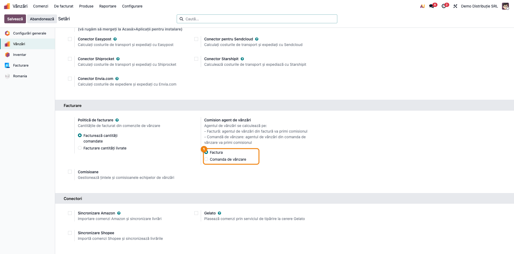
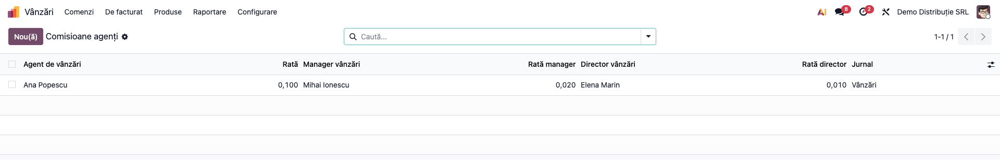
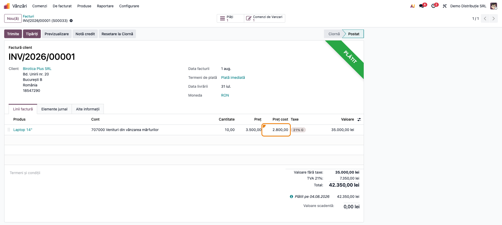
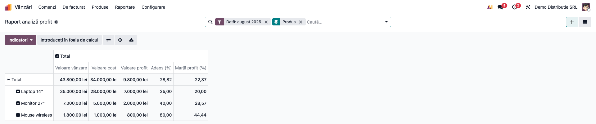
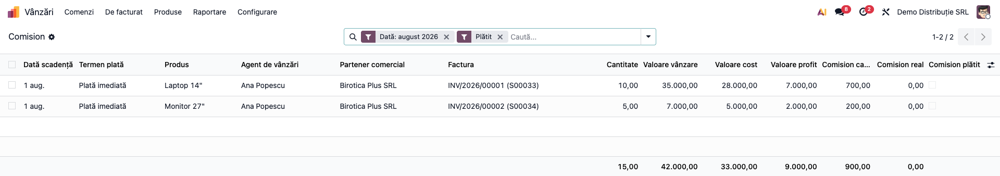
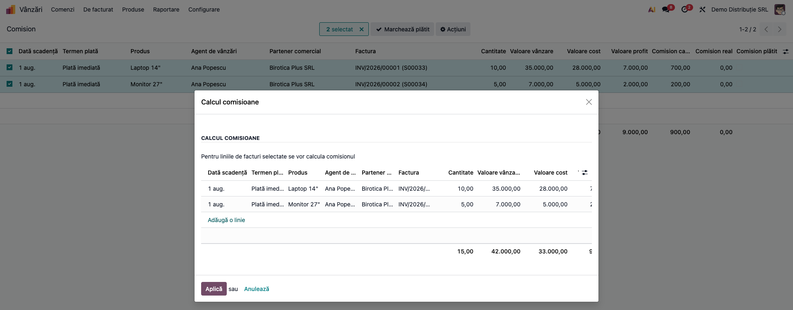
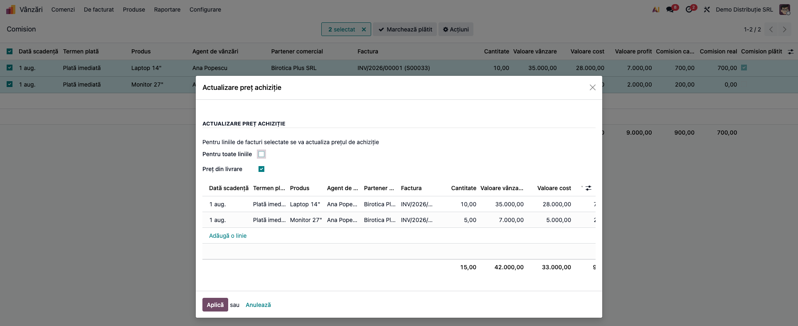

# Fișă Modul: Comisioane de vânzare calculate din profit, cu analiza profitabilității

**Modul:** `deltatech_sale_commission`
**Utilizator principal:** Manager de vânzări, responsabil salarizare / resurse umane, contabil
(analiza profitului)
**Prioritate:** 🟡 Medie (nu generează note contabile, dar stabilește suma plătită agenților)

---

## 1. Scop business

Firmele de distribuție își motivează agenții cu un comision, iar întrebarea e mereu aceeași: **din ce
se calculează și când se plătește?** Un comision pe valoarea vânzării îi încurajează pe agenți să vândă
cu discount mare; unul pe **profit** îi încurajează să vândă profitabil.

Modulul calculează comisionul **din profitul realizat pe fiecare linie de factură**: valoarea
vânzării minus costul real al mărfii livrate, adică **marja comercială brută**, fără alte cheltuieli.
Comisionul se acordă agentului. Pentru managerul și directorul lui se **calculează** informativ, fiecare
cu propriul procent. Poate fi condiționat de **încasarea la
timp** a facturii: dacă clientul plătește cu întârziere peste o limită, comisionul liniei devine 0.

În plus, modulul aduce:
- **raportul de analiză a profitului** pe produs, categorie, agent, client și perioadă, cu adaos și
  marjă;
- **costul pe linia facturii client**, luat din livrare;
- blocarea facturării sub cost, pentru companiile care au ales această politică în
  `deltatech_sale_margin`.

## 2. Bază legală și context

Modulul nu are o bază legală proprie și nu generează note contabile. Contextul:
- comisionul e un **calcul de gestiune**, stocat pe liniile facturilor. Plata lui se face în afara
  modulului, după natura relației cu agentul (vezi „Note de monografie”);
- profitul și costul se calculează în **moneda companiei**, fără TVA: vânzarea din valoarea netă a
  liniei, costul din valoarea mișcării de livrare.

## 3. Utilizatori și roluri

| Rol | Ce face | Drept Odoo |
|---|---|---|
| Manager de vânzări / responsabil comisioane | configurează procentele, calculează comisioanele, recalculează costul, le marchează plătite | grupul **Administrator comisioane** (nu e nevoie de un drept de facturare) |
| Utilizator care consultă | vede raportul de profit și lista comisioanelor, fără să le poată modifica | grupul **Vizualizare comisioane** |
| Contabil | citește raportul de analiză a profitului | **Vizualizare comisioane** |
| Agent de vânzări | vinde; nu are acces la comisioane | fără grupurile de comision |

Cele două grupuri nu le primește nimeni la instalare, **nici administratorul**. Până nu sunt
atribuite, meniurile *Comision* și *Raport analiză profit* nu apar nimănui.

**Atenție la „Vizualizare comisioane”:** raportul de profit arată costul și marja, deci ocolește
ascunderea costului din `deltatech_sale_margin`. Dați grupul doar celor care au voie să vadă costul.
Grupul doar citește: **Marchează plătit**, corectarea *Comision real* sau *Preț cost* și asistenții
**Calcul comisioane** și **Actualizare preț achiziție** sunt rezervate grupului **Administrator
comisioane**.

Costul de pe factură e vizibil doar grupului **Show purchase price on sale order lines and customer
invoice** din `deltatech_sale_margin` (vezi fișa acelui modul).

Roluri recomandate la testare: un utilizator cu **Administrator comisioane** și **Vânzări /
Utilizator**, fără drept de facturare, pentru fluxul complet; un utilizator cu **Vizualizare
comisioane**, ca să verificați că poate consulta, dar nu poate marca plata sau rula asistenții; un
agent cu **Vânzări / Utilizator**, ca să verificați că nu vede comisioanele.

## 4. Conturi și date implicate

Modulul nu atinge conturi. Datele pe care se bazează:

| Date | Unde | Rol |
|---|---|---|
| Comisioane agenți | *Vânzări → Configurare → Comisioane agenți* | procentul agentului, al managerului și al directorului, pe jurnal de vânzări (obligatoriu, un singur rând pe agent și jurnal) |
| Agentul de vânzări | factura (*Agent de vânzări*) sau comanda de vânzare, după setare | cui îi revine comisionul |
| Costul liniei (*Preț cost*) | linia facturii client | calculat din livrare; baza profitului |
| Plata facturii și scadența | factura | condiția de încasare la timp |
| Parametrul `deltatech_sale_commission.days_for_commission` | *Setări → Tehnic → Parametri sistem* | numărul maxim de zile de întârziere a încasării (0 = cel târziu la scadență) |

Date minime pentru demo (folosite și în capturi):
- Companie **Demo Distribuție SRL**, plan de conturi RO, RON; produse în categoria *IT & periferice*,
  cost FIFO.
- Agenta **Ana Popescu**: comision **10 %** din profit, cu manager **Mihai Ionescu** (2 %) și director
  **Elena Marin** (1 %), pe jurnalul **Vânzări**.
- Parametrul `days_for_commission` = **10** zile.
- Trei facturi din luna trecută, către **Birotica Plus SRL**, cu plată imediată (scadența = data
  facturii):

  | Factură | Produs | Vânzare | Cost | Profit | Comision calculat | Încasare | Comision real |
  |---|---|---|---|---|---|---|---|
  | INV/…/00001 | 10 × Laptop 14" | 35.000 | 28.000 | 7.000 | 700 | la 3 zile după scadență | **700** |
  | INV/…/00002 | 5 × Monitor 27" | 7.000 | 5.000 | 2.000 | 200 | la 20 de zile după scadență | **0** |
  | INV/…/00003 | 20 × Mouse wireless | 1.800 | 1.000 | 800 | 80 | neîncasată | **0** |

## 5. Configurare inițială

1. Instalați `deltatech_sale_commission` (dependență: `deltatech_sale_margin`, care aduce `sale`,
   `stock` și `account`).
2. **Drepturi** — în *Setări → Utilizatori*, dați grupul **Administrator comisioane** celor care
   calculează comisioanele și **Vizualizare comisioane** celor care doar le consultă. Pentru costul
   pe factură, adăugați și grupul de cost din `deltatech_sale_margin`.
3. **Cine primește comisionul** — *Setări → Vânzări*, secțiunea **Facturare**, **Comision agent de
   vânzări**:
   - **Factura** (implicit) — agentul trecut pe factură;
   - **Comanda de vânzare** — agentul comenzii din care s-a facturat linia.

   Alegeți varianta **la implementare, înainte de primele calcule** (vezi limitările). Opțiunea
   **Comisioane** de sub ea („Gestionează țintele și comisioanele echipelor de vânzări”) e modulul
   standard Odoo, alt mecanism: nu o activați pentru acest flux.
4. **Procentele** — *Vânzări → Configurare → Comisioane agenți*, câte un rând pe agent:
   - **Rată**, **Rată manager**, **Rată director** — ca **fracție din profit**: 0,100 = 10 %,
     0,020 = 2 %. Implicit, rata agentului e 0,010 (1 %);
   - **Manager vânzări** / **Director vânzări** — cui îi revin ratele respective;
   - **Jurnal** — **obligatoriu**, doar jurnale de vânzări: comisionul se aplică doar facturilor din
     jurnalul trecut aici. Un agent poate avea un singur rând pe jurnal; al doilea rând pe aceeași
     pereche e refuzat („Un agent de vânzări poate avea o singură rată de comision pe jurnal și
     companie.”).
5. **Încasarea la timp** (opțional) — în *Setări → Tehnic → Parametri sistem* (cu modul dezvoltator
   activ), creați `deltatech_sale_commission.days_for_commission` cu numărul maxim de zile dintre
   scadență și ultima încasare, ca număr întreg (de exemplu `10`). Valoarea `0` înseamnă încasare cel
   târziu la scadență. Fără parametru (sau cu valoare goală), comisionul se acordă indiferent dacă
   factura e plătită. O valoare nenumerică sau negativă e refuzată la calcul.

## 6. Flux de utilizare

### Pasul 1 — Cine primește comisionul

Accesați **Setări → Vânzări**, secțiunea **Facturare**, opțiunea **Comision agent de vânzări**, și
alegeți **Factura** sau **Comanda de vânzare** (vezi configurarea, punctul 3). Apăsați **Salvează**.



### Pasul 2 — Procentele pe agent

Accesați **Vânzări → Configurare → Comisioane agenți**. Lista e editabilă direct: agentul, rata lui,
managerul și directorul cu ratele lor, și jurnalul. Pe demo: Ana Popescu cu 0,100, manager Mihai
Ionescu cu 0,020, director Elena Marin cu 0,010, pe jurnalul *Vânzări*.

Jurnalul e obligatoriu și fiecare agent are **un singur rând pe jurnal** (un al doilea e refuzat).
Un agent care facturează pe mai multe jurnale are câte un rând pentru fiecare.



### Pasul 3 — Costul pe factura client

Pe factura clientului, coloana **Preț cost** arată costul unitar al mărfii, lângă **Preț**. Costul
se calculează automat:
- din **livrarea** comenzii facturate: valoarea mișcării de stoc spre client, împărțită la cantitate
  (costul real FIFO sau mediu al mărfii ieșite);
- la produsele de tip kit, din componentele livrate;
- la facturile fără comandă sau fără livrare, din **costul produsului**;
- la notele de credit, din **returul de marfă**; o notă de credit fără retur (reducere de preț) are
  cost **0**, pentru că marfa a fost deja costată pe factura inițială.

Pe demo: 10 × Laptop 14" la 3.500,00, cu Preț cost 2.800,00. Coloana e vizibilă doar grupului de cost
din `deltatech_sale_margin`. Pe facturile în valută, **Preț** e în moneda facturii, iar **Preț cost**
în lei, moneda companiei.

Pe o companie care are în `deltatech_sale_margin` politica **Blochează vânzarea**, o factură client
în ciornă cu preț sub cost nu se poate salva („Nu puteți vinde sub prețul de achiziție.”). Se
compară prețul unitar **înainte de discount**, deci o linie adusă sub cost prin discount nu e blocată.
Excepție fac utilizatorii din grupul **Vânzare sub prețul de achiziție**.



### Pasul 4 — Analiza profitului

Accesați **Vânzări → Raportare → Raport analiză profit**. Se deschide ca tabel pivot, pe luna trecută,
grupat pe produs. Liniile se pot regrupa pe agent, categorie, client, factură, jurnal sau lună.

1. **Găsiți pe ecran** — pe fiecare rând, **Valoare vânzare**, **Valoare cost**, **Valoare profit**,
   **Adaos (%)** și **Marjă profit (%)**.
2. **Verificați**:
   - profitul = vânzare − cost; pe demo, total 43.800,00 − 34.000,00 = 9.800,00;
   - **Adaos** = profit / cost (pe demo, Laptop 25 %);
   - **Marjă** = profit / vânzare (pe demo, Laptop 20 %);
   - pe total și pe grupări, adaosul și marja se recalculează din sume, nu sunt media rândurilor.
3. **Treceți mai departe** — **Introduceți în foaia de calcul** sau exportul (⬇) scot tabelul în
   Excel.

Raportul cuprinde facturile client, notele de credit și chitanțele postate, pe liniile de produs și
de discount. Notele de credit scad din vânzare și din cost.



### Pasul 5 — Comisioanele de calculat

Accesați **Vânzări → Comenzi → Comision → Comision**. Lista se deschide pe luna trecută și doar pe
facturile **plătite** (inclusiv cele *În plată*). Scoateți filtrul *Plătit* ca să vedeți și facturile
neîncasate.

Pe fiecare linie:
- factura, produsul, agentul și clientul;
- vânzarea, costul și profitul;
- **Comision calculat** = rata agentului × profit;
- **Comision real** — cel stabilit la calcul (pasul 6), inițial 0;
- **Comision plătit**.

Pe demo: Laptop, profit 7.000,00, comision calculat 700,00; Monitor, profit 2.000,00, comision calculat
200,00. Comisioanele managerului și directorului (140 și 70 pe Laptop) sunt în coloanele opționale
(⇄) *Comision manager calculat* și *Comision director calculat*.



### Pasul 6 — Calculul comisioanelor

Selectați liniile de calculat și alegeți **⚙ Acțiuni → Calcul comisioane**. Asistentul listează
liniile selectate. Apăsați **Aplică**.

Pentru fiecare linie, **Comision real** devine:
- **fără parametrul `days_for_commission`**: comisionul calculat, indiferent de încasare;
- **cu parametrul**:
  - factură neplătită integral: **0**;
  - factură plătită, cu ultima încasare la cel mult N zile după scadență: **comisionul calculat**;
  - factură plătită mai târziu: **0**;
  - notă de credit: întotdeauna comisionul calculat, care e negativ și scade din cel al agentului.
    Cu **retur de marfă**, costul e al mărfii returnate; **doar pe valoare** (reducere, fără retur),
    costul e 0, deci toată reducerea scade din profit.

„Plătită” înseamnă starea **Plătit** sau **În plată** (încasare înregistrată și reconciliată cu
factura, dar nepotrivită încă cu extrasul bancar). Limita `0` cere încasarea cel târziu în ziua
scadenței.

Asistentul poate fi rulat doar de **Administrator comisioane**; nu e nevoie de un drept de facturare.
Deschis fără selecție, listează liniile facturilor plătite care nu au încă comision.

Asistentul scrie doar comisionul **agentului**. Comisioanele managerului și directorului rămân
informative, în coloanele *calculat*.



### Pasul 7 — Rezultatul calculului

După **Aplică**, lista se deschide pe liniile calculate. Pe demo:
- Laptop: încasat la 3 zile după scadență, sub limita de 10 → **Comision real 700,00**;
- Monitor: încasat la 20 de zile după scadență, peste limită → **Comision real 0,00**.

1. **Găsiți pe ecran** — coloanele **Comision calculat** și **Comision real** și totalurile lor
   (900,00 calculat, 700,00 real).
2. **Verificați** — fiecare linie cu comision real 0 are o cauză: factură neîncasată sau încasată
   peste limită. Diferența dintre cele două totaluri e suma pierdută din cauza încasării întârziate.
3. **Treceți mai departe** — **Comision real** se poate corecta manual, înainte de plată: deschideți
   rândul și modificați câmpul în formular (lista nu e editabilă).


### Pasul 8 — Marcarea comisionului plătit

După ce comisionul a fost plătit agentului (pe stat de plată sau pe factura agentului), selectați
liniile și apăsați **Marchează plătit** din antetul listei. Filtrele **Comision neplătit** și
**Comision plătit** despart apoi ce s-a achitat de ce mai e de plătit.

Pe demo, linia Laptop apare cu **Comision plătit** bifat.


### Pasul 9 — Recalcularea costului

Dacă costul unei linii e greșit (de exemplu livrarea s-a validat după facturare, sau costul
produsului s-a corectat), selectați liniile și alegeți **⚙ Acțiuni → Actualizare preț achiziție**:
- **Preț din livrare** (implicit) — recalculează costul din livrare, iar dacă nu există, ia costul
  produsului;
- fără bifă — ia direct costul actual al produsului;
- **Pentru toate liniile** — aplică recalcularea pe **toate** liniile din raport, din toate
  perioadele, nu doar pe cele selectate.

Asistentul e rezervat grupului **Administrator comisioane**. Pe notele de credit fără retur,
recalcularea din livrare păstrează costul 0.

În plus, acțiunea programată **Actualizare zilnică preț achiziție** recalculează zilnic, din livrare,
costul liniilor facturate în ultimele 7 zile.

Profitul și comisionul calculat se actualizează imediat. **Comisionul real** rămâne cel stabilit la
calcul, până la un nou calcul (pasul 6).



### Note de monografie și raportare

Modulul **nu generează note contabile**: comisionul e un calcul, stocat pe liniile facturilor, iar
bifa *Comision plătit* e doar evidență. Plata se înregistrează în afara modulului, după natura
relației cu agentul:
- **agent salariat** — comisionul face parte din drepturile salariale ale lunii și se înregistrează
  prin statul de plată (Dr 641 = Cr 421, cu contribuțiile aferente);
- **agent independent** (contract de agent sau prestări servicii, pe bază de factură) — comisionul se
  înregistrează din factura agentului: Dr 622 + Dr 4426 = Cr 401 dacă agentul e plătitor de TVA,
  Dr 622 = Cr 401 dacă nu e. Pentru un agent persoană fizică fără PFA, reținerea impozitului la sursă
  se stabilește cu contabilul.

## 7. Legături cu alte module / declarații

| Modul / proces | Rol în flux | Tip legătură |
|---|---|---|
| `deltatech_sale_margin` | grupul de cost, politica de vânzare sub cost (blocarea pe factură) | dependență (manifest) |
| `sale`, `stock`, `account` | comenzi, livrări (costul real), facturi, plăți | prin `deltatech_sale_margin` |
| `mrp` (dacă e instalat) | costul produselor kit, din componentele livrate | opțional |
| Salarizare / facturi furnizor | plata efectivă a comisionului | proces |

**Ce e automat:**
- costul pe linia facturii, luat din livrare;
- recalcularea zilnică a costului pe ultimele 7 zile;
- profitul, adaosul, marja și comisioanele calculate;
- aplicarea condiției de încasare la calcul.

**Ce rămâne manual:**
- procentele pe agent și jurnal;
- lansarea calculului (asistentul);
- corecturile pe *Comision real*;
- marcarea comisionului plătit;
- plata propriu-zisă.

## 8. Verificări pentru consultant

- [ ] Meniurile *Comision* și *Raport analiză profit* apar doar utilizatorilor cu grupurile de
      comision, inclusiv pentru administrator, după atribuirea grupului.
- [ ] Un utilizator cu *Administrator comisioane*, fără drept de facturare, rulează **Aplică** fără
      eroare; unul cu *Vizualizare comisioane* nu vede asistenții în *Acțiuni* și nici butonul
      **Marchează plătit**.
- [ ] Fiecare agent are rândul lui în *Comisioane agenți*, cu jurnal; un al doilea rând pe același
      agent și jurnal e refuzat.
- [ ] Pe demo, Laptop: Comision calculat 700,00 (10 % × 7.000,00), manager 140,00, director 70,00.
- [ ] Preț cost pe factură = costul real al mărfii livrate (2.800,00 pe demo), nu prețul de listă.
- [ ] Cu `days_for_commission` = 10: factura încasată la 3 zile după scadență primește comisionul,
      cea încasată la 20 de zile primește 0, iar cea neîncasată primește 0.
- [ ] Fără parametru, toate liniile selectate primesc comisionul calculat.
- [ ] O notă de credit **cu retur** are costul mărfii returnate; una **doar pe valoare** are cost 0.
      Ambele reduc comisionul agentului (comision negativ).
- [ ] O factură *În plată* (nereconciliată cu extrasul) e tratată ca încasată.
- [ ] Cu `days_for_commission` = 0, o factură încasată la scadență primește comisionul, una încasată
      a doua zi primește 0.
- [ ] **Marchează plătit** bifează *Comision plătit*, iar filtrul *Comision neplătit* nu mai arată
      linia.
- [ ] După schimbarea setării „Comision agent de vânzări” și **Salvează**, raportul ia agentul după
      noua setare (vezi limitările: schimbarea e retroactivă).
- [ ] Pe politica **Blochează vânzarea**, o factură în ciornă cu preț sub cost e respinsă pentru un
      utilizator fără grupul de excepție.

## 9. Mesaje de eroare frecvente

| Mesaj / simptom | Cauză probabilă | Remediere |
|---|---|---|
| Meniul *Comision* lipsește, chiar pentru administrator | Grupurile de comision nu sunt atribuite nimănui la instalare | Dați grupul **Administrator comisioane** sau **Vizualizare comisioane** |
| *Comision calculat* gol sau 0 pentru un agent | Agentul nu are rând în *Comisioane agenți* pe jurnalul facturii | Adăugați un rând pe jurnalul de vânzări folosit |
| „Un agent de vânzări poate avea o singură rată de comision pe jurnal și companie.” | Există deja un rând pentru agentul și jurnalul respectiv | Modificați rândul existent |
| *Comision real* 0 pe o factură plătită | Încasarea a venit peste limita `days_for_commission` | Comportament voit; corectați manual *Comision real* dacă e o excepție acceptată |
| Eroare de acces la **Marchează plătit**, la salvarea rândului sau la asistenți; asistenții lipsesc din *Acțiuni* | Utilizatorul are doar *Vizualizare comisioane* | Dați grupul *Administrator comisioane* celor care lucrează cu comisioanele |
| „Parametrul de sistem deltatech_sale_commission.days_for_commission trebuie să fie un număr întreg de zile…” sau „…nu poate fi negativ.” | Valoarea parametrului nu e un număr întreg ≥ 0 | Corectați parametrul (ștergeți valoarea pentru a renunța la condiție) |
| Linii cu comision real 0 pe facturi neîncasate | Parametrul `days_for_commission` e setat, iar factura nu e plătită integral | Recalculați după încasare |
| Profit greșit, cost 0 sau costul de listă | Livrarea nu era validată la facturare, sau produsul nu are cost | **Actualizare preț achiziție**, după validarea livrării sau corectarea costului |
| „Nu puteți vinde sub prețul de achiziție.” la salvarea facturii | Politica **Blochează vânzarea** din `deltatech_sale_margin` și un preț sub cost | Corectați prețul sau folosiți un utilizator din grupul **Vânzare sub prețul de achiziție** |
| Asistentul *Calcul comisioane*, deschis fără selecție, arată mai multe linii decât vă așteptați | Fără selecție, listează toate liniile plătite fără comision, din toate perioadele | Selectați liniile în lista *Comision*, apoi **Acțiuni → Calcul comisioane** |

## 10. Capturi de ecran

Capturile (`readme/screenshots/`) se generează automat din `tests/test_screenshots.py`, cu mixinul
`ScreenshotCase` din `l10n_ro_doc_screenshots` (import defensiv). Sunt în **limba română**, pe
compania **Demo Distribuție SRL**, cu planul de conturi RO și datele demo din secțiunea 4. Facturile
sunt datate în luna trecută, perioada pe care se deschid implicit rapoartele.

| # | Fișier | Conținut |
|---|---|---|
| 1 | `01_setari_agent_comision.png` | Setarea **Comision agent de vânzări** (Factura / Comanda de vânzare) |
| 2 | `02_comisioane_agenti.png` | Procentele agentei, managerului și directorului, pe jurnal |
| 3 | `03_factura_pret_cost.png` | Factura client, cu **Preț cost** pe linie |
| 4 | `04_raport_profit.png` | Raportul de analiză a profitului (pivot) |
| 5 | `05_comisioane_de_calculat.png` | Lista **Comision**, înainte de calcul |
| 6 | `06_calcul_comisioane.png` | Asistentul **Calcul comisioane** |
| 7 | `07_comisioane_calculate.png` | Lista după calcul: comision real 700 / 0 |
| 8 | `08_comisioane_platite.png` | Comisionul marcat plătit |
| 9 | `09_actualizare_pret_achizitie.png` | Asistentul **Actualizare preț achiziție** |

Regenerare (doar clasa acestui modul, altfel se regenerează și capturile din `deltatech_sale_margin`):

```bash
./odoo/odoo-bin -c odoo.conf -d <db> -i deltatech_sale_commission,l10n_ro,l10n_ro_doc_screenshots \
    --test-tags=/deltatech_sale_commission:TestSaleCommissionScreenshots --stop-after-init \
    --http-port=8987 --gevent-port=8988
```

## 11. Observații pentru manual

Păstrați ordinea de lucru:
1. grupurile de comision;
2. alegerea agentului care primește comisionul (factură sau comandă);
3. procentele pe agent **și jurnal**;
4. limita de încasare, dacă e politica firmei;
5. la sfârșitul perioadei: verificarea costurilor (recalculare dacă e nevoie);
6. calculul;
7. corecturile;
8. plata în afara modulului și marcarea *Comision plătit*.

Subliniați că baza comisionului e **profitul**, nu vânzarea, și că ratele se introduc ca fracții
(0,10 = 10 %).

### Limitări cunoscute

- **Grupurile de comision nu sunt atribuite nimănui la instalare**, nici administratorului.
- **Notele de credit fără retur au cost 0**, iar costul se decide după returul legat de comandă. O
  notă de credit cu marfă returnată fără retur în stoc legat de comandă (retur nevalidat încă, sau
  notă fără comandă) are și ea cost 0, până la validarea returului și **Actualizare preț achiziție**,
  sau până la corectarea manuală a *Preț cost*.
- **Vânzarea sub cost** produce comision calculat negativ, care se scrie ca real (la încasare la timp
  sau fără parametru).
- **O factură fără comision** (întârziată sau neîncasată), urmată de o notă de credit, lasă agentului
  un comision negativ pentru o vânzare care nu i-a adus nimic.
- **„Ultima încasare”** ia în calcul și notele de credit sau compensările reconciliate cu factura.
- **Schimbarea setării „Comision agent de vânzări”** reconstruiește raportul la salvare. Raportul
  fiind calculat din date, noua setare **reatribuie retroactiv** toate liniile, inclusiv comisioanele
  deja plătite. Alegeți varianta la implementare.
- **Doar comisionul agentului** se stabilește la calcul. Comisioanele managerului și directorului sunt
  doar calculate (informative).
- **Recalcularea costului nu recalculează comisionul real**: după **Actualizare preț achiziție** sau
  după rularea zilnică, *Comision real* rămâne cel vechi până la un nou calcul.
- **Recalcularea zilnică suprascrie** costurile corectate manual pe liniile din ultimele 7 zile (cu
  excepția costului 0, pe care nu îl scrie niciodată).
- **Agentul modificat în raport** se scrie pe **toată** factura postată (*Agent de vânzări*). Pe
  varianta *Comanda de vânzare*, raportul ia agentul din comandă, deci modificarea nu schimbă nimic în
  raport.
- **Asistenții de calcul și de actualizare a costului** permit și „Adaugă o linie”.
- **La actualizarea modulului** de la o versiune anterioară, rândurile *Comisioane agenți* fără jurnal
  primesc jurnalul de vânzări al companiei, dacă e unul singur. Rândurile rămase fără jurnal și
  dublurile (același agent și jurnal) sunt doar semnalate în jurnalul serverului și trebuie curățate
  manual; până atunci, unicitatea nu e impusă în baza de date.
