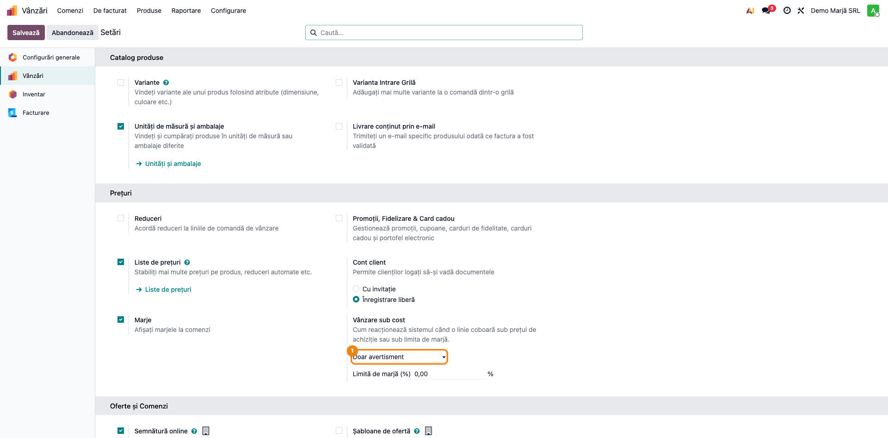
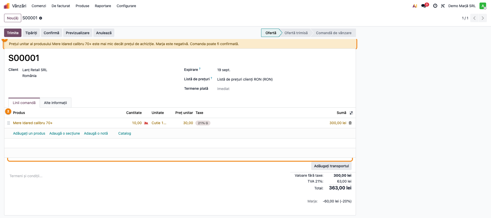

# Fișă Modul: Control al marjei pe comanda de vânzare

**Modul:** `deltatech_sale_margin`
**Utilizator principal:** Operator vânzări, manager vânzări, consultant la implementare
**Prioritate:** 🟡 Medie (obligatoriu unde politica de preț trebuie respectată de operatori, nu doar recomandată)

---

## 1. Scop business

Modulul răspunde la o întrebare de politică comercială: **ce se întâmplă când un operator vinde sub
costul de achiziție?** Odoo standard calculează marja și o afișează, dar nu reacționează în niciun fel.
Aici alegeți reacția, **per companie**: se blochează vânzarea, se semnalează fără să se blocheze, sau
nu se verifică nimic. În plus, controlați **cine vede** costul și marja și **cine poate modifica**
prețul.

Cele trei politici acoperă trei tipuri de afaceri diferite, iar alegerea greșită se simte imediat:

| Politică | Pentru cine | Ce se întâmplă |
|---|---|---|
| **Blochează vânzarea** (implicit) | distribuție cu preț de listă, unde vânzarea sub cost e o greșeală | prețul nu se salvează, comanda nu se confirmă |
| **Doar avertisment** | marfă perisabilă, lichidări de stoc, gesturi comerciale — unde vânzarea sub cost e o operațiune curentă | linia se marchează, comanda merge înainte |
| **Fără verificare** | unde marja se urmărește exclusiv în rapoarte | nimic nu se semnalează |

„Doar avertisment" există pentru că o interdicție dură într-o afacere care vinde curent sub cost
oprește activitatea zilnică, iar nevoia reală este alta: **să se vadă când se întâmplă și cine a
decis**.

## 2. Bază legală și context

Modul comercial, fără temei fiscal propriu — nicio lege nu interzice vânzarea sub cost, iar modulul nu
o încadrează fiscal. Contextul relevant este de **control intern**: politica de preț a companiei devine
verificabilă în sistem, iar deciziile de a vinde sub cost rămân documentate în chatterul comenzii.

Modulul **nu** decide tratamentul contabil al vânzării sub cost și nu generează note contabile proprii.

## 3. Utilizatori și roluri

Consultantul alege politica la implementare; operatorul de vânzări o întâlnește zilnic; managerul de
vânzări primește excepțiile.

Trei grupuri tehnice, instalate de modul, decid ce vede și ce poate face fiecare:

| Grup | Efect | Implicit |
|---|---|---|
| **Ascunde preț de achiziție în comanda de vânzare și factură client** | fără el, utilizatorul **nu** vede costul și marja | doar administratorii |
| **Sell below the purchase price** | pe politica „Blochează", membrii **trec** peste blocaj (rămâne o notă în chatter) | doar administratorii |
| **Sell below margin limit** | la fel, pentru pragul de marjă | doar administratorii |
| **No change price on sale order** | preț și discount devin **readonly** pe comandă | nimeni |

⚠️ **Operatorul obișnuit nu trebuie pus în aceste grupuri.** Pe politica „Doar avertisment" el vede
marcajul liniei și bannerul comenzii — care spun *că* marja e sub limită, nu *cât* este costul — fără
să afle costul de achiziție. Adăugați cineva în grupul de cost doar dacă are dreptul comercial să îl
vadă.

Roluri recomandate pentru testare:
- **Utilizator Vânzări** (`sales_team.group_sale_salesman`), **fără** grupurile de mai sus — reproduce
  exact ce vede operatorul;
- **Administrator funcțional** — alege politica și pragul.

## 4. Conturi și date implicate

Modulul **nu postează note contabile** și nu impune conturi. Comparația se face între:

- **prețul net unitar** al liniei (preț după discount, fără TVA);
- **costul** liniei — câmpul `purchase_price`, întreținut de mecanismul nativ de marjă: pentru
  cantitatea **livrată** este costul efectiv al ieșirii din stoc (deci, la marfa produsă, costul
  lotului), iar pentru cantitatea **nelivrată** este costul curent al produsului.

Ambele sunt aduse în **moneda** și în **unitatea de măsură ale liniei** — vezi pasul 2 pentru de ce
unitatea e esențială.

Date minime pentru demo:
- un produs cu **cost de achiziție completat** (fără cost nu există comparație și nu se semnalează
  nimic — cazul cel mai frecvent de „nu funcționează");
- o listă de prețuri și un client;
- opțional, o unitate de ambalaj definită **relativ la** unitatea de bază a produsului (ex. Cutie 12 kg
  = 12 × kg), pentru scenariul vânzării pe ambalaj.

## 5. Configurare inițială

1. **Alegeți politica**: **Setări → Vânzări → Prețuri → „Vânzare sub cost"**. Implicit este **Blochează
   vânzarea** — comportamentul istoric al modulului, păstrat ca să nu se schimbe nimic la actualizare.
2. **Stabiliți pragul**: **„Limită de marjă (%)"**, în același loc. **0** semnalează doar marjele
   negative (strict sub cost); o valoare **negativă** (ex. −10) tolerează o pierdere de până la acel
   procent fără să alerteze; o valoare **pozitivă** (ex. 5) semnalează și marjele subțiri, deși pe plus.
3. **Repetați pe fiecare companie.** Politica este **per companie**, iar o companie creată ulterior
   pornește pe „Blochează vânzarea" — cea mai frecventă cauză de „ne-a blocat brusc comenzile".
4. **Verificați apartenența la grupuri** (secțiunea 3): operatorii **în afara** grupului de cost,
   managerii în el.
5. Opțional, **„Verifică marja doar la confirmare"** (vizibil doar pe politica „Blochează"): mută
   verificarea din momentul salvării liniei în momentul confirmării, ca operatorul să poată pregăti
   oferta în ciornă fără fricțiune.
6. Completați **costul de achiziție** pe produsele vizate. Fără cost, modulul tace — corect, dar
   deconcertant dacă nu știți de ce.



## 6. Flux de utilizare

### Pasul 1 — Consultantul alege politica și pragul

**Setări → Vânzări → Prețuri → „Vânzare sub cost"** (captura de la secțiunea 5). Alegerea se face o
singură dată, la implementare, împreună cu clientul — este o **decizie de politică comercială**, nu un
detaliu tehnic. Întrebarea de pus clientului: *„vânzarea sub cost este o greșeală pe care vreți să o
opriți, sau o realitate pe care vreți să o vedeți?"*

Pe **„Blochează vânzarea"**, operatorul din afara grupului de excepție primește o eroare și nu poate
salva prețul. Pe **„Doar avertisment"**, nimic nu se oprește.

### Pasul 2 — Operatorul vinde sub cost și vede semnalul

Pe **Vânzări → Comenzi**, imediat după ce a completat **Prețul unitar**: dacă marja scade sub prag,
**rândul se colorează** și în capul comenzii apare un banner. Semnalul apare la ieșirea din câmpul de
preț — acolo unde se ia decizia, nu la confirmare, când e prea târziu.

Pe politica „Doar avertisment", bannerul spune explicit **„Comanda poate fi confirmată"**, ca operatorul
să nu aștepte o aprobare care nu există.

**Comparația se face în unitatea liniei** — esențial când se vinde pe ambalaj: la un cost de 3 lei/kg,
o Cutie 12 kg costă 36 lei, deci **30 lei/cutie este sub cost**, chiar dacă „30" pare mult față de „3".
În exemplul din captură, marja iese −60,00 lei (−20%).

| Ce vede operatorul | Ce înseamnă |
|---|---|
| rândul colorat + bannerul | marja e sub pragul configurat |
| **Marja** din josul comenzii | cifra concretă — **doar** pentru cine are dreptul să vadă costul |
| butonul **Confirmă** activ | comanda nu e blocată (politica „Doar avertisment") |
| nimic, deși prețul pare mic | costul nu e completat pe produs, sau unitățile nu sunt comparabile |

⚠️ Dacă produsul are **unitatea de bază greșită** (ex. „Units" în loc de kg, cu ambalaje definite peste
kg), semnalul **tace intenționat** pentru acel produs: costul convertit ar ieși de 1.000 de ori mai
mare și **fiecare** linie ar apărea sub cost. Tăcerea arată că trebuie corectată fișa produsului.

**La confirmare**, pe politica „Doar avertisment", comanda primește în **chatter** o notă cu liniile
vândute sub cost și marja fiecăreia — urma deciziei, pentru discuția de mai târziu. Nota se scrie **o
singură dată**, la confirmare, nu la fiecare corectare de preț.



### Note de monografie și raportare

Modulul nu generează note contabile. Marja calculată aici alimentează raportarea de profitabilitate din
`deltatech_sale_commission` (raportul de marjă și calculul comisioanelor), deci **semnalul de pe
comandă și raportul de după folosesc același cost** — nu există două cifre concurente.

## 7. Legături cu alte module / declarații

| Modul / proces | Rol în flux | Tip legătură |
|---|---|---|
| `sale_margin` | calculul nativ al marjei și câmpul de cost pe linie | dependență (manifest) |
| `sale_stock_margin` | aduce costul la **valorizarea reală a livrării**; la marfa produsă, costul lotului | dependență (manifest) |
| `stock_account`, `account`, `delivery` | valorizare, facturare, linii de transport (excluse din verificare) | dependență (manifest) |
| `deltatech_sale_commission` | aplică **aceeași politică** pe linia de factură; raport de profitabilitate | consumator (aval) |
| `website_sale` | comenzile din website sunt **excluse** din verificare (parametrul `sale.check_price_website`), ca promoțiile să fie posibile | interacțiune tratată explicit |

**Ce este automat:** marcajul liniei, bannerul comenzii, nota din chatter la confirmare, respectarea
politicii de către constrângerea de pe linia de factură, excluderea liniilor de transport, a
serviciilor și a recompenselor de fidelitate.
**Ce rămâne manual:** alegerea politicii și a pragului, apartenența la grupuri, completarea costului pe
produse și — evident — decizia comercială de a vinde sub cost.

## 8. Verificări pentru consultant

- [ ] Modulul se instalează fără erori; politica apare în **Setări → Vânzări → Prețuri**.
- [ ] Pe o bază existentă, după actualizare, politica este **Blochează vânzarea** (comportamentul
      istoric nu se schimbă de la sine).
- [ ] Politica e setată pe **fiecare** companie, inclusiv pe cele create după instalarea modulului.
- [ ] Produs cu cost **3 lei/kg**, linie de **10 Cutii 12 kg** la **30 lei/cutie**, politica „Doar
      avertisment": rândul se colorează, bannerul apare, comanda **se confirmă**.
- [ ] Aceeași linie la **40 lei/cutie** (peste costul convertit de 36): **niciun** semnal.
- [ ] Pe politica **„Blochează vânzarea"**, un operator din afara grupului de excepție **nu** poate
      salva prețul de 30 lei/cutie (eroare explicită).
- [ ] Pe „Doar avertisment", corectări repetate de preț **nu** adaugă note noi în chatter; după
      confirmare există **exact o** notă.
- [ ] Factura emisă pe o comandă sub cost se creează fără eroare pe „Doar avertisment" (constrângerea
      din `deltatech_sale_commission` respectă politica).
- [ ] Un operator **fără** grupul de cost vede rândul marcat și bannerul, **nu** vede marja și **nu**
      primește eroare de drepturi.
- [ ] Prag **−10**: o pierdere de 5% nu alertează, una de 25% da. Prag **20**: o marjă de 10% e
      semnalată.
- [ ] Produs cu unitatea de bază din **altă familie** decât unitatea liniei: **niciun** semnal (garda
      de unități), în loc de marcaj fals pe fiecare linie.
- [ ] Produs cu cost **0**: niciun semnal.
- [ ] Politica **„Fără verificare"**: nici marcaj, nici banner, nici blocaj.

## 9. Mesaje de eroare frecvente

| Mesaj / simptom | Cauză probabilă | Remediere |
|-----------------|-----------------|-----------|
| „Nu puteți vinde sub prețul de achiziție: X." (blocant) | Politica e **Blochează vânzarea** și utilizatorul nu e în grupul de excepție | Dacă vânzarea sub cost e legitimă în această afacere, treceți politica pe „Doar avertisment"; altfel, corectați prețul |
| „Nu puteți vinde sub marjă: X" | Marja e sub „Limită de marjă", pe politica „Blochează" | Corectați prețul sau ajustați pragul |
| „Nu puteți vinde X fără preț." | Linie cu preț 0 pe politica „Blochează" | Completați prețul; recompensele de fidelitate sunt exceptate automat |
| „…Marja este negativă. Comanda poate fi confirmată." | **Avertisment**, nu eroare — politica e „Doar avertisment" | Nimic de remediat; decizia e comercială |
| Ne-a blocat brusc comenzile pe o companie nouă | Politica e **per companie**; una nouă pornește pe „Blochează vânzarea" | Setați politica pe compania respectivă |
| Vânzare vizibil sub cost, dar **niciun** semnal | Costul produsului este **0** | Completați costul de achiziție pe produs |
| Un anume produs nu se marchează niciodată | Unitatea liniei și unitatea de bază a produsului sunt din **familii diferite** — garda tace ca să nu marcheze fals fiecare linie | Corectați unitatea de măsură pe fișa produsului |
| Coloana **Marjă** nu apare | Utilizatorul nu e în grupul de cost | Comportament corect; marcajul și bannerul rămân vizibile |
| Comenzile din website nu sunt verificate | Comportament intenționat (`sale.check_price_website`), ca promoțiile să fie posibile | Nimic |

## 10. Capturi de ecran

Capturile (`readme/screenshots/`) sunt **generate automat** din `tests/test_screenshots.py` (mixinul
`ScreenshotCase` din `l10n_ro_doc_screenshots`, import defensiv), în **limba română**, pe planul de
conturi RO:

| # | Fișier | Conținut |
|---|--------|----------|
| 1 | `screenshots/01_setari_politica.png` | **Setări → Vânzări → Prețuri**: politica „Vânzare sub cost" pe „Doar avertisment" și „Limită de marjă (%)" |
| 2 | `screenshots/02_comanda_sub_cost.png` | Comandă cu 10 Cutii 12 kg la 30 lei/cutie peste un cost de 36 lei/cutie: bannerul, rândul marcat, marja −60,00 lei (−20%), butonul **Confirmă** activ |

Nota din chatter de la confirmare **nu** are captură proprie: chatterul cade în afara cadrului capturat,
iar nota este un efect al confirmării, nu un ecran separat — este descrisă în pasul 2.

Regenerare (planul de conturi RO este necesar pentru compania de demo):

```bash
./odoo/odoo-bin -c odoo.conf -d <db> -i deltatech_sale_margin,l10n_ro,l10n_ro_doc_screenshots --test-tags=fise_screenshots --stop-after-init --http-port=8987 --gevent-port=8988
```

## 11. Observații pentru manual

Scrieți în manual că **alegerea politicii este o decizie a clientului, nu o setare tehnică** — și
puneți-o la începutul capitolului, nu la anexe. Insistați pe patru lucruri: (1) implicit se
**blochează**, deci o bază nouă sau o companie nou creată se comportă restrictiv până la configurare;
(2) pe „Doar avertisment" semnalul este **informativ** — nu îl prezentați ca eroare de corectat, altfel
operatorii vor căuta pe cine să întrebe pentru fiecare comandă; (3) comparația se face **preț pe
ambalaj față de cost pe ambalaj**, ca nimeni să nu conteste semnalul crezând că 30 lei/cutie e peste
3 lei/kg; (4) marcajul liniei **nu dezvăluie costul**, deci poate rămâne vizibil pentru toți agenții —
distincția față de coloana de marjă, care se vede doar cu drept, merită explicată o dată, clar.
