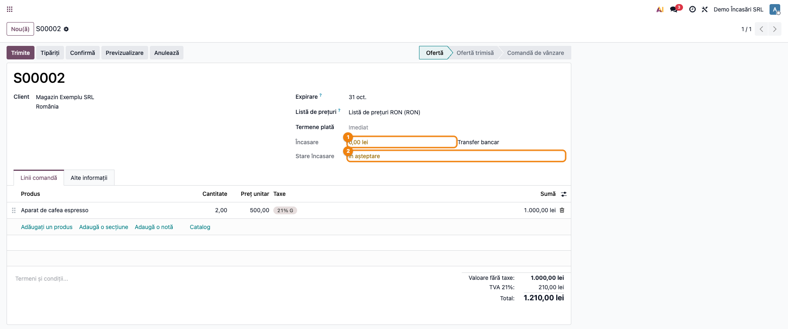
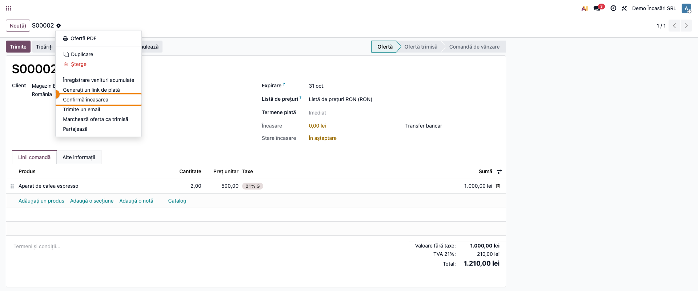
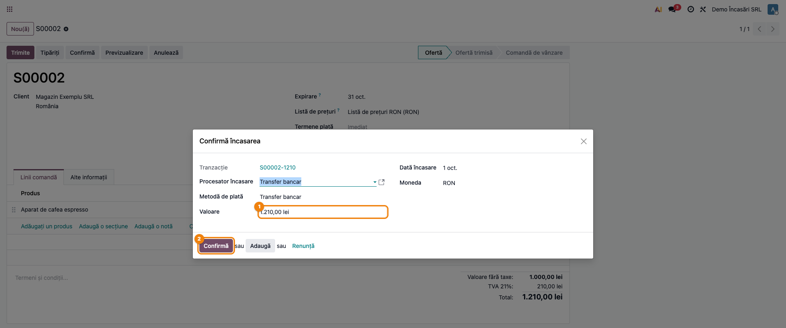
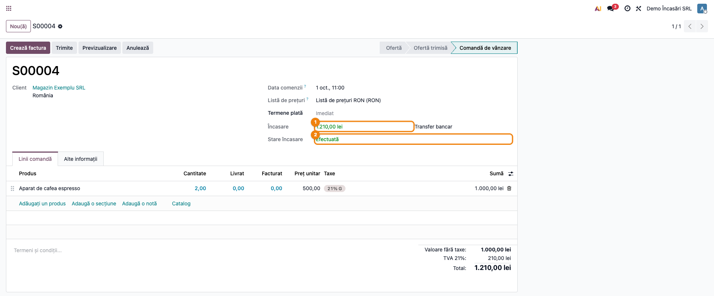
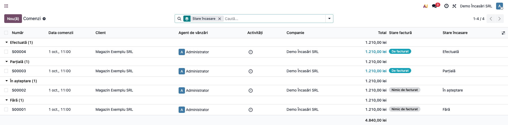

# Fișă Modul: Încasarea comenzilor de vânzare

**Modul:** `deltatech_sale_payment`
**Utilizator principal:** Operator vânzări / magazin online, casier, contabil care urmărește încasările
**Prioritate:** 🟡 Medie (necesar oriunde clienții plătesc înainte de livrare — transfer bancar, ramburs, card — și vânzările trebuie să știe ce comenzi sunt achitate)

---

## 1. Scop business

În Odoo standard, o comandă de vânzare nu spune **cât s-a încasat** pe ea: suma plătită apare pe
factură, iar tranzacțiile de plată (card, transfer bancar, ramburs) stau într-un ecran separat. Când
clientul plătește prin transfer bancar sau în numerar, operatorul nu are nici un gest simplu prin care
să marcheze încasarea direct pe comandă.

Modulul rezolvă ambele probleme:

- **pe fiecare comandă** se vede **Încasare** (suma încasată, în moneda comenzii), **procesatorul** de
  plată și **Stare încasare** (Fără, Inițiată, În așteptare, Autorizată, Parțială, Efectuată, Anulată);
- **lista comenzilor** se poate filtra, grupa și sorta după starea încasării — „ce comenzi au plata în
  așteptare?", „ce comenzi sunt achitate integral și pot pleca?";
- acțiunea **Confirmă încasarea** înregistrează pe comandă o încasare primită în afara unui procesator
  online (extras bancar, numerar la ghișeu, ramburs), fără a trece prin ecranul de tranzacții.

## 2. Bază legală și context

Modul operațional, fără temei fiscal propriu. Starea încasării este o informație **de gestiune** pentru
vânzări și logistică (ce comandă se livrează), nu un document contabil.

Încasarea propriu-zisă, cu nota contabilă și documentul justificativ (extras de cont, chitanță,
borderou de ramburs), rămâne a contabilității: modulul **nu** emite chitanțe și **nu** postează note
proprii — plata contabilă, când există, este creată de Odoo standard (vezi secțiunea 6, „Note de
monografie și raportare").

## 3. Utilizatori și roluri

| Rol | Ce face |
|---|---|
| **Operator vânzări / magazin online** | urmărește starea încasării în lista comenzilor, confirmă încasările prin transfer bancar sau numerar |
| **Casier / responsabil ramburs** | confirmă încasarea comenzilor achitate la livrare |
| **Contabil** | verifică plățile create și reconcilierea lor cu facturile |
| **Administrator** | configurează procesatorii de plată și jurnalele lor |

Drepturi: fereastra **Confirmă încasarea** este accesibilă oricărui utilizator intern; lista
procesatorilor se citește cu dreptul **Vânzări / Utilizator: doar documentele proprii**
(`sales_team.group_sale_salesman`).

Roluri recomandate la testare: un **Utilizator Vânzări** (fără drepturi de contabilitate) pentru
confirmarea încasării și un **Contabil** pentru verificarea plății create.

## 4. Conturi și date implicate

Modulul nu impune conturi. Dacă procesatorul de plată are un **jurnal** (bancă sau casă), Odoo creează la
confirmarea tranzacției o plată de client pe acel jurnal — vezi „Note de monografie și raportare".

Cum se calculează **Încasare** (suma afișată pe comandă), în **moneda comenzii**:

- suma încasată pe **facturile validate** ale comenzii (total minus rest de plată; notele de credit
  scad), adusă în moneda comenzii la cursul de la data facturii;
- suma **tranzacțiilor confirmate** ale comenzii, adusă în moneda comenzii la data tranzacției;
- se ia **cea mai mare** dintre cele două. Aceiași bani apar de obicei de două ori (ca tranzacție și
  ca plată pe factură) și nu trebuie adunați; maximul nu dublează încasarea și nici nu pierde o
  tranzacție încă nedecontată pe factură.

Comanda devine **Efectuată** când suma încasată atinge totalul comenzii (la rotunjirea monedei) și
**Parțială** când s-a încasat ceva, dar mai puțin.

Date minime pentru demo:
- un procesator de plată activ (ex. **Transfer bancar**), cu un jurnal de bancă;
- un client și un produs cu preț;
- o comandă la care clientul a ales transfer bancar (tranzacție **În așteptare**).

## 5. Configurare inițială

1. **Instalați modulul** `deltatech_sale_payment`. La instalare, starea încasării se calculează pentru
   comenzile existente.
2. **Activați procesatorii** folosiți: **Facturare → Configurare → Plăți online → Furnizori de plată**
   (ex. **Transfer bancar**, ramburs; meniul e vizibil administratorului contabil). Fereastra **Confirmă încasarea** propune doar procesatorii care nu sunt
   dezactivați.
3. **Verificați jurnalul** fiecărui procesator (tabul **Configurare** al furnizorului de plată): fără jurnal,
   încasarea confirmată schimbă starea comenzii, dar **nu** creează plată contabilă.
4. Opțional, în **Vânzări → Configurare → Setări**, bifați facturarea automată (eticheta în română: **Factură client Automată**) dacă doriți ca o
   comandă încasată să fie facturată automat la procesarea tranzacției (comportament Odoo standard).
5. În lista comenzilor, coloana **Stare încasare** este vizibilă implicit; **Procesator încasare** se
   adaugă din selectorul de coloane opționale.

## 6. Flux de utilizare

Scenariul: clientul **Magazin Exemplu SRL** a comandat 2 buc. × 500 lei + TVA (1.210,00 lei) și a ales
plata prin transfer bancar. Banii au intrat în cont, iar operatorul confirmă încasarea pe comandă.

### Pasul 1 — Comanda cu plata în așteptare

**Vânzări → Comenzi → Cotații** (sau **Comenzi**) → deschideți comanda.

Sub **Termeni de plată** apar trei informații noi:
- **Încasare** — suma încasată până acum (aici **0,00 lei**) și, alături, procesatorul (**Transfer
  bancar**);
- **Stare încasare** — **În așteptare**: clientul a ales transferul bancar, dar banii nu au fost încă
  confirmați.

Culorile ajută la citire: verde = **Efectuată**, portocaliu = **Parțială / În așteptare / Inițiată /
Autorizată**, roșu = **Anulată**, gri = **Fără**.



### Pasul 2 — Deschideți „Confirmă încasarea"

Pe formularul comenzii, **⚙ Acțiuni → Confirmă încasarea**.



### Pasul 3 — Completați și confirmați încasarea

Se deschide fereastra **Confirmă încasarea**. Când comanda are deja o tranzacție în așteptare (cazul
nostru), fereastra o preia: **Tranzacție**, **Procesator încasare**, **Metodă de plată** și **Valoare**
sunt precompletate cu datele ei. Fără tranzacție, completați procesatorul și valoarea încasată.

Verificați înainte de a confirma:
- **Valoare** este suma **efectiv încasată** (pe extras / în casă), nu neapărat totalul comenzii — o
  încasare mai mică lasă comanda **Parțială**;
- **Procesator încasare** este cel prin care au venit banii (de el depinde jurnalul plății).

Butoanele:
- **Confirmă** — tranzacția devine **confirmată**; comanda trece pe **Efectuată** (sau **Parțială**);
- **Adaugă** — înregistrează tranzacția **în așteptare**, fără confirmare (ex. clientul a anunțat plata,
  dar banii nu au intrat încă);
- **Renunță** — închide fereastra fără modificări.

⚠️ Câmpul **Dată încasare** se afișează, dar **nu** ajunge pe plata contabilă: plata primește data la
care Odoo procesează tranzacția. Pentru o încasare dintr-o zi anterioară, contabilul corectează data pe
plată.



### Pasul 4 — Comanda încasată

După **Confirmă**, comanda arată **Încasare 1.210,00 lei**, procesatorul **Transfer bancar** și
**Stare încasare: Efectuată** (verde).

Odoo procesează apoi tranzacția confirmată (imediat sau prin acțiunea programată de procesare a
plăților, la câteva minute): o cotație încasată integral se **confirmă** automat ca comandă, se creează
**plata** de client pe jurnalul procesatorului și, dacă e activă facturarea automată, **factura**.



### Pasul 5 — Urmărirea încasărilor în lista comenzilor

**Vânzări → Comenzi → Comenzi**.

1. **Găsiți pe ecran** — coloana **Stare încasare** arată, pe fiecare rând, starea plății. Folosiți
   **Filtre** (Fără plată, Plată inițiată, Plată în așteptare, Plată autorizată, Plătită parțial, Plată
   efectuată, Plată anulată) sau **Grupează după → Stare încasare** pentru o imagine pe grupuri.
2. **Verificați** — comenzile **Plătită parțial** au un rest de încasat (totalul comenzii minus
   **Încasare**); comenzile **În așteptare** vechi de câteva zile sunt transferuri anunțate și neprimite,
   de urmărit cu clientul; **nicio** comandă cu plată în avans nu pleacă la livrare înainte de
   **Efectuată**.
3. **Treceți mai departe** — deschideți comanda de urmărit sau exportați lista (**selectați rândurile →
   ⚙ Acțiuni → Exportă**) pentru raportarea către contabilitate.



### Note de monografie și raportare

Modulul **nu** postează note contabile. Când tranzacția confirmată este procesată și procesatorul are
jurnal, Odoo standard creează o plată de client (încasare) pe jurnalul procesatorului:

| Operațiune | Debit | Credit | Sumă |
|---|---|---|---|
| Încasare prin transfer bancar (plata creată de Odoo) | contul de încasări al metodei de plată din jurnal (cont de încasări în curs, dacă e configurat, altfel contul jurnalului — **5121** Conturi la bănci în lei) | **4111** Clienți | 1.210,00 lei |
| Încasare în numerar (procesator cu jurnal de casă) | **5311** Casa în lei (sau contul de încasări în curs al jurnalului) | **4111** Clienți | suma încasată |

Dacă factura comenzii există deja, plata se **reconciliază** cu ea și factura apare ca plătită. Dacă
plata intră în contul de încasări în curs, ea se închide la reconcilierea extrasului bancar.

Procesatorii **fără jurnal** (ex. plata cu cardul importată dintr-un magazin extern) nu creează plată:
banii ajung pe factură abia la reconcilierea decontării procesatorului. De aceea **Încasare** ia maximul
dintre facturi și tranzacții — vezi secțiunea 4.

## 7. Legături cu alte module / declarații

| Modul | Rol |
|---|---|
| `sale`, `payment` (standard) | comanda, tranzacțiile și procesatorii de plată |
| `account_payment` (standard) | plata contabilă creată la procesarea tranzacției confirmate |
| `payment_custom` (standard) | procesatorul **Transfer bancar** |
| `deltatech_website_sale_status` | folosește **Stare încasare** în lista comenzilor online neîncasate |
| `deltatech_sale_store` | chitanțele de magazin intră în calculul sumei încasate |

**Ce e automat:** suma încasată, starea și procesatorul pe comandă (recalculate la orice schimbare a
tranzacțiilor sau facturilor); confirmarea cotației încasate integral, plata și facturarea automată
(Odoo standard, la procesarea tranzacției).

**Ce rămâne manual:** confirmarea încasărilor primite în afara unui procesator online (transfer bancar,
numerar, ramburs); data plății, când încasarea e din altă zi; reconcilierea extrasului bancar.

## 8. Verificări pentru consultant

- [ ] O comandă nouă, fără tranzacții, arată **Stare încasare: Fără** și **Încasare 0,00**.
- [ ] Comanda cu transfer bancar ales arată **În așteptare**, procesatorul **Transfer bancar**, și apare
      la filtrul **Plată în așteptare**.
- [ ] **⚙ Acțiuni → Confirmă încasarea** preia tranzacția în așteptare (procesator, metodă, valoare
      precompletate).
- [ ] **Confirmă** cu valoarea integrală: comanda trece pe **Efectuată**, **Încasare** = totalul
      comenzii.
- [ ] **Confirmă** cu jumătate din valoare pe o altă comandă: **Parțială**, iar comanda apare la
      **Plătită parțial**.
- [ ] **Adaugă** (fără confirmare): tranzacția rămâne **În așteptare**, starea comenzii nu devine
      Efectuată.
- [ ] O valoare negativă în fereastră e refuzată („Valoarea trebuie să fie pozitivă").
- [ ] După procesarea tranzacției, pe procesatorul cu jurnal există o **plată** de client (Dr cont de
      încasări / Cr 4111), reconciliată cu factura, dacă factura exista.
- [ ] Comandă de 100 EUR într-o companie în lei, facturată și încasată 50 EUR pe factură: **Încasare
      50,00 €**, **Parțială** (nu 250 și nu Efectuată).
- [ ] Factură încasată integral printr-o tranzacție: **Încasare** = totalul, **nu** dublul lui.
- [ ] **Grupează după → Stare încasare** în lista comenzilor dă un grup pe fiecare stare.

## 9. Mesaje de eroare frecvente

| Mesaj / simptom | Cauză | Remediere |
|-----------------|-------|-----------|
| „Vă rog să selectați o comandă de vânzare" | Fereastra a fost deschisă fără o comandă activă | Deschideți-o din formularul comenzii, **⚙ Acțiuni → Confirmă încasarea** |
| „Valoarea trebuie să fie pozitivă" | Valoare negativă în fereastră | Introduceți suma încasată, pozitivă; un retur de bani se face din factură / nota de credit |
| Comanda e **Efectuată**, dar nu există plată contabilă | Procesatorul nu are jurnal | Setați jurnalul pe procesator; pentru încasarea deja confirmată, contabilul înregistrează plata pe factură |
| Comanda e **Efectuată**, dar cotația nu s-a confirmat încă | Tranzacția confirmată nu a fost încă procesată (acțiunea programată rulează la câteva minute) | Așteptați procesarea sau confirmați manual comanda |
| Plata are data de azi, nu data încasării | **Dată încasare** din fereastră nu se transmite plății | Corectați data pe plată în contabilitate |
| Pe o comandă deja încasată, **Confirmă încasarea** propune din nou suma | Fereastra preia ultima tranzacție (inclusiv una confirmată prin transfer bancar sau ramburs) și, la confirmare, o **înlocuiește** | Nu redeschideți fereastra pe comenzi **Efectuate**; pentru o încasare suplimentară folosiți plata pe factură |
| Pe o plată cu cardul **Autorizată**, **Confirmă** anulează autorizarea | Fereastra înlocuiește tranzacția autorizată cu o încasare manuală | Capturați plata din procesator, nu din fereastră |
| **Încasare** pare prea mică la o comandă plătită cu cardul și completată cu plată pe factură | Se ia maximul dintre facturi și tranzacții, nu suma lor, cât timp decontarea cardului nu e reconciliată | Reconciliați decontarea procesatorului pe factură |

## 10. Capturi de ecran

Capturile (`readme/screenshots/`) sunt **generate automat** din `tests/test_screenshots.py` (mixinul
`ScreenshotCase` din `l10n_ro_doc_screenshots`, import defensiv), în **limba română**, pe planul de
conturi RO, pe compania „Demo Încasări SRL" în RON:

| # | Fișier | Conținut |
|---|--------|----------|
| 1 | `screenshots/01_comanda_plata_in_asteptare.png` | Comanda de 1.210,00 lei cu **Încasare 0,00**, procesator **Transfer bancar**, **Stare încasare: În așteptare** |
| 2 | `screenshots/02_meniu_actiuni_confirma_incasarea.png` | Meniul **⚙ Acțiuni** deschis pe comandă, cu **Confirmă încasarea** |
| 3 | `screenshots/03_wizard_confirma_incasarea.png` | Fereastra **Confirmă încasarea** precompletată din tranzacția în așteptare |
| 4 | `screenshots/04_comanda_incasata.png` | Comanda încasată: **Încasare 1.210,00 lei**, **Stare încasare: Efectuată** |
| 5 | `screenshots/05_lista_grupata_stare_incasare.png` | Lista comenzilor grupată după **Stare încasare** (Fără, În așteptare, Parțială, Efectuată) |

Regenerare (planul de conturi RO este necesar pentru compania de demo):

```bash
./odoo/odoo-bin -c odoo.conf -d <db> -i deltatech_sale_payment,payment_custom,l10n_ro,l10n_ro_doc_screenshots --test-tags=fise_screenshots --stop-after-init --http-port=8987 --gevent-port=8988
```

## 11. Observații pentru manual

Prezentați **Stare încasare** ca instrumentul zilnic al operatorului: lista comenzilor filtrată pe
**Plată în așteptare** și **Plătită parțial** este lista de urmărit cu clienții, iar **Efectuată** este
semnalul că o comandă cu plată în avans poate pleca. Insistați pe trei lucruri: (1) **Încasare** e în
**moneda comenzii** și nu adună de două ori aceiași bani (tranzacție + plată pe factură); (2)
**Confirmă încasarea** este pentru banii primiți **în afara** procesatorilor online — nu se folosește
pe comenzi deja **Efectuate** și nici pe plăți cu cardul autorizate; (3) data plății contabile este data
procesării, nu cea din fereastră, deci încasările din zile anterioare se corectează în contabilitate.
