# Fișă Modul: Inventariere pe document (metoda clasică, cu valori)

**Modul:** `deltatech_stock_inventory`
**Utilizator principal:** Gestionar / responsabil inventar (numărare), manager de stoc (validare și
valori), contabil stocuri (verificarea notelor)
**Prioritate:** 🔴 Ridicată (inventarierea stocurilor e obligatorie, iar validarea modifică direct
cantitățile și soldul contului de stoc)

---

## 1. Scop business

Odoo 19 standard face inventarierea direct pe cantitățile din stoc (**Inventariere fizică**), fără un
document care să grupeze numărarea: nu există o listă de inventariere cu număr, dată și stare, care să
poată fi tipărită, numărată pe hârtie, verificată și abia apoi validată. Modulul readuce **documentul
de inventar** (metoda „clasică" din versiunile vechi de Odoo): un document cu număr `INV00001`, filtre
pe locații și produse, linii cu stoc scriptic și stoc faptic, stări *Ciornă → În desfășurare →
Validat* și mișcări de stoc generate la validare.

Pe lângă cantități, documentul arată **impactul valoric** înainte de validare: pe fiecare linie apar
costul unitar, valoarea stocului scriptic, valoarea stocului numărat, valoarea diferenței, iar după
validare, valoarea efectiv înregistrată. Totalurile apar pe document. Managerul de stoc vede astfel
câți lei înseamnă plusurile și minusurile înainte de a le înregistra, nu doar după.

În jurul inventarului, modulul mai adaugă:
- amplasamente manuale pe produs (raft / rând / etaj / casetă), pe fiecare depozit;
- afișarea stocului pe depozite în kanban-ul de produse;
- un drept separat pentru cine poate modifica cantitățile;
- confirmarea rapidă a stocului unui produs;
- unirea mai multor inventare validate;
- gruparea zilnică a reaprovizionărilor manuale.

## 2. Bază legală și context

- **Legea contabilității nr. 82/1991** — obligă entitățile să inventarieze elementele de activ și
  pasiv cel puțin o dată pe an și în situațiile prevăzute de lege (predare-primire de gestiune,
  fuziune, încetarea activității etc.).
- **OMFP 2861/2009** — normele privind organizarea și efectuarea inventarierii (comisia, listele de
  inventariere, stabilirea și înregistrarea diferențelor).
- **OMFP 1802/2014** — funcțiunea conturilor: contul 371 se debitează cu mărfurile constatate plus la
  inventar (607, 758) și se creditează cu lipsurile la inventar (607).

Modulul acoperă **partea operațională** a inventarierii: lista de numărare, compararea stocului
scriptic cu cel faptic, calculul diferențelor cantitative și valorice și înregistrarea lor în stoc.
Modulul **nu** reproduce formularele tipizate din OMFP 2634/2015 (lista de inventariere 14-3-12,
procesul-verbal al comisiei). De asemenea, **nu** tratează lipsurile imputabile, perisabilitățile și
TVA-ul ajustat pentru lipsuri. Aceste aspecte se acoperă cu `l10n_ro_inventory_closing` (vezi
secțiunea 7).

## 3. Utilizatori și roluri

| Rol | Ce face | Drept Odoo |
|---|---|---|
| Gestionar / responsabil inventar | creează documentul, pornește inventarul, numără, tipărește lista | **Inventar / Utilizator** (`stock.group_stock_user`) |
| Manager de stoc | vede valorile, validează inventarul | **Inventar / Administrator** (`stock.group_stock_manager`) |
| Utilizator cu drept de ajustare | aplică ajustări pe **Inventariere fizică** cu diferență de cantitate | grupul **„Poate actualiza cantitățile"** (*Can update quantities*) |
| Responsabil consolidare | unește mai multe inventare validate într-unul singur | grupul **„Unire documente inventar"** (*Can merge inventory documents*) |
| Contabil stocuri | verifică notele contabile generate | **Contabilitate / Contabil** |

La instalare, grupul „Poate actualiza cantitățile" îl primesc doar utilizatorii *admin* și *root*. Ceilalți
utilizatori trebuie adăugați explicit, altfel o ajustare cu diferență e respinsă cu mesajul
„Utilizatorul dumneavoastră nu poate actualiza cantitățile produselor".

Roluri recomandate pentru testare:
- un gestionar fără drept de administrator, ca să verificați că **nu** vede totalurile și coloanele
  *Valoare unitară / teoretică / numărată / diferență / postată* și **nu** are butonul **Validare
  inventar**. Atenție: coloana **Preț** și rapoartele PDF (cu *Valoare*, *Valoare în plus / în minus*)
  **nu** sunt restricționate, deci gestionarul vede în continuare prețurile și valorile din PDF;
- un manager de stoc, pentru validare.

## 4. Conturi și date implicate

Modulul nu are conturi proprii. Nota contabilă a diferențelor este generată de nucleul Odoo
(`stock_account`) la validarea mișcărilor. Ea apare **numai** dacă sunt îndeplinite ambele condiții:
- categoria produsului are evaluarea stocului **automatizată** (*real time*);
- locația virtuală **Locații virtuale / Inventory adjustment** are completat **Cont pierderi**.

Liniile cu **Proprietar** (stoc în custodie, al unui terț) nu produc notă: nucleul exclude de la
valorizare mișcările cu alt proprietar decât compania.

| Cont | Rol |
|---|---|
| 371 „Mărfuri" (sau 301, 345 etc., după categoria produsului) | contul de stoc al categoriei |
| **Cont pierderi** de pe locația de ajustare (de regulă 607 pentru mărfuri) | contrapartida ambelor sensuri: minus și plus |
| Jurnalul de stoc al companiei | jurnalul în care se postează nota |

**Contul de pierderi e comun tuturor categoriilor** care folosesc aceeași locație de ajustare. Dacă
inventariați și materii prime (301) sau produse finite (345) cu locația pe 607, notele ies greșit
(`Dr 607 = Cr 301` în loc de 601/301, `Dr 607 = Cr 345` în loc de 711/345). Pentru acestea creați
locații de ajustare separate (tip *Pierdere la inventar*), cu contul potrivit (601, respectiv 711),
și setați-le pe produs în câmpul **Locație diferențe inventar** (tab-ul *Inventar*, grupul *Locații
contrapartide*, vizibil doar în modul dezvoltator).

Date minime pentru demo (folosite și în capturi):
- Companie **Demo Inventar SRL**, plan de conturi RO, monedă RON.
- Două depozite: `WH` (principal) și `WH2` (secundar), ca să apară defalcarea stocului pe depozite.
- Categorie „Mărfuri", cu evaluare **automatizată** și cost **FIFO**, pe contul 371.
- Locația **Inventory adjustment**, cu **Cont pierderi** = 607.
- Produse stocabile:
  - **Șurub M8**: stoc 100 buc la 2,00 lei; se numără 95 buc, deci **minus 5 buc = −10,00 lei**;
  - **Vopsea albă 5L**: stoc 20 buc la 80,00 lei; se numără 22 buc, deci **plus 2 buc = +160,00 lei**;
  - **Diblu 8 mm**: stoc 50 buc la 0,50 lei, numărat fără diferență; rămâne nebifat „E Ok" pentru
    demonstrarea butonului **Inventar nou pentru Not ok**.

## 5. Configurare inițială

1. Instalați `deltatech_stock_inventory` (dependențe: `stock`, `stock_account`, `purchase_stock`,
   `sale_stock`).
2. **Contabilitate stocuri**:
   - pe categoria de produse, setați evaluarea **automatizată** și contul de stoc 371;
   - în **Inventar → Configurare → Locații**, filtrați locațiile virtuale, deschideți
     **Inventory adjustment** și completați **Cont pierderi** (de exemplu 607).
   Fără cont pe această locație, inventarul mișcă doar cantitățile, fără notă contabilă.
3. **Drepturi**: în **Setări → Utilizatori**, adăugați:
   - grupul „Poate actualiza cantitățile" utilizatorilor care aplică ajustări din **Inventariere fizică**;
   - grupul „Unire documente inventar" celor care unesc inventare.
4. **Amplasamente manuale** (opțional, recomandat când **nu** folosiți reguli de depozitare): în
   **Inventar → Configurare → Setări**, secțiunea **Trasabilitate**, bifați **Afișează câmpurile de
   amplasare manuală**. Pe produs apar câmpurile Raft / Rând / Etaj / Casetă, pe fiecare depozit.
5. **Afișarea stocului în kanban** (doar cu cel puțin două depozite în companie): pe fiecare depozit
   (**Inventar → Configurare → Depozite**), câmpul **Afișare stoc în kanban** are trei valori:
   - *Toate* — stocul întregului depozit;
   - *Locație principală* — doar locația principală de stoc;
   - *Detaliat* — total, plus rezervat (R), blocat (B), în tranzit (T), așteptat de la furnizor (E)
     și un rând final **STOC LIBER**.
6. **Locații blocate** (opțional): pe o locație internă, bifați **Gestiune restricționată**. În
   afișarea *Detailed*, cantitățile din această locație apar ca blocate (B) și nu intră în stocul
   liber.
7. **Prețul de inventar**: parametrul de sistem `stock.use_inventory_price` decide dacă **Prețul**
   de pe linie valorizează plusurile de inventar. E considerat **adevărat** și atunci când lipsește.
   Cu parametrul activ:
   - la **FIFO** și **cost mediu**, plusul intră în stoc la **Prețul** liniei (valoarea mișcării =
     cantitatea în plus × Preț). Costul mediu se recalculează ponderat, iar stocul existent **nu** se
     reevaluează;
   - la **cost standard**, plusul intră la costul standard. Excepție: pe o linie cu stoc scriptic 0,
     dacă produsul nu are stoc valorizat în companie, **Prețul** liniei devine costul standard;
   - minusurile ies întotdeauna la costul curent (mediu, standard sau straturile FIFO consumate),
     indiferent de **Preț**.

   Cu parametrul `False`, **Prețul** de pe linie nu influențează nicio valoare, nici pe liniile cu
   stoc scriptic 0. Validarea inventarului nu modifică niciodată costul stocului existent.

## 6. Flux de utilizare

### Pasul 1 — Lista documentelor de inventar

Accesați **Inventar → Operații → Ajustări → Documente inventariere**. Lista arată data, numele,
compania și starea fiecărui document. Coloanele *Locații* și *Produse* se activează din selectorul de
coloane opționale (⇄), din dreapta antetului. Documentele pot fi afișate și ca kanban.

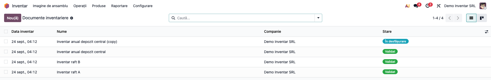

### Pasul 2 — Crearea documentului

Apăsați **Nou** și completați:
- **Locații** — lăsați gol pentru toate locațiile interne ale companiei. Selectați o locație pentru a
  include și sublocațiile ei.
- **Produse** — lăsați gol pentru toate produsele stocabile. Selectați produse doar pentru un inventar
  parțial.
- **Include produsele epuizate** — adaugă și produsele fără stoc, cu stoc scriptic 0: produsele din
  câmpul **Produse** sau, dacă e gol, toate produsele stocabile ale companiei, pe fiecare locație
  aleasă (fără locații: pe locația principală de stoc a fiecărui depozit).
- **Data inventarului** — data la care se face numărarea. Ea datează documentul și mișcările de stoc.
- **Cantitate Fizică** — alegeți:
  - *Implicit stocul disponibil*: numărătorul corectează doar ce diferă;
  - *Implicit zero*: numărătorul trebuie să completeze tot, iar ce nu e numărat rămâne 0.

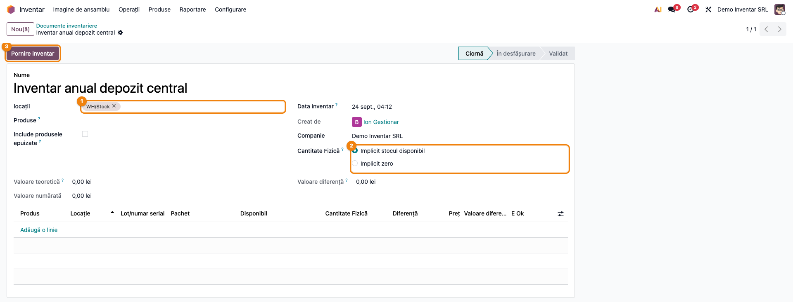

### Pasul 3 — Pornirea inventarului

Apăsați **Pornire inventar**. Documentul trece **În desfășurare** și se generează câte o linie pentru
fiecare combinație produs / locație / lot / pachet / proprietar care are stoc. Fiecare linie are:
- **Disponibil** — stocul scriptic la momentul pornirii;
- **Cantitate Fizică** — precompletată conform alegerii de la pasul 2;
- **Preț** — costul produsului, editabil; valorizează plusul de inventar (secțiunea 5, punctul 7);
- **E Ok** — nebifat pe liniile generate.

Se deschide direct lista de linii, editabilă.

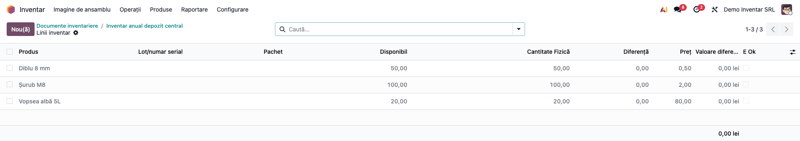

### Pasul 4 — Tipărirea listei de numărare

Imediat după pornire, înainte de numărare, apăsați **Tipărește lista de numărare** (sau **Tipăriți →
Inventar**). PDF-ul „Inventar după așezare produse" conține:
- câte un tabel pe fiecare locație, cu produsul, lotul, ambalarea și **Cantitate teoretică**;
- coloana **Cantitate faptică** goală cât timp inventarul nu e validat, ca să fie completată de mână
  de comisie;
- coloana **Valoare** (cantitatea din sistem × **Preț**) și rândul **Total general**, unde
  **Înainte** este valoarea scriptică.

Tipăriți lista înainte de numărare și cu opțiunea *Implicit stocul disponibil*. Coloana **Valoare**
este cantitatea deja introdusă în sistem × **Preț**, iar coloanele de diferență se calculează din
aceleași cantități. Cu *Implicit zero*, valoarea iese 0 pe rânduri și tot stocul apare la *Valoare în
minus*, adică diferențele ar fi sub ochii comisiei. Același raport se retipărește după validare din
**Tipăriți → Poziții inventar**, cu cantitățile finale.

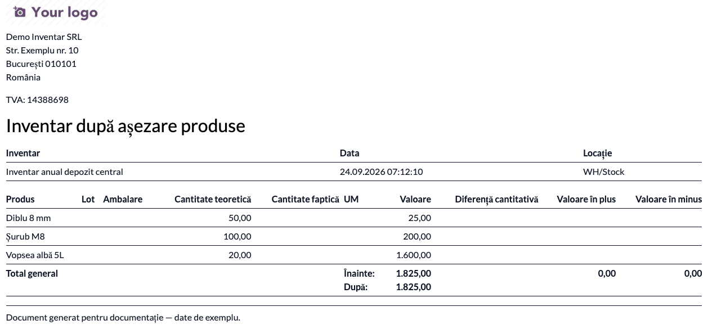

### Pasul 5 — Numărarea

Completați **Cantitate Fizică** pe fiecare linie. La modificarea cantității, linia se bifează automat
**E Ok**. Liniile cu diferență apar colorate în roșu, iar cele fără diferență în gri. Coloana
**Diferență** arată faptic minus scriptic. Pentru manageri, coloana **Valoare diferență** arată
diferența în lei, cu total în subsolul listei.

Alte acțiuni utile:
- dacă stocul s-a mișcat după pornirea inventarului, linia afișează butonul de reîmprospătare
  (↻), care recitește stocul scriptic și costul unitar;
- din meniul **Acțiuni** al liniilor selectate: **Setează cantitățile numărate la 0** și
  **Recalculează cantitatea în stoc** (recitește stocul scriptic);
- un produs găsit fizic, dar lipsă din listă, se adaugă ca linie nouă. Modulul respinge a doua linie
  pentru aceeași combinație produs / locație / lot / pachet / proprietar.

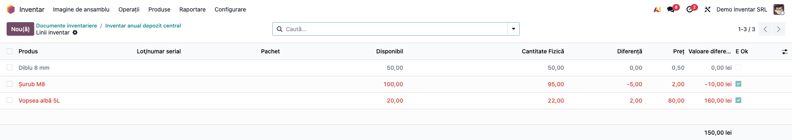

### Pasul 6 — Verificarea valorilor, înainte de validare

Acesta este pasul de citire a documentului; nu validați înainte de a-l parcurge.

1. **Găsiți pe ecran** — pe formularul documentului, blocul de valori (vizibil doar managerilor de
   stoc) arată trei totaluri:
   - **Valoare teoretică** — stocul scriptic la costul unitar fotografiat pe linii;
   - **Valoare numărată** — stocul faptic la același cost;
   - **Valoare diferență** — plusurile minus minusurile.
   În lista de linii de sub bloc, fiecare rând arată cantitățile și diferența pe produs.
2. **Verificați**:
   - pe demo, **Valoare diferență** este +150,00 lei (+160,00 la Vopsea albă 5L și −10,00 la
     Șurub M8);
   - **Valoare teoretică** minus **Valoare numărată** este, în valoare absolută, egală cu diferența;
   - nicio linie nu are cantitate numărată negativă;
   - produsele cu lot sau serie au lotul completat pe liniile cu diferență;
   - data inventarului este data numărării.
3. **Tratați liniile nenumărate**. Liniile rămase cu **E Ok** nebifat nu au fost atinse de numărător.
   Aveți două variante:
   - **Inventar nou pentru Not ok** — mută liniile nenumărate într-un document nou, În desfășurare, ca
     să fie numărate separat;
   - **Elimină liniile Not ok** — le șterge din document, iar produsele respective nu se inventariază acum.

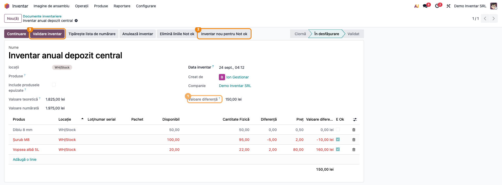

### Pasul 7 — Validarea inventarului

Managerul de stoc apasă **Validare inventar**. La validare:
- documentul primește numărul din secvența `INV` (dacă se numea *Nou*) și trece în starea
  **Validat**;
- pentru fiecare linie cu diferență se generează o mișcare de stoc:
  - plus: de la **Inventory adjustment** spre locația liniei;
  - minus: de la locația liniei spre **Inventory adjustment**;
- mișcările primesc data inventarului, iar fiecare mișcare păstrează legătura cu linia care a
  generat-o;
- pe fiecare linie se completează **Valoare postată**, adică valoarea efectivă a mișcării. Ea poate
  diferi de estimare în două cazuri: la minusurile FIFO, ieșirea se evaluează pe loturile de cost
  consumate; la plusuri, dacă ați modificat **Prețul** pe linie, plusul intră la acest preț
  (secțiunea 5, punctul 7);
- mișcările poartă ca referință numele documentului de inventar (de exemplu `INV00012`);
- costul stocului existent nu se modifică. La cost mediu, costul se recalculează ponderat cu plusul
  intrat.

Butonul **Afișează liniile** redeschide liniile, needitabile. Butonul inteligent **Mișcări produs** listează
mișcările generate.

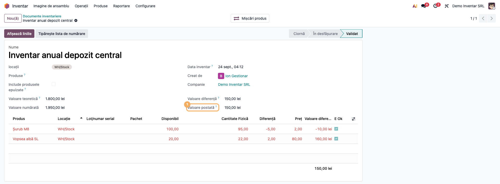

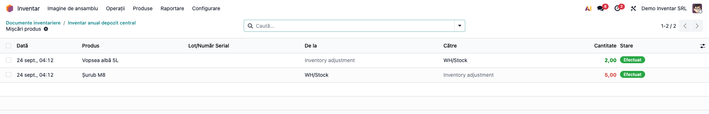

### Pasul 8 — Raportul de diferențe

Din meniul **Tipăriți** al documentului, alegeți **Diferențe inventar**.

1. **Găsiți pe ecran** — raportul are câte un tabel pe fiecare locație. Întâi sunt listate liniile
   cu plus, apoi cele cu minus. Coloanele **Valoare în plus** și **Valoare în minus** dau valoarea
   diferenței la prețul liniei. Rândul **Total general** arată valoarea **Înainte** (scriptic) și
   **După** (faptic).
2. **Verificați**:
   - pe demo, Valoare în plus = 160,00 și Valoare în minus = 10,00;
   - După = Înainte + plus − minus (pe demo 1.950,00 = 1.800,00 + 160,00 − 10,00, după ce linia nenumărată a fost mutată în alt inventar);
   - valorile corespund totalului **Valoare diferență** din pasul 6. Pot diferi în două situații:
     raportul calculează cu **Preț** (editabil), iar ecranul cu **Valoare unitară** (fotografiată la
     generare), deci orice preț modificat pe linie produce o diferență; la minusurile FIFO, **Valoare
     postată** reflectă loturile de cost consumate. Cantitățile fracționare apar cu zecimale (de
     exemplu 2,50 kg).
3. **Treceți mai departe** — tipăriți sau salvați PDF-ul și atașați-l la procesul-verbal al comisiei
   de inventariere. Tot din **Tipăriți**, **Poziții inventar** dă lista completă, cu cantitățile
   finale.

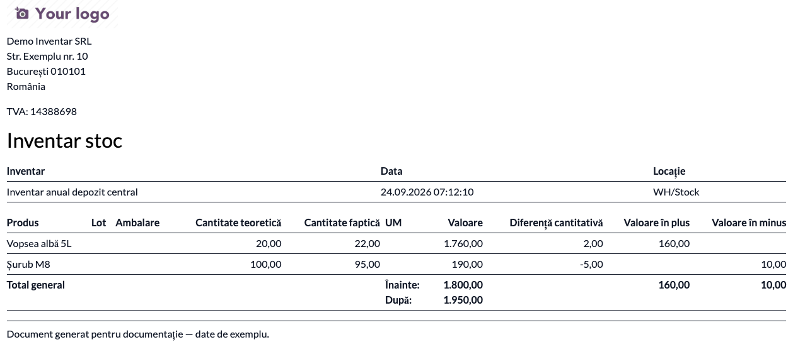

### Pasul 9 — Nota contabilă a diferențelor

Deschideți **Contabilitate → Contabilitate → Note contabile** (în Community aplicația se numește
**Facturare**), filtrați jurnalul **Evaluarea stocurilor** și
data validării. Referința notei este numele documentului de inventar (pe demo, „Inventar anual depozit
central"), deci nota se regăsește direct după document. Liniile notei poartă și numele produsului. Nota există doar dacă sunt
îndeplinite condițiile din secțiunea 4.

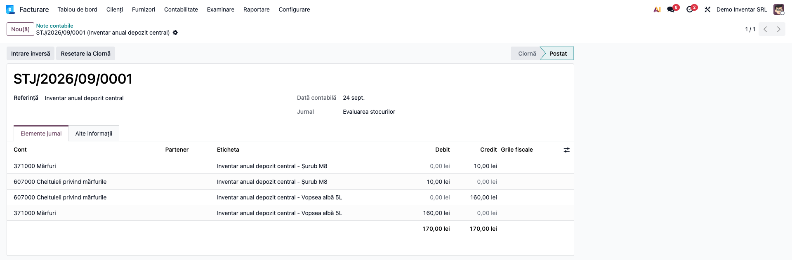

### Pasul 10 — Unirea mai multor inventare (opțional)

Când inventarierea s-a făcut pe mai multe documente parțiale (de exemplu câte unul pe raft):
1. În lista **Documente inventariere**, selectați documentele **validate**.
2. Alegeți **Acțiuni → Unește...** și completați:
   - **Nume** — lăsați „/” ca documentul rezultat să primească numărul din secvența `INV`;
   - **Data** documentului rezultat;
   - **Locație** — precompletată cu stocul primului depozit al companiei. Când e completată,
     **înlocuiește** locațiile documentelor unite. Goliți câmpul ca să se preia locațiile
     documentelor. Captura arată valoarea **implicită** (WH/Stock), care la rafturile din WH2 trebuie
     ștearsă înainte de **Unește**.
3. Apăsați **Unește**.

Liniile și mișcările trec pe documentul nou, iar documentele inițiale se șterg. În chatter rămâne
mesajul cu numele lor. Acțiunea e vizibilă doar grupului „Unire documente inventar".

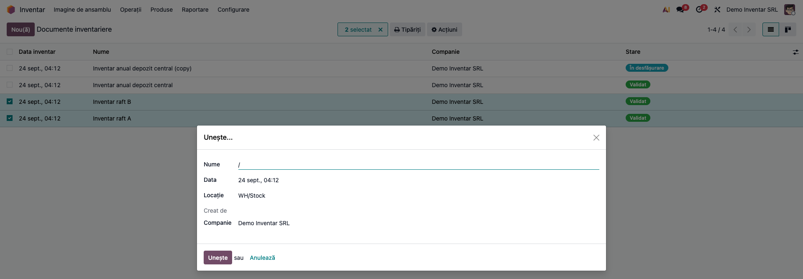

### Pasul 11 — Ajustare rapidă din Inventariere fizică, cu motiv

Pentru o corecție punctuală, fără document pregătit:
1. Accesați **Inventar → Operații → Ajustări → Inventariere fizică**.
2. Completați cantitatea numărată și coloana **Notă inventar** (motivul corecției, vizibilă
   implicit).
3. Apăsați **Aplică**.

Modulul creează automat un document de inventar **Validat**, cu număr din secvența `INV`. Nota devine
referința mișcării de stoc, deci motivul rămâne vizibil în istoricul mișcărilor produsului. Dacă
sunt îndeplinite condițiile din secțiunea 4, aplicarea generează și o notă contabilă pe contul de
pierderi. În captură, cantitatea e doar completată, nu și aplicată. La **Aplică**, pe demo ar rezulta
pentru Cuie 50 mm (−2 buc × 0,10 lei): Dr 607 = Cr 371, 0,20 lei, cu referința egală cu **Notă
inventar**. Coloana
**Data ultimului inventar** arată ultima inventariere a fiecărei cantități.

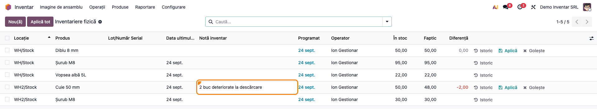

### Pasul 12 — Confirmarea stocului unui produs

Accesați **Inventar → Produse → Produse din depozit**, deschideți produsul și apăsați **Confirmă stoc**.
În asistent alegeți **Locație**. Câmpul e gol implicit, iar fără locație **Confirmă** nu face nimic;
în captură e precompletat din seed. Asistentul arată:
- stocul din locația aleasă;
- data și documentul ultimei inventarieri a produsului în acea locație.

**Confirmă** creează și validează un inventar fără diferențe, adică o confirmare că stocul faptic e
egal cu cel scriptic. Pentru cantitățile deja inventariate în ziua curentă nu se mai creează linii.

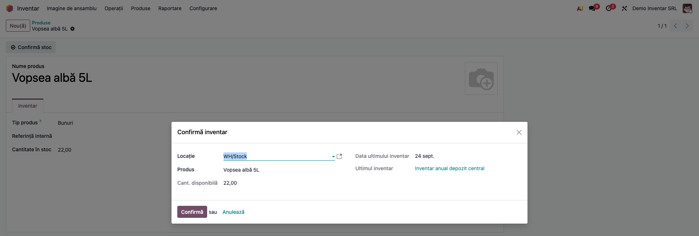

### Pasul 13 — Stocul pe depozite în kanban-ul de produse

În **Inventar → Produse → Produse** (vizualizare kanban), fiecare card afișează stocul pe coduri de
depozit (de exemplu `WH: 95.0`, `WH2: 30.0`). Pe depozitele setate *Detailed*, cardul detaliază R / B /
T / E și rândul **STOC LIBER**. **STOC LIBER** însumează **numai** depozitele setate *Detailed*.
În captură, la Șurub M8, `WH2: 30.0` nu intră în stocul liber de 95.0, pentru că WH2 e pe *All*. Cu
un singur depozit în companie, defalcarea nu se afișează.

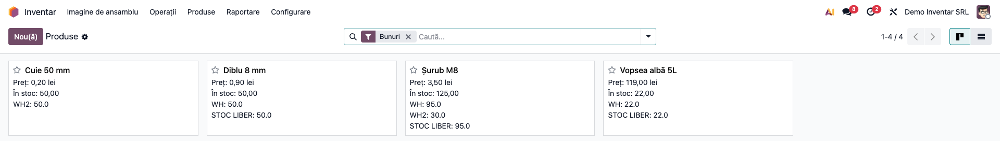

### Pasul 14 — Reaprovizionare grupată pe zi

Pe formularul produsului, **⚙ Acțiuni → Reaprovizionare** deschide asistentul standard, completat
cu câmpul **Grupare**. Câmpul primește automat o referință „Reaprovizionare <cod depozit> <data>", comună
tuturor reaprovizionărilor din aceeași zi și din același depozit. Astfel, reaprovizionările ajung
pe un singur transfer, în loc de câte unul pe produs. Câmpul se poate schimba manual.

O a doua reaprovizionare pentru același produs, pe aceeași referință deja executată, e respinsă.

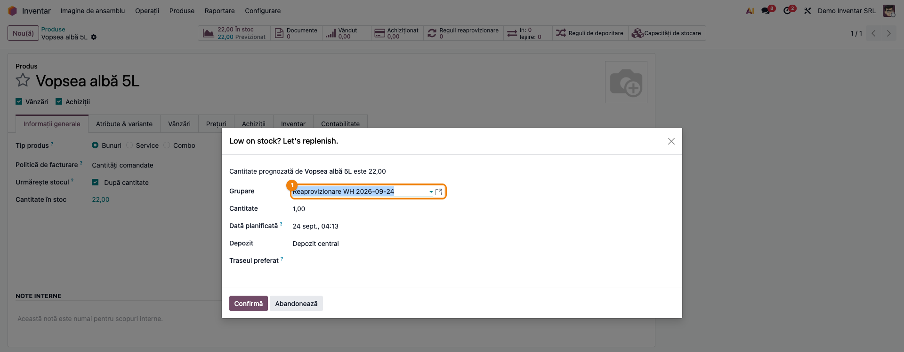

### Note de monografie și raportare

Nota se generează la validare, câte una pe grupul de mișcări validate, în jurnalul de stoc al
companiei. Exemplele de mai jos folosesc contul de pierderi 607 pe locația de ajustare și datele
demo:

| Operațiune | Debit | Credit | Sumă (demo) |
|---|---|---|---|
| Minus de inventar (Șurub M8, 5 buc × 2,00) | 607 Cheltuieli privind mărfurile | 371 Mărfuri | 10,00 |
| Plus de inventar (Vopsea albă 5L, 2 buc × 80,00) | 371 Mărfuri | 607 Cheltuieli privind mărfurile | 160,00 |

Ambele note respectă funcțiunea contului 371 din OMFP 1802/2014: plusul se înregistrează pe
credit în 607, lipsa pe debit în 607. Cele două operațiuni ajung în aceeași notă, pentru că nucleul
grupează mișcările validate împreună.

Pentru categoriile pe alte conturi de stoc (301, 345 etc.), partea de stoc a notei folosește contul
categoriei. Contrapartida rămâne însă contul de pierderi al locației de ajustare, **același** pentru
plus și minus și pentru toate categoriile (vezi secțiunea 4 pentru locațiile separate).

Modulul nu diferențiază lipsurile: nu tratează imputarea lor și nici ajustarea TVA pentru lipsurile
nejustificate. Toate diferențele ajung pe contul de pierderi. Tratamentele diferențiate se fac prin
procesul RO de inventariere (`l10n_ro_inventory_closing`).

**Data notei:** nucleul pune pe notă data zilei în care se face validarea, nu data inventarului.
Mișcările de stoc primesc data inventarului, dar nota contabilă nu. Un inventar datat 31.12 și
validat pe 05.01 produce o notă pe 05.01. Validați inventarul în perioada contabilă la care se
referă.

## 7. Legături cu alte module / declarații

| Modul / proces | Rol în flux | Tip legătură |
|---|---|---|
| `stock` | cantitățile, locațiile, mișcările, **Inventariere fizică** | dependență (manifest) |
| `stock_account` | valorizarea mișcărilor și nota contabilă, pe baza contului de pierderi al locației | dependență (manifest) |
| `purchase_stock`, `sale_stock` | stocul așteptat de la furnizori din kanban; reaprovizionarea | dependență (manifest) |
| `l10n_ro_inventory_closing` | inventarierea anuală RO: tipuri de diferență (neimputabil, imputabil cu TVA, casare) și procesul-verbal OMFP 2861/2009 | complementar |
| `l10n_ro_inventory_register` | Registrul-inventar anual preia soldul stocurilor rezultat după inventariere | complementar |
| Codul de bare (Barcode) | nu există integrare proprie: numărarea cu scanerul se face din aplicația standard, pe **Inventariere fizică** | proces |

**Ce e automat:**
- generarea liniilor din stoc;
- numerotarea `INV`;
- calculul diferențelor cantitative și valorice;
- mișcările de ajustare, datate la data inventarului;
- valoarea postată pe linie;
- valorizarea plusurilor la prețul liniei (FIFO / cost mediu), fără reevaluarea stocului existent;
- nota contabilă, când locația de ajustare are cont.

**Ce rămâne manual:**
- numărarea propriu-zisă;
- decizia asupra liniilor nenumărate (inventar nou sau eliminare);
- completarea contului de pierderi pe locația de ajustare;
- tratamentul fiscal al lipsurilor (imputare, TVA), prin procesul RO dedicat;
- arhivarea listelor semnate de comisie.

## 8. Verificări pentru consultant

- [ ] Modulul se instalează fără erori; meniul **Documente inventariere** apare sub **Inventar →
      Operații → Ajustări**.
- [ ] **Pornire inventar** generează linii doar pentru locațiile și produsele filtrate.
- [ ] **Include produsele epuizate** adaugă produsele fără stoc, și cu **Produse** gol (toate
      produsele stocabile ale companiei).
- [ ] *Implicit zero* pune cantitatea numărată pe 0 pe toate liniile. *Implicit stocul disponibil* o
      pune egală cu stocul scriptic.
- [ ] Modificarea cantității numărate bifează **E Ok**. O linie duplicată pentru aceeași combinație
      produs / locație / lot este respinsă.
- [ ] Un gestionar fără drept de administrator **nu** vede totalurile și coloanele *Valoare…* și nu
      are butonul **Validare inventar**. Vede însă coloana **Preț** și valorile din rapoartele PDF.
- [ ] Pe demo, înainte de validare, **Valoare diferență** = +150,00 lei.
- [ ] **Inventar nou pentru Not ok** mută liniile nenumărate într-un document nou, În desfășurare.
- [ ] La validare, un document lăsat cu numele *Nou* primește număr `INV…`. Un document cu nume dat
      (ca pe demo) îl păstrează. Mișcările au data inventarului.
- [ ] **Valoare postată** este completată pe liniile cu diferență și, la produsele cu cost unitar
      unic, este egală cu **Valoare diferență**.
- [ ] Raportul **Diferențe inventar** dă Valoare în plus 160,00 / Valoare în minus 10,00 și După = Înainte + plus −
      minus.
- [ ] Nota contabilă: Dr 607 / Cr 371 pentru 10,00 lei și Dr 371 / Cr 607 pentru 160,00 lei. Fără
      cont de pierderi pe locația de ajustare, nu se generează nicio notă.
- [ ] Data notei contabile este data validării. Verificați că inventarul a fost validat în perioada
      corectă.
- [ ] Un document **În desfășurare** sau **Validat** nu poate fi șters, doar unul în ciornă.
      **Anulează inventar** readuce documentul în *Ciornă* și îi șterge liniile.
- [ ] Un utilizator fără grupul „Poate actualiza cantitățile" primește eroare la **Aplică** pe
      **Inventariere fizică**, dacă ajustarea are diferență.
- [ ] **Notă inventar** apare ca referință pe mișcarea generată și se golește după aplicare.
- [ ] Unirea refuză documentele nevalidate și cere cel puțin două documente. Cu **Locație** golită,
      documentul rezultat preia locațiile documentelor unite.
- [ ] Pe un produs pe cost mediu, un plus cu **Preț** modificat pe linie intră la acest preț, iar
      costul mediu se recalculează ponderat. Stocul existent nu se reevaluează, iar validarea nu
      creează nicio înregistrare de reevaluare.
- [ ] Referința notei contabile și a mișcărilor este numele documentului de inventar.
- [ ] Pe un inventar cu mai multe locații, raportul **Diferențe inventar** arată fiecare minus o
      singură dată, sub locația lui.
- [ ] Kanban-ul de produse arată stocul pe depozite doar cu cel puțin două depozite în companie.

## 9. Mesaje de eroare frecvente

| Mesaj / simptom | Cauză probabilă | Remediere |
|---|---|---|
| „You can only delete a draft inventory adjustment…" | Ștergere pe un document În desfășurare sau Validat | **Anulează inventar** îl readuce în Ciornă (liniile se pierd), apoi îl puteți șterge; un document validat nu se șterge |
| „There is already one inventory adjustment line for this product…" | Linie duplicată pentru aceeași combinație produs / locație / lot / pachet / proprietar | Corectați cantitatea pe linia existentă |
| „You can only adjust storable products." | Produs consumabil sau serviciu adăugat pe inventar | Marcați produsul ca stocabil sau scoateți-l din inventar |
| „You cannot set a negative product quantity in an inventory line…" | Cantitate numărată negativă pe o linie | Corectați cantitatea la 0 sau la valoarea numărată |
| „No lines" la validare | Produs urmărit pe lot / serie, cu diferență, fără lot completat | Completați lotul / seria pe linie |
| „Utilizatorul dumneavoastră nu poate actualiza cantitățile produselor" | Utilizatorul nu are grupul „Poate actualiza cantitățile" | Adăugați grupul din **Setări → Utilizatori** |
| „All inventories must be in done state to be merged" | La unire au fost selectate documente nevalidate | Selectați doar documente validate |
| „You must select at least two inventory documents" | Unire pe un singur document | Selectați cel puțin două documente |
| „Reaprovizionarea a fost deja făcută astăzi pentru acest produs și depozit." | A doua reaprovizionare pe aceeași referință zilnică, deja executată | Schimbați **Grupare** sau așteptați ziua următoare |
| Validarea nu produce notă contabilă | Evaluare manuală pe categorie sau lipsa contului de pierderi pe locația de ajustare | Setați evaluarea automatizată și **Cont pierderi** pe **Inventory adjustment** |

## 10. Capturi de ecran

Capturile (`readme/screenshots/`) se generează automat din `tests/test_screenshots.py`, cu mixinul
`ScreenshotCase` din `l10n_ro_doc_screenshots` (import defensiv). Sunt în **limba română**, pe
compania **Demo Inventar SRL**, cu planul de conturi RO și datele demo din secțiunea 4.

| # | Fișier | Conținut |
|---|---|---|
| 1 | `01_lista_documente.png` | Lista **Documente inventariere** |
| 2 | `02_document_nou.png` | Document nou în ciornă: locații, produse, opțiunea **Cantitate Fizică** |
| 3 | `03_linii_generate.png` | Liniile generate la **Pornire inventar** |
| 4 | `04_lista_numarare_pdf.png` | PDF-ul **Tipărește lista de numărare**, tipărit înainte de numărare |
| 5 | `05_linii_numarate.png` | Liniile după numărare: minus Șurub M8, plus Vopsea albă 5L, rânduri colorate |
| 6 | `06_valori_document.png` | Documentul În desfășurare, cu Valoare teoretică / numărată / diferență |
| 7 | `07_inventar_validat.png` | Documentul validat, cu **Valoare postată** și butonul **Mișcări produs** |
| 8 | `08_miscari_produs.png` | Mișcările de produs generate |
| 9 | `09_diferente_pdf.png` | PDF-ul **Diferențe inventar** |
| 10 | `10_nota_contabila.png` | Nota contabilă: Dr 607 / Cr 371 și Dr 371 / Cr 607, cu referința = numele documentului |
| 11 | `11_unire_inventare.png` | Asistentul **Unește...** |
| 12 | `12_inventariere_fizica_nota.png` | **Inventariere fizică** cu coloana **Notă inventar** |
| 13 | `13_confirmare_stoc.png` | Asistentul **Confirmă inventar** |
| 14 | `14_kanban_stoc_depozite.png` | Kanban de produse cu stocul pe `WH` / `WH2` |
| 15 | `15_reaprovizionare_grupare.png` | Asistentul de reaprovizionare, cu **Grupare** |

Orele din interfață și din PDF pot diferi între capturi: browserul care le generează rulează pe alt
fus orar decât utilizatorul. Pe o bază reală, ambele apar pe fusul orar al utilizatorului.

Regenerare:

```bash
./odoo/odoo-bin -c odoo.conf -d <db> -i deltatech_stock_inventory,l10n_ro,l10n_ro_doc_screenshots \
    --test-tags=fise_screenshots --stop-after-init --http-port=8987 --gevent-port=8988
```

## 11. Observații pentru manual

Păstrați ordinea de lucru:
1. configurare (contul de pierderi, drepturi);
2. document cu filtre;
3. pornire;
4. listă tipărită pentru comisie;
5. numărare;
6. verificarea valorilor pe ecran;
7. decizia pentru liniile nenumărate;
8. validare;
9. raportul de diferențe atașat la procesul-verbal;
10. verificarea notei contabile.

Explicați diferența dintre acest modul (documentul operațional de numărare) și procesul RO de
inventariere anuală din `l10n_ro_inventory_closing` (tipul diferenței, imputare, TVA, procesul-verbal
OMFP 2861/2009).

### Limitări cunoscute

- **Data notei contabile** este data validării, nu data inventarului (vezi monografia).
- **Un singur cont de pierderi** pe locația de ajustare, pentru plus și minus și pentru toate
  categoriile. Materiile prime și produsele finite cer locații de ajustare separate (secțiunea 4).
  Lipsurile imputabile, perisabilitățile și TVA-ul aferent nu se tratează aici.
- **Estimarea valorică** de pe ecran (**Valoare diferență**) folosește **Valoarea unitară**
  fotografiată la generare. Dacă modificați **Prețul** pe o linie cu plus, **Valoare postată** iese
  la noul preț și diferă de estimare.
- **Valorile nu sunt complet ascunse gestionarilor:** coloana **Preț** și rapoartele PDF sunt vizibile
  oricărui utilizator de stoc.
- **Descrierea modulului nu mai corespunde codului pe trei puncte:**
  - opțiunea „Clear old valuation" (arhivarea straturilor de valoare) nu mai are efect în 19.0,
    unde straturile de valoare nu mai există, și nu apare pe formular;
  - modulul nu are integrare proprie de cod de bare;
  - filtrul pe raft nu este afișat pe document.
- **Formatul cantităților** pe depozit din kanban (`95.0`) nu e cel românesc.
