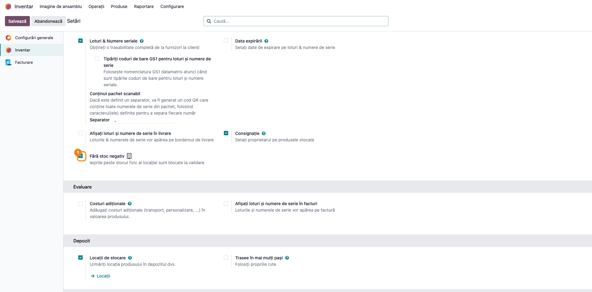
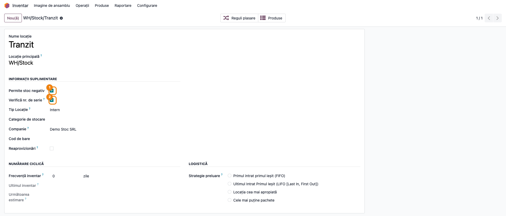
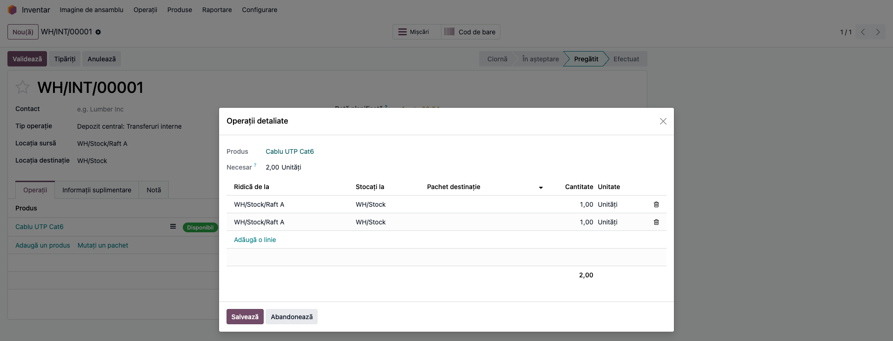
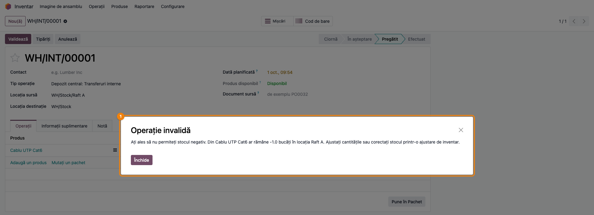
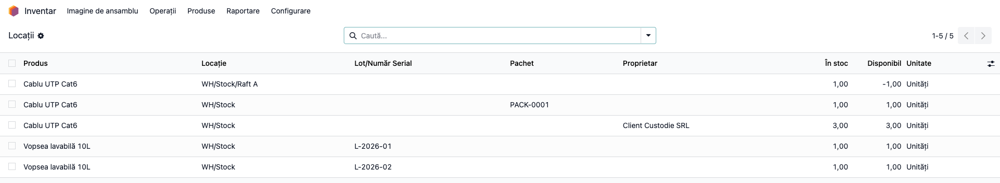
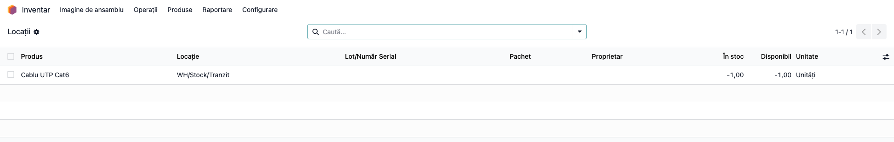
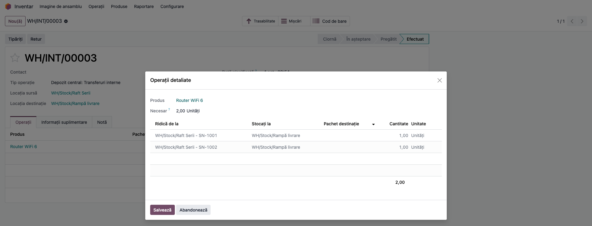
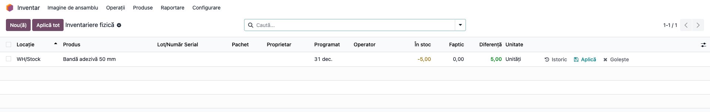

# Fișă Modul: Interzicerea stocului negativ la validarea transferurilor

**Modul:** `deltatech_stock_negative`
**Utilizator principal:** Gestionar / operator de depozit (validează transferurile), manager de stoc
(configurează politica și excepțiile pe locații)
**Prioritate:** 🔴 Ridicată (fără modul, Odoo validează ieșiri peste stocul fizic, iar stocul și
valoarea lui devin negative)

---

## 1. Scop business

Odoo 19 standard permite validarea unei livrări, a unui transfer intern sau a unui consum de
producție chiar dacă în locația sursă nu există cantitatea transferată. Stocul din locație devine
negativ, iar valoarea stocului îl urmează. Diferența iese la iveală abia la inventar, departe de
momentul în care s-a produs.

Modulul blochează **validarea** oricărei mișcări care ar duce sub zero stocul unei locații interne,
pe combinația verificată. Verificarea se face pe **stocul fizic** din locație, pe aceeași combinație
lot / pachet / proprietar ca linia transferată, și **cumulat pe toate liniile validate împreună**: două
linii de câte 1 bucată pe un stoc de 1 bucată sunt blocate, chiar dacă fiecare, luată separat, ar
încăpea.

Politica se activează pe companie. Pe fiecare locație se pot face două excepții:
- **Permite stoc negativ** — locația e scutită de verificare (de exemplu o locație internă folosită
  ca zonă de tranzit sau de producție în curs);
- **Verifică nr. de serie** debifat — la produsele cu număr de serie, stocul se verifică pe total, pe
  toate seriile din locație, nu pe seria de pe linie (pasul 7 arată ce înseamnă pentru o serie
  absentă).

Modulul nu blochează vizualizarea stocului și nici aducerea la zero, prin inventar, a unui stoc deja
negativ (secțiunea 6, pasul 8).

## 2. Bază legală și context

Stocul faptic al unei gestiuni nu poate fi negativ: o cantitate negativă înseamnă o ieșire
documentată fără bunuri reale, adică o eroare de înregistrare (recepție nefăcută, transfer greșit,
serie sau lot greșit). În contabilitate, conturile de stocuri din clasa 3 (de exemplu 371 „Mărfuri")
sunt conturi de activ, cu sold debitor. Pe o categorie cu evaluare automată, o ieșire peste stoc
creditează contul de stoc peste soldul lui.

Modulul acoperă **partea operațională**: împiedică apariția diferenței la sursă, în momentul
validării. Nu are temei legal propriu și nu generează documente sau note contabile.

## 3. Utilizatori și roluri

| Rol | Ce face | Drept Odoo |
|---|---|---|
| Manager de stoc | activează politica pe companie, setează excepțiile pe locații | **Inventar / Administrator** (`stock.group_stock_manager`) |
| Gestionar / operator de depozit | validează livrări, transferuri, recepții; primește blocajul | **Inventar / Utilizator** (`stock.group_stock_user`) |
| Responsabil inventar | aduce la zero prin inventar stocurile negative existente, după ce s-a găsit cauza | **Inventar / Utilizator** |

Câmpurile de pe locație sunt vizibile doar cu **Locații de stocare** activat (**Inventar → Configurare
→ Setări**, secțiunea *Depozit*). Verificarea se face indiferent de utilizator: nu există un grup care
să o ocolească. Singurele excepții sunt cele din configurare (companie sau locație).

Meniul **Inventar → Raportare** (inclusiv **Locații**, folosit mai jos pentru pozițiile de stoc) e
vizibil doar managerului de stoc. Gestionarul vede pozițiile din **Inventar → Operații → Ajustări →
Inventariere fizică**.

Roluri recomandate pentru testare: un gestionar fără drept de administrator, care validează
transferurile, și un manager de stoc pentru configurare.

## 4. Conturi și date implicate

Modulul nu are conturi proprii și nu modifică notele contabile. Blocarea are loc **înainte** ca Odoo
să mute cantitățile, deci la o validare respinsă nu se creează nicio mișcare și nicio notă.

Date minime pentru demo (folosite și în capturi):
- Companie **Demo Stoc SRL**, plan de conturi RO, monedă RON.
- Depozitul **Depozit central** (`WH`), cu locația **WH/Stock** și sublocațiile interne:
  - **WH/Stock/Raft A** — locație normală, cu verificare;
  - **WH/Stock/Tranzit** — locație de tip **Intern** cu **Permite stoc negativ** bifat (nu tipul
    Odoo *Tranzit*, care oricum nu e verificat);
  - **WH/Stock/Raft Serii** — **Verifică nr. de serie** debifat;
  - **WH/Stock/Rampă livrare** — destinația transferurilor validate din exemple.
- Produse stocabile:
  - **Cablu UTP Cat6** (Unități), stoc 1 buc pe **Raft A**, pentru cumulul pe mai multe linii;
  - **Șuruburi M6** (Unități, mișcate și la **Duzina**), stoc 12 buc pe **WH/Stock**, pentru unitatea de
    măsură diferită;
  - **Vopsea lavabilă 10L**, urmărit pe **lot**: 1 buc pe lotul `L-2026-01`, 1 buc pe `L-2026-02`;
  - **Router WiFi 6**, urmărit pe **număr de serie**: seriile `SN-1001` și `SN-1002` pe **Raft
    Serii**;
  - pe **WH/Stock**: pachetul `PACK-0001` cu 1 buc Cablu UTP Cat6 și 3 buc Cablu UTP Cat6 în
    custodie (proprietar **Client Custodie SRL**), pentru filtrele de pachet și proprietar;
  - **Bandă adezivă 50 mm**, cu o poziție de −5 buc pe **WH/Stock**, rămasă din perioada fără
    politică, pentru corecția prin inventar.

## 5. Configurare inițială

1. Instalați `deltatech_stock_negative` (dependență: `stock`).
2. În **Inventar → Configurare → Setări** activați **Locații de stocare** (secțiunea *Depozit*) și,
   după nevoie, **Loturi & Numere seriale** și **Consignație** (proprietar pe stoc), din secțiunea
   *Trasabilitate*.
3. Activați politica: în aceeași pagină, secțiunea **Trasabilitate**, bifați **Fără stoc negativ** și
   salvați. Setarea e pe **companie**: într-o bază cu mai multe companii, se bifează pe fiecare.
4. Pe locațiile care trebuie scutite (tranzit, producție în curs, locații tehnice), deschideți
   **Inventar → Configurare → Locații**, apoi locația, și bifați **Permite stoc negativ**.
5. Pe locațiile unde produsele cu serie se mișcă fără urmărirea strictă a seriei, debifați **Verifică nr.
   de serie** (implicit e bifat).
6. Înainte de activarea pe o bază existentă, verificați stocurile negative existente (**Inventar →
   Raportare → Locații**, filtrul **Stoc negativ**). Pentru fiecare poziție negativă:
   1. identificați cauza (recepție nevalidată, factură de achiziție fără recepție, transfer pe
      locația sau lotul greșit);
   2. înregistrați documentul lipsă sau corectați transferul greșit:
      - **factura există, recepția lipsește** — factura a înregistrat marfa în curs de aprovizionare
        (Dr 327 + Dr 4426 = Cr 401). Validați recepția: Dr 371 = Cr 327. Nu înregistrați din nou
        4426 / 401, care sunt deja pe factură;
      - **lipsesc și factura, și recepția** — înregistrați-le pe amândouă; efectul cumulat este
        Dr 371 + Dr 4426 = Cr 401;
   3. folosiți inventarul (pasul 8) doar pentru diferențele reale, care nu pot fi documentate.
   Un plus de inventar pus în locul unei recepții lipsă pierde datoria față de furnizor și TVA-ul
   deductibil. Pozițiile rămase negative blochează imediat ieșirile din ele.

## 6. Flux de utilizare

### Pasul 1 — Activarea politicii pe companie

Accesați **Inventar → Configurare → Setări**, secțiunea **Trasabilitate**, și bifați **Fără stoc
negativ**. Salvați.

Cât timp bifa e debifată, modulul nu blochează nimic, iar transferurile peste stoc se validează și
lasă stoc negativ, ca în Odoo standard. Excepție: pe locațiile cu **Verifică nr. de serie** debifat,
rezervarea produselor cu serie ignoră seria și cu politica oprită. Bifa se aplică pe compania
fiecărei linii transferate.



### Pasul 2 — Excepțiile pe locație

Accesați **Inventar → Configurare → Locații** și deschideți locația. Modulul adaugă două câmpuri,
deasupra câmpului **Tip Locație**:
- **Permite stoc negativ** — bifat, locația e scutită: ieșirile din ea se validează chiar dacă o duc
  sub zero;
- **Verifică nr. de serie** (în engleză *Check Serial No.*) — bifat (implicit), stocul produselor cu
  serie se verifică pe seria de pe linie; debifat, se verifică pe total, pe toate seriile din locație
  (pasul 7).

Verificarea se aplică doar locațiilor cu **Tip Locație** = **Intern**. Locațiile virtuale (furnizori, clienți,
pierderi de inventar, producție) nu sunt verificate.



### Pasul 3 — Transfer peste stoc, pe mai multe linii

Pe **Raft A** există 1 buc **Cablu UTP Cat6**. Operatorul pregătește un transfer intern de 2 buc
din **Raft A** spre **WH/Stock** (**Inventar → Operații → Transferuri → Intern**). În tabul
**Operații**, butonul **Detalii** (sau pictograma ≡) de pe rândul produsului deschide **Operații
detaliate**, unde operatorul a selectat de două ori câte 1 buc din **Raft A**.

Ce trebuie văzut pe ecran înainte de validare:
- **Găsiți** — în **Operații detaliate** sunt două linii, fiecare cu **Ridică de la** =
  WH/Stock/Raft A și **Cantitate** = 1,00; totalul de jos este 2,00;
- **Verificați** — totalul liniilor din aceeași locație, pe același lot / pachet / proprietar (2 buc)
  depășește stocul fizic din locație (1 buc). Fiecare linie, luată separat, ar încăpea.



### Pasul 4 — Validarea este blocată

Închideți **Operații detaliate** și apăsați **Validează**. Modulul verifică toate liniile împreună,
înainte ca Odoo să mute vreo cantitate. A doua linie depășește stocul, iar validarea este oprită cu
dialogul **Operație invalidă** și mesajul *„Ați ales să nu permiteți stocul negativ. Din Cablu UTP
Cat6 ar rămâne -1.0 bucăți în locația Raft A…"*.

Cifra din mesaj este **stocul care ar rămâne** după linia care depășește (aici −1), adică lipsa, nu
stocul disponibil. Transferul rămâne nevalidat, stocul rămâne neatins (1 buc). Operatorul corectează
cantitățile sau află de ce lipsește marfa (o recepție nevalidată, un transfer anterior greșit).

Același blocaj apare și:
- la **unitatea de măsură diferită**: pe un stoc de 12 Unități **Șuruburi M6**, o linie de 1
  **Duzina** plus o linie de 1 **Unități** înseamnă 13 bucăți, deci se blochează. Cantitățile se convertesc în unitatea
  produsului înainte de comparare;
- la o singură linie mai mare decât stocul (de exemplu 10 buc pe un stoc de 5);
- la livrări, consumuri de producție, casări și minusuri de inventar: orice mișcare care **pleacă**
  dintr-o locație internă verificată.



### Pasul 5 — Ce se adună și ce nu: lot, pachet, proprietar, locație

Verificarea compară linia cu stocul din **aceeași** locație, cu **același** lot, **același** pachet
sursă și **același** proprietar. Liniile se cumulează doar pe aceeași combinație. Deschideți
**Inventar → Raportare → Locații** ca să vedeți pozițiile de stoc pe care se face comparația (lista
se poate grupa pe locație sau lot din meniul de căutare).

- **Găsiți** — fiecare rând este o poziție de stoc: produs, locație, lot / serie, pachet, proprietar,
  cantitate;
- **Verificați**, pe datele demo:
  - **Vopsea lavabilă 10L**: o linie pe `L-2026-01` și una pe `L-2026-02`, câte 1 buc, trec
    (fiecare lot are 1 buc). Două linii pe `L-2026-01` se blochează;
  - **Cablu UTP Cat6** din pachetul `PACK-0001`: se verifică doar stocul din pachet. Stocul din afara
    pachetului nu acoperă o linie pe pachet, și invers;
  - o linie fără proprietar nu poate consuma stocul în custodie al **Client Custodie SRL**, și
    invers;
  - linii din locații diferite (Raft A și WH/Stock) nu se adună între ele;
  - liniile de produse diferite nu se adună între ele.

Verificarea folosește coloana **În stoc** (cantitatea fizică), nu **Disponibil** (fizic minus
rezervat). În captură, **Disponibil** = −1,00 pe Raft A, pentru că transferul blocat de la pasul 3 are
rezervate 2 buc din 1; rezervarea proprie a transferului nu e numărată ca cerere concurentă.



### Pasul 6 — Locație cu stoc negativ permis

Pe **WH/Stock/Tranzit** (cu **Permite stoc negativ** bifat), un transfer de 2 buc spre **Rampă
livrare**, pe un stoc de 1 buc, se validează. În **Inventar → Raportare → Locații**, poziția Cablu
UTP Cat6 pe **WH/Stock/Tranzit** rămâne cu **În stoc** = −1,00. Același efect îl are debifarea politicii pe companie
(pasul 1), dar pentru toate locațiile.

Mișcările de **intrare** într-o locație nu se verifică niciodată: recepțiile și transferurile spre
**Raft A** trec indiferent de stocul existent acolo, iar verificarea se face doar pe locația sursă.



### Pasul 7 — Produse cu număr de serie: „Verifică nr. de serie" bifat sau debifat

**Router WiFi 6** are pe **Raft Serii** seriile `SN-1001` și `SN-1002`, câte 1 buc.

Cu **Verifică nr. de serie** **bifat** (implicit), verificarea se face pe seria de pe linie, ca la loturi:
- o linie pe `SN-1001` trece;
- o linie pe o serie care nu e în locație (de exemplu `SN-1003`) se blochează, chiar dacă alte serii
  sunt în stoc.

Cu **Verifică nr. de serie** **debifat**, verificarea se face pe **total**, pe toate seriile din locație
(pachetul, proprietarul și locația rămân filtre):
- o linie pe `SN-1001` și una pe `SN-1002` trec (2 buc pe un total de 2);
- dacă în locație ar fi doar `SN-1001`, două linii (`SN-1001` și `SN-1002`) se blochează: ambele
  consumă din același total de 1 buc;
- stocul aceluiași produs dintr-o altă locație nu se adună;
- **atenție:** o linie pe o serie care **nu** e în locație (de exemplu `SN-1003`) trece, dacă totalul
  ajunge. Odoo descarcă apoi exact seria de pe linie: `SN-1003` ajunge la −1, iar seria reală rămâne
  la +1. Totalul locației e corect, dar evidența pe serii trebuie corectată manual, prin inventar, în
  **doi pași**: aplicați întâi rândul seriei de pe −1 (`SN-1003`, Faptic 0), apoi rândul seriei de pe
  +1 (`SN-1001`, Faptic 0). Aplicate împreună (**Aplică tot**), minusul pe `SN-1001` e verificat pe
  totalul locației, care e 0, și e blocat.

În captură, transferul **efectuat** din **Raft Serii** spre **Rampă livrare** are, în **Operații
detaliate** (butonul **Detalii**), câte o linie pe `SN-1001` și `SN-1002`, de câte 1,00 buc.

Debifarea are efect și la rezervare: Odoo rezervă produsul fără să țină cont de serie. Debifați-o doar
pe locațiile unde seria se înregistrează abia la ieșire.



### Pasul 8 — Aducerea la zero a unui stoc negativ prin inventar

Folosiți inventarul abia după ce ați căutat cauza poziției negative și ați înregistrat documentele
lipsă (secțiunea 5, punctul 6). Pentru diferența rămasă, deschideți **Inventar → Operații → Ajustări
→ Inventariere fizică**, filtrul **Stoc negativ**, găsiți poziția, completați coloana **Faptic** cu
cantitatea numărată fizic și apăsați **Aplică** pe rând.

- **Găsiți** — coloana **În stoc** arată valoarea negativă (−5,00), **Faptic** cantitatea numărată
  (0,00 — raftul e gol), iar **Diferență** plusul care se va înregistra (+5,00);
- **Verificați** — **Faptic** e o cantitate numărată, deci niciodată negativă. Plusul este o intrare
  în locație și nu e verificat de modul. O ajustare care ar **scădea** stocul sub zero este o ieșire
  și se blochează ca orice transfer.

Tehnic, modulul lasă să treacă și o creștere care lasă poziția tot negativă (de la −5 la −2): o
intrare nu e verificată. Nu e o corecție de inventar validă, pentru că stocul faptic nu poate fi
negativ.



### Note de monografie și raportare

Modulul nu generează note contabile. Efectul lui contabil este indirect: o ieșire blocată nu produce
mișcare de stoc și nici nota de descărcare din gestiune (de exemplu Dr 607 = Cr 371), deci contul de
stoc nu ajunge pe sold creditor din cauza unei ieșiri fără marfă.

La corecția prin inventar (pasul 8), nota contabilă e cea standard a ajustării de inventar, generată
de nucleul Odoo pe contul configurat pe locația virtuală **Inventory adjustment**. Modulul nu o
modifică.

## 7. Legături cu alte module / declarații

| Modul / proces | Rol în flux | Tip legătură |
|---|---|---|
| `stock` | transferurile, pozițiile de stoc, locațiile, inventarierea fizică | dependență (manifest) |
| `stock_account` | nota contabilă a mișcărilor validate; nu e afectată de modul | proces |
| `mrp` | consumurile de materii prime din locații interne sunt verificate ca orice ieșire | proces |
| `deltatech_stock_inventory` | documentul de inventar; minusurile de inventar sunt ieșiri și sunt verificate | complementar |

**Ce e automat:**
- verificarea la fiecare validare, pe toate liniile împreună;
- conversia cantităților în unitatea de măsură a produsului;
- separarea pe locație, lot / serie, pachet și proprietar;
- scutirea locațiilor non-interne și a celor cu **Permite stoc negativ**.

**Ce rămâne manual:**
- activarea politicii pe fiecare companie;
- alegerea locațiilor scutite și a celor cu **Verifică nr. de serie** debifat;
- găsirea cauzei stocurilor negative existente și înregistrarea documentelor lipsă, înainte de
  activare;
- investigarea cauzei unui blocaj (recepție nevalidată, lot sau serie greșită).

## 8. Verificări pentru consultant

- [ ] Cu **Fără stoc negativ** debifat, un transfer peste stoc se validează și lasă stoc negativ.
- [ ] Cu **Fără stoc negativ** bifat, un transfer de 10 buc pe un stoc de 5 buc este blocat, iar
      stocul rămâne 5.
- [ ] Un transfer care golește exact locația (stoc 5, linii de 2 și 3) se validează; stocul ajunge 0.
- [ ] Două linii de câte 1 buc pe un stoc de 1 buc sunt blocate; stocul rămâne 1.
- [ ] O linie de 1 Duzina și una de 1 Unități pe un stoc de 12 Unități sunt blocate.
- [ ] Linii pe loturi diferite, fiecare acoperită de lotul ei, se validează; două linii pe același
      lot, peste stocul lotului, se blochează.
- [ ] Linii pe pachete diferite nu se adună; două linii pe același pachet, peste stocul lui, se
      blochează.
- [ ] Linii din locații diferite sau pe produse diferite nu se adună între ele.
- [ ] O linie fără proprietar nu consumă stocul în custodie al unui proprietar, și invers.
- [ ] Pe o locație cu **Permite stoc negativ**, transferul peste stoc se validează și poziția rămâne
      negativă.
- [ ] O recepție sau un transfer de intrare nu e verificat pe locația de destinație.
- [ ] Produs cu serie, **Verifică nr. de serie** bifat: o serie absentă din locație se blochează.
- [ ] Produs cu serie, **Verifică nr. de serie** debifat: o linie pe o serie existentă trece; două linii
      pe serii diferite peste totalul locației se blochează; o linie pe o serie absentă trece dacă
      totalul ajunge, iar seria absentă rămâne pe −1.
- [ ] Pe **Inventariere fizică**, o poziție de −5 numărată la 0 se aplică fără eroare.
- [ ] Pe **Inventariere fizică**, un minus care ar duce poziția sub zero e blocat.
- [ ] Lista de transferuri, prognoza și disponibilitatea se afișează fără eroare și pe produsele cu
      poziții negative existente.

## 9. Mesaje de eroare frecvente

| Mesaj / simptom | Cauză probabilă | Remediere |
|---|---|---|
| „Ați ales să nu permiteți stocul negativ. Din *produs* ar rămâne *N* bucăți în locația *locație*…" (*N* negativ) | Liniile transferului, cumulate, depășesc stocul fizic din locație pe aceeași combinație lot / pachet / proprietar; *N* este lipsa | Reduceți cantitățile, alegeți altă locație / alt lot, sau validați întâi recepția care aduce marfa. Gestionarul fără acces la **Raportare** verifică pozițiile din **Inventariere fizică** |
| Același mesaj, deși **Inventar → Raportare → Locații** arată stoc suficient | Stocul e pe alt lot, alt pachet, alt proprietar sau altă sublocație decât linia | Corectați lotul / pachetul / locația de pe linie |
| Același mesaj pe un produs cu serie, cu seria corectă în stoc | **Verifică nr. de serie** bifat și seria de pe linie nu e cea din locație | Corectați seria sau, dacă locația nu urmărește seria la ieșire, debifați **Verifică nr. de serie** |
| Ajustarea de inventar e respinsă cu același mesaj | **Faptic** e completat cu o valoare negativă, sub stocul actual; sau, la serii pe o locație cu **Verifică nr. de serie** debifat, minusul pe o serie e aplicat odată cu plusul pe alta | Introduceți cantitatea numărată fizic (≥ 0); la serii, aplicați întâi rândul de pe −1, apoi pe cel de pe +1 (pasul 7) |
| Transferurile peste stoc trec fără blocaj | Politica nu e activă pe compania transferului, locația sursă are **Permite stoc negativ** sau nu e de tip **Intern** | Verificați setarea companiei și câmpurile locației |

## 10. Capturi de ecran

Capturile (`readme/screenshots/`) se generează automat din `tests/test_screenshots.py`, cu mixinul
`ScreenshotCase` din `l10n_ro_doc_screenshots` (import defensiv). Sunt în **limba română**, pe
compania **Demo Stoc SRL**, cu planul de conturi RO și datele demo din secțiunea 4.

| # | Fișier | Conținut |
|---|---|---|
| 1 | `01_setari_fara_stoc_negativ.png` | **Setări → Trasabilitate**, bifa **Fără stoc negativ** |
| 2 | `02_locatie_optiuni.png` | Formularul locației, cu **Permite stoc negativ** și **Verifică nr. de serie** |
| 3 | `03_transfer_doua_linii.png` | **Operații detaliate**: două linii de câte 1 buc din Raft A |
| 4 | `04_eroare_stoc_negativ.png` | Dialogul **Operație invalidă** la **Validează** |
| 5 | `05_pozitii_stoc.png` | **Raportare → Locații**, pozițiile pe locație, lot, pachet, proprietar |
| 6 | `06_locatie_stoc_negativ_permis.png` | Poziția negativă pe **WH/Stock/Tranzit** |
| 7 | `07_serie_check_debifat.png` | Transfer efectuat din **Raft Serii**, **Operații detaliate** pe `SN-1001` și `SN-1002` |
| 8 | `08_inventar_corectie_negativ.png` | **Inventariere fizică**: În stoc −5,00, Faptic 0,00, Diferență +5,00, înainte de **Aplică** |

Regenerare:

```bash
./odoo/odoo-bin -c odoo.conf -d <db> -i deltatech_stock_negative,l10n_ro,l10n_ro_doc_screenshots \
    --test-tags=fise_screenshots --stop-after-init --http-port=8987 --gevent-port=8988
```

## 11. Observații pentru manual

Păstrați ordinea de lucru:
1. curățarea stocurilor negative existente;
2. activarea politicii pe companie;
3. excepțiile pe locații (stoc negativ permis, verificarea seriei);
4. comportamentul la validare și citirea mesajului de blocare;
5. găsirea cauzei pozițiilor negative; inventarul doar pentru diferențele care nu pot fi
   documentate.

Insistați pe două idei: verificarea se face **la validare**, nu la rezervare sau la afișare; și se
face pe **toate liniile împreună**, pe aceeași combinație locație / lot / pachet / proprietar.

### Limitări cunoscute

- **Cifra din mesajul de blocare** este lipsa (valoare negativă), cu punct zecimal (`-1.0`), nu
  stocul rămas.
- **Serie absentă cu verificarea seriei oprită:** trece dacă totalul locației ajunge și lasă seria de
  pe linie pe −1 (pasul 7).
- **Stoc fizic, nu disponibil:** verificarea nu ține cont de rezervările altor transferuri. Un
  transfer poate consuma cantitatea rezervată pentru altul, cât timp stocul fizic ajunge.
- **Nicio ocolire pe utilizator:** nu există un grup care să permită validarea peste stoc; excepțiile
  sunt doar pe companie sau pe locație.
